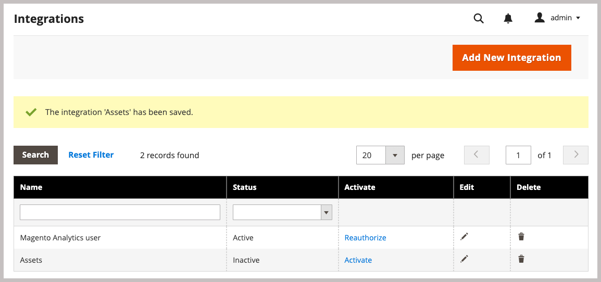

# Installieren von Adobe Commerce-Paketen

Diese Integration für Commerce ermöglicht die Synchronisierung von Assets zwischen Adobe Commerce und Adobe Experience Manager Assets (AEM Assets). Die Erweiterung bietet eine Reihe von Tools und Services zum Verwalten von Produktbildern, Videos und anderen Medien-Assets auf beiden Plattformen.

Fügen Sie diese Erweiterung der Commerce-Umgebung hinzu, indem Sie die `aem-assets-integration` PHP-Erweiterung installieren. Sie müssen außerdem Adobe I/O Events für Commerce aktivieren und die Anmeldeinformationen generieren, die für die Kommunikation und Workflows zwischen Adobe Commerce und Adobe Experience Manager Assets erforderlich sind.

**Zugriffsanforderungen**

Sie benötigen die folgenden Rollen und Berechtigungen, um die Integration von Commerce mit AEM Assets zu aktivieren.

- [Commerce Cloud Project-Administrator](https://experienceleague.adobe.com/de/docs/commerce-cloud-service/user-guide/project/user-access) - Installieren Sie die erforderlichen Erweiterungen und konfigurieren Sie den Commerce-Anwendungsserver über den Administrator oder die Befehlszeile.

   - Zugriff auf [repo.magento.com](https://repo.magento.com/admin/dashboard) zur Installation der Erweiterung.

     Informationen zum Generieren von Schlüsseln und zum Abrufen der erforderlichen Berechtigungen finden Sie unter [Abrufen Ihrer Authentifizierungsschlüssel](https://experienceleague.adobe.com/de/docs/commerce-operations/installation-guide/prerequisites/authentication-keys). Informationen zu Cloud-Installationen finden Sie im Handbuch [Commerce on Cloud Infrastructure](https://experienceleague.adobe.com/de/docs/commerce-cloud-service/user-guide/develop/authentication-keys)

- [Commerce Admin](https://experienceleague.adobe.com/de/docs/commerce-admin/start/guide-overview): Aktualisieren der Store-Konfiguration und Verwalten von Commerce-Benutzerkonten.

>[!TIP]
>
> Adobe Commerce kann für die Verwendung von [Adobe IMS-Authentifizierung](https://experienceleague.adobe.com/de/docs/commerce-admin/start/admin/ims/adobe-ims-config) konfiguriert werden.

## Installations- und Konfigurationsablauf

Installieren Sie das Adobe Commerce-Paket und bereiten Sie die Commerce-Umgebung vor, indem Sie die folgenden Schritte ausführen:

1. [Installieren Sie die Erweiterung AEM Assets Integration for Commerce (`aem-assets-integration`)](#install-the-aem-assets-integration-extension).

1. [Konfigurieren Sie den Commerce Services Connector](#configure-the-commerce-services-connector), um Ihre Adobe Commerce-Instanz und mit den Services zu verbinden, die die Übertragung von Daten zwischen Adobe Commerce und AEM Assets ermöglichen.

1. [Konfigurieren von Adobe I/O Events für Commerce](#configure-adobe-io-events-for-commerce)

1. [Abrufen von Authentifizierungsdaten für API-Zugriff](#get-authentication-credentials-for-api-access)

## Installieren der AEM Assets-Integrationserweiterung

Installieren Sie die neueste Version der AEM Assets-Integrationserweiterung (`aem-assets-integration`) auf einer Adobe Commerce-Instanz mit Version Adobe Commerce 2.4.5+. Die Erweiterung wird als Composer-Metapaket aus dem Repository [repo.magento.com](https://repo.magento.com/admin/dashboard) bereitgestellt.

>[!BEGINTABS]

>[!TAB Cloud-Infrastruktur]

Verwenden Sie diese Methode, um die [!DNL AEM Assets Integration]-Erweiterung auf einer Commerce Cloud-Instanz zu installieren.

1. Wechseln Sie auf Ihrer lokalen Workstation in das Projektverzeichnis für Ihr Adobe Commerce on Cloud-Infrastrukturprojekt.

   >[!NOTE]
   >
   >Informationen zur lokalen Verwaltung von Commerce-Projektumgebungen finden Sie unter [Verwalten von Verzweigungen mit der CLI](https://experienceleague.adobe.com/de/docs/commerce-cloud-service/user-guide/develop/cli-branches) im _Benutzerhandbuch für Adobe Commerce auf Cloud-Infrastruktur_.

1. Checken Sie die Umgebungsverzweigung aus, um sie mithilfe der Adobe Commerce Cloud-CLI zu aktualisieren.

   ```shell
   magento-cloud environment:checkout <environment-id>
   ```

1. Fügen Sie die Erweiterung AEM Assets Integration for Commerce hinzu.

   ```shell
   composer require "magento/aem-assets-integration" "<version-tbd>" --no-update
   ```

1. Paketabhängigkeiten aktualisieren.

   ```shell
   composer update "magento/aem-assets-integration"
   ```

1. Code-Änderungen für `composer.json` und `composer.lock` übertragen und übertragen.

1. Fügen Sie die Code-Änderungen für die `composer.json`- und `composer.lock`-Dateien hinzu, übertragen Sie sie und übertragen Sie sie in die Cloud-Umgebung.

   ```shell
   git add -A
   git commit -m "Install AEM Assets Integration extension for Adobe Commerce"
   git push origin <branch-name>
   ```

   Durch das Pushen der Aktualisierungen wird der [Commerce-Cloud-Bereitstellungsprozess](https://experienceleague.adobe.com/de/docs/commerce-cloud-service/user-guide/develop/deploy/process) zum Anwenden der Änderungen initiiert. Überprüfen Sie den Bereitstellungsstatus im [Bereitstellungsprotokoll](https://experienceleague.adobe.com/de/docs/commerce-cloud-service/user-guide/develop/test/log-locations#deploy-log).

>[!TAB On-Premises]

Verwenden Sie diese Methode, um die [!DNL AEM Assets Integration]-Erweiterung für eine lokale Instanz zu installieren.

1. Verwenden Sie Composer, um Ihrem Projekt die Erweiterung AEM Assets Integration for Commerce hinzuzufügen:

   ```shell
   composer require "magento/aem-assets-integration" --no-update
   ```

1. Aktualisieren Sie die Abhängigkeiten und installieren Sie die Erweiterung:

   ```shell
   composer update  "magento/aem-assets-integration"
   ```

1. Adobe Commerce aktualisieren:

   ```shell
   bin/magento setup:upgrade
   ```

1. Löschen Sie den Cache:

   ```shell
   bin/magento cache:clean
   ```

>[!TIP]
>
> Wenn Sie in der Produktion bereitstellen, sollten Sie den kompilierten Code nicht löschen, um Zeit zu sparen. Erstellen Sie immer eine Systemsicherung, bevor Sie Änderungen vornehmen.

>[!ENDTABS]

## Konfigurieren des Commerce Services-Connectors

>[!NOTE]
>
> Die Einrichtung des Commerce Services-Connectors ist ein einmaliger Prozess, der für die Verwendung von [Adobe Commerce SaaS-Services erforderlich &#x200B;](https://experienceleague.adobe.com/de/docs/commerce/user-guides/integration-services/saas#availableservices). Wenn Sie den Connector bereits für einen anderen Service konfiguriert haben, können Sie die vorhandene Konfiguration über den Commerce-Admin anzeigen, indem Sie **[!UICONTROL Systems]** > [!UICONTROL Services] > **[!UICONTROL Commerce Services Connector]** auswählen.

Um Daten zwischen Ihrer Adobe Commerce-Instanz und den Services zu übertragen, die die AEM Assets-Integration aktivieren, konfigurieren Sie den Commerce Services Connector über die Admin Console (**[!UICONTROL System]** > [!UICONTROL Services] > **[!UICONTROL Commerce Services Connector]**).

{width="600" zoomable="yes"}

Geben Sie in der Konfiguration die folgenden Werte an

- Produktions- und Sandbox-API-Schlüssel für die Authentifizierung
- Name des Datenspeichers (SaaS-Kennung) für sicheren Cloud-Speicher
- IMS-Organisations-ID, unter der Ihre Commerce- und AEM Assets-Umgebungen bereitgestellt werden

Detaillierte Anweisungen finden Sie im [Video zur Konfiguration von Commerce Services Connector](https://experienceleague.adobe.com/de/docs/commerce-learn/tutorials/admin/adobe-commerce-services/configure-adobe-commerce-services-connector#configuration-faqs) in der Dokumentation zu [Commerce Services Connector](../../landing/saas.md#organizationid).

Wenn Sie die Konfiguration speichern, generiert das System die SaaS-Projekt- und Datenbank-IDs für Ihre Umgebung. Diese Werte sind erforderlich, um die Synchronisierung von Assets zwischen Adobe Commerce und AEM Assets zu aktivieren.

## Konfigurieren von Adobe I/O Events für Commerce

Die AEM Assets-Integration verwendet den Adobe I/O Events-Service zum Senden benutzerdefinierter Ereignisdaten zwischen der Commerce-Instanz und Experience Cloud. Die Ereignisdaten werden zur Koordinierung von Workflows für die AEM Assets-Integration verwendet.

Bevor Sie Adobe I/O Events konfigurieren, überprüfen Sie die RabbitMQ- und Cron-Auftragskonfiguration für Ihr Commerce-Projekt:

- Stellen Sie sicher, dass RabbitMQ aktiviert ist und auf Ereignisse wartet.
   - [RabbitMQ-Setup für Adobe Commerce On-Premise](https://experienceleague.adobe.com/de/docs/commerce-cloud-service/user-guide/configure/service/rabbitmq)
   - [RabbitMQ-Setup für Adobe Commerce in der Cloud-Infrastruktur](https://experienceleague.adobe.com/de/docs/commerce-cloud-service/user-guide/configure/service/rabbitmq)
   - Stellen Sie sicher[&#x200B; dass Cron-Aufträge aktiviert &#x200B;](https://developer.adobe.com/commerce/extensibility/events/configure-commerce/#check-cron-and-message-queue-configuration). Cron-Aufträge sind für die Kommunikation und Workflows für die AEM Assets-Integration erforderlich.

>[!NOTE]
>
> Für Projekte mit Commerce Version 2.4.5 müssen Sie [die Adobe I/O-Module installieren](https://developer.adobe.com/commerce/extensibility/events/installation/#install-adobe-io-modules-on-commerce). In Commerce ab Version 2.4.6 werden diese Module automatisch geladen. Für die AEM Assets-Integration für Commerce müssen Sie nur die -Module installieren. App Builder-Setup ist nicht erforderlich.


### Aktivieren des Commerce Eventing-Frameworks

Aktivieren Sie das Ereignis-Framework über den Commerce-Administrator.

>[!NOTE]
>
>Die App Builder-Einrichtung ist nur erforderlich, wenn Sie eine benutzerdefinierte Abgleichstrategie zum Synchronisieren von Assets zwischen Commerce und AEM Assets verwenden möchten.

1. Navigieren Sie vom Administrator aus zu **[!UICONTROL Stores]** > [!UICONTROL Settings] > **[!UICONTROL Configuration]** > **[!UICONTROL Adobe Services]** > **Adobe I/O Events**.

1. Erweitern Sie **[!UICONTROL Commerce events]**.

1. Legen Sie **[!UICONTROL Enabled]** auf `Yes` fest.

   {width="600" zoomable="yes"}

1. Geben Sie den Namen des Händlerunternehmens in die **[!UICONTROL Merchant ID]** und den Umgebungsnamen in die **[!UICONTROL Environment ID]** Felder ein. Verwenden Sie beim Festlegen dieser Werte nur alphanumerische Zeichen und Unterstriche.

>[!BEGINSHADEBOX]

**Benutzerdefinierte VCL für Blockierungsanfragen konfigurieren**

Wenn Sie ein benutzerdefiniertes VCL-Fragment verwenden, um unbekannte eingehende Anfragen zu blockieren, müssen Sie möglicherweise den HTTP-Header `X-Ims-Org-Idheader` einbeziehen, um eingehende Verbindungen vom AEM Assets Integration for Commerce-Service zuzulassen.

>[!TIP]
>
> Sie können das Fastly CDN-Modul verwenden, um eine Edge-ACL mit einer Liste von IP-Adressen zu erstellen, die Sie blockieren möchten.

Der folgende benutzerdefinierte VCL-Code-Ausschnitt (JSON-Format) zeigt ein Beispiel mit einer `X-Ims-Org-Id`-Anfragekopfzeile.

```json
{
  "name": "blockbyuseragent",
  "dynamic": "0",
  "type": "recv",
  "priority": "5",
  "content": "if ( req.http.X-ims-org ~ \"<YOUR-IMS-ORG>\" ) {error 405 \"Not allowed\";}"
}
```

Bevor Sie einen Ausschnitt basierend auf diesem Beispiel erstellen, überprüfen Sie die Werte, um festzustellen, ob Sie Änderungen vornehmen müssen:

- `name`: Name für den VCL-Code-Ausschnitt. In diesem Beispiel wird der Name `blockbyuseragent` verwendet.

- `dynamic`: Legt die Ausschnittversion fest. Dieses Beispiel verwendet `0`. Detaillierte Informationen zu Datenmodellen finden Sie [Fastly VCL](https://www.fastly.com/documentation/reference/api/vcl-services/snippet/)Snippets).

- `type`: Gibt den Typ des VCL-Ausschnitts an, der die Position des Ausschnitts im generierten VCL-Code bestimmt. Dieses Beispiel verwendet `recv`. Eine Liste der Snippet[Typen finden Sie &#x200B;](https://www.fastly.com/documentation/reference/api/#api-section-snippet) der Snippet-Referenz Fastly VCL .

- `priority`: Bestimmt, wann der VCL-Snippet ausgeführt wird. In diesem Beispiel wird die `5` verwendet, um sofort auszuführen und zu überprüfen, ob eine Admin-Anfrage von einer zulässigen IP-Adresse stammt.

- `content`: Der auszuführende VCL-Code-Ausschnitt, der die Client-IP-Adresse prüft. Wenn sich die IP in der Edge-ACL befindet, wird der Zugriff für die gesamte Website mit einem `405 Not allowed` blockiert. Alle anderen Client-IP-Adressen erhalten Zugriff.

Ausführliche Informationen zur Verwendung von VCL-Snippets zum Blockieren eingehender Anfragen finden Sie unter [Benutzerdefiniertes VCL für Blockieranfragen](https://experienceleague.adobe.com/de/docs/commerce-cloud-service/user-guide/cdn/custom-vcl-snippets/fastly-vcl-blocking) im _Handbuch zu Commerce in Cloud Infrastructure_.

>[!ENDSHADEBOX]

## Abrufen von Authentifizierungsdaten für API-Zugriff

Die AEM Assets-Integration für Commerce erfordert OAuth-Authentifizierungsberechtigungen, um API-Zugriff auf die Commerce-Instanz zu ermöglichen. Diese Anmeldeinformationen sind erforderlich, um API-Anfragen zu authentifizieren, wenn Sie Assets mit der AEM Assets-Integration verwalten.

Sie generieren die Anmeldeinformationen, indem Sie die Integration zur Commerce-Instanz hinzufügen und aktivieren.

### Integration zur Commerce-Umgebung hinzufügen

1. Gehen Sie von der Admin aus zu **System** > Erweiterungen > **Integrationen** und klicken Sie dann auf **Neue Integration hinzufügen**.

1. Geben Sie Informationen zur Integration ein.

   Geben Sie im Abschnitt **Allgemein** nur die Integration **Name** und **Email** an. Verwenden Sie die E-Mail-Adresse für ein Adobe IMS-Konto mit Zugriff auf das Unternehmen, in dem Commerce und Experience Manager Assets bereitgestellt werden.

   {width="600" zoomable="yes"}

1. Überprüfen Sie Ihre Identität, indem Sie auf **Identität bestätigen** klicken.

   Das System überprüft Ihre Identität, indem es sich mit Ihrer Adobe-ID bei Experience Cloud authentifiziert.

1. Konfigurieren von API-Ressourcen.

   1. Klicken Sie im linken Bedienfeld auf **[!UICONTROL API]**.

   1. Wählen Sie die **[!UICONTROL Catalog > Inventory > Products > External Media]** Externe Medienressource aus.

      {width="600" zoomable="yes"}

1. Klicken Sie auf **[!UICONTROL Save]**.

### OAuth-Anmeldeinformationen generieren

Generieren Sie auf der Seite Integrationen die OAuth-Authentifizierungsberechtigungen, indem Sie für **Assets-Integration auf** Aktivieren“ klicken. Sie benötigen diese Anmeldeinformationen, um das Commerce-Projekt beim Assets Rule Engine Service zu registrieren und API-Anfragen zum Verwalten von Assets zwischen Adobe Commerce und AEM Assets zu senden.

1. Generieren Sie auf der Seite Integrationen die Anmeldeinformationen, indem Sie auf **[!UICONTROL Activate]** klicken.

   {width="600" zoomable="yes"}

1. Wenn Sie die API verwenden möchten, speichern Sie die Anmeldeinformationen für den Consumer-Schlüssel und das Zugriffstoken, um die Authentifizierung in Ihrem API-Client zu konfigurieren.

   {width="600" zoomable="yes"}

1. Klicken Sie auf **[!UICONTROL Done]**.

>[!NOTE]
>
>Sie können Authentifizierungsdaten auch mithilfe der Adobe Commerce-APIs generieren. Weitere Informationen zu diesem Prozess und weitere Informationen zur OAuth-basierten Authentifizierung für Adobe Commerce finden Sie unter [OAuth-basierte Authentifizierung](https://developer.adobe.com/commerce/webapi/get-started/authentication/gs-authentication-oauth/) in der Dokumentation zu Adobe Developer.

## Nächster Schritt

- [Konfigurieren der Integration über Commerce Admin](setup-synchronization.md)
