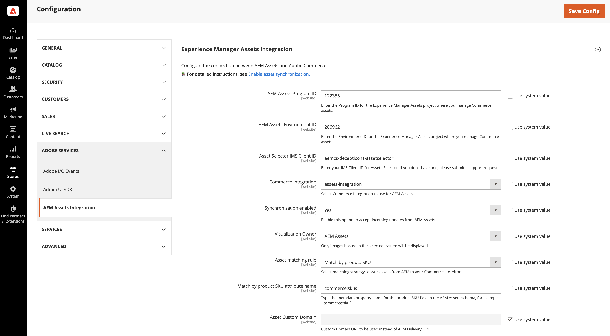

# Integration konfigurieren

Konfigurieren Sie die Integration, indem Sie Commerce mit der AEM Assets-Instanz verbinden und die entsprechende Strategie für die Synchronisierung von Assets auswählen.

Nachdem Sie das AEM Assets-Projekt identifiziert haben, wählen Sie die Zuordnungsregel für die Synchronisierung von Assets zwischen Adobe Commerce und AEM Assets aus.

* **[!UICONTROL Match by product SKU]** - Standardregel, die die SKU in den Asset-Metadaten mit der [Commerce-Produkt-SKU](https://experienceleague.adobe.com/en/docs/commerce-operations/implementation-playbook/glossary#sku) abgleicht, um sicherzustellen, dass Assets mit den richtigen Produkten verknüpft sind.

* **[!UICONTROL Custom match]** - Matching-Regel für komplexere Szenarien oder spezifische Geschäftsanforderungen, die eine benutzerdefinierte Matching-Logik erfordern. Für die Implementierung des benutzerdefinierten Abgleichs ist die Entwicklung von benutzerdefiniertem Code in Adobe Developer App Builder erforderlich, um zu definieren, wie Assets mit Produkten abgeglichen werden. Weitere Details folgen in Kürze…

Verwenden Sie für die Ersteinrichtung die Standardregel *Übereinstimmung nach Produkt-SKU*.

## Voraussetzungen

* [Installieren des AEM Assets-Pakets](configure-aem.md)

* [!BADGE Nur PaaS]{type=Informative tooltip="Gilt nur für Adobe Commerce in Cloud-Projekten (von Adobe verwaltete PaaS-Infrastruktur)."} [Installieren von Adobe Commerce-](configure-commerce.md), um die Erweiterung hinzuzufügen und die erforderlichen Anmeldeinformationen und Verbindungen zur Verwendung der Erweiterung zu generieren.

* Führen Sie die Schritte aus, die im Thema [Öffnen der Dynamic Media-API aktivieren](https://experienceleague.adobe.com/en/docs/experience-manager-cloud-service/content/assets/dynamicmedia/dynamic-media-open-apis/dynamic-media-open-apis-overview#enable-dynamic-media-open-apis) beschrieben sind. Fügen Sie dem Support-Team die folgenden Informationen hinzu:

   * **[!UICONTROL AEM Program ID]**
   * **[!UICONTROL Adobe Commerce URL]**
   * **[!UICONTROL AEM Environment ID]**,
   * **[!UICONTROL IMS Org ID]** für die AEM Assets-Authoring-Umgebung, die Sie mit Commerce verbinden möchten.

## Konfigurieren der Verbindung

1. Rufen Sie die Projekt- und Umgebungs-ID der [0&rbrace;AEM Assets-Autorenumgebung ab.](https://experienceleague.adobe.com/en/docs/experience-manager-cloud-service/content/sites/authoring/quick-start)

   1. Öffnen Sie die AEM Cloud Manager und wählen Sie **[!UICONTROL Assets]** aus.

   1. Kopieren Sie die Projekt- und Umgebungs-IDs aus der URL und speichern Sie sie: `https://author-p[Program ID]-e[EnvironmentID].adobeaemcloud.com/`

1. Öffnen Sie vom Commerce-Administrator aus die AEM Assets-Integrationskonfiguration.

   1. Wechseln Sie zu **[!UICONTROL Store]** > Konfiguration > **[!UICONTROL ADOBE SERVICES]** > **[!UICONTROL AEM Assets Integration]**.

      {width="600" zoomable="yes"}

1. Geben Sie die **[!UICONTROL Program ID]** und **[!UICONTROL Environment ID]** der AEM Assets-Umgebung ein.

   Bearbeiten Sie die Konfigurationswerte, indem Sie die Auswahl aus der *[!UICONTROL Use system value]* entfernen.

1. Geben Sie die **[!UICONTROL Asset Selector IMS Client ID]** ein.

   Weitere Informationen zum Asset-Wähler finden Sie unter [Manuelles Auswählen von Assets](../synchronize/asset-selector-integration.md)

1. [!BADGE Nur PaaS]{type=Informative tooltip="Gilt nur für Adobe Commerce in Cloud-Projekten (von Adobe verwaltete PaaS-Infrastruktur)."} Wählen Sie die [[!UICONTROL Commerce integration]](configure-commerce.md#add-the-integration-to-the-commerce-environment) zum Authentifizieren von Anfragen zwischen Commerce und dem Asset Matching-Service aus.

1. Legen Sie die **[!UICONTROL Commerce integration]** auf `assets-integration` fest, um die Commerce-Integration auszuwählen, die mit AEM Assets verwendet werden soll.

1. Legen Sie **[!UICONTROL Synchronization enabled]** auf `Yes` fest, damit Commerce eingehende Updates von AEM Assets annehmen kann.

   Nach der Aktivierung der Integration stehen zusätzliche Konfigurationsoptionen zur Verfügung, um Kriterien für die Asset-Zuordnung anzugeben.

1. Wählen Sie aus dem Dropdown-Menü &quot;**[!UICONTROL Asset matching rule]**&quot; eine der Asset-Zuordnungsregeln für die Asset-Synchronisierung aus.

   * Wählen Sie **[!UICONTROL Match by SKU]** für [standardmäßige automatische ](../synchronize/default-match.md))
   * Wählen Sie **[!UICONTROL Custom match]** für [benutzerdefinierten automatischen Abgleich](../synchronize/custom-match.md) (erfordert [Adobe Developer App Builder](https://experienceleague.adobe.com/en/docs/commerce-learn/tutorials/adobe-developer-app-builder/introduction-to-app-builder).)

1. Fügen Sie den [AEM Assets-Metadatenfeldnamen](configure-aem.md#configure-metadata) der für Commerce-Produkt-SKUs definiert ist, in das Feld **[!UICONTROL Match by product SKU attribute name]** ein, `commerce:skus` standardmäßig.

1. Wählen Sie **[!UICONTROL Save Config]** aus, um Aktualisierungen anzuwenden und die Synchronisierung von Assets zu starten.

   Durch die Konfigurationsaktualisierung wird der anfängliche Synchronisierungsprozess Trigger, sodass Commerce eingehende Aktualisierungen von AEM Assets annehmen kann. Die für die Synchronisierung erforderliche Zeit hängt vom Volumen der Assets und von bestimmten Konfigurationen ab. Die Integration nutzt automatisierte Prozesse, um die für die Synchronisierung erforderliche Zeit zu minimieren.

### Synchronisierung mit SLA

Die Integration gewährleistet die folgenden Synchronisierungsleistungsstufen:

* `< 5 minutes for 99% of updates`

* `< 30 minutes for 99.9% of updates`

Dadurch wird sichergestellt, dass Produktseiten immer die aktuellsten Bilder anzeigen und so der Inhalt der Storefront korrekt und visuell ansprechend bleibt.

### Visualisierungsbesitzer konfigurieren

Die Einstellung **Visualisierungseigentümer** bestimmt, welches System Produktbilder in der Integration bereitstellt:

* Adobe Commerce - Verwendet in Commerce gehostete Bilder.
* AEM Assets - Verwendet Bilder, die mit AEM synchronisiert wurden.

Der Administrator zeigt die verfügbaren Bilder für diesen Eigentümer an, während der Rest der Bilder ausgegraut ist und mit einer **Beschriftung angezeigt**.

Weitere Informationen [ Verhalten bei der Anzeige von Bildern finden ](https://experienceleague.adobe.com/en/docs/commerce-admin/catalog/products/digital-assets/product-image#set-image-details){target=_blank} unter „Festlegen von“.

>[!TIP]
>
> Legen Sie während einer Migration von Commerce zu AEM Assets den **Visualisierungseigentümer** auf Commerce fest, um fehlerhafte Bildverknüpfungen zu vermeiden. Wenn alle Produkte erfolgreich mit AEM Assets synchronisiert wurden, wechseln Sie zum AEM Assets-Eigentümer, um die Umstellung abzuschließen. Dadurch wird eine kontinuierliche Bildverfügbarkeit während des gesamten Prozesses sichergestellt.

1. Navigieren Sie zu **[!UICONTROL Store]** > Konfiguration > **[!UICONTROL ADOBE SERVICES]** > **[!UICONTROL AEM Assets Integration]**.

   Funktion für Verantwortlichen für die Visualisierung der AEM Assets-Integration {width="400" zoomable="yes"}

1. Wählen Sie die **Visualisierungsinhaber** Quelle aus, um die Bilder anzuzeigen.

1. Klicken Sie auf **[!UICONTROL Save Config]** , um Aktualisierungen anzuwenden und die Synchronisierung von Assets zu starten.

### Optional. Konfigurieren der benutzerdefinierten Domain-URL

Wenn das AEM Assets as a Cloud Service-Projekt mit einem [benutzerdefinierten Domain-Namen](https://experienceleague.adobe.com/de/docs/experience-manager-cloud-service/content/implementing/using-cloud-manager/custom-domain-names/add-custom-domain-name){target=_blank} konfiguriert wurde, müssen Sie den Domain-Namen zur Commerce-Store-Konfiguration hinzufügen, damit die AEM Assets-Integration für Commerce ihn verwenden kann.

1. Navigieren Sie zu **[!UICONTROL Store]** > Konfiguration > **[!UICONTROL ADOBE SERVICES]** > **[!UICONTROL AEM Assets Integration]**.

   {width="700" zoomable="yes"}

1. Fügen Sie die **benutzerdefinierte Domain-URL** zum Feld **[!UICONTROL Asset Custom Domain]** hinzu.

1. Klicken Sie auf **[!UICONTROL Save Config]** , um Aktualisierungen anzuwenden und die Synchronisierung von Assets zu starten.

## Nächster Schritt

[Verwalten von Commerce-Assets](../manage-assets.md)
