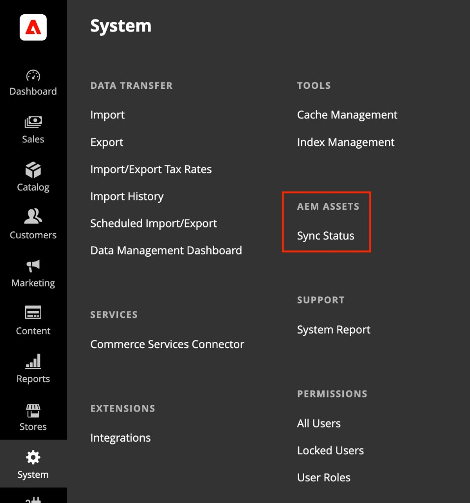

# Synchronisierungsstatus für AEM Assets anzeigen

Die **[!UICONTROL Sync Status]** bietet eine Asset-orientierte Liste von Assets, die über die AEM Assets-Integration synchronisiert wurden. Verwenden Sie sie, um Assets anhand ihrer eigenen Attribute zu finden, zu überprüfen und zu beheben, anstatt Produkt für Produkt im Katalog zu navigieren.

{width="700" zoomable="yes"}

>[!NOTE]
>
> [!UICONTROL Sync Status] ist nicht für [!DNL Adobe Commerce Optimizer] verfügbar.

## Synchronisierungsstatus öffnen

Navigieren Sie in _Admin_-Seitenleiste zu **[!UICONTROL System]** > **[!UICONTROL AEM Assets]** > **[!UICONTROL Sync Status]**.

{width="600" zoomable="yes"}

## Zustand der Integrationssynchronisierung

Oben auf der Seite fasst das Banner **AEM-Synchronisierungsstatus** den Pipeline-Status zusammen und gibt an, wie viele Ereignisse verarbeitet werden sollen. Wählen Sie **[!UICONTROL Refresh]** aus, um das Synchronisierungskonsistenzbanner zu aktualisieren.

## Asset-Liste

Das Raster listet Assets auf, die von der AEM Assets-Synchronisierungs-Pipeline verarbeitet wurden, sowie ihren aktuellen Synchronisierungsstatus. Jede Zeile stellt ein Asset und dessen Synchronisierungsstatus in Commerce dar. Es stellt keinen Produktdatensatz dar.

| Spalte | Beschreibung |
|--------|-------------|
| **Asset-ID** | AEM-Asset-Kennung (z. B. `urn:aaid:aem:…`). |
| **Status** | Ergebnis des letzten Synchronisierungsversuchs für das Asset. Mögliche Werte sind **Erfolg**, **Fehlgeschlagen** oder **Warten**. |
| **Verarbeitung** | Beginn der Datums- und Uhrzeitverarbeitung für das Asset. |
| **Dispatched** | Datum und Uhrzeit, zu der das Synchronisierungsereignis gesendet wurde. |
| **Fehler** | Fehlermeldung, wenn **Status** einen Fehler anzeigt; leer, wenn die Synchronisierung erfolgreich war. |

### Filtern von Assets

1. Wählen Sie **[!UICONTROL Filters]** aus, um das Filterbedienfeld zu erweitern.

1. Geben Sie eine **Asset-ID** ein oder wählen Sie einen **Status**-Wert.

1. Wählen Sie **[!UICONTROL Apply Filters]** aus, um das Raster zu aktualisieren, oder **[!UICONTROL Cancel]**, um das Bedienfeld zu schließen, ohne Änderungen vorzunehmen.

Filter werden auf Daten auf Asset-Ebene angewendet, sodass Sie fehlgeschlagene Synchronisationen isolieren oder ein bestimmtes Asset verfolgen können, ohne einzelne Produkte öffnen zu müssen.

## Fehlgeschlagene Synchronisationen

Wenn **Status** einen Fehler anzeigt, überprüfen Sie die Spalte **Fehler** im Raster auf die von der Synchronisierungs-Pipeline zurückgegebene Nachricht.

Überprüfen Sie die vollständige Fehlermeldung und die Details zum letzten Synchronisierungsversuch, um den Fehler zu diagnostizieren.

[!BADGE Nur PaaS]{type=Informative tooltip="Gilt nur für Adobe Commerce in Cloud-Projekten (von Adobe verwaltete PaaS-Infrastruktur)."} Weitere Informationen zur Fehlerbehebung finden Sie unter [Standardmäßiger automatischer Abgleich](../synchronize/default-match.md). Integrationsprotokolldateien sind unter `/var/log/aem-assets-integration.log` und `/var/log/aem-assets-integration-errors.log` in Ihrer Commerce-Instanz verfügbar.
