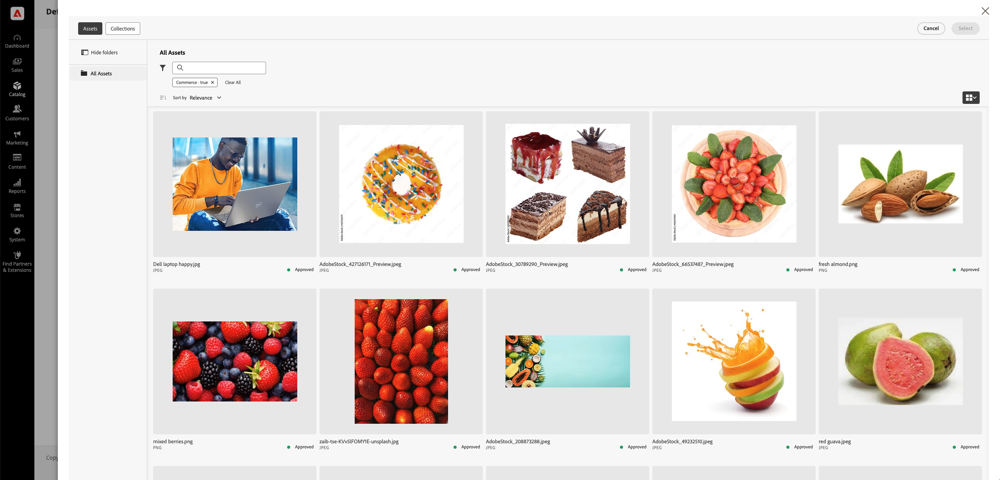

# Manuelle Asset-Auswahl

Mit dem **AEM Asset Selector** können Marketing-Experten und Merchandiser Bilder aus AEM Assets einfach zu Adobe Commerce hinzufügen und so den Asset-Management-Prozess optimieren. Diese Methode stellt die Markenkonsistenz und -konformität sicher, indem die Asset-Auswahl auf die im [!DNL DAM (Digital Asset Management system)] geprüften und genehmigten Assets beschränkt wird.

Der **AEM Asset Selector** ist verfügbar, wenn die IMS-Client-ID für das AEM Assets-Projekt in der Commerce-Admin konfiguriert wurde und die Benutzenden über die erforderlichen [Berechtigungen und IMS-Authentifizierung](../get-started/permissions.md) verfügen. Siehe [Konfigurieren des AEM Asset-Wählers](#configure-the-aem-asset-selector-in-adobe-commerce).

Wenn die Integration **AEM Asset Selector** konfiguriert ist, können Marketing-Experten und Merchandiser:

* Kategoriebilder können mühelos verwaltet werden, um sicherzustellen, dass sie den Richtlinien für Marken und Kampagnen entsprechen.
* [!BADGE Nur PaaS]{type=Informative tooltip="Gilt nur für Adobe Commerce in Cloud-Projekten (von Adobe verwaltete PaaS-Infrastruktur)."} Weisen Sie Assets für visuell ansprechende Inhalte direkt in Page Builder zu.
* [!BADGE Nur SaaS]{type=Positive url="https://experienceleague.adobe.com/en/docs/commerce/user-guides/product-solutions" tooltip="Gilt nur für Adobe Commerce as a Cloud Service- und Adobe Commerce Optimizer-Projekte (von Adobe verwaltete SaaS-Infrastruktur)."} Weisen Sie Assets für visuell angereicherte Inhalte direkt in der Commerce-Storefront mit Edge Delivery Services zu.

>[!NOTE]
>
> Der AEM Asset-Wähler ist eine AEM Assets-Frontend-Komponente zur Integration von AEM Assets mit Authoring-Programmen. Weitere Informationen zu dieser Komponente finden Sie unter [Micro-Frontend-Asset](https://experienceleague.adobe.com/en/docs/experience-manager-cloud-service/content/assets/manage/asset-selector/overview-asset-selector){target=_blank}Auswahl im *AEM as a Cloud Service-Benutzerhandbuch*.

## Die wichtigsten Vorteile

Das Einbetten des AEM-Asset-Wählers in das Adobe Commerce Admin Panel bietet mehrere wichtige Vorteile:

* **Markenkonsistenz** zeigt nur genehmigte Assets an und minimiert das Risiko veralteter oder nicht konformer Bilder in der Storefront.

* **Effizienz**-Mit können Marketing-Experten und Merchandiser Assets schnell zuweisen, ohne zwischen verschiedenen Plattformen zu wechseln.

* **Optimierter Collaboration** - Erleichtert nahtlose Zusammenarbeit, indem er die direkte Bildauswahl vom DAM ermöglicht, wodurch manuelle Downloads und Uploads vermieden werden.

* **Verbesserte Inhaltsqualität** - Stellt die Verwendung hochauflösender, optimierter Bilder für Produktseiten, Kategorien und Page Builder sicher.

{width="600" zoomable="yes"}

## Konfigurieren des AEM-Asset-Wählers in Adobe Commerce

1. Navigieren Sie vom Commerce-Administrator aus zu **[!UICONTROL Store]** > Konfiguration > **[!UICONTROL ADOBE SERVICES]** > **[!UICONTROL AEM Assets Integration]**.

1. Füllen Sie das Feld **[!UICONTROL IMS Client ID]** aus. Informationen zu den erforderlichen Berechtigungen und zum Abrufen dieser ID finden Sie unter [Benutzerberechtigungen und IMS](../get-started/permissions.md).

1. **Speichern** der Konfiguration.

## Nächste Schritte

* [Verwalten von Kategoriebildern mit dem Asset-Selektor](../manage-assets.md#category-images)
* [Verwalten von Bildern in Page Builder-Inhalten](../manage-assets.md#using-aem-asset-selector-in-page-builder)
