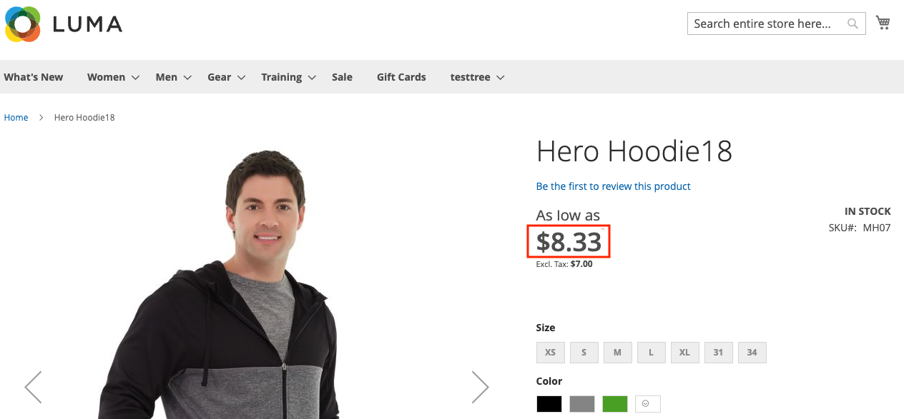

# Versteuerte Preise mit API Mesh für Adobe Developer App Builder anzeigen

[API Mesh](https://developer.adobe.com/graphql-mesh-gateway/gateway/overview/) ermöglicht Entwicklern die Integration von privaten oder Drittanbieter-APIs und anderen Benutzeroberflächen mit Adobe-Produkten unter Verwendung von Adobe I/O Runtime.

In diesem Thema wird API Mesh verwendet, um Produktpreise auf einer Produktdetailseite mit Steuern anzuzeigen, die in angegeben sind.

## Steuersätze einrichten

Sie müssen Steuern dafür konfiguriert haben, damit sie auf der Produktdetailseite angezeigt werden.

1. [Steuersätze einrichten](https://experienceleague.adobe.com/docs/commerce-admin/stores-sales/site-store/taxes/tax-rules.html?lang=de).
1. Aktivieren Sie die Anzeige [im Katalog](https://experienceleague.adobe.com/docs/commerce-admin/stores-sales/site-store/taxes/display-settings.html?lang=de#step-1%3A-configure-catalog-prices-display-settings) und legen Sie dafür entweder `Including and Excluding Tax` oder `Including Tax` fest.

Überprüfen Sie, ob der Katalog-Service funktioniert, indem Sie eine Produktdetailseite prüfen.



## Konfigurieren von API-Mesh

Verbinden Sie, falls noch nicht geschehen, die API Mesh mit dem Katalog-Service mit Ihrer -Instanz. Detaillierte Anweisungen finden Sie [ Thema „Erste Schritte](https://developer.adobe.com/graphql-mesh-gateway/gateway/getting-started/) im API Mesh-Entwicklerhandbuch.

Ersetzen Sie in der `mesh.json`-Datei die Werte `name `, `endpoint` und `x-api-key`.

```json
{
    "meshConfig": {
      "sources": [
        {
          "name": "<NAME OF MESH>",
          "handler": {
            "graphql": {
              "endpoint": "<COMMERCE INSTANCE GQL ENDPOINT URL>"
            }
          },
          "transforms": [
              {
                  "prefix": {
                      "includeRootOperations": true,
                        "value": "Core_"
                  }
              }
          ]
        },
        {
          "name": "CommerceCatalogServiceGraph",
          "handler": {
            "graphql": {
              "endpoint": "https://catalog-service-sandbox.adobe.io/graphql/",
              "operationHeaders": {
                "Magento-Store-View-Code": "{context.headers['magento-store-view-code']}",
                "Magento-Website-Code": "{context.headers['magento-website-code']}",
                "Magento-Store-Code": "{context.headers['magento-store-code']}",
                "Magento-Environment-Id": "{context.headers['magento-environment-id']}",
                "x-api-key": "API_KEY",
                "Magento-Customer-Group": "{context.headers['magento-customer-group']}"
              },
              "schemaHeaders": {
                "x-api-key": "<YOUR API_KEY>"
              }
            }
          }
        }
      ],
      "additionalTypeDefs": "extend type ComplexProductView {\n  priceWithTaxes: Core_PriceRange\n}\n extend type SimpleProductView {\n  priceWithTaxes: Core_PriceRange\n}\n",
      "additionalResolvers": [
            {  
              "targetTypeName": "ComplexProductView",
              "targetFieldName": "priceWithTaxes",
              "sourceName": "MagentoQACore",
              "sourceTypeName": "Query",
              "sourceFieldName": "Core_products",
              "requiredSelectionSet": "{\n items {\n sku, \n price_range {\n minimum_price {\n final_price {\n value\n currency\n }\n }\n }\n }\n }",
                "sourceArgs": {
                    "filter.sku.eq": "{root.sku}"
                },
                "result": "items[0].price_range"
            },
            {  
              "targetTypeName": "SimpleProductView",
              "targetFieldName": "priceWithTaxes",
              "sourceName": "MagentoQACore",
              "sourceTypeName": "Query",
              "sourceFieldName": "Core_products",
              "requiredSelectionSet": "{\n items {\n sku, \n price_range {\n minimum_price {\n final_price {\n value\n currency\n }\n }\n }\n }\n }",
                "sourceArgs": {
                    "filter.sku.eq": "{root.sku}"
                },
                "result": "items[0].price_range"
            }
        ]
     }
  }
```

Diese `mesh.json` Konfigurationsdatei:

* Wandelt die Commerce-Kernanwendung so um, dass „core_“ allen Abfragen oder Typen vorangestellt werden muss. Dadurch werden mögliche Namenskonflikte mit dem Katalog-Service verhindert.
* Erweitert die `ComplexProductView`- und `SimpleProductView` mit einem neuen Feld namens `priceWithTaxes`.
* Fügt einen benutzerdefinierten Resolver für das neue Feld hinzu.

Erstellen Sie das Netz mit dem [Befehl erstellen](https://developer.adobe.com/graphql-mesh-gateway/gateway/create-mesh/#create-a-mesh-1) mit der `mesh.json`.

### GraphQL-Abfrage

Sie können die neuen `priceWithTaxes` mit GraphQL abrufen.

Abfragebeispiel:

```graphql
query {
    products(skus:[MH07]) {
        __typename
        id
        sku
        name
        description
        shortDescription
        addToCartAllowed
        url
        ... on ComplexProductView {
            priceWithTaxes {
              minimum_price {
                final_price {
                  value
                }
              }
              maximum_price {
                final_price {
                  value
                }
              }
            }
            priceRange {
                maximum {
                    final {
                        amount {
                            value
                            currency
                        }
                    }
                    regular {
                        amount {
                            value
                            currency
                        }
                    }
                    roles
                }
                minimum {
                    final {
                        amount {
                            value
                            currency
                        }
                    }
                    regular {
                        amount {
                            value
                            currency
                        }
                    }
                    roles
                }
            }
        }
    }
}
```

Antwort der Abfrage:

```json
{
  "data": {
    "products": [
      {
        "__typename": "ComplexProductView",
        "id": "VFVnd053AFpHVm1ZWFZzZEEAWkRWa09Ua3hNVFl0WTJJd015MDBaRGMwTFRnME16a3RNak01TVRVNE9ESTBOemd4AGJXRnBibDkzWldKemFYUmxYM04wYjNKbABZbUZ6WlEAVFVGSE1EQTFPRFEyTVRjeA",
        "sku": "MH07",
        "name": "Hero Hoodie13",
        "description": "<p>Gray and black color blocking sets you apart as the Hero Hoodie keeps you warm on the bus, campus or cold mean streets. Slanted outsize front pockets keep your style real . . . convenient.</p>\r\n<p>* Full-zip gray and black hoodie.<br />* Ribbed hem.<br />* Standard fit.<br />* Drawcord hood cinch.<br />* Water-resistant coating.</p>",
        "shortDescription": "",
        "addToCartAllowed": true,
        "url": "http://commerce_url/hero-hoodie.html",
        "priceWithTaxes": {
          "minimum_price": {
            "final_price": {
              "value": 8.330001
            }
          },
          "maximum_price": {
            "final_price": {
              "value": 13355.524701
            }
          }
        },
        "priceRange": {
          "maximum": {
            "final": {
              "amount": {
                "value": 39.02,
                "currency": "USD"
              }
            },
            "regular": {
              "amount": {
                "value": 54,
                "currency": "USD"
              }
            },
            "roles": [
              "visible"
            ]
          },
          "minimum": {
            "final": {
              "amount": {
                "value": 39.02,
                "currency": "USD"
              }
            },
            "regular": {
              "amount": {
                "value": 54,
                "currency": "USD"
              }
            },
            "roles": [
              "visible"
            ]
          }
        }
      }
    ]
  },
  "extensions": {}
}
```
