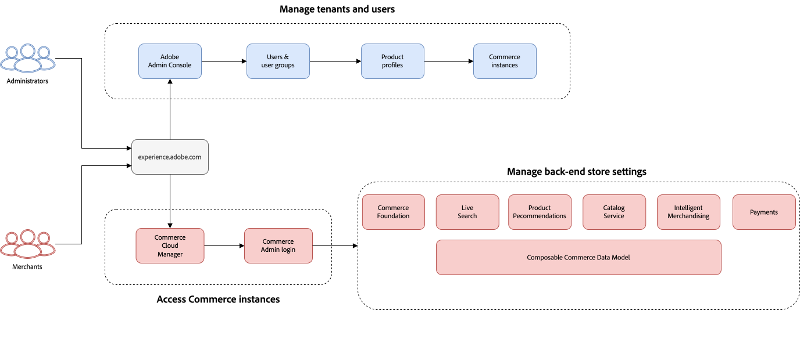

# Erste Schritte

[!DNL Adobe Commerce as a Cloud Service] bietet die meisten vorkonfigurierten Konfigurationen. Nach Abschluss einiger grundlegender Einrichtungsprozesse ist Ihr Store in kürzester Zeit betriebsbereit. Dieses Handbuch führt Sie durch die Erstellung und Arbeit mit einer -Instanz und hilft Ihnen beim Einrichten Ihrer Organisation für den Erfolg. Dadurch wird sichergestellt, dass Ihre Teams angemessenen Zugriff auf [!DNL Adobe Commerce as a Cloud Service] und die Tools haben, die Sie für den Einstieg benötigen.

[!DNL Adobe Commerce as a Cloud Service] ist eine Cloud-native Commerce-Plattform, die Flexibilität, Skalierbarkeit und Effizienz für die Bereitstellung digitaler Commerce-Erlebnisse bietet. Dieses SaaS-Angebot ist eine vollständig verwaltete, versionslose Plattform, die ein nahtloses Upgrade ohne manuelles Eingreifen ermöglicht.

## Schlüsselkomponenten

[!DNL Adobe Commerce as a Cloud Service] besteht aus den folgenden Komponenten:

* **[[!DNL Adobe Experience Cloud]](https://experience.adobe.com/)** - Ihr zentraler Einstiegspunkt für alle [!DNL Adobe Commerce] Produkte unter [experience.adobe.com](https://experience.adobe.com/)
   * Klicken Sie unter „Schnellzugriff [!UICONTROL **auf {**]}Commerce [!UICONTROL **, um Commerce Cloud Manager zu öffnen**]
* **[[!DNL Commerce Cloud Manager]](https://experience.adobe.com/#/commerce/cloud-service)**: Erstellen und Verwalten von Instanzen, Zugreifen auf API-URLs und Commerce-Admin
* **[[!DNL Adobe Admin Console]](https://adminconsole.adobe.com/)** - Verwalten von Benutzern und Rollen
* **Commerce Admin** - Produkte, Bestellungen, Kunden und Store-Konfiguration verwalten
* **[Storefront powered by [!DNL Edge Delivery Services]](./storefront.md)** - Erstellen und passen Sie eine kundenorientierte Storefront mit einem zusammenstellbaren, leistungsstarken System an, das Händlern und Entwicklern außergewöhnliche Geschwindigkeit, SEO und Anwendererlebnis bietet
* **[[!DNL Adobe Developer App Builder]](https://developer.adobe.com/app-builder/)** - Erstellen benutzerdefinierter Integrationen mit [!DNL App Builder] zusammen mit anderen Erweiterbarkeits-Tools wie dem [Integrations-Starter-Kit](https://developer.adobe.com/commerce/extensibility/starter-kit/integration/) und [[!DNL API Mesh]](https://developer.adobe.com/graphql-mesh-gateway/)

## Einrichtung und Verwaltung

Im Rahmen des [!DNL Adobe Commerce as a Cloud Service] Einrichtungsprozesses konfigurieren Ihr Systemadministrator, Ihre Händler und Entwickler den Zugriff und die Ressourcen für Ihr Unternehmen, einschließlich der Bereitstellung von Cloud-Ressourcen und der Zuweisung von Benutzern zu entsprechenden Rollen auf der Grundlage ihrer Zuständigkeiten.

### Einrichten und Verwalten von Workflows

Als kombinierte Gruppe müssen Systemadministrator, Händler und Entwickler die folgenden wichtigen Schritte ausführen, um Ihre Commerce-Instanz einzurichten und auszuführen:

1. **Alle Benutzer**: [Instanz erstellen](#create-an-instance)
1. **Systemadministrator**: [Benutzer hinzufügen und Rollen zuweisen](user-management.md#add-users-and-admins)
1. **Händler**: [Greifen Sie auf den Commerce-](#access-an-instance) zu und [importieren Sie Ihren Katalog](#import-your-catalog)
1. **Entwickler**: [Richten Sie Ihre Storefront ein](storefront.md) und erkunden Sie die [Entwicklerplattform](overview.md#developer-platform)

#### Workflow für AEM Assets- und Produktvisualisierung

Die folgenden Schritte sind erforderlich, um [!DNL Adobe Experience Manager Assets] oder [!DNL Product Visuals powered by AEM Assets] mit [!DNL Adobe Commerce as a Cloud Service] zu integrieren:

1. **Systemadministrator**: [Hinzufügen von Benutzern zum  [!DNL AEM Assets] -  [!DNL Product Visuals]  Produktprofil](user-management.md#add-a-user-to-aem-assets-or-product-visuals)
1. **Entwickler**: [Integrieren [!DNL AEM Assets] und [!DNL Product Visuals]](../aem-assets-integration/overview.md)
1. **Händler**: [Greifen Sie auf Ihre  [!DNL AEM Assets]  zu [!DNL Product Visuals]](./user-management.md#access-the-experience-manager-interface)

### Rollenbasierte Setup- und Verwaltungsaufgaben

Wählen Sie eine Registerkarte unten aus, um allgemeine Workflow-Grafiken für die entsprechende Rolle anzuzeigen:

>[!BEGINTABS]

>[!TAB Systemadministrator und Händler-Workflow]

Dieses Diagramm bietet einen allgemeinen Überblick darüber, wie Systemadministratoren und Händler auf [!DNL Adobe Commerce as a Cloud Service]-Instanzen zugreifen und diese verwalten. Weitere Informationen zu Administrator-Workflows finden [&#x200B; im Handbuch zu Adobe Admin Console &#x200B;](https://helpx.adobe.com/de/enterprise/admin-guide.html).

{zoomable="yes"}

>[!TAB Entwickler-Workflow]

Dieses Diagramm bietet einen allgemeinen Überblick darüber, wie Entwickler Integrationen für [!DNL Adobe Commerce as a Cloud Service] mit App Builder erstellen. Weitere Informationen finden Sie in [&#x200B; API](https://developer.adobe.com/commerce/webapi/rest/)Dokumentation.

{zoomable="yes"}

>[!ENDTABS]

Wählen Sie Ihre Rolle aus, um Ressourcen zu finden und mit Ihrem Einrichtungsprozess zu beginnen:

>[!BEGINTABS]

>[!TAB Systemadministrator]

Als System-Admin sind Sie für die Einrichtung der Organisation und die Verwaltung des Benutzerzugriffs verantwortlich.

| Aufgabe | Beschreibung | Ressource |
|------|-------------|----------|
| Grundlegendes zur Plattform | Erfahren Sie mehr über die Architektur und Vorteile von Adobe Commerce as a Cloud Service | [Übersicht](overview.md) |
| Funktionen vergleichen | Verstehen der Unterschiede zwischen Cloud Service und anderen Adobe Commerce-Angeboten | [Funktionsvergleich](feature-comparison.md) |
| Instanz erstellen | Bereitstellen von Sandbox- und Produktionsumgebungen | [Instanz erstellen](#create-an-instance) |
| Einrichten der Benutzerverwaltung | Hinzufügen von Benutzern, Zuweisen von Rollen und Verwalten von Berechtigungen | [Benutzerverwaltung](user-management.md) |
| Einrichten von [!DNL AEM Assets] und [!DNL Product Visuals] (optional) | Hinzufügen von Benutzern, Zuweisen von Rollen und Verwalten von Berechtigungen | [Benutzerverwaltung](user-management.md#add-a-user-to-aem-assets-or-product-visuals) |

>[!TAB Händler]

Als Händler konzentrieren Sie sich auf die Verwaltung von Produkten, Bestellungen und Storefront-Inhalten.

| Aufgabe | Beschreibung | Ressource |
|------|-------------|----------|
| Zugriff auf Ihre Instanz | Melden Sie sich bei Commerce Admin an, um Ihren Store zu verwalten | [Zugriff auf eine Instanz](#access-an-instance) |
| Anwendungsfälle erkunden | Praktische Geschäftsszenarien und Workflows kennenlernen | [Anwendungsfälle](./use-cases.md) |
| Katalog importieren | Erfahren Sie, wie Sie Ihre Produktdaten in die Plattform importieren | [Katalog importieren](#import-your-catalog) |
| Zugriff auf [!DNL AEM Assets] und [!DNL Product Visuals] (optional) | Zugriff auf Experience Manager, um mit der Verwendung von [!DNL AEM Assets] und [!DNL Product Visuals] zu beginnen | [Zugriff auf die Experience Manager-Benutzeroberfläche](./user-management.md#access-the-experience-manager-interface) |

>[!TAB Entwickler]

Als Entwickler müssen Sie wissen, wie Sie benutzerdefinierte Integrationen erstellen und die Platform-Funktionalität erweitern können.

| Aufgabe | Beschreibung | Ressource |
|------|-------------|----------|
| Grundlegendes zur Architektur | Erfahren Sie mehr über die Erweiterbarkeit der Plattform und APIs | [Übersicht - Entwicklerplattform](overview.md#developer-platform) |
| Einrichten einer Entwicklungsumgebung | Erstellen einer Sandbox-Instanz für Entwicklung und Tests | [Instanz erstellen](#create-an-instance) |
| Storefront erstellen | Erfahren Sie, wie Sie die Commerce-Storefront einrichten und anpassen | [Storefront-Setup](./storefront.md) |
| Konfigurieren der Storefront | Erfahren Sie, wie Sie Ihre Storefront einrichten | [Storefront-Setup](./storefront.md) |
| Erkunden von Integrationsoptionen | Erfahren Sie mehr über App Builder, API Mesh und andere Erweiterungs-Tools, auf die Sie Zugriff haben | [Übersicht - Entwicklerplattform](overview.md#developer-platform) |
| Integration von [!DNL AEM Assets] und [!DNL Product Visuals] (optional) | Erfahren Sie, wie Sie [!DNL AEM Assets] und [!DNL Product Visuals] mit [!DNL Adobe Commerce] integrieren | [AEM Assets-Integration](../aem-assets-integration/overview.md) |

>[!ENDTABS]

### Nächste Schritte

Nach Abschluss der rollenspezifischen Setup-Aufgaben:

* **Systemadministratoren**: Lesen Sie die Richtlinien [gemeinsame Verantwortung](shared-responsibility.md)
* **Händler**: Erkunden Sie [Anwendungsfälle](use-cases.md) für gängige Geschäftsszenarien
* **Entwickler**: Lesen Sie die [Entwicklerdokumentation für Adobe Commerce](https://developer.adobe.com/commerce/docs)

## Grundlagen zu Adobe Commerce as a Cloud Service

In den folgenden Abschnitten werden die grundlegenden Prozesse beschrieben, die Sie abschließen müssen, um Ihre Commerce-Instanz einzurichten und auszuführen.

### Instanz erstellen

>[!NOTE]
>
>Bevor Sie eine Instanz erstellen können, müssen Sie vom Produktadministrator oder Systemadministrator Ihres Unternehmens als Benutzer des [!DNL Adobe Commerce as a Cloud Service] Produkts hinzugefügt werden. Weitere Informationen finden [&#x200B; unter „Hinzufügen von &#x200B;](./user-management.md#add-users-and-admins) und Administratoren“.

[!DNL Adobe Commerce as a Cloud Service] Instanzen verwenden ein kreditbasiertes System. Sie können mehrere Instanzen erstellen, aber jede Instanz erfordert verfügbare Credits. Die Anzahl der Guthaben, die Sie zunächst haben, hängt von Ihrem Abonnement ab.

1. Melden Sie sich bei Ihrem [[!DNL Adobe Experience Cloud]](https://experience.adobe.com/) an.

1. Klicken Sie unter [!UICONTROL Quick access] auf [!UICONTROL **Commerce**], um die [!UICONTROL Commerce Cloud Manager] zu öffnen.

   Die [!UICONTROL Commerce Cloud Manager] zeigt eine Liste der [!DNL Adobe Commerce as a Cloud Service] Instanzen an, die in Ihrer Adobe IMS-Organisation verfügbar sind.

1. Klicken [!UICONTROL **oben rechts**] Bildschirm auf „Instanz hinzufügen“.

   {width="50%" align="center" zoomable="yes"}

1. Wählen Sie [!UICONTROL **Commerce as a Cloud Service**].

1. Geben Sie **Name** und **Beschreibung** für Ihre Instanz ein.

1. Wählen Sie den [!UICONTROL **Umgebungstyp**] für Ihre Instanz aus. Sie können zwischen den folgenden Optionen wählen:

   * [!UICONTROL **Sandbox**] - Nur für Design- und Testzwecke. Sie sollten Ihren [!DNL Adobe Commerce as a Cloud Service]-Journey mit der Sandbox-Umgebung beginnen.

   >[!NOTE]
   >
   > Sandbox-Instanzen dienen nur zu Design- und Testzwecken. Sie sollten keine Produktionsdaten in einer Sandbox-Umgebung verwenden.
   >
   >Sandbox-Instanzen sind auf die Region Nordamerika beschränkt.

   * [!UICONTROL **Produktion**] - Für Live-Stores und kundenorientierte Websites.

   >[!NOTE]
   >
   >Die Infrastruktur von Adobe Commerce as a Cloud Service ist global verfügbar. Informationen zu Produktionsumgebungen in Ihrer Region erhalten Sie von Ihrem Kundenbetreuer.

1. Wählen Sie die Region aus, in der Ihre Instanz gehostet werden soll.

   >[!NOTE]
   >
   >Nachdem Sie Ihre Instanz erstellt haben, können Sie die Region nicht mehr ändern.

1. Klicken Sie [!UICONTROL **Instanz hinzufügen**].

{{aem-assets-instance-mapping}}

### Zugriff auf eine Instanz

Nachdem Sie eine Instanz erstellt haben, können Sie über die [!UICONTROL Commerce Cloud Manager] darauf zugreifen.

1. Melden Sie sich bei Ihrem [Adobe Experience Cloud](https://experience.adobe.com/)-Konto an.

1. Klicken Sie unter [!UICONTROL Quick access] auf [!UICONTROL **Commerce**], um die [!UICONTROL Commerce Cloud Manager] zu öffnen.

   Die [!UICONTROL Commerce Cloud Manager] zeigt eine Liste der Instanzen an, die in Ihrer Adobe IMS-Organisation verfügbar sind.

1. Um die [!UICONTROL Commerce Admin] für eine Instanz zu öffnen, klicken Sie auf den Instanznamen.

>[!TIP]
>
>Um Informationen zu Ihrer -Instanz, einschließlich der REST- und GraphQL-Endpunkte und der Admin-URL, anzuzeigen, klicken Sie auf das Informationssymbol neben dem Instanznamen.

Die Basis-URLs für Ihre Admin- und -Endpunkte unterscheiden sich je nach Region und Umgebung. Verwenden Sie dazu das folgende Muster:

* Administrator
   * Produktionsadministrator in Nordamerika: `https://na1.admin.commerce.adobe.com`
   * Sandbox-Admin in Nordamerika: `https://na1-sandbox.admin.commerce.adobe.com`
   * Produktionsadministrator in Europa: `https://eu1.admin.commerce.adobe.com`
* REST und GraphQL
   * Nordamerika-Produktion GraphQL: `https://na1.api.commerce.adobe.com`
   * Nordamerika Sandbox GraphQL: `https://na1-sandbox.api.commerce.adobe.com`
   * Europa-Produktion GraphQL: `https://eu1.api.commerce.adobe.com`

### Importieren des Katalogs

Standardmäßig enthalten [!DNL Adobe Commerce as a Cloud Service] Instanzen keine Produktdaten. Sie haben die Möglichkeit, beim Erstellen einer Instanz zu Test- und Lernzwecken Beispielproduktdaten einzubeziehen, bevor Sie Ihren eigenen Katalog importieren.

Es gibt zwei Möglichkeiten, Ihren Katalog in [!DNL Adobe Commerce as a Cloud Service] zu importieren:

* [**Commerce Admin**](https://experienceleague.adobe.com/de/docs/commerce-admin/systems/data-transfer/import/data-import) - Eine benutzerfreundliche Oberfläche, über die Sie Ihre Katalogdaten mit wenigen Klicks importieren können.
* [**JSON-API importieren**](https://developer.adobe.com/commerce/webapi/rest/modules/import/#import-json-api) - Eine REST-API, mit der Sie Ihre Katalogdaten programmgesteuert importieren können.

### Einrichten der Storefront

Nachdem Sie eine Instanz erstellt haben, können Sie [&#x200B; &#x200B;](storefront.md) „Ihre Storefront [!DNL Edge Delivery Services]&quot;.

## Zusätzliche Ressourcen

* [Versionshinweise](release-notes.md)
* [Migrationshandbuch](migration/overview.md)
* [Dokumentation zur Commerce-Storefront](https://experienceleague.adobe.com/developer/commerce/storefront/?lang=de)
