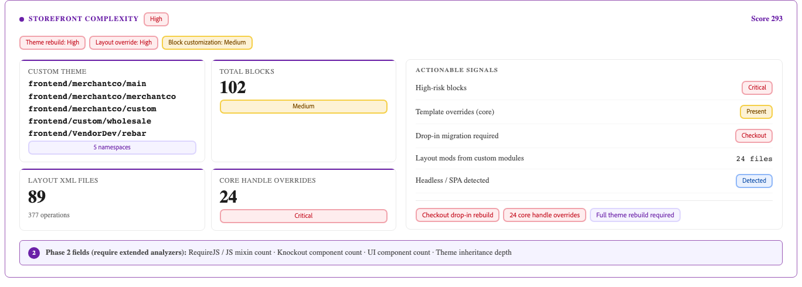

# Migrationsbewertung

>[!IMPORTANT]
>
> Die Migrationsbewertung ist nur bei der Migration von [!DNL Adobe Commerce on Cloud Infrastructure] oder [!DNL Adobe Commerce on-premises] Projekten nach [!DNL Adobe Commerce as a Cloud Service] verfügbar.

Eine Commerce-Migrationsbewertung ist eine automatisierte Analyse Ihrer bestehenden Adobe Commerce-Implementierung. Die Tools von Adobe scannen Ihre Commerce-Codebasis und erzeugen einen strukturierten Bericht, der alle erstellten, angepassten oder geänderten Elemente auflistet. Der Bericht zeigt dann an, wie sich die Anpassungen an Ihrer Code-Basis auf Ihre Migration nach [!DNL Adobe Commerce as a Cloud Service] auswirken.

Der Bericht wird als HTML-Datei bereitgestellt, die Sie in jedem Browser öffnen können. Es ist kein Zugriff auf die Produktionsumgebung erforderlich, es sei denn, Sie geben zunächst die Code-Basis Ihres Projekts frei.

**Die Bewertung sieht Folgendes vor:**

- Ein vollständiges Inventar aller benutzerdefinierten Module in Ihrem Geschäft, sortiert nach Typ und Auswirkungsstufe
- Eine Bewertung der Migrationskomplexität (Hoch, Medium oder Niedrig), die aus risikovorhersehbaren Metriken berechnet wird
- Priorisierte Ansicht der Backend- und Storefront-Bereiche mit der größten Auswirkung, die eine Migrationsplanung erfordern
- Eine Beschreibung jedes benutzerdefinierten Moduls, das Sie als direkte Eingabe für die Entwickler-Tools der Adobe-KI verwenden können

## Grundlagen zum Migrationsbewertungsbericht

Der Bericht ist in drei Registerkarten unterteilt: **[!UICONTROL Summary]**, **[!UICONTROL Module Reports]** und **[!UICONTROL Report Reliability]**.

>[!NOTE]
>
>Nicht alle Abschnitte des Berichts gelten für jeden Shop. Die Bewertung ist so konzipiert, dass sie alle möglichen Anpassungstypen und Komplexitätstreiber umfasst, Ihr Store jedoch nur eine Teilmenge der hier aufgeführten Abschnitte enthält.

## Registerkarte „Zusammenfassung“

Die Registerkarte **[!UICONTROL Summary]** bietet einen Überblick über die wichtigsten Signale in den folgenden Bereichen:

- Komplexität der Migration
- Aufschlüsselung des Dateityps
- Module mit der größten Auswirkung
- Migrationstreiber
- Aufschlüsselung der Anpassung

### Komplexität der Migration

Der Abschnitt Migrationskomplexität enthält die Bewertungsbewertung für Ihren Store insgesamt. Darin wird erläutert, wie die Bewertung berechnet wurde, und die primären Risikofaktoren werden hervorgehoben.

**Migrationskomplexität und -komplexitätswert**

{width="600" zoomable="yes"}

Der Komplexitätswert gewichtet jede Eingabe nach der Schwierigkeit der Migration. Der Score ist einer Bewertung der Migrationskomplexität unter Verwendung fester Schwellenwerte zugeordnet:

| Bewertung | Bewertungsbereich | Typischer Migrationsansatz |
| --- | --- | --- |
| niedrig | 150 oder weniger | Standardmigration - direkte Migration mit der Koordination des Zahlungsanbieters und Datenmigration als parallele Arbeitsabläufe. |
| Medium | 151-375 | Modulare Migration - in Segmenten migriert, um wirkungsvolle benutzerdefinierte Module zu triggern. |
| Hoch | über 375 | Eine stufenweise Migration, die wahrscheinlich 12-24 Monate dauert. |

**Custom Module Ratio**

{width="600" zoomable="yes"}

Der Prozentsatz Ihrer Module, die speziell für Ihre Implementierung erstellt wurden. Ein höheres Verhältnis bedeutet, dass mehr benutzerdefinierter Code geprüft und migriert werden muss. Das durchschnittliche Verhältnis von benutzerdefinierten Modulen beim Kunden beträgt etwa 62 %.

>[!TIP]
>
>Custom Module Ratio ist ein Scope-Signal, kein Komplexitätssignal. Ein Geschäft mit 80 % benutzerdefinierten Modulen, die isoliert sind und ein geringes Risiko aufweisen, könnte einfacher zu migrieren sein als ein Geschäft mit 40 % risikoreicheren benutzerdefinierten Modulen. Verwenden Sie den Komplexitätswert und die Anzahl der Kettenkonflikte, um die Schwierigkeit zu bewerten. Verwenden Sie das Custom Module Ratio, um das Volumen zu schätzen.

**Aufschlüsselung des Dateityps**

{width="600" zoomable="yes"}

Eine Liste der Dateien in Ihrer Codebasis, sortiert nach Typ.

**Module mit der größten Auswirkung**

{width="600" zoomable="yes"}

Eine kuratierte Liste der spezifischen Module in Ihrem Store, die die meiste Aufmerksamkeit auf die Migration erfordern. Bei diesen Modulen handelt es sich häufig um Module, die mit Checkout, Zahlung oder Bestellverwaltung interagieren. Jedes Modul mit hoher Auswirkung benötigt einen eigenen Migrationsplan. Diese Liste ist der beste Ausgangspunkt für Gespräche mit Ihrem technischen Team.

### Komplexität der Storefront

{width="600" zoomable="yes"}

Im Abschnitt „Komplexität der Storefront“ wird der Aufwand angezeigt, der für die Migration der Frontend-Präsentationsebene Ihres Stores erforderlich ist. Dieser Arbeitsablauf ist ein anderer als die Backend-Code-Migration, die von Frontend-Entwicklern durchgeführt wird und normalerweise separate Planungsgespräche erfordert.

>[!NOTE]
>
>Ein Store kann eine niedrige Backend-Komplexität und eine hohe Storefront-Komplexität aufweisen. Lesen Sie immer beide Abschnitte, bevor Sie den Migrationsaufwand berechnen.

- Benutzerdefiniertes Design - Der Namespace des benutzerdefinierten Designs Ihres Stores (z. B. BrandName_Theme). Das Vorhandensein eines benutzerdefinierten Designs bedeutet, dass für [!DNL Adobe Commerce as a Cloud Service] ein vollständiger Design-Neuaufbau erforderlich ist. Jeder bewertete Store mit einem benutzerdefinierten Design-Namespace muss einen dedizierten Frontend-Migrations-Workflow planen.

- Gesamtblöcke : Die Anzahl der Block- und Vorlagendateien (.phtml) in Ihrem Store. Blöcke sind die primären Server-seitigen Rendering-Artefakte und stellen jeweils eine diskrete Migrationsaufgabe dar.

| Anzahl der Blöcke | Aufwand |
| --- | --- |
| Unter 100 | Baseline - Standardaufwand |
| 100-300 | Medium - Planen einer strukturierten Frontend-Phase |
| Über 300 | Hoch - Priorisierung als dedizierter Arbeitsablauf |

### Migrationstreiber

{width="600" zoomable="yes"}

Im Abschnitt Migrationstreiber werden die wichtigsten Faktoren für Ihre Komplexitätsbewertung angezeigt.

| Fahrer | Definition |
| --- | --- |
| Anpassungsbedarf | Das Gesamtvolumen an benutzerdefiniertem Code im Verhältnis zur gesamten Implementierung |
| Plug-ins und Beobachter | Code, der das Verhalten der Kernplattform zur Laufzeit abfängt |
| Klassenvoreinstellungen | Ein fragiles Anpassungsmuster, das Kernklassen vollständig ersetzt und bei Upgrades im Hintergrund bricht |
| Datenmodell | Benutzerdefinierte und geänderte Datenbankstrukturen |
| Integrationen | Externe Systeme, die mit Ihrem Geschäft verbunden sind |

Jeder Treiber wird mit einem hohen, einem Medium-Wert oder einem niedrigen Aufwand angezeigt. Zuerst die am höchsten bewerteten Treiber beim Scoping und der Planung ansprechen.

### Datenmodell

{width="600" zoomable="yes"}

Im Abschnitt Datenmodell wird die Anzahl der benutzerdefinierten Tabellen, Änderungen an den [!DNL Adobe Commerce] Datenbankkerntabellen und kritischen Entitätenattribut-Wert (EAV)-Attributen angezeigt.

Änderungen an Kerntabellen sind die am schwierigsten zu migrierende Kategorie, da sie Abhängigkeiten von einer bestimmten Plattform-Schemaversion schaffen und große Auswirkungen auf die Formel zur Komplexitätsbewertung haben.

>[!TIP]
>
>Wenn Ihr Bericht mehr als 15 Änderungen an der Kerntabelle auflistet, planen Sie einen dedizierten Datenmigrations-Workstream vor der Migration des Backend-Moduls.

## Aufschlüsselung der Anpassung

{width="600" zoomable="yes"}

Der Abschnitt Aufschlüsselung der Anpassung enthält detaillierte Metriken für jede Anpassungskategorie in Ihrem Geschäft.

>[!NOTE]
>
>Nicht alle Unterabschnitte werden in jedem Bericht angezeigt, sondern nur die in der Codebasis erkannten Kategorien.
>
>Unterabschnitte, die sich auf die Frontend-Präsentationsebene auswirken, sind ein separater Arbeitsablauf von der Backend-Code-Migration und erfordern in der Regel separate Planungsgespräche.
>
>Ein Store kann eine niedrige Backend-Komplexität und eine hohe Frontend-Komplexität aufweisen. Überprüfen Sie immer sowohl die Backend- als auch die Storefront-bezogenen Unterabschnitte, bevor Sie den Migrationsaufwand berechnen.

### Layout-XML

Die Anzahl der Layout-XML-Dateien und ihre Gesamtzahl an Vorgängen. Layout-XML definiert die Struktur jeder Seite, einschließlich der angezeigten Blöcke, der Container, in denen sie angezeigt werden, und der Seitentypen, unter denen sie sich befinden.

Eine hohe Dateianzahl mit vielen Vorgängen signalisiert eine erhebliche Anpassung der Seitenstruktur, die neu gestaltet werden muss.

### Überschreibungen des Kernhandles

Die Anzahl der Stellen, an denen Ihre Layout-XML einen Kern-[!DNL Adobe Commerce]-Seiten-Handler überschreibt (z. B. `checkout_cart_index` oder `catalog_product_view`). Überschreibungen von Core-Handles sind das Layout-Signal mit dem höchsten Risiko, da sie die Seitenstruktur auf Plattformebene ändern und eine explizite Neuerstellung erfordern.

| Anzahl überschreiben | Aufwand |
| --- | --- |
| 0 | Keine Core-Layout-Überschreibungen |
| 1-3 | Laufzeitrisiko : Jede Überschreibung muss explizit neu erstellt werden |
| 4 oder mehr | Kritisch - Planung eines dedizierten Layout-Migrationssprints |

### Bausteine

Die Anzahl der Block- und Vorlagendateien (`.phtml`) in Ihrem Store. Blöcke sind die primären Server-seitigen Rendering-Artefakte. Jeder Baustein stellt eine diskrete Migrationsaufgabe dar.

| Anzahl der Blöcke | Aufwand |
| --- | --- |
| Unter 100 | Baseline - Standardaufwand |
| 100-300 | Medium - Planen einer strukturierten Frontend-Phase |
| Über 300 | Hoch - Priorisierung als dedizierter Arbeitsablauf |

### Blöcke mit hohem Risiko

Blöcke, die zentrale Renderpfade berühren, z. B. Checkout-Rendering, Warenkorbanzeige und ähnliche Frontend-Oberflächen. Alle Blöcke mit hohem Risiko erfordern eine individuelle Migrationsbewertung vor der Planung.

### Designs und E-Mail-Vorlagen

Der Namespace des benutzerdefinierten Designs Ihres Stores (z. B. `BrandName_Theme`). Das Vorhandensein eines benutzerdefinierten Designs bedeutet, dass ein vollständiger Design-Neuaufbau erforderlich ist. Jeder bewertete Store mit einem benutzerdefinierten Design-Namespace muss einen dedizierten Frontend-Migrations-Workflow planen.

### Überschreibungen von Vorlagen (Core geändert)

Die Anzahl der überschriebenen [!DNL Adobe Commerce] `.phtml`. Jede Überschreibung der Kernvorlage erzeugt eine Abhängigkeit von einer bestimmten Version dieser Vorlage. Platform-Aktualisierungen, die die Vorlage ändern, unterbrechen die Überschreibung im Hintergrund.

### Dropdown-Migration erforderlich

[!DNL Adobe Commerce as a Cloud Service] verwendet eine modulare Dropdown-Komponentenarchitektur für Storefront-Oberflächen einschließlich Checkout, Warenkorb und Produktdetails. Anpassungen dieser Oberflächen müssen als Dropdown-Komponenten neu erstellt werden. Diese Anpassungen können eine Vielzahl von Funktionen abdecken, z. B. das Hinzufügen benutzerdefinierter Checkout-Schritte, das Ändern der Warenkorbanzeigelogik oder das Erweitern der Produktdetailseite.

Das Feld [!UICONTROL Drop-in migration required] gibt an, welche Storefront-Bereiche Dropdown-Neuaufbauen erfordern.

>[!IMPORTANT]
>
>Wenn **Checkout** als Migrationsanforderung für Dropin aufgeführt ist, planen Sie einen dedizierten Checkout-Dropin-Arbeitsablauf. Diese Aufgabe ist die komplexeste und geschäftskritischste Aufgabe für die Storefront-Migration.

## Registerkarte „Modulberichte“

{width="600" zoomable="yes"}

Die Registerkarte **[!UICONTROL Module Reports]** enthält einen dedizierten Eintrag für jedes benutzerdefinierte Modul in Ihrem Store. Geben Sie diese Informationen an Ihr technisches Team weiter.

Für jedes Modul zeigt der Bericht Folgendes an:

| Feldname | Definition |
| --- | --- |
| Funktion | Eine Beschreibung des Zwecks und der Geschäftsfunktion des benutzerdefinierten Moduls |
| Auswirkungsgrad | **Hoch**, **Medium** oder **Niedrig** Auswirkung darauf, welches Commerce-Verhalten das Modul berührt |
| Anzahl der Hooks | Die Anzahl der Webhooks, die angeben, an wie vielen Stellen dieses Modul das Verhalten der Kernplattform abfängt |
| Migrationsempfehlung | **Neu erstellen**, **Refaktorieren**, **Ersetzen** durch eine native Funktion oder **Entfernen** |
| Abhängigkeiten | Mit welchen anderen Modulen dieses Modul interagiert, die Informationen zur Migrationssequenzierung liefern können |

**Workflow**

1. Filtern Sie zuerst nach **High-Impact**-Modulen. Diese führen zu dem größten Migrationsaufwand und den höchsten Migrationskosten.
1. Bestimmen Sie für jedes benutzerdefinierte Modul Antworten auf die folgenden Fragen:
   - Wird dieses Modul noch aktiv verwendet?
   - Könnte das Modul durch eine native [!DNL Adobe Commerce as a Cloud Service]-Funktion ersetzt werden?
   - Wenn das Modul neu aufgebaut werden muss, welche Funktionalität muss sein Ersatz bieten?
1. Identifizieren Sie benutzerdefinierte Module, die eingestellt oder ersetzt werden können. Jede dieser Versionen reduziert den Migrationsbereich, bevor Code geschrieben wird.
1. Kopieren Sie die Beschreibung jedes benutzerdefinierten Moduls mit der Migrationsempfehlung **Neu erstellen**. Diese Beschreibungen können direkt den Entwickler-Tools für KI von Adobe gegeben werden. Weitere Informationen finden Sie unter [Entwickler-Tools für Commerce](#ai-developer-tools-for-commerce-extensibility)Erweiterbarkeit von KI .

## Referenz: Schlüsselbegriffe

| Begriff | Definition |
| --- | --- |
| **MODULE** | Ein benutzerdefiniertes, in sich abgeschlossenes Funktionspaket. Ihr Geschäft könnte zwischen zwanzig Modulen und Hunderten von Modulen haben. |
| **Plugin (Interceptor)** | Code, der eine Commerce-Funktion abfängt und ihr Verhalten vor, während oder nach der Ausführung ändert. |
| **Beobachter** | Code, der auf ein bestimmtes Platform-Ereignis wartet, z. B. auf „Bestellung aufgegeben“, und eine benutzerdefinierte Logik ausführt, wenn dieses Ereignis ausgelöst wird. |
| **Voreinstellung (Klassenüberschreibungen)** | Ein fragiler Anpassungstyp, der eine Commerce-Kernklasse vollständig ersetzt, die unbeaufsichtigt unterbrochen wird, wenn die Plattform diese Klasse aktualisiert. |
| **Kettenkonflikt** | Wenn zwei oder mehr Plug-ins die gleiche Funktion abfangen und eines die Kontrolle nicht an das nächste weitergibt. Dies kann dazu führen, dass Funktionen nicht mehr leise und ohne Fehlermeldung funktionieren. |
| **Änderung der Haupttabelle** | Eine strukturelle Änderung an den integrierten Datenbanktabellen von Commerce, die eine irreversible Abhängigkeit von einer bestimmten Plattformschemaversion erzeugt. Diese tragen in der Formel zur Komplexitätsbewertung die höchste Gewichtung. |
| **entity-attribute-value (EAV)** | Ein flexibles benutzerdefiniertes Feld, das Produkten oder Kunden hinzugefügt wird, z. B. ein benutzerdefiniertes Feld „Garantiezeitraum“. Hohe EAV-Zahlen erhöhen die Komplexität der Datenmigration. |
| **Hakendichte** | Die durchschnittliche Anzahl der Plug-ins und Beobachter pro Modul. Höhere Dichte bedeutet, dass die Anpassung enger in die Kernplattform eingebunden ist. |
| **Drop-in** | [!DNL Adobe Commerce's] modularer Ansatz für Storefront-Komponenten (einschließlich Checkout-, Warenkorb- und Produktdetailseiten). Benutzerdefiniertes Checkout-Verhalten bei [!DNL Adobe Commerce on Cloud Infrastructure] oder [!DNL Adobe Commerce on Premises] erfordert in der Regel einen Dropdown-Neuaufbau bei [!DNL Adobe Commerce as a Cloud Service]. |
| **App Builder** | Adobes prozessexterne Erweiterungsplattform und die empfohlene Methode zum Erstellen benutzerdefinierter Funktionen, wobei prozessinterne PHP-Erweiterungen ersetzt werden. |
| **Layout-XML** | Konfigurationsdateien, die definieren, welche Blöcke auf welchen Seiten angezeigt werden. Für die Seitenstruktur muss die XML-Datei für [!DNL Adobe Commerce as a Cloud Service's] benutzerdefiniertes Layout neu architektonisch erstellt werden. |
| **Core-Handle überschreiben** | Eine Layout-XML-Anpassung, die eine Commerce-Seitenstruktur global ändert. Diese weisen das Layout-Muster mit dem höchsten Risiko für die Migration auf. |

## KI-Entwickler-Tools für die Commerce-Erweiterbarkeit

Sie können die Modulbeschreibungen auf der Registerkarte **[!UICONTROL Module Reports]** als Eingabeaufforderungen für das Entwickler-Tool für Adobe AI verwenden. Das Tool unterstützt Sie beim Erstellen und Bereitstellen einer Ersatzerweiterung, die mit [!DNL Adobe Commerce as a Cloud Service] kompatibel ist.

### Was die Tools bieten

Adobes [KI-Entwickler-Tools für die Commerce](https://developer.adobe.com/commerce/extensibility/developer-agent/)Erweiterbarkeit umfassen zwei Hauptfunktionen.

- [!DNL Adobe Commerce] [!DNL App Builder] MCP-Server - Eine MCP-Integration (Model Context Protocol), die KI-Kodierungs-Assistenten direkt mit [!DNL Adobe Commerce] Dokumentation, APIs und App Builder-Entwicklungsmustern verbindet. Entwickler können beschreiben, was sie erstellen möchten, und der MCP-Server bietet eine Commerce-fähige Code-Generierung, Architekturanleitungen und eine Bereitstellungsautomatisierung innerhalb der IDE.
- Agent-Kenntnisse - Vordefinierte KI-Fähigkeiten, die gängige Commerce-Erweiterbarkeitsmuster wie REST-APIs, Checkout-Erweiterungen, Storefront-Komponenten und ereignisgesteuerte Integrationen abdecken. Kenntnisse führen die KI durch die Architektur, Implementierung, Tests und Bereitstellungsschritte, die für [!DNL Adobe Commerce as a Cloud Service] und [!DNL App Builder] spezifisch sind.

#### Installieren von KI-Tools

Vollständige Anweisungen [ spezifische IDE-Konfigurationen finden Sie unter „Installieren ](https://developer.adobe.com/commerce/extensibility/developer-agent/coding-tools) Entwickler-Tools für die KI“.

**Voraussetzungen:** Node.js 22.x, npm 9.0.0 oder höher, Adobe I/O CLI.

Installationsbefehl:

```bash
aio commerce extensibility tools-setup
```

### Erstellen von Eingabeaufforderungen aus dem Bewertungsbericht

Während die Bewertung Ihnen einen Blueprint für die Entwicklung liefert, ermöglichen die KI-Tools Ihrem Team, sofort mit der Erstellung zu beginnen, bevor ein vollständiger Migrationsplan abgeschlossen ist.

1. Öffnen Sie die Registerkarte **[!UICONTROL Module Reports]** und suchen Sie ein Modul mit hoher Auswirkung mit einer **Neu erstellen** Empfehlung.
1. Lesen Sie die Modulbeschreibung, z. B.:

```shell-session
Manages custom shipping rate calculations based on customer account tier and order    weight thresholds.
```

1. Öffnen Sie Ihre IDE, z. B. GitHub Copilot, Cursor oder Claude, wenn der Commerce Extensibility MCP-Server aktiviert ist.
1. Verwenden Sie die Modulbeschreibung, um den KI-Agenten aufzufordern.
1. Überprüfen Sie die [!DNL App Builder]-Anwendung der Strukturvorlage und iterieren Sie mit dem Agenten, um die Implementierung zu verfeinern.

## Nächste Schritte

1. Öffnen Sie die Registerkarte **[!UICONTROL Summary]** . Überprüfen Sie die Migrationskomplexität und die Module mit der größten Auswirkung und lesen Sie dann die Unterabschnitte Aufschlüsselung der Anpassung . Wenn Ihr Store über ein benutzerdefiniertes Design, Blöcke mit hohem Risiko oder eine Checkout-Dropdown-Liste verfügt, planen Sie einen parallelen Frontend-Arbeitsablauf zusammen mit der Backend-Migration.
1. Geben Sie die Registerkarte **[!UICONTROL Module Reports]** für Ihr technisches Team oder Ihren Entwicklungspartner frei. Bitten Sie sie, alle benutzerdefinierten Module zu kennzeichnen, die nicht mehr aktiv verwendet werden oder durch eine [!DNL Adobe Commerce as a Cloud Service] Funktion ersetzt werden könnten.
1. Beginnen Sie mit dem Erstellen Ihrer Anpassungen. Verwenden Sie die Modulbeschreibungen als Eingabe für das KI-Tool, um mit der Strukturvorlage kompatible Erweiterungen zu starten.
1. Planen Sie einen Walkthrough-Aufruf mit Ihrem Adobe-Account-Team. Adobe kann die Ergebnisse mit Ihnen besprechen, alle Fragen zu bestimmten Modulen und Storefront-Signalen beantworten und Ihnen dabei helfen, den Migrationsansatz für Ihr Komplexitätsprofil zuzuordnen.

## Ressourcen

- [!DNL Adobe Commerce as a Cloud Service]
   - [Überblick](../overview.md)
   - [Migrationsübersicht](./overview.md)
   - [Tutorial zur Bewertungserweiterung](../tutorials/ratings-extension.md)
   - [Tutorial zur Versandmethode](../tutorials/shipping-method-extension.md)
- Erweiterbarkeit
   - [Überblick](https://developer.adobe.com/commerce/extensibility/)
   - [KI-Entwickler-Tools](https://developer.adobe.com/commerce/extensibility/developer-agent/)
      - [Best Practices](https://developer.adobe.com/commerce/extensibility/developer-agent/best-practices)
      - [Setup](https://developer.adobe.com/commerce/extensibility/developer-agent/coding-tools)
      - [Kenntnisse und Eingabeaufforderungen](https://developer.adobe.com/commerce/extensibility/developer-agent/skills-and-prompts)
      - [Anwendungsszenarien](https://developer.adobe.com/commerce/extensibility/developer-agent/use-cases)
   - [Übersicht über App Builder](https://developer.adobe.com/app-builder/docs/intro_and_overview/)
   - [App Builder für Adobe Commerce](https://experienceleague.adobe.com/en/docs/commerce-learn/tutorials/extensibility/adobe-developer-app-builder/introduction-to-app-builder)
   - Starter Kits
      - [Backend-Integrations-Starter-Kit](https://developer.adobe.com/commerce/extensibility/starter-kit/integration/)
      - [Checkout-Starterkit](https://developer.adobe.com/commerce/extensibility/starter-kit/checkout/)
- Storefront-Entwicklung
   - [Überblick](https://experienceleague.adobe.com/developer/commerce/storefront/)
   - [Storefront AI-Kenntnisse](https://experienceleague.adobe.com/developer/commerce/storefront/boilerplate/ai-agent-skills/)

>[!TIP]
>
>Wenden Sie sich an Ihren Solution Account Manager, um eine Migrationsbewertung Ihrer bestehenden Instanz anzufordern.
