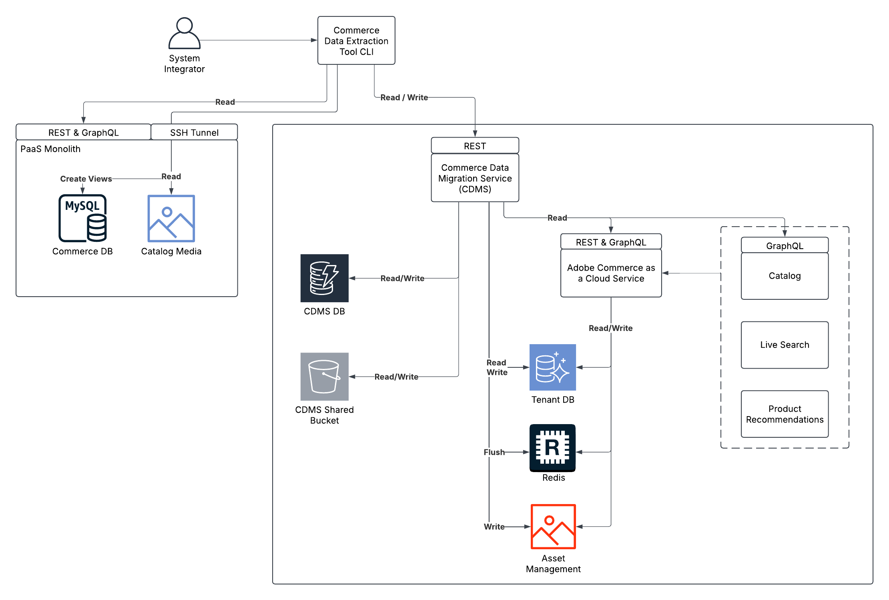

# Tool für die Massendatenmigration

Das Tool für die Massendatenmigration folgt einer verteilten Architektur, die eine sichere und effiziente Datenmigration von PaaS- zu SaaS-Umgebungen ermöglicht. Mit diesem Tool können Lösungsimplementierende Daten aus einer bestehenden Adobe Commerce on Cloud-Instanz (PaaS) nach [!DNL Adobe Commerce as a Cloud Service] (SaaS) migrieren. Weitere Informationen zum Migrationsprozess finden Sie unter [Migrationsübersicht](./overview.md).

>[!NOTE]
>
>Das Tool für die Massendatenmigration unterstützt nur die Migration von Commerce-Kerndaten von Erstanbietern. Die Migration benutzerdefinierter Daten wird derzeit nicht unterstützt.

Die folgende Abbildung zeigt die Architektur und die wichtigsten Komponenten für die Verwendung des Tools für die Massendatenmigration.

{zoomable="yes"}

## Migrations-Workflow

Der Workflow für die Massendatenmigration besteht aus den folgenden Schritten:

1. Richten Sie eine neue Umgebung für Ihre Migration ein.
1. Kopieren Sie Ihre Daten aus Ihrem alten System.
1. Verschieben Sie Ihre Daten in das neue System.
1. Stellen Sie Ihren Produktkatalog im neuen System zur Verfügung.
1. Überprüfen Sie, ob Ihre Daten korrekt migriert wurden.

In den folgenden Abschnitten werden diese Schritte detailliert beschrieben.

## Zugriff auf das Tool für die Massendatenmigration

Das Tool für die Massendatenmigration ist wie folgt verfügbar:

Dieses Tool ist derzeit über bereitgestellte technische Interaktionen verfügbar. Wenn Sie an der Verwendung dieses Tools interessiert sind, wenden Sie sich an den Adobe-Support.

## Erstellen einer Zielumgebung

Der Lösungsimplementierer erstellt eine Zielumgebung für die Migration. Diese Umgebung speichert die aus der Quellinstanz migrierten Daten.

Erstellen [&#x200B; zunächst eine neue  [!DNL Adobe Commerce as a Cloud Service] SaaS) &#x200B;](../getting-started.md#create-an-instance).

### Konfigurieren des Extraktionstools

Extrahieren Sie mit dem Extraktions-Tool Daten aus der Quellinstanz.

1. Laden Sie das Extraktions-Tool über den von Adobe bereitgestellten Link herunter.
1. Legen Sie die folgenden Umgebungsvariablen im Extraktions-Tool fest:
   - Verbindungsdetails zur vorhandenen MySQL-Datenbank
   - Die Ziel-Mandanten-ID für Ihre [!DNL Adobe Commerce as a Cloud Service]
   - Ihre IMS-Anmeldedaten, einschließlich:
      - Client-ID
      - Client-Geheimnis
      - IMS-Bereiche
      - IMS-URL : Die Basis-URL. Beispiel: `https://ims-na1.adobelogin.com/`.
      - IMS-Organisations-ID

   Wählen Sie für IMS-Bereiche und andere Werte Ihren OAuth-Typ im Abschnitt **Anmeldedaten** innerhalb Ihres Projekts in der [Adobe Developer Console](https://developer.adobe.com/console/). Weitere Informationen finden Sie in der `.example.env`, die mit dem Extraktions-Tool geliefert wird.

### Extrahieren von Daten

Vor Ausführung des Extraktions-Tools muss der Implementierer der Lösung einen SSH-Tunnel zur PaaS-Datenbank einrichten, indem er Folgendes verwendet:

```bash
magento-cloud tunnel:open
```

Führen Sie dann das Extraktions-Tool aus. Dieses führt folgende Vorgänge aus:

1. Stellen Sie eine Verbindung zur PaaS-Datenbank her, analysieren Sie deren Schema und vergleichen Sie es mit den Details des SaaS-Mandantenschemas.
1. Generieren eines Extraktions- und Umwandlungsplans basierend auf den gemeinsamen Schemaelementen zwischen PaaS und SaaS.
1. Extrahieren Sie die Daten mithilfe des Catalog Data Management Service (CDMS).

### Daten laden

Führen Sie das von Adobe bereitgestellte Tool zum Laden von Daten aus. Dieses Tool wird:

1. Stellen Sie mithilfe eines Migrationskontos eine Verbindung zur SaaS-Mandantendatenbank her.
1. Erstellen Sie einen Ladeplan.
1. Führen Sie den Plan aus und verschieben Sie Daten in Batches in die SaaS-Mandantendatenbank.
1. Katalogmedien verarbeiten und in die Zielumgebung übertragen
1. Leeren Sie den SaaS-Redis-Cache und invalidieren Sie die Datenbankindizes für den Mandanten.

### Aufnahme von Katalogdaten

Nach dem Laden der Daten fließen die Katalogdaten automatisch von der SaaS-Mandantendatenbank zum Katalog-Service.

Der Katalog-Service gibt diese Daten für die Live-Suche und für Produktempfehlungen frei. Für diesen Prozess ist kein manuelles Eingreifen erforderlich. Die Daten sind in allen -Services verfügbar, sobald die Aufnahme abgeschlossen ist.

>[!IMPORTANT]
>
>Die Konfigurationseinstellungen werden nicht automatisch importiert. Beachten Sie vor Beginn des Datenmigrationsprozesses Ihre aktuellen Katalogkonfigurationseinstellungen in der [!DNL Commerce Admin]. Implementieren Sie dann dieselbe Konfiguration in der [!DNL Adobe Commerce as a Cloud Service].

### Prüfung der Datenintegrität

Nach der Migration führt CDMS die folgenden automatischen Datenintegritätsprüfungen durch, um die Genauigkeit und Vollständigkeit der migrierten Daten sicherzustellen:

**API-basierte Verifizierung**

Während der Verifizierung vergleicht CDMS die REST- und GraphQL-API-Antworten von zuvor ausgeführten Abfragen mit den entsprechenden Datensätzen aus der Zielinstanz. Alle Diskrepanzen sind im Migrationsstatus sichtbar.

**Überprüfung auf Datenbankebene**

Bei der Überprüfung zählt CDMS die Anzahl der extrahierten Datensätze und vergleicht diese Anzahl mit der Anzahl der geladenen Datensätze.

**Prüfung auf Anfrage (optional)**

Sie können auch manuell eine umfassende Überprüfung aller Systemdatensätze in Trigger nehmen:

>[!NOTE]
>
>Dieser Prozess ist ressourcenintensiv und sollte nur in Sandbox-Umgebungen verwendet werden.

Die vollständige Verifizierung umfasst:

- Vollständige API-basierte Verifizierung mit allen vorab extrahierten REST- und GraphQL-API-Antworten
- Detaillierter Bericht über festgestellte Inkonsistenzen
