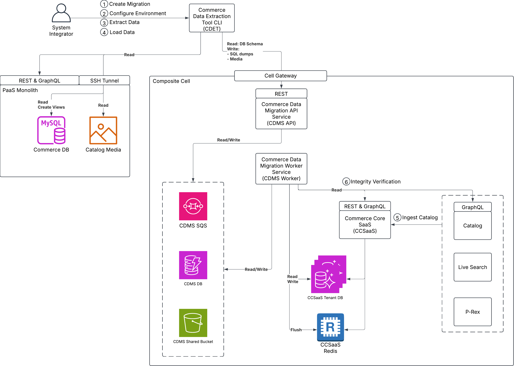

# Tool für die Massendatenmigration

>[!IMPORTANT]
>
>Das Tool für die Massendatenmigration befindet sich derzeit im Early Access-Modus. Der Zugriff wird ausschließlich über den Interaktionsprozess mit dem von Commerce bereitgestellten Engineering (CDE) bereitgestellt.

Das Tool für die Massendatenmigration ermöglicht es Systemintegratoren, Commerce-Kerndaten von Erstanbietern aus [!DNL Adobe Commerce on Cloud] oder lokalen Installationen nach [!DNL Adobe Commerce as a Cloud Service] zu migrieren.

Das Tool für die Massendatenmigration ist eine Docker-basierte CLI, die Systemintegratoren auf ihrem eigenen Migrationsrechner ausführen. Es stellt eine Verbindung zur Quellinstanz her, extrahiert Commerce-Kerndaten von Erstanbietern, lädt sie in den Migrationsdienst von Adobe (Commerce Data Migration Service) hoch und überwacht den Fortschritt bis zum Abschluss.

Alle Befehle werden lokal ausgeführt, sodass Sie steuern können, wann die Migration beginnt, wann der Wartungsmodus angewendet wird und wann jede Phase ausgeführt wird.

## Migrations-Workflow

Das Tool verwaltet die folgenden Schritte von Anfang bis Ende:

- **Datenextraktion** - Extrahiert Commerce-Kerndaten von Erstanbietern aus der Quellinstanz ([!DNL Adobe Commerce on Cloud] oder On-Premise).
- **Laden** - Lädt extrahierte Daten in die [!DNL Adobe Commerce as a Cloud Service].
- **Datenintegritätsprüfung** - Führt automatisierte Prüfungen nach der Migration durch, einschließlich REST- und GraphQL-API-Vergleichen und Validierung der Datensatzanzahl.

>[!NOTE]
>
>Derzeit unterstützt das Tool für die Massendatenmigration nur die Migration von Commerce-Kerndaten von Erstanbietern. Die Migration benutzerdefinierter Daten wird derzeit nicht unterstützt. Konfigurationseinstellungen (Store-Einstellungen, Systemkonfiguration) werden nicht automatisch migriert und müssen vor der Migration unabhängig auf der Zielinstanz eingerichtet werden.

## Architektur

Das Tool für die Massendatenmigration folgt einer verteilten Architektur, die eine sichere und effiziente Datenmigration ermöglicht. Dieses Tool hilft Systemintegratoren bei der Migration von Daten aus einem vorhandenen [!DNL Adobe Commerce on Cloud or on-premises instance] nach [!DNL Adobe Commerce as a Cloud Service]. Weitere Informationen zum Migrationsprozess finden Sie unter [Migrationsübersicht](../overview.md).

Die folgende Abbildung zeigt die Architektur und den End-to-End-Datenfluss unter Verwendung des Tools für die Massendatenmigration.

{zoomable="yes"}

### Komponenten

| Komponente | Rolle |
| --------- | ---- |
| **Tool für die Massendatenmigration** | Die Docker-basierte CLI wird vom Systemintegrator auf dem Migrationsrechner ausgeführt. Sie orchestriert die vollständige Pipeline, indem sie das Schema und die Daten aus der Quelle liest, die extrahierten Daten in den Migrations-Service von Adobe hochlädt und Statusübergänge steuert. |
| **Source-Instanz (Commerce on Cloud oder On-Premise)** | Die Migrationsquelle. Das Tool stellt eine Verbindung über REST- und GraphQL-APIs und über einen SSH-Tunnel ([!DNL Adobe Commerce on Cloud]) oder über eine direkte Datenbankverbindung (lokal) her, um Daten zu extrahieren. |
| **Commerce Data Migration Service (CDMS)-API** | Adobe-verwaltete REST-API, die Migrationen registriert, Statusübergänge koordiniert und sichere Endpunkte für das Hochladen extrahierter Daten bereitstellt. Das Migrations-Tool stellt eine Verbindung zu dieser API her, indem es die CDMS-Endpunkt-URL und die IMS-Anmeldeinformationen in Ihrer `.env`-Konfiguration verwendet. |
| **Commerce Data Migration Service (CDMS)-Worker** | Adobe-verwalteter Hintergrunddienst, der extrahierte Daten in die Zielinstanz lädt und eine Integritätsprüfung nach dem Laden durchführt. |
| **[!DNL Adobe Commerce as a Cloud Service]** | Die SaaS-basierte Version von Adobe Commerce und Ihr Migrationsziel. Empfängt geladene Daten und stellt Katalog-, Live Search- und Preisregeldienste zur Verfügung, die bei der Integritätsprüfung verwendet werden. |

### Datenfluss

Daten werden in der folgenden Reihenfolge durch die Komponenten verschoben:

1. Das Tool für die Massendatenmigration liest das Datenbankschema und die Daten aus der Quellinstanz über einen SSH-Tunnel für die [!DNL Adobe Commerce on Cloud] oder eine direkte Datenbankverbindung für On-Premise.
1. Das Tool registriert die Migration und lädt die extrahierten Daten über die CDMS-API hoch.
1. Der CDMS-Worker lädt die Daten in den Ziel-[!DNL Adobe Commerce as a Cloud Service]-Mandanten.
1. [!DNL Adobe Commerce as a Cloud Service] nimmt die geladenen Katalogdaten auf und erstellt den Katalogindex.
1. Der Commerce Data Migration Service (CDMS)-Worker überprüft die geladenen Daten durch Datenbankprüfsummenvergleich, REST und GraphQL in den folgenden Services:

   - **Katalog** (GraphQL) — Produkt- und Kategoriedaten.
   - **Live Search** (REST) — Richtigkeit des Suchindex.
   - **Preisregeln** (REST) — Preis- und Regeldaten.

1. Das Tool fragt den Migrationsstatus durchgängig ab und ruft den endgültigen Migrationsbericht nach Abschluss ab.

## Interaktionslebenszyklus

Der Zugriff auf das Tool für die Massendatenmigration wird ausschließlich über ein von Commerce bereitgestelltes Engineering (CDE)-Projekt bereitgestellt. Das Tool ist nicht öffentlich zugänglich.

Der typische Interaktionslebenszyklus ist:

1. **CDE-Erkennung** - Schließen Sie den ersten Scoping-Aufruf ab, bewerten Sie den Datenspeicherbedarf und die Komplexität und füllen Sie den Scoping-Fragebogen aus.
1. **Deal Sign** - Die Handelsvereinbarung ist in Kraft und der Migrationsumfang wird bestätigt. In dieser Phase erhalten Sie Zugriff auf das Migrations-Tool.
1. **Co-Innovation und Support von CDE** - Arbeiten Sie mit Adobe zusammen, um das Tool in Ihrer Umgebung zu installieren und Testmigrationen durchzuführen.
1. **Live schalten** - Die Migration zur Produktionsumstellung durchführen und die Datenintegrität vollständig überprüfen.

## Tool-Verteilung

Das Tool wird im Rahmen der Code-Interaktion bereitgestellt. Ihr Adobe-Support-Mitarbeiter stellt Ihnen das Tool-Paket zur Verfügung, das Folgendes umfasst:

- Die Docker-basierte CLI- und Build-Konfiguration
- Eine `.example.env` Konfigurationsvorlage mit Dokumentation für alle erforderlichen Umgebungsvariablen
- Umfassende technische Dokumentation, die die Architektur des Tools, Konfigurationsreferenzen, benutzerdefinierte Transformations- und Test-Frameworks und Handbücher zur Fehlerbehebung umfasst

Detaillierte Anweisungen zur Einrichtung und zum Betrieb finden Sie in der Dokumentation im Tool-Verteilungspaket.

## Migrationshandbücher

Auf den folgenden Seiten wird der gesamte Migrationslebenszyklus von der Vorbereitung bis zur Ausführung dargestellt. Um ein umfassendes Verständnis des Migrationsprozesses zu erhalten, überprüfen Sie diese in der folgenden Reihenfolge:

1. [Checkliste zur Kundenbereitschaft](readiness-checklist.md) - Bestätigen Sie die Voraussetzungen für Interaktion, Migration, Computer, Quelle und Ziel, bevor Sie den Zugriff auf das Tool anfordern.
1. [Überprüfen des Zugriffs auf den Migrationsdienst](cdms-access.md) - Nachdem Sie Zugriff auf das Tool erhalten haben, überprüfen Sie die Erreichbarkeit des Netzwerks, die IMS-Authentifizierung und die Mandantenautorisierung mit der Commerce Data Migration Service (CDMS)-API.
1. [Massendatenmigration ausführen](migration-guide.md) - Konfigurieren Sie das Tool, bereiten Sie Ihr Netzwerk und Ihre Instanzen vor und beginnen Sie die Migration.

Die vollständige Konfigurationsreferenz, benutzerdefinierte Transformations- und Test-Frameworks und Anleitungen zur Fehlerbehebung finden Sie in der Dokumentation, die im Tool-Verteilungspaket enthalten ist.
