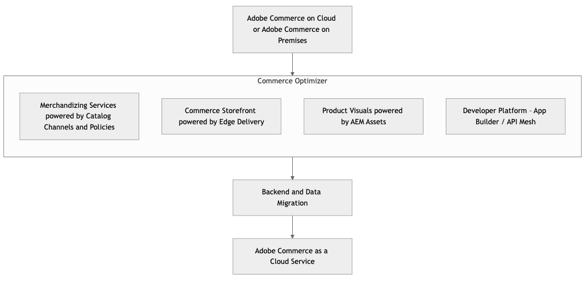

# Migrieren nach [!DNL Adobe Commerce as a Cloud Service]

[!DNL Adobe Commerce as a Cloud Service] bietet einen umfassenden Leitfaden für Entwickler, die von einem bestehenden Adobe Systems Commerce PaaS-Implementierung auf das neue Adobe Systems Commerce as a Cloud Service (SaaS)-Angebot umsteigen. Adobe Systems Commerce as a Cloud Service stellt eine signifikante Umstellung auf ein vollständig verwaltetes, versionsloses SaaS-Modell dar, das eine verbesserte Leistung, Skalierbarkeit, vereinfachte Abläufe und eine engere Integration in die breitere [!DNL Adobe Experience Cloud].

>[!NOTE]
>
>Weitere Informationen zu Migrationswerkzeugen finden Sie unter Massenmigrationstool [&#128279;](./bulk-data.md)Daten.

## Den Wandel verstehen – PaaS und SaaS im Vergleich

**Wichtige Unterschiede**

* [!BADGE Nur]{type=Informative url="https://experienceleague.adobe.com/en/docs/commerce/user-guides/product-solutions" tooltip="Gilt nur für Adobe Systems Commerce in Cloud-Projekten (Adobe Systems-verwaltete PaaS-Infrastruktur) und On-Premises-Projekte."} **PaaS PaaS (aktuell)**:Merchant verwaltet Applikation Code, Upgrades, Patches und die Infrastrukturkonfiguration innerhalb der gehosteten Umgebung von Adobe Systems. [Modell](https://experienceleague.adobe.com/en/docs/commerce-operations/security-and-compliance/shared-responsibility) der geteilten Verantwortung für Dienste (MySQL, Elasticsearch und andere).
* [!BADGE Nur]{type=Positive url="https://experienceleague.adobe.com/en/docs/commerce/user-guides/product-solutions" tooltip="Gilt nur für Adobe Systems Commerce as a Cloud Service und Adobe Systems Commerce Optimizer-Projekte (Adobe Systems verwaltete SaaS-Infrastruktur)."} **SaaS SaaS (Neu - [!DNL Adobe Commerce as a Cloud Service])**: Adobe Systems verwaltet die wichtigsten Applikation, die Infrastruktur und Updates vollständig. Händler konzentrieren sich auf die Anpassung über Erweiterungspunkte (APIs, App Builder, UI-SDKs). Der Code der Hauptanwendung ist gesperrt.

**Auswirkungen auf die Architektur**

* **Versionslose Plattform**: Kontinuierliche Updates bedeuten, dass für den Kern keine größeren Versions-Upgrades mehr erforderlich sind.
* **Microservices &amp; API-first**: Stärkere Abhängigkeit von APIs für Erweiterbarkeit und Integration.
* **Headless standardmäßig (optional)**: Starke Unterstützung für entkoppelte Storefronts (z. B. Commerce Storefront powered by Edge Lieferung Services).
* **Edge Lieferung Services**: Auswirkungen auf Leistung und Implementierung des Front-Ends.

**Neu Werkzeuge &amp; Konzepte**

* [Adobe Developer App Builder](https://developer.adobe.com/app-builder/) und [API Mesh für Adobe Developer App Builder](https://developer.adobe.com/graphql-mesh-gateway)
* [Commerce Optimizer](../../optimizer/overview.md)
* [Edge Delivery Services](https://experienceleague.adobe.com/developer/commerce/storefront/)
* Self-Service-Bereitstellung mit dem [Commerce Cloud Manager](../getting-started.md#create-an-instance)

## Migrationspfade

[!DNL Adobe Commerce as a Cloud Service] Unterstützt mehrere Migrationspfade, abhängig von Ihrem Timeline, Ihrer Storefront und Ihren Anpassungen.

Als Alternative zu einer vollständigen Migration unterstützt [!DNL Adobe Commerce as a Cloud Service] eine stufenweise Migration mithilfe von Commerce Optimizer oder eines inkrementellen Ansatzes.

* **Inkrementelle Migration** Dieser Ansatz umfasst die schrittweise Migration Ihrer Daten, Anpassungen und Integrationen. Dieser Ansatz ist ideal für große Händler mit vielen Anpassungen, die ihre komplexen Anpassungen und Daten schrittweise in ihrem eigenen Tempo auf [!DNL Adobe Commerce as a Cloud Service] umstellen möchten.

{width="600" zoomable="yes"}

* **Commerce Optimizer**: Bei diesem Ansatz können Sie iterativ migrieren, indem Sie Commerce Optimizer als Übergangsphase verwenden, um komplexe Anpassungen und Daten in Ihrem eigenen Tempo in [!DNL Adobe Commerce as a Cloud Service] zu verschieben. Commerce Optimizer bietet Zugriff auf Merchandising-Services, die auf Katalogansichten und Richtlinien basieren, auf die Commerce-Storefront mit Edge Delivery und auf [!DNL Product Visuals powered by AEM Assets].

{width="600" zoomable="yes"}

* **Voll Migration** – Bei diesem Ansatz werden alle Daten, Anpassungen und Integrationen gleichzeitig migriert. Dieser Ansatz ist ideal für kleinere Händler mit wenigen Anpassungen, die schnell Übergang auf [!DNL Adobe Commerce as a Cloud Service].

Die folgende Tabelle bietet einen Überblick über den Migrationsprozess für verschiedene Storefronts und Konfigurationen:

|                    | LUMA Storefront | PWA Storefront | Commerce-Storefront mit Edge Lieferung | Headless |
|--------------------|----------------------------------------|----------------------------------------|------------------------------------------------------|----------------------------------------|
| Daten Migration | Erforderlich | Erforderlich | Erforderlich | Erforderlich |
| Schaufenster | Zu Commerce-Storefront migrieren, das von Edge unterstützt wird Lieferung | Migration zu Commerce-Storefront mit Edge-Lieferung oder Wartung | Keine Auswirkungen | Keine Auswirkungen |
| API-Mesh | Build neues Gitter | Build neues Mesh oder konfigurieren Sie das vorhandene neu | Build neues Mesh oder konfigurieren Sie das vorhandene neu | Build neues Mesh oder konfigurieren Sie das vorhandene neu |
| Integrationen | Nutzen Sie das Starter-Kit für die Integration | Nutzen Sie das Starter-Kit für die Integration | Nutzen Sie das Starter-Kit für die Integration | Nutzen Sie das Starter-Kit für die Integration |
| Anpassungen | Verschieben zu Applikation Builder und API-Mesh | Verschieben zu Applikation Builder und API-Mesh | Verschieben zu Applikation Builder und API-Mesh | Verschieben zu Applikation Builder und API-Mesh |
| Assets Management | Migration bei Verwendung von OOTB erforderlich | Migration bei Verwendung von OOTB erforderlich | Migration bei Verwendung von OOTB erforderlich | Migration bei Verwendung von OOTB erforderlich |
| Erweiterungen | Zu Applikation Builder migrieren | Zu Applikation Builder migrieren | Zu Applikation Builder migrieren | Zu Applikation Builder migrieren |

Wie aus der Tabelle ersichtlich, bestehen die Abhilfemaßnahmen für jede Migration aus:

* **Datenmigration** - Verwenden der bereitgestellten [Migrations-Tools](./bulk-data.md) um Daten von Ihrer vorhandenen Instanz zu [!DNL Adobe Commerce as a Cloud Service] zu migrieren.
* **Storefront** – Vorhandene Commerce-Storefronts, die von Edge Lieferung unterstützt werden, und Headless-Storefronts erfordern keine Gegenleistung, aber Luma-Storefronts erfordern eine Migration zu Commerce-Storefront, die von Edge Lieferung unterstützt wird. PWA Studio Storefronts können zu Commerce Storefront migriert werden, das von Edge Lieferung unterstützt wird, oder in ihrem aktuellen Zustand beibehalten werden. Adobe Systems wird Beschleuniger bereitstellen, die Sie bei der Storefront-Migration unterstützen.
* **[API-Mesh: Erstellen ein neues Mesh](https://developer.adobe.com/graphql-mesh-gateway)** oder ändern Sie das vorhandene. Adobe Systems stellen vorkonfigurierte Gitter zur Verfügung, um diesen Prozess zu unterstützen.
* **Integrationen**: Bei allen Integrationen müssen entweder das [Integration Starter Kit](https://developer.adobe.com/commerce/extensibility/starter-kit/integration/) oder die [[!DNL Adobe Commerce as a Cloud Service] REST-API](https://developer.adobe.com/commerce/webapi/reference/rest/saas/) verwenden.
* **Anpassungen**: Alle Anpassungen müssen in Applikation Builder und API Mesh verschoben werden.
* **Assets-**: Die gesamte Asset-Verwaltung erfordert eine Migration. Wenn Sie [!DNL AEM Assets] bereits verwenden, müssen Sie nicht migrieren.
* **Erweiterungen** - Alle prozessinternen Erweiterungen müssen als prozessexterne Erweiterungen neu erstellt werden. Bis Ende 2025 wird Adobe Zugriff auf unsere beliebtesten Erweiterungen bieten, um die Erstellungszeiten zu minimieren.

## Migrationsphasen

In den folgenden Phasen werden die notwendigen Schritte und Überlegungen für die Migration zu [!DNL Adobe Commerce as a Cloud Service].

### Bewertung und Planung vor der Migration

Diese Phase ist wichtig, um Risiken zu minimieren, einen klaren Migrations Pfad zu etablieren und Probleme zu erkennen, bevor sie auftreten.

**Ermittlung und Prüfung der aktuellen Umgebung**

**Codebasis Analyse:**

* Identifizieren Sie alle benutzerdefinierten Module, Themen und Außerkraftsetzungen.
* Analysieren Sie die wichtigsten Codeänderungen und bestimmen Sie, welche im Rahmen der Migration umgestaltet werden müssen.
* Bewerten Sie Drittanbietererweiterungen und bestimmen Sie die Kompatibilität mit [!DNL Adobe Commerce as a Cloud Service]. Gibt es SaaS-kompatible Alternativen, oder müssen Sie benutzerdefinierte API-Integrationen oder Applikation Builder-Anwendungen erstellen?
* Identifizieren Sie veraltete Codes oder Funktionen, die nicht migriert werden.

**Daten Audit:**

* Bewerten Sie die Größe und Komplexität Ihrer Datenbank.
* Identifizieren Sie nicht verwendete Daten oder Tabellen für die Bereinigung.
* prüfen vorhandenen Datenimport/-exportprozessen.

**Überprüfung der Integrationen:**

* Liste alle externen Systeme, die in Adobe Systems Commerce integriert sind (ERP, CRM, PIM, Zahlungsgateways, Versanddienstleister OMS und alle anderen Systeme).
* Bewerten Sie Integrationsmethoden (API, benutzerdefinierte Skripte und andere Methoden).
* Bewerten Sie die Kompatibilität mit [!DNL Adobe Commerce as a Cloud Service]dem API-First-Ansatz und Applikation Builder.

**Leistungs-Benchmarks:**

* Dokumentieren Sie aktuelle Lighthouse-Scores, Seite Ladezeiten und Key Performance Indicators (KPIs), die eine Grundlage für die messen von Verbesserungen bei der Posting-Migration bieten.

**Überprüfung der Sicherheitskonfiguration:**

* Bewerten Sie benutzerdefinierte WAF-Regeln, IP-Zulassungslisten und andere Sicherheitskonfigurationen.

**Definieren Sie Migrations Umfang und -strategie:**

* **Phasenweise oder All-at-Once-Migration:** Bewerten Sie die Vor- und Nachteile der einzelnen Ansätze.
* **Identifizieren Sie Kerngeschäftsprozesse:** Priorisieren Sie Funktionen, die zuerst migriert werden müssen, z. B.:
   * Komplexe Preisgestaltungsregeln
   * Benutzerdefinierte Geschäftsregeln, die angewendet werden, bevor ein bestellen offiziell platziert oder verarbeitet wird
   * Komplexe Steuerberechnungen
   * Adresse Validierungen
   * Benutzerdefinierte Logik, die nach dem Platzieren einer bestellen ausgelöst wird
* **Headless vs. monolithische Storefront:** Entscheidungspunkt für die Entwicklung neuer Storefronts oder die Anpassung bestehender Storefronts.
* **Integrationsstrategie:** Legen Sie fest, wie bestehende Integrationen auf eine neue Plattform umgestellt werden sollen (API Mesh, Applikation Builder, direkte API).
* **Daten Migrationsstrategie:** Bestimmen Sie, ob Sie beabsichtigen, vollständige historische Daten, partielle Daten oder keine migrierten Daten zu migrieren.

**Teambereitschaft &amp;Training:**

* Machen Sie sich mit [!DNL Adobe Commerce as a Cloud Service] Konzepten, Entwicklungs- Workflows und neuen Tools vertraut.
* Nehmen Sie an praktischen Training mit Adobe Systems Applikation Builder-, Edge Lieferung Services- und [!DNL Adobe Commerce as a Cloud Service] Implementierung-Pipelines teil.

**Umgebung Einrichtung &amp; Bereitstellung:**

* Stellen Sie Ihre [!DNL Adobe Commerce as a Cloud Service] Sandbox- und Entwicklungsumgebungen mit Commerce Cloud Manager bereit.

### Inkrementelle Migrationsphasen

**Strategisches Refactoring und Externalisierung**

Diese Phase besteht aus dem Kern der Migration und konzentriert sich auf die Anpassung Ihrer Codebasis an das [!DNL Adobe Commerce as a Cloud Service] Cloud-nativ-Paradigma. Dazu gehört die strategische Einführung neuer Adobe Systems Services und die Verlagerung benutzerdefinierter Logik aus der Commerce-Kernplattform.

#### &#x200B;1. Migration von prozessbegleitenden Anpassungen und Erweiterungen in Applikation Builder

Dies ist eine entscheidende Phase, um einen &quot;Locked Core&quot; zu erreichen und Ihre Lösung zukunftssicher zu machen, die für die [!DNL Adobe Commerce as a Cloud Service] Architekturphilosophie von zentraler Bedeutung ist.

* **Externalisieren komplexer Logik in Applikation Builder**: Analysieren Sie vorhandene benutzerdefinierte Module und Erweiterungen von Drittanbietern in Ihrer PaaS-Codebasis. Für komplexe Business-Logik, maßgeschneiderte Integrationen oder Microservices, die keine direkte, prozessbegleitende Bearbeitung des zentralen Commerce-Datenmodells erfordern, refaktorieren Sie sie und re-platformen sie als serverlose Anwendungen innerhalb Adobe Systems Developer Applikation Builder.
* **API-Mesh** nutzen: Für Szenarien, die Daten aus mehreren Back-End-Systemen erfordern (z. B. PaaS Commerce-Backend, ERP, CRM und benutzerdefinierte Applikation Builder-Microservices), implementieren Sie eine API-Mesh-Ebene innerhalb Applikation Builder. Dadurch werden unterschiedliche APIs in einem einzigen, leistungsstarken GraphQL-Endpunkt konsolidiert, der von Ihrer neuen Storefront oder anderen Diensten genutzt wird, wodurch das Abrufen komplexer Daten vereinfacht wird.
* **Ereignisgesteuerte Architektur**: Nutzen Sie Adobe Systems E/A-Ereignis, um Applikation Builder-Aktionen auf der Grundlage von Ereignissen auszulösen, die in Ihrem PaaS-Instanz (z. B. Produktaktualisierungen, Kundenregistrierungen bestellen Statusänderungen) oder anderen verbundenen Systemen auftreten. Dies fördert die asynchrone Kommunikation, reduziert die enge Kopplung und erhöht die Ausfallsicherheit des Systems.

**Vorteil**: Dieser Schritt verringert die technische Schuld im Zusammenhang mit tief eingebetteten Anpassungen erheblich, beschleunigt den Übergang Ihrer Commerce-Instanz zu [!DNL Adobe Commerce as a Cloud Service] erheblich, verbessert die Skalierbarkeit und unabhängige Bereitstellbarkeit von benutzerdefinierter Logik und beschleunigt die Entwicklungszyklen für Erweiterungen.

#### &#x200B;2. Einführung von SaaS-basierten Adobe Commerce-Merchandising-Services und Integration von Katalogdaten

Dies ist ein wichtiger erster Integrationspunkt mit zwei Optionen für die Katalogdaten-Verwaltung:

>[!BEGINTABS]

>[!TAB Option 1 - Vorhandener Katalog-SaaS-Dienst]

**Nutzen Sie den vorhandenen Catalog SaaS-Service, der in das PaaS-Backend integriert ist**

Diese Option dient als Übergangsschritt und baut auf einer bestehenden Integration auf, bei der Ihr PaaS-Backend eine vorhandene Instanz des Adobe Systems Commerce SaaS-Dienstes mit Daten aus dem Katalogdienst[, Live-suchen](../../catalog-service/guide-overview.md) [&#x200B; und &#x200B;](../../live-search/overview.md)Produktempfehlungen[&#128279;](../../product-recommendations/overview.md) füllt.

* **Katalogdatensynchronisierung**: Stellen Sie sicher, dass Ihre Adobe Systems Commerce-PaaS-Instanz weiterhin Produkt- und Katalogdaten mit Ihrem vorhandenen Adobe Systems Commerce-Katalog-SaaS-Dienst synchronisiert. Dies beruht in der Regel auf etablierten Konnektoren oder Modulen innerhalb Ihrer PaaS-Instanz. Der Catalog SaaS-Dienst bleibt die maßgebliche Quelle für suchen- und Merchandising Funktionen und leitet seine Daten von Ihrem PaaS-Backend ab.
* **API-Mesh zur Optimierung**: Während die Headless-Storefront (auf Edge Lieferung Services) und andere Dienste Daten direkt aus dem Catalog SaaS-Dienst nutzen können, empfiehlt Adobe Systems dringend, API Mesh (innerhalb Applikation Builders) zu verwenden. API Mesh kann APIs aus dem Catalog SaaS-Dienst mit anderen erforderlichen APIs aus Ihrem PaaS-Backend (z. B. Echtzeit-Warenbestand-Überprüfungen aus der Transaktionsdatenbank oder benutzerdefinierten Produktattributen, die nicht vollständig auf den Catalog SaaS-Dienst repliziert werden) in einem einzigen, leistungsfähigen GraphQL-Endpunkt vereinheitlichen. Dies ermöglicht auch eine zentralisierte Caching, Authentifizierung und Antwort Umwandlung.
* **Integrieren Sie Live-Search und Produkt-Recommendations**: Konfigurieren Sie Live-Search und Product Recommendations SaaS-Dienste so, dass [Katalogdaten](https://experienceleague.adobe.com/en/docs/commerce/live-search/install#configure-the-data) direkt aus Ihrem vorhandenen Adobe Systems Commerce-Katalog-SaaS-Dienst aufgenommen werden, der wiederum von Ihrem PaaS-Backend aufgefüllt wird.

**Vorteil**: Dies bietet einen schnelleren Pfad zu einer Headless-Storefront und erweiterten SaaS-Merchandising Funktionen, indem ein bestehender und betrieblicher Katalog-SaaS-Service und dessen Integrationspipeline mit Ihrem PaaS-Backend genutzt werden. Es behält jedoch die Abhängigkeit vom PaaS-Back-End für den primären Katalog-Datenquelle bei und bietet nicht die Multi-Source-Aggregationsfunktionen, die dem neuen Composable Catalog Daten-Modell innewohnen. Diese Option ist ein guter Schritt auf dem Weg zu einer umfassenderen Composable Architecture.

>[!TAB Option 2 - Composable Catalog Daten Model]

**Übernahme des neuen Composable Catalog Daten Model (CCDM)**

Dies ist der strategische, zukunfts Testversand orientierte Ansatz für die Nutzung Adobe Systems Commerce Optimizer. CCDM bietet einen flexiblen, skalierbaren und einheitlichen Katalogdienst, der für die Aggregation von Daten aus mehreren Quellen und dynamische Merchandising entwickelt wurde.

* **Daten Aufnahme und Vereinheitlichung**
   * Beginnen Sie mit der Aufnahme von Produkt- und Katalogdaten aus Ihrem vorhandenen Adobe Systems Commerce-PaaS-Instanz (und/oder anderen PIM/ERP-Systemen) in das neue Composable Catalog Daten Model (CCDM).
   * Ordnen Sie vorhandene Produktattribute den flexiblen Schema des CCDM zu. Priorisieren Sie wichtig Produktdaten für die erste Aufnahme.
   * Richten Sie robuste Datenpipelines für eine kontinuierliche Synchronisierung ein. Dabei kann es sich um Folgendes handeln:
      * **Ereignisgesteuert** (über Applikation Builder): Nutzen Sie Adobe Systems E/A-Ereignis Ihrer PaaS-Instanz, um öffentlich verfügbare oder benutzerdefinierte Adobe Systems Applikation Builder-Anwendungen auszulösen. Diese Anwendungen transformieren Datenänderungen (Erstellen, Aktualisieren und Löschen) und pushen sie über ihre APIs an das CCDM.
      * **Batch Aufnahme**: Verwenden Sie für große anfängliche Ladevorgänge oder regelmäßige Massenaktualisierungen sichere Dateiübertragungen (z. B. CSV oder JSON) in einen Staging-Bereich, der von Adobe Experience Platform (AEP) Aufnahme Services in CCDM verarbeitet wird.
      * **Direkte API-Integration** (mit Applikation Builder Orchestrierung): Für komplexere Szenarien kann Applikation Builder als Orchestrierung Layer fungieren, direkte API-Aufrufe an Ihr PaaS-Backend senden, die Daten transformieren und an CCDM übertragen.
* **Katalog Ansicht und Regel Definition**: Konfigurieren Sie Katalogansichten (logische Gruppierungen für eine eindeutige Katalogdarstellung, z. B. Geschäft Ansichten, Regionen und B2B/B2C Segmente) und definieren Sie Richtlinien (Regel Sätze für die Produktdarstellung, Filterung und Merchandising) innerhalb des CCDM. Dies ermöglicht eine dynamische Steuerung der Produktsortimente und der Anzeigelogik pro Katalog Ansicht.
* **Integrieren Sie Live-Search und Produkt-Recommendations**: Sobald Katalogdaten in CCDM vorhanden sind, integrieren Sie die SaaS-basierten Live-Search und Product Recommendations-Services von Adobe Systems. Diese verwenden Adobe Systems KI-, KI- und Machine-Learning-Modelle für überlegene suchen Relevanz und personalisierte Empfehlungen, wobei Daten direkt aus dem CCDM genutzt werden.

**Nutzen**: Durch die Abstrahierung der Katalogverwaltung und -erkennung in CCDM und die zugehörigen SaaS-Dienste erzielen Sie eine verbesserte Leistung, erhalten KI-gesteuerte Merchandising-Funktionen, entlasten Lesevorgänge erheblich von Ihrem Legacy-Backend und ermöglichen ein robustes &quot;Abziehen&quot; der Top-of-Trichter-Erlebnis.

>[!ENDTABS]

#### &#x200B;3. Build Sie Ihr Schaufenster auf Edge Lieferung Services

Nachdem Merchandising Datenpipelines eingerichtet und Anpassungen ausgelagert wurden, verlagert sich der konzentrieren auf den Aufbau Ihres leistungsstarken Frontends.

* **Ersteinrichtung**: Festlegen Ihr Projekt mit der Adobe Systems Commerce Storefront-Boilerplate für Edge Lieferung Services. Dies bietet ein grundlegendes Headless-Frontend, das auf modernen Webtechnologien basiert.
* **Stellen Sie eine Verbindung zu Katalogdiensten und API-Mesh** her: Ihr Commerce-Storefront verbraucht Daten hauptsächlich über GraphQL-APIs:
   * **Option 1**: Über den vorhandenen SaaS-Katalogdienst (über API Mesh) für Produktinformationen und Merchandising Regeln.
   * **Option 2**: Über CCDM für Produktinformationen und Merchandising Regeln.
   * Über API Mesh für alle orchestrierten Daten aus Ihrem Legacy-Backend (PaaS-Instanz) oder benutzerdefinierten Applikation Builder-Diensten (z. B. Echtzeit-Warenbestand, benutzerdefinierte Produktattribute und Treuepunkteanzeige).
* **Inhaltsmigration (AEM Services):** Migrieren Sie Ihre vorhandenen statischen Inhalte (z. B. &quot;Info&quot;-Seiten, Blogbeiträge und Marketing-Banner) in AEM Services, die die Commerce-Storefront unterstützt. Nutzen Sie die Inhaltserstellung Funktionen von AEM und stellen Sie sicher, dass Assets für Edge- Lieferung Services optimiert sind.
* **Entwickeln Sie UI-Kernkomponenten**: Build wichtig User Schnittstellenkomponenten für Produktdetailseiten (PDPs), Produktlistenseiten (PLPs) und allgemeine Inhalte-Seiten mithilfe von Edge-Lieferung Services Drop-in-Komponenten und benutzerdefinierten React/Vue-Komponenten aus. Priorisieren Sie wichtige Commerce-Flüsse.
* **Integration in bestehende Warenkorb/Checkout**: Zunächst orchestriert der Edge Lieferung Services Storefront eine Übergabe an Ihre vorhandene Adobe Systems Commerce-PaaS (oder eine andere Plattform eines Drittanbieters) für die Verwaltung und Checkout von Warenkorb. Dies beinhaltet in der Regel:
   * **Umleitung**: Umleitung der User an die nativ Warenkorb und Checkout-URLs der Legacy-Plattform und Übergabe der erforderlichen Sitzungs- und Warenkorb-IDs.
   * **Direkte API-Interaktion** (mit Applikation Builder Orchestrierung): Erstellen von benutzerdefinierten Warenkorb und Checkout UI Komponenten innerhalb von Edge Lieferung Services, die direkt mit den Warenkorb- und Checkout APIs Ihres PaaS-Backends interagieren. Dies beinhaltet häufig die Applikation Builder als Backend-for-Frontend (BFF), um Aufrufe an mehrere Back-End-Dienste (z. B. PaaS-Warenkorb, Zahlungsgateways und Versandrechner) zu orchestrieren.

**Vorteil**: Liefert eine blitzschnelle, SEO-optimierte und hochflexible Storefront-Erlebnis. Diese Phase trägt direkt zu einer überlegenen Kundenerlebnis bei und legt den Grundstein für zukünftige Frontend-Innovationen.

#### &#x200B;4. Daten Migration (stufenweises Verfahren)

Daten Migration ist ein wichtig und facettenreicher Prozess, der gleichzeitig mit dem Refactoring und der Storefront-Entwicklung ausgeführt wird, um die Datenkonsistenz und -integrität zu gewährleisten.

* **Bereinigen und optimieren Sie vorhandene Daten**: Führen Sie vor einer groß angelegten Migration umfassende Daten Datenbereinigung, Deduplizierung und Tauglichkeitsprüfung Ihrer vorhandenen PaaS-Datenbank durch. Dieser proaktive Schritt ist entscheidend, um die Übertragung von Altdatenproblemen zu minimieren und die Qualität der Daten in der neuen Umgebung sicherzustellen.

**Massendatenmigrationen**

Bei der Massendatenmigration wird ein vollständiger Daten-Dump aus Ihrer Adobe Systems Commerce-PaaS-Instanz genommen, die gesamte Datensatz transformiert und auf einmal als Cloud Service in Adobe Systems Commerce importiert. Diese Methode wird in der Regel für die anfängliche Füllung von Daten verwendet.

* **Verfügbarkeit** von Tools: Dedizierte [Tools](./bulk-data.md) für die Massendatenmigration für Kunden für die Migration von Commerce-Massendaten durch Erstanbieter werden im 1. Quartal 2026 bis Anfrage verfügbar sein. Wenn Kunden im Vorfeld Unterstützung bei der Massendatenmigration benötigen, können Adobe Systems die Datenübertragung in ihrem Namen durch Anfrage erleichtern.

* **Ablauf**:
   * **Voll Datenexport**: Extract eine vollständige Datensatz aus Ihrer Adobe Systems Commerce-PaaS-Instanz (z. B. Produkte, Kategorien, Kundenkonten, historische bestellen Daten, statische Blöcke und Seite Inhalte).
   * **Daten Umwandlung**: Übernehmen notwendigen Transformationen, um die extrahierten Daten mit den Schema Anforderungen der neuen Adobe Systems Commerce-as-a-Cloud Service-Komponenten in Einklang zu bringen, einschließlich des Composable Catalog Daten Model (CCDM), falls es übernommen wird, und aller anderen relevanten Adobe Systems-Dienste oder -Datenbanken. Dabei kann es sich um benutzerdefinierte Skripte oder spezielle Datenzuordnungstools handeln.
   * **Initialer Import**: Importieren die umgewandelte vollständige Datensatz in die entsprechenden Komponenten von Adobe Systems Commerce als Cloud Service. Für Produkt- und Kategorie-Daten wird der ausgewählte Katalogdienst (CCDM oder vorhandener SaaS-Katalog) aufgefüllt. Für Kunden- und bestellen Daten werden damit das Transaktions-Backend oder die zugehörigen Dienste aufgefüllt.
   * **Validierung: Validieren** Sie die importierten Daten rigoros, um Vollständigkeit, Genauigkeit und Konsistenz in allen neuen Systemen sicherzustellen.

**Iterative Datenmigrationen**

Iterative Datenmigrationen konzentrieren auf der Synchronisierung inkrementeller Änderungen und Deltas von der Quell-PaaS-Instanz mit den neuen Cloud Service Komponenten, um die Aktualität der Daten vor und nach der Umstellung sicherzustellen.

* **Verfügbarkeit von** Tools: Tools, die speziell für iterative Datenmigrationen entwickelt wurden, werden im Jahr 2026 verfügbar sein.

* **Ablauf**:
   * **Delta-Identifikation**: Richten Sie Mechanismen ein, um Änderungen (Erstellungen, Aktualisierungen und Löschungen) in wichtig Datensätzen auf Ihrer PaaS-Umgebung seit dem letzten Synchronisation zu identifizieren. Dabei kann es sich um Change Data Capture (CDC), Zeitstempelvergleiche oder Ereignis-basierte Trigger handeln.
   * **Kontinuierliche Synchronisierung**: Implementieren Sie robuste Mechanismen für eine kontinuierliche, inkrementelle Datensynchronisierung von Ihrem PaaS-Umgebung zu den neuen Cloud Service-Komponenten (z. B. CCDM und Transaktions-Backend). Dies ist entscheidend, um die Aktualität der Daten aufrechtzuerhalten und Ausfallzeiten während der Umstellung zu minimieren.
   * **Nutzung von Ereignissen**: Nutzen Sie nach Möglichkeit Adobe Systems E/A-Ereignis, um Applikation Builder-Aktionen für Echtzeit- oder nahezu Echtzeit-Updates von Ihrem PaaS-Instanz auf die neuen Dienste auszulösen. Beispielsweise könnte eine Produktaktualisierung in PaaS eine Ereignis auslösen, die den entsprechenden Eintrag in CCDM aktualisiert.
   * **API-gesteuerte Updates**: Verwenden Sie für Daten, die nicht Ereignis-gesteuert sind, geplante API-Aufrufe (über Applikation Builder oder andere Integrationsplattformen), um Änderungen von PaaS zu abrufen und sie auf die neuen Systeme zu übertragen.
   * **Fehler Handhabung und Überwachung**: Implementieren Sie eine robuste Fehlerbehandlung, Protokollierung und Überwachung für alle iterativen Datenpipelines, um sicherzustellen, dass die Datenintegrität während des gesamten Prozesses gewahrt bleibt.

### Post-Migration und laufender Betrieb

**DNS-Umstellung und Live-Schaltung:**

* Planen Sie die DNS-Umstellung sorgfältig und mit minimaler Ausfallzeit.
* Überwachen Sie den Zustand und die Leistung der Site sofort Posting-starten.

**Post-starten-Operationen:**

**Stilllegung von PaaS-Umgebung:**

* Archivieren oder löschen Sie alte PaaS-Instanzen und -Daten nach dem Tauglichkeitsprüfung Zeitraum.

**Laufende Weiterentwicklung arbeitsablauf:**

* Nutzen Sie die versionslose Natur von [!DNL Adobe Commerce as a Cloud Service], die kontinuierliche kleine Bereitstellungen anstelle von großen Upgrades bietet.
* Nutzen Sie Cloud Manager für die Verwaltung von Umgebungen und Bereitstellungen.
* Nutzen Sie Applikation Builder, um Funktionen zu erweitern, ohne den Core zu beeinträchtigen.

**Überwachung, Leistung und Sicherheit:**

* Überwachen Sie kontinuierlich Site-Performance, Fehler und Sicherheitsprotokolle.
* Nutzen Sie die integrierten Sicherheitsfunktionen von Adobe Systems und halten Sie sich an Best Practices.

**Schulung und Dokumentation:**

* Schulen Sie neue Entwickler und Geschäftsanwender auf der Plattform und Workflows [!DNL Adobe Commerce as a Cloud Service] .
* Pflegen Sie die aktuelle interne Dokumentation für benutzerdefinierte Integrationen und Prozesse.
