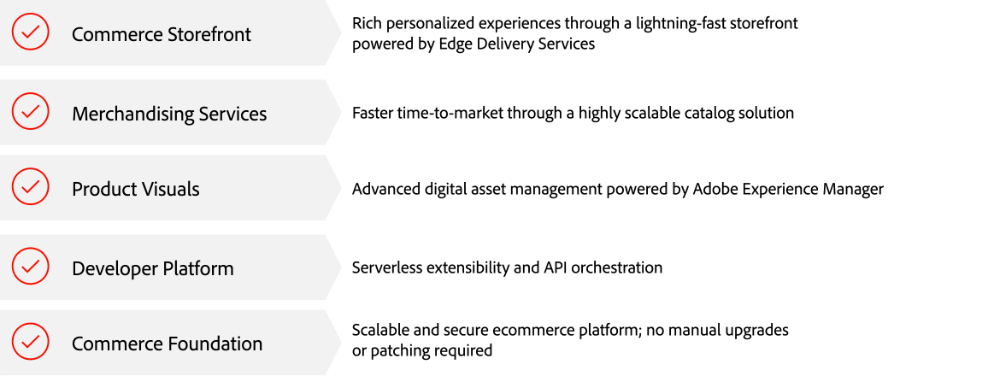
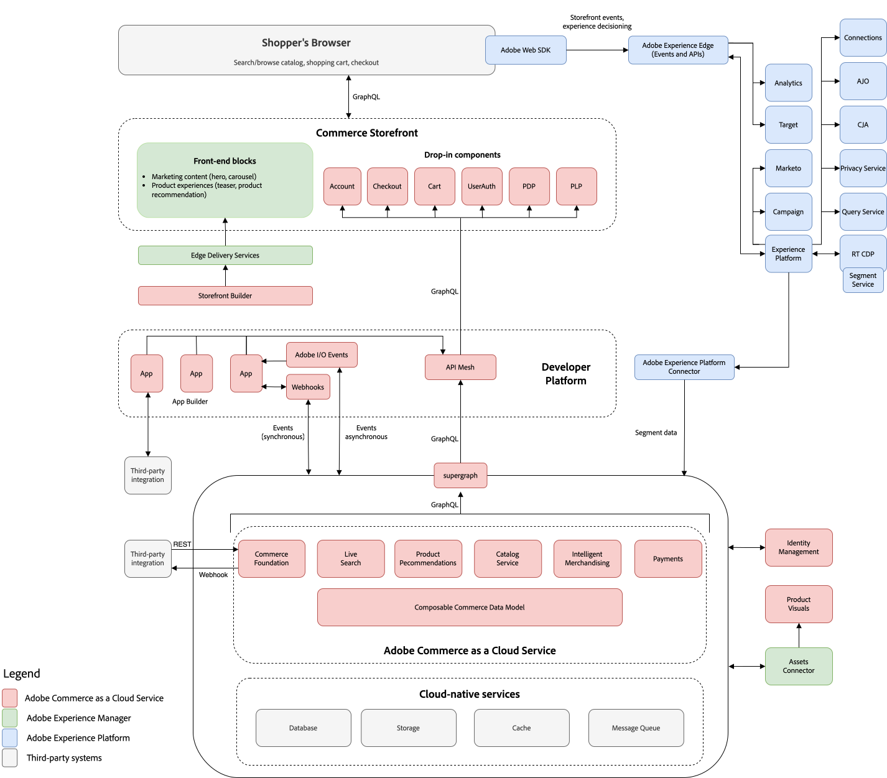

# Übersicht über Adobe Commerce as a Cloud Service

Adobe Commerce as a Cloud Service bietet Flexibilität, Skalierbarkeit und Effizienz, da Unternehmen digitale Abläufe bereitstellen und schnell skalieren und Innovationen beschleunigen können. Die Cloud-native Infrastruktur von Adobe passt Ressourcen automatisch an Spitzenanforderungen an Traffic, Bestellungen und Katalogmanagement an.

Die folgende Grafik zeigt die Produkte, die Adobe Commerce as a Cloud Service unterstützen:

{align="center" zoomable="yes"}

>[!BEGINSHADEBOX]

 Wenn Sie am Early-Access-Programm von Adobe Commerce as a Cloud Service teilnehmen möchten, füllen Sie [dieses Formular](https://forms.office.com/pages/responsepage.aspx?id=Wht7-jR7h0OUrtLBeN7O4WOxhjY2doZPikS2hIbfmL5URFZXTE5TUk9PMUw0OFdOWTBNNlI3UTlNMS4u&amp;route=shorturl) aus.

>[!ENDSHADEBOX]

## Architektur

Im folgenden Video finden Sie eine kurze Einführung in die Architektur von Adobe Commerce as a Cloud Service. Diagramme, die die Architektur veranschaulichen, werden unter dem Video bereitgestellt.

>[!VIDEO](https://video.tv.adobe.com/v/3443232?learn=on)

Dieses Diagramm zeigt den Datenfluss zwischen Adobe Commerce as a Cloud Service und allen Adobe Experience Cloud-Lösungen.

{zoomable="yes"}

## Commerce-Storefront

Verwenden Sie die [Commerce-Storefront](https://experienceleague.adobe.com/developer/commerce/storefront) von Adobe, die von Edge Delivery Services unterstützt wird, um in Minutenschnelle umfassende Erlebnisse mit einfacher dokumentbasierter Bearbeitung oder visueller Bearbeitung mit Storefront Builder zu erstellen.

Die Commerce-Storefront ist vollständig Headless mit einer entkoppelten Architektur, die alle Merchandising-Services und -Daten über eine GraphQL-API-Ebene bereitstellt. Diese Architektur ermöglicht es Teams, ihre Frontends unabhängig von der Commerce Foundation zu entwickeln, und bietet die Agilität, neue Touchpoints mit neuen Technologien zu erstellen und zu testen.

>[!NOTE]
>
>Adobe Commerce as a Cloud Service unterstützt keine Luma-Storefronts. Wenn Sie von Adobe Commerce in der Cloud oder lokal migrieren, finden Sie unter [Vorhandene Storefronts](https://experienceleague.adobe.com/developer/commerce/storefront/discovery/#existing-storefronts) Anleitungen zum Übergang.

## Merchandising- und Zahlungsdienste

Adobe bietet eine breite Palette intelligenter, zusammenstellbarer Merchandising-Services, mit denen Sie Ihre wichtigsten Geschäftsziele unterstützen können. Diese Services bieten auch APIs, die für die skalierte Leistungsoptimierung von entscheidender Bedeutung sind.

- [Live-Suche](../live-search/overview.md) - Mit diesem KI-gestützten Suchwerkzeug können Sie Käufern intelligentere, schnellere und relevante Ergebnisse liefern.
- [Produktempfehlungen](../product-recommendations/overview.md) - Fügen Sie KI-gestützte Empfehlungen hinzu, die auf dem Kundenverhalten, beliebten Trends, Produktähnlichkeiten und mehr basieren.
- [Merchandising-Services auf Basis von Kanälen und Richtlinien](../merchandising-services/overview.md) - Verwalten Sie große und komplexe Produktkataloge mit flexibler Datenmodellierung, um leistungsstarke, flexible Commerce-Kataloge bereitzustellen, die an der Geschäftsstruktur und an Markteinführungsstrategien ausgerichtet sind. Verwenden Sie mit [Commerce Optimizer](../optimizer/overview.md), um die Katalogleistung zu optimieren und die Konversionsraten zu verbessern.
- [Payment Services](../payment-services/overview.md) - Steigern Sie die Kundenzufriedenheit, indem Sie verschiedene Zahlungsmethoden anbieten, einschließlich zinsfreier Zahlungsraten und einer einzigen Ansicht der Zahlungsabwicklung, Bestellungen und Rechnungen.

## Produktvisualisierung

Vereinfachen Sie das Asset-Management mit einem robusten DAM-System (Digital Asset Management), das zum Verwalten von Rich-Media-Inhalten mit Adobe Experience Manager integriert werden kann. Alternativ bietet das native Mini-DAM grundlegende Asset-Management-Tools zum Speichern und Verwalten digitaler Assets.

Weitere Informationen [ Sie unter ](https://experienceleague.adobe.com/en/docs/commerce-admin/content-design/aem-asset-management/aem-assets-integration)Asset-Management“.

## Entwicklerplattform

Adobe bietet Entwicklern umfassende Erweiterungspunkte und Tools, um Programme zu erstellen, die die Commerce Foundation-Funktionen erweitern und mit Drittanbietersystemen (wie CRMs, ERPS und PIMS) integrieren. Diese Tools senken Ihre Gesamtbetriebskosten der Plattform wie folgt:

- **Skalierbarkeit** - Anwendungen können getrennt von der Kernsoftware skaliert werden, was eine höhere Effizienz und vereinfachte Upgrades ermöglicht.
- **Isolation**-Eine isolierte Umgebung bedeutet, dass Entwickler ihre Erweiterungen nach eigenem Ermessen aktualisieren oder ändern können, ohne sich auf eine Hauptversion zu verlassen.
- **Technologische Unabhängigkeit**-Entwickler können wählen, welche Technologie-Stacks und Programmiersprachen ihren Bedürfnissen entsprechen.

>[!TIP]
>
>Von Anbietern erstellte Apps sind auch für die Installation auf [Adobe Exchange verfügbar](https://exchange.adobe.com/).

Adobe bietet die folgenden Entwickler-Tools zum Erstellen von Integrationen und Anpassungen:

- [**API Mesh für Adobe Developer App Builder**](https://developer.adobe.com/graphql-mesh-gateway/) - Koordinieren und kombinieren Sie mehrere API-, GraphQL-, REST- und andere Quellen zu einem einzigen, abfragbaren GraphQL-Endpunkt.
- [**App Builder**](https://developer.adobe.com/app-builder/docs/overview/): Erstellen und implementieren Sie sichere und skalierbare Web-Anwendungen, die die Commerce-Funktionalität erweitern und mit Lösungen von Drittanbietern integrieren.
- [**Ereignisse**](https://developer.adobe.com/commerce/extensibility/events/) - Verwenden Sie benutzerdefinierte Ereignis-Trigger, um mit anderen erweiterbaren Entwicklungs-Tools zu interagieren.
- [**Webhooks**](https://developer.adobe.com/commerce/extensibility/webhooks/) - Verwenden Sie Webhooks, um Trigger zwischen Commerce und Drittanbietersystemen automatisch zu erstellen.
- [**Admin-Benutzeroberfläche SDK**](https://developer.adobe.com/commerce/extensibility/admin-ui-sdk/) - Passen Sie den Commerce-Admin an und erweitern Sie ihn mit neuen Seiten und Funktionen für Ihre Händler.
- [**Integration Starter Kit**](https://developer.adobe.com/commerce/extensibility/starter-kit/integration/) - Beschleunigen Sie Ihre Backoffice-Integrationen mit Referenzintegrationen, Onboarding-Skripten und einer standardisierten Architektur.

## Commerce Foundation

Commerce Foundation bietet eine sichere automatisierte Hosting-Plattform und Self-Service-Funktionen für die Verwaltung Ihrer Commerce-Anwendung in einer Cloud-nativen Umgebung. Zu den wichtigsten Funktionen gehören:

- Vereinfachtes Onboarding
- Nahtlose Upgrades

### Vereinfachtes Onboarding

Starten Sie Sandbox- und Produktionsinstanzen in Minutenschnelle mit dem Commerce Cloud Manager Self-Service-Bereitstellungsportal. Alles, was Sie benötigen, einschließlich Merchandising Services, Commerce Storefront und App Builder, wird automatisch konfiguriert und in Ihre Instanzen integriert.

Unter [Erste Schritte](getting-started.md) erfahren Sie, wie Sie Commerce-Instanzen erstellen und verwalten.

### Nahtlose Upgrades

Zugriff auf die neuesten Funktionen und Verbesserungen ohne manuelle Upgrades. Durch die kontinuierliche Bereitstellung neuer Funktionen und Updates ist kein manuelles Patchen mehr erforderlich, sodass Sie stets auf die neuesten Funktionen mit niedrigen Gesamtbetriebskosten zugreifen können.

Der typische Upgrade-Prozess für Adobe Commerce in Cloud umfasste das Erstellen von Backups, das Klonen von Instanzen, das Ausführen von Kompatibilitäts-Tools und das Beheben von Code-Konflikten. Mit Adobe Commerce as a Cloud Service ist dies nicht mehr erforderlich. Adobe sendet Ihnen In-App-Benachrichtigungen, wenn neue Funktionen und Sicherheitsaktualisierungen veröffentlicht wurden. Sie haben einen Zeitraum von 30 Tagen, um die neuen Funktionen in Ihren Sandbox-Instanzen zu bewerten, bevor die Aktualisierungen automatisch auf Ihre Produktionsumgebungen angewendet werden.

>[!NOTE]
>
>Adobe garantiert Abwärtskompatibilität für alle Updates. Das bedeutet, dass Aktualisierungen, die angewendet werden, nicht die vorhandenen Funktionen oder Anpassungen beeinträchtigen, die dem Modell der &quot;[-First-Erweiterbarkeit](https://developer.adobe.com/commerce/extensibility/) entsprechen.

## Experience Cloud-Integration

Adobe Commerce as a Cloud Service lässt sich mit allen Experience Cloud-Lösungen integrieren, um [personalisierte Commerce-Erlebnisse in großem Maßstab“ ](https://experienceleague.adobe.com/en/docs/commerce-admin/customers/customers-menu/personalize-scale#customers-menu).

[Datenverbindung](../data-connection/overview.md) ermöglicht Einblicke in das Kaufverhalten Ihrer Kunden, sodass Sie mit anderen Adobe Digital Experience-Produkten kanalübergreifend personalisierte Einkaufserlebnisse erstellen können.

## Vorteile

In den folgenden Abschnitten finden Sie Informationen zu den Vorteilen, die Adobe Commerce as a Cloud Service für Unternehmen und IT-Führungskräfte bietet.

### Unternehmensführer

- **Umsatz steigern**: Steigern Sie den organischen Traffic mit einer leistungsstarken Storefront, die SEO steigert. Erstellen Sie personalisierte Erlebnisse, die mit umfangreichen Daten die Konversionsrate steigern.
- **Skalierungsvorgänge**: Automatische Skalierungsdienste erfüllen die Spitzenanforderungen Ihres Unternehmens mit einer Verfügbarkeit von 99,9 %. Rollout mehrerer Marken und Regionen und Unterstützung für B2B und B2C von einer einzigen Instanz aus. Unterstützung großer und komplexer Produktkataloge mit flexibler Datenmodellierung.
- **Merchandiser-Produktivität steigern**: Verwenden Sie KI-gestützte Merchandising-Services, um die Konversion zu verbessern. Experimentieren Sie nativ, direkt in der Storefront. Verwalten Sie das Storefront-Erlebnis, um in Minutenschnelle umfassende Erlebnisse mit einfacher dokumentbasierter Bearbeitung oder einem visuellen Editor zu erstellen.
- **Niedrigere Gesamtbetriebskosten (TCO) und schnellere Innovation**: Immer aktuelle Services bieten Ihnen sofort Zugriff auf neue Funktionen. Aktivieren Sie neue Funktionen, indem Sie Apps einfach vom Markt installieren. Freisetzung von Ressourcen aus langwierigen Wartungsarbeiten, um sich auf den Aufbau neuer Funktionen zu konzentrieren.

### Führende Unternehmen im Bereich Informationstechnologie

- **Schnelle Bereitstellung**: Starten Sie schnell mit der Self-Service-Bereitstellung in Minuten. Alle Services sind für eine nahtlose Zusammenarbeit vorkonfiguriert, um schneller loszulegen. Stellen Sie bei Bedarf Sandboxes für Entwicklerexperimente bereit.
- **Niedrige Betriebskosten**: Keine weiteren Upgrades mit stets aktuellen Services. Bleiben Sie sicher und konform mit den neuesten automatisch für Sie angewendeten Sicherheits-Patches. Automatische Skalierung für anspruchsvollste Arbeitslasten.
- **Hochleistungs-Storefront**: Erstellen Sie innerhalb von Minuten umfangreiche Erlebnisse mit einfacher dokumentbasierter Bearbeitung oder einem visuellen Editor. Verwenden Sie KI-gestützte Merchandising-Services, um die Konvertierung zu verbessern. Native Experimente in der Storefront integriert.
- **Schnellere Innovation**: Freisetzen Sie Ressourcen von mühsamen Wartungsarbeiten und konzentrieren Sie sich auf den Aufbau neuer Funktionen, die geschäftlichen Nutzen bieten. Verwenden Sie umfassende Erweiterbarkeit und standardbasierte Technologien (JavaScript, HTML, CSS und Low-Code-Tools), um differenzierte Erlebnisse zu erstellen. Installieren Sie Apps von Drittanbietern mit einem Klick, um Ihrer Commerce-Plattform neue Funktionen hinzuzufügen.

## Neue Funktionslösungen

Die [Admin-Benutzeroberfläche](https://experienceleague.adobe.com/en/docs/commerce-admin/systems/guide-overview) ist die primäre Oberfläche für den Zugriff auf Funktionen zur Verwaltung von Backend-Store-Vorgängen, Inventar, Preisen, Promotions und Kundeninteraktionen. Adobe Commerce as a Cloud Service bietet jedoch einzigartige Lösungen, die einige der bekannten Funktionen ersetzen, die in Adobe Commerce für Cloud- und lokale Projekte verfügbar sind. In der folgenden Tabelle werden die in Adobe Commerce as a Cloud Service verfügbaren Funktionen und Ersatzlösungen beschrieben:

| Funktion | Lösung | Verfügbarkeit | Details |
|---------|----------|--------------|--------|
| [Digital Asset Management](https://experienceleague.adobe.com/en/docs/commerce-admin/content-design/wysiwyg/gallery/media-gallery-asset-management) | [Produktvisualisierung](https://experienceleague.adobe.com/en/docs/commerce-admin/content-design/aem-asset-management/aem-assets-integration) oder Mini-DAM | Verfügbar | Ein robustes DAM-System (Digital Asset Management), das für die Verwaltung von Rich-Media-Inhalten mit Adobe Experience Manager integriert ist. Alternativ bietet der Mini-DAM grundlegende Asset-Management-Tools zum Speichern und Verwalten digitaler Assets. |
| [Content Management System (CMS)](https://experienceleague.adobe.com/en/docs/commerce-admin/content-design/guide-overview) | [Commerce-Storefront](https://www.aem.live/) | Verfügbar | Eine einfache CMS, mit der Benutzende Dokumente und Website-Inhalte mithilfe der dokumentbasierten Inhaltserstellung einfach erstellen und verwalten können. Alternativ dazu steht ein universeller Editor zur Verfügung, der ein erweitertes Content-Management und eine plattformübergreifende Anpassung ermöglicht. |
| [Inhalts-Staging](https://experienceleague.adobe.com/en/docs/commerce-admin/content-design/staging/content-staging) | [Katalog-Service](../catalog-service/overview.md) | Fahrplan | Ein Katalogverwaltungstool, das mit Adobe Experience Platform verbunden ist und die Verwaltung großer Kataloge ermöglicht. |
| [Page Builder](https://experienceleague.adobe.com/en/docs/commerce-admin/page-builder/guide-overview) | [Commerce-Storefront](https://www.aem.live/) | Verfügbar | Eine einfache CMS, mit der Benutzende Dokumente und Website-Inhalte mithilfe der dokumentbasierten Inhaltserstellung einfach erstellen und verwalten können. Alternativ dazu steht ein universeller Editor zur Verfügung, der ein erweitertes Content-Management und eine plattformübergreifende Anpassung ermöglicht. |
| [Zahlungen](https://experienceleague.adobe.com/en/docs/commerce-admin/stores-sales/payments/payments) | [Payment Services für Adobe Commerce](../payment-services/overview.md) | Verfügbar | Ein integrierter Zahlungsdienst, der sichere und effiziente Transaktionen ermöglicht. |
| [Freigegebener Katalog](https://experienceleague.adobe.com/en/docs/commerce-admin/b2b/shared-catalogs/catalog-shared) | [Preisindizierungs-Service](../price-index/price-indexing.md) | Fahrplan | Analysiert Preisdaten und schlägt optimale Preisstrategien für Produkte basierend auf verschiedenen Faktoren vor. |
| [URL-Neuschreibungen](https://experienceleague.adobe.com/en/docs/commerce-admin/marketing/seo/url-rewrites/url-rewrite) | [Commerce-Storefront](https://www.aem.live/) | Verfügbar | Eine einfache CMS, mit der Benutzende Dokumente und Website-Inhalte mithilfe der dokumentbasierten Inhaltserstellung einfach erstellen und verwalten können. Alternativ dazu steht ein universeller Editor zur Verfügung, der ein erweitertes Content-Management und eine plattformübergreifende Anpassung ermöglicht. |
| [Visual Merchandiser](https://experienceleague.adobe.com/en/docs/commerce-admin/marketing/merchandising/visual-merch/visual-merchandiser) | [Katalog-Service](../catalog-service/overview.md) | Fahrplan | Ein Katalogverwaltungstool, das mit Adobe Experience Platform verbunden ist und die Verwaltung großer Kataloge ermöglicht. |
