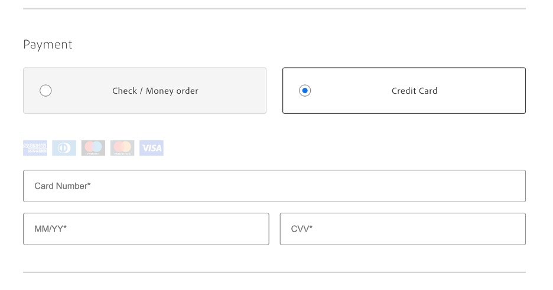

# Anwendungsszenarien

Die folgenden Anwendungsfälle zeigen die Kernfunktionen und Geschäftsszenarien, die von [!DNL Adobe Commerce as a Cloud Service] unterstützt werden. Sie ermöglichen es Ihnen, die Entwicklung zu beschleunigen und wirkungsvolle Erlebnisse zu starten.

Wenn Probleme auftreten, finden Sie im Abschnitt [Fehlerbehebung](#troubleshooting) Anleitungen.

## Voraussetzungen

Bevor Sie einen dieser Anwendungsfälle ausführen, müssen Sie die folgenden Voraussetzungen erfüllen:

1. [Erstellen Sie Ihre Cloud Service](./getting-started.md#create-an-instance)Instanz mithilfe der folgenden Optionen:
   1. Wählen Sie [!UICONTROL **Sandbox**] in der Dropdown [!UICONTROL **Umgebung**] aus.
   1. Wählen Sie [!UICONTROL **Adobe Store**] in der Dropdown-Liste [!UICONTROL **Testdaten**] aus.
1. [Beim Konto  [!DNL Adobe Experience Cloud]  anmelden](https://experience.adobe.com)
1. [Richten Sie Ihre Cloud Service-Storefront ](./storefront.md), indem Sie die folgenden Optionen verwenden:
   1. Wählen Sie [!UICONTROL `adobe-commerce/adobe-demo-store`] für die Vorlage aus.
   1. Wählen Sie [!UICONTROL **Verfügbare Instanz auswählen (Mesh -> SaaS)**] für die Verbindungsmethode aus.

## Checkout-Workflow

Dieser Workflow zeigt den Checkout-Prozess für einen Kunden, der ein Produkt in Ihrer Storefront kauft, und wie Sie als Administrator die Bestellung bestätigen können.

### Zahlungsdienste aktivieren

1. Navigieren Sie in Commerce Admin zu [!UICONTROL **Stores**] > [!UICONTROL Settings] > [!UICONTROL **Configuration**] > [!UICONTROL **Zahlungsmethoden**].

1. Geben [!UICONTROL **im Abschnitt „Allgemeine**]&quot; Ihre `Payment Services Sandbox ID` und `Payment Services Sandbox Key` ein. Sie können diese IDs abrufen, indem Sie die unter &quot;[-Onboarding“ beschriebenen Schritte ](../payment-services/sandbox.md#sandbox-onboarding)

1. Legen Sie das [!UICONTROL **Aktivieren**]-Dropdown auf [!UICONTROL **Ja**] fest.

1. Klicken Sie [!UICONTROL **Konfiguration speichern**].

### Produkt kaufen

1. Wechseln Sie zur [Storefront](./storefront.md) die Sie in den Voraussetzungen erstellt haben.

1. Produkt suchen und auswählen. Treffen Sie alle erforderlichen Anpassungsauswahlen. Klicken Sie dann auf [!UICONTROL **Zum Warenkorb hinzufügen**].

   {width="600" zoomable="yes"}

1. Wählen Sie das Warenkorbsymbol aus, um Ihren Warenkorb anzuzeigen.

   {width="600" zoomable="yes"}

1. Klicken Sie [!UICONTROL **Checkout**].

   {width="600" zoomable="yes"}

1. Geben Sie die erforderlichen Kontaktdaten und Versandinformationen ein. Sie können fiktive Informationen für diese Bestellung verwenden.

1. Um zu checken, wählen Sie [!UICONTROL **Scheck / Zahlungsanweisung**]. Wenn Sie eine Kreditkarte verwenden möchten, verwenden Sie eine der [Testkarten von Paypal](https://developer.paypal.com/tools/sandbox/card-testing/#link-teststaticcardnumbers). Sie können diese mit einem beliebigen zukünftigen Ablaufdatum und einem beliebigen CVC verwenden.

   {width="600" zoomable="yes"}

   {width="600" zoomable="yes"}

1. Klicken Sie [!UICONTROL **Bestellung aufgeben**].

### Bestellung bestätigen

1. Öffnen Sie die Commerce Admin-`<your store URL>/admin`.

1. Melden Sie sich mit Ihrer Adobe ID an.

1. Navigieren Sie [!UICONTROL **Verkauf**] > [!UICONTROL **Bestellungen**].

   {width="600" zoomable="yes"}

1. Suchen Sie nach der von Ihnen aufgegebenen Bestellung und bestätigen Sie die Details.

   {width="600" zoomable="yes"}

## Storefront-Inhalt aktualisieren

Inhalte direkt in der Storefront erstellen, bearbeiten und veröffentlichen.

1. Öffnen Sie die [Storefront](./storefront.md) die Sie in den Voraussetzungen erstellt haben.

1. Öffnen Sie Storefront Builder. Navigieren Sie zu `https://da.live/#/<GitHub User Name>/<Repository Name>/main/da/index.md`.

1. Öffnen Sie die Seite [!UICONTROL **Index**].

1. Geben Sie unter dem Karussellblock einen neuen Titel ein, indem Sie die Zeile „Willkommen bei der Adobe Store-Demo“ bearbeiten.

1. Klicken Sie auf das Symbol Senden und dann auf [!UICONTROL **Vorschau**].

1. Überprüfen Sie die Vorschauseite und klicken Sie auf &quot;[!UICONTROL **&quot;**].

1. Aktualisieren Sie die Seite „Storefront“ und bestätigen Sie, dass Ihre Änderungen jetzt live sind.

## Kontextuelles Experiment

Mit der Funktion für kontextuelle Experimente von [!DNL Adobe Commerce] können Sie Experimente in Ihrer Storefront erstellen und verwalten, um verschiedene Inhalte und Konfigurationen zu testen.

### Voraussetzungen

* Installieren Sie die Erweiterung [AEM Sidekick](https://www.aem.live/docs/sidekick)

1. Wählen Sie in Storefront Builder Ihre Indexseite aus und klicken Sie auf [!UICONTROL **Kopieren**].

1. Erstellen Sie [!UICONTROL **Ordner**] Experimente“ unter dem Hauptordner, indem Sie auf die Schaltfläche [!UICONTROL **Neu**] klicken und [!UICONTROL **Ordner**] auswählen.

1. Erstellen Sie einen Ordner mit dem Namen **1234** im Ordner [!UICONTROL **Experimente**].

1. Fügen Sie die beiden Kopien der Indexseite in den Ordner **1234“**.

1. Öffnen Sie jede Seite und benennen Sie sie in „homev1“ und „homev2“ um. Das sind eure [Herausforderer](https://www.aem.live/docs/experimentation#create-your-challenger-page).

1. Ändern Sie jede Seite so, dass sie unterschiedliche Inhalte enthält. Ändern Sie beispielsweise das Hero-Bild oder den Text . Sie müssen in der Lage sein, die Unterschiede zwischen den einzelnen Seiten zu identifizieren.

1. Veröffentlichen Sie jede Ihrer Challenger-Seiten.

1. Öffnen Sie die Steuerelementseite, also die ursprüngliche Indexseite.

1. Fügen Sie einen neuen Block mit dem Titel &quot;[!UICONTROL **&quot;**].

1. Fügen Sie die folgenden Informationen zu den Zeilen des Metadatenblocks hinzu

   * Titel - Adobe Commerce
   * Beschreibung - Ein Webstore
   * Experiment - 1234
   * Experimentvarianten
      * `https://<your-site>.aem.live/experiments/1234/indexv1`
      * `https://<your-site>.aem.live/experiments/1234/indexv2`

   {width="600" zoomable="yes"}

1. Öffnen Sie ein Inkognito- oder privates Browser-Fenster und navigieren Sie zur Hauptseite.

1. Schließen Sie das private Browser-Fenster und wiederholen Sie den vorherigen Schritt. Jedes Mal, wenn Sie die Seite öffnen, sehen Sie eine von Ihnen erstellte zufällige Variante.

## Inhalt der Storefront verbessern

Mit [!DNL AEM Assets], [!DNL Adobe Express] und [!DNL Firefly] können Sie mit einem einfachen, selbstgesteuerten Workflow schnell Änderungen an Bildern vornehmen, die in Ihrer Storefront angezeigt werden.

### Voraussetzungen

* Erfordert Zugriff auf [!DNL AEM Assets], [!DNL Adobe Express] und [!DNL Adobe Firefly].

### Anpassen des Hintergrunds eines Bildes

Stellen Sie sich ein Szenario vor, in dem Sie den Hintergrund eines Produktbilds schnell ändern möchten. Die Kombination aus [!DNL Adobe Commerce], [!DNL AEM Assets] und [!DNL Adobe Express] ermöglicht es Ihnen, diese Änderung in wenigen einfachen Schritten abzuschließen.

1. Öffnen Sie die [Storefront](./storefront.md) die Sie in den Voraussetzungen erstellt haben, und navigieren Sie zu einem Element, das Sie ändern möchten. Beachten Sie die Artikel-SKU oder den Produkt-Code.

1. Öffnen Sie [!DNL AEM Assets], indem Sie es in der [Adobe Experience Cloud ](https://experience.adobe.com/#/home).

   ![[!DNL AEM Assets]-Selektor, der die [!DNL Adobe Experience Cloud] anzeigt](./assets/select-aem-assets.png){width="600" zoomable="yes"}

1. Auf [!UICONTROL **Assets**].

   ![Assets-Navigationsoption in [!DNL AEM Assets] Benutzeroberfläche](./assets/click-assets.png){width="600" zoomable="yes"}

1. Suchen Sie nach dem Artikel **SKU** oder **Produkt-Code**.

1. Wählen Sie das zu bearbeitende Element aus und klicken Sie auf [!UICONTROL **In Adobe Express öffnen**].

   {width="600" zoomable="yes"}

1. Wählen Sie im [!UICONTROL **Bild**]-Bedienfeld [!UICONTROL **Objekt einfügen**] aus.

   {width="600" zoomable="yes"}

1. Beschreiben Sie im Textfeld das Bild, das Sie hinzufügen möchten. Zum Beispiel „Schneekiefern“.

   {width="600" zoomable="yes"}

1. Passen Sie die [!UICONTROL Brush size] an und zeichnen Sie dort, wo Sie das generierte Bild hinzufügen möchten. Zeichnen Sie in diesem Beispiel um das vorhandene Objekt, um den Hintergrund auszuwählen.

1. Klicken Sie [!UICONTROL **Generieren**], um die Ergebnisse anzuzeigen.

1. Wählen Sie aus den verschiedenen Ergebnissen die gewünschte Option aus und klicken Sie auf [!UICONTROL **Beibehalten**].

1. Klicken Sie [!UICONTROL **Your Stuff**], um zum Bildeditor zurückzukehren.

1. Klicken Sie [!UICONTROL **Speichern**], um den Bildtyp anzugeben.

1. Klicken [!UICONTROL **erneut auf**] Speichern“, um die Änderungen zu speichern.

1. Wählen Sie im [!UICONTROL **Asset speichern**] den Commerce-[!UICONTROL **Zielordner**].

   {width="600" zoomable="yes"}

1. Klicken Sie [!UICONTROL **Als neues Asset speichern**], um das Bild zu speichern.

#### Hinzufügen des Bildes zu [!DNL Commerce AEM Assets]

1. Wählen Sie [Navigationsbereich](https://experienceleague.adobe.com/en/docs/experience-manager-cloud-service/content/sites/authoring/basic-handling#navigation-panel) von [!DNL AEM as a Cloud Service] die Option [!UICONTROL **Assets**] > [!UICONTROL **Dateien**] > [!UICONTROL **Commerce**] und klicken Sie auf das Asset, das Sie im vorherigen Abschnitt erstellt haben.

   ![Commerce-Ordner in [!DNL AEM Assets] mit Produktbildern](./assets/commerce-folder.png){width="600" zoomable="yes"}

1. Klicken Sie [!UICONTROL **Eigenschaften**].

   ![Schaltfläche „Eigenschaften“ in [!DNL AEM Assets] Symbolleiste](./assets/properties.png){width="600" zoomable="yes"}

1. Wählen Sie die Registerkarte [!UICONTROL **Commerce**] aus.

   Registerkarte {width="600" zoomable="yes"}

1. Stellen Sie sicher, dass [!UICONTROL **Ist sie in Adobe Commerce vorhanden?**] Feld ist auf &quot;[!UICONTROL **&quot;**].

1. Klicken Sie [!UICONTROL **Hinzufügen**] und geben Sie die Produkt-SKU ein, der Sie das Asset hinzufügen möchten.

   {width="600" zoomable="yes"}

1. Wählen Sie die Position für das Asset und den Asset-Typ aus.

1. Wählen Sie die Registerkarte [!UICONTROL **Allgemein**] und ändern Sie die Registerkarte [!UICONTROL **Prüfungsstatus**] in [!UICONTROL **Genehmigt**].

   {width="600" zoomable="yes"}

1. Klicken Sie [!UICONTROL **Speichern und schließen**].

#### Bestätigen des Bildes in Commerce

1. Navigieren Sie in Adobe Commerce [!UICONTROL **Admin**] zu [!UICONTROL **Katalog**] > [!UICONTROL **Produkte**].

1. Wählen Sie das Produkt aus, dem Sie das Bild im vorherigen Abschnitt hinzugefügt haben.

1. Erweitern Sie den Abschnitt [!UICONTROL **Bilder und Videos**] .

   {width="600" zoomable="yes"}

1. Vergewissern Sie sich, dass Ihr Bild jetzt in der Liste der Bilder verfügbar ist.

1. Kehren Sie zu Ihrer Storefront zurück und navigieren Sie zur Seite für das geänderte Produkt.

1. Bestätigen Sie, dass das neue Bild angezeigt wird.

   {width="600" zoomable="yes"}

## Varianten erzeugen

[!DNL Adobe Commerce]s Varianten generieren nutzt generative KI, um die Erstellung hochwertiger Inhalte zu automatisieren, das Messaging anzupassen und Assets nahtlos in Ihrer Storefront zu veröffentlichen.

### Text generieren

1. Öffnen Sie Ihre Storefront-Site mit dem [universellen Editor](https://experienceleague.adobe.com/en/docs/experience-manager-cloud-service/content/implementing/developing/universal-editor/introduction).

1. Wählen Sie den Textblock aus, den Sie bearbeiten möchten.

1. Klicken Sie [!UICONTROL **Bedienfeld**] Eigenschaften“ auf [!UICONTROL **Varianten erstellen**].

1. Klicken Sie auf die [!UICONTROL **Generieren**]-Schaltfläche.

1. Wählen Sie den generierten Text aus oder passen Sie ihn an.

1. Klicken Sie [!UICONTROL **Veröffentlichen**], um Ihre Storefront zu aktualisieren.

### Erstellen von Inhalten und Bildern

1. [[!DNL Generate Variations]](https://experienceleague.adobe.com/en/docs/experience-manager-cloud-service/content/generative-ai/generate-variations) öffnen

1. Wählen Sie die Vorlage [!UICONTROL **Hero Banner**] aus.

1. Geben Sie im Textfeld [!UICONTROL **Benutzerinteraktion erläutern**] Folgendes ein: „Erlebnis für Adobe-Mitarbeiter und -Partner beim Kauf von Geräten der Marke Adobe! &quot;.

1. Geben Sie in [!UICONTROL **URL für Domain**] Wissen **www.adobestore.com** ein.

1. Klicken Sie [!UICONTROL **Generieren**].

1. Wählen Sie eine Inhaltsvariante aus und klicken Sie auf [!UICONTROL **Bild erstellen**].

1. Wählen Sie im Dropdown [!UICONTROL **Menü „Bildgröße**] die Option [!UICONTROL **Breitbild (16:9)**].

1. Wählen Sie in [!UICONTROL **Dropdown-**] „Content-Typ“ [!UICONTROL **Foto**] aus.

1. Wählen Sie für [!UICONTROL **Referenzbild**] Stil“ das vorhandene Adobe-Store-Banner aus.

1. Wählen Sie das zu verwendende generierte Bild aus und klicken Sie auf [!UICONTROL **Speichern**].

1. Wiederholen Sie diesen Vorgang mit anderen Referenzbildern, um weitere Varianten zu generieren.

## Fehlerbehebung

Verwenden Sie die folgenden Vorschläge, um Probleme zu beheben, die beim Versuch dieser Tutorials auftreten.

* Wenn Sie Anleitungen zu Befehlen oder Flags benötigen:

   1. Führen Sie `aio --help` aus, um alle verfügbaren Befehle und Flags anzuzeigen.
   1. Verwenden Sie für bestimmte Befehle das `--help`-Flag. Beispiel:
      * `aio console --help`
      * `aio commerce --help`

* Wenn Sie auf ungültige Anmeldeprobleme stoßen:

   1. `aio config clear` ausführen.
   1. `aio auth login --force` ausführen.
   1. Melden Sie sich bei Ihrem Browser an.
   1. Wählen Sie Ihr Profil.
   1. Wechseln Sie zurück zum Terminal, um fortzufahren.

* Wenn der `init`-Befehl fehlschlägt:

   1. `aio api-mesh delete` ausführen.
   1. Führen Sie `aio commerce init` erneut aus.

* Wenn Sie die falsche Organisation, das falsche Projekt oder den falschen Arbeitsbereich ausgewählt haben, bevor Sie den `init` Befehl ausgeführt haben:

   1. `aio console org select` ausführen.
   1. `aio console project select` ausführen.
   1. `aio console workspace select` ausführen.

* Wenn Sie eine ungültige Mandantenauswahl haben:

   1. Brechen Sie die aktuelle CLI-Ausführung mit der Taste **Strg-C** ab.
   1. `aio commerce init` ausführen.

* Wenn eine ungültige API-Mesh-Installation auftritt:

   * `aio api-mesh update mesh-config.json` ausführen.
