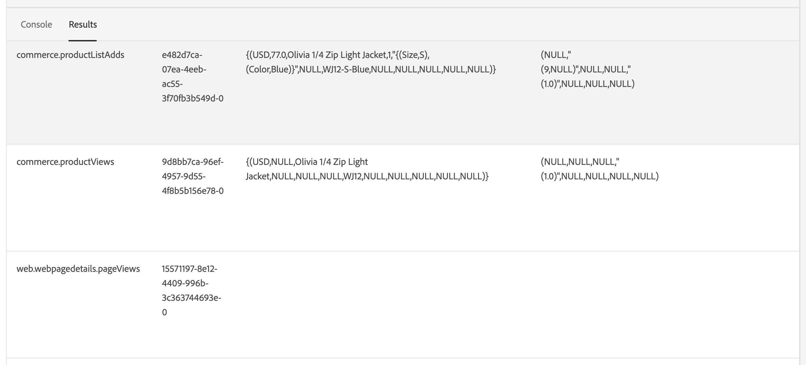

# Verbinden von Commerce-Daten mit Adobe Experience Platform

Bei der Installation der [!DNL Data Connection]-Erweiterung erscheinen zwei neue Konfigurationsseiten im Menü **System** unter **Services** im Commerce _Admin_.

- Commerce Services-Connector
- [!DNL Data Connection]

Um Ihre Adobe Commerce-Instanz mit der Adobe Experience Platform zu verbinden, müssen Sie beide Connectoren konfigurieren. Dies beginnt mit dem Commerce Services-Connector und endet mit der [!DNL Data Connection].

## Konfigurieren des Commerce Services-Connectors

Wenn Sie zuvor einen Adobe Commerce-Service installiert haben, haben Sie wahrscheinlich bereits den Commerce Services-Connector konfiguriert. Andernfalls müssen Sie die folgenden Aufgaben auf der Seite [Commerce Services-Connector](../landing/saas.md) ausführen:

1. Melden Sie sich bei Ihrem Commerce-Konto an, um [Ihre Produktions- und Sandbox-API-Schlüssel &#x200B;](../landing/saas.md#credentials).
1. Wählen Sie einen [SaaS-Datenbereich](../landing/saas.md#saas-configuration).
1. Melden Sie sich bei Ihrem Adobe-Konto an, um [Ihre Organisations-ID abzurufen](../landing/saas.md#ims-organization-optional).

Nachdem Sie den Commerce Services-Connector konfiguriert haben, konfigurieren Sie die [!DNL Data Connection].

## Konfigurieren der [!DNL Data Connection]

In diesem Abschnitt erfahren Sie, wie Sie die [!DNL Data Connection]-Erweiterung konfigurieren.

### Hinzufügen von Details zum Service-Konto und zu den Anmeldedaten

Wenn Sie (historische [) oder (Kundenprofildaten](#send-historical-order-data) [&#x200B; erfassen und senden möchten](#send-customer-profile-data) müssen Sie Details zum Service-Konto und zu den Anmeldedaten hinzufügen. Wenn Sie die Erweiterung [Audience Activation](https://experienceleague.adobe.com/docs/commerce-admin/customers/audience-activation.html?lang=de) konfigurieren, müssen Sie außerdem die folgenden Schritte ausführen.

Wenn Sie nur Storefront- oder Back-Office-Daten erfassen und senden, können Sie zum Abschnitt [Allgemein](#general) wechseln.

#### Schritt 1: Erstellen eines Projekts in Adobe Developer Console

Erstellen Sie ein Projekt in der Adobe Developer Console, das Commerce authentifiziert, damit es Experience Platform-API-Aufrufe durchführen kann.

Um das Projekt zu erstellen, führen Sie die Schritte aus, die im Tutorial [Authentifizieren und Zugreifen auf Experience Platform-APIs](https://experienceleague.adobe.com/docs/experience-platform/landing/platform-apis/api-authentication.html?lang=de) beschrieben sind.

Stellen Sie beim Durchlaufen des Tutorials sicher, dass Ihr Projekt Folgendes enthält:

- Zugriff auf die folgenden [Produktprofile](https://experienceleague.adobe.com/docs/experience-platform/landing/platform-apis/api-authentication.html?lang=de#select-product-profiles): **Standardzugriff für alle Produktionsvorgänge** und **Standardzugriff für alle AEP**.
- Die richtigen [Rollen und Berechtigungen sind &#x200B;](https://experienceleague.adobe.com/docs/experience-platform/landing/platform-apis/api-authentication.html?lang=de#assign-api-to-a-role).
- Wenn Sie sich für die Verwendung von JSON Web Token (JWT) als Server-zu-Server-Authentifizierungsmethode entschieden haben, müssen Sie auch einen privaten Schlüssel hochladen.

Als Ergebnis dieses Schritts wird eine Konfigurationsdatei erstellt, die Sie im nächsten Schritt verwenden.

#### Schritt 2: Konfigurationsdatei herunterladen

Laden Sie die [Workspace-Konfigurationsdatei](https://developer.adobe.com/commerce/extensibility/events/project-setup/#download-the-workspace-configuration-file) herunter. Die `<workspace-name>.json` enthält alle Werte, die Sie auf der Seite **Service-Konto/Anmeldedaten** des Commerce-Administrators eingeben müssen.

![[!DNL Data Connection] Admin-Konfiguration](./assets/epc-admin-config.png){width="700" zoomable="yes"}

1. Navigieren Sie in Commerce Admin zu **Stores** > Einstellungen > **Konfiguration** > **Services** > **[!DNL Data Connection]**.

1. Wählen Sie die von Ihnen implementierte Server-zu-Server-Autorisierungsmethode im Menü **Adobe Developer-Autorisierungstyp** aus. Adobe empfiehlt die Verwendung von OAuth. [Weitere Informationen](https://developer.adobe.com/commerce/webapi/rest/authentication/server-to-server/).

1. Kopieren Sie den Inhalt der `<workspace-name>.json`-Datei in die Felder **Service-Konto/**-Details“, z. B. `"client_id"`, `"client_secrets"`, `"technical_account_email"`, `"technical_account_id"` usw.

1. Klicken Sie **Konfiguration speichern**.

1. Klicken Sie auf die Schaltfläche **[!UICONTROL Test connection]** , um sicherzustellen, dass die eingegebenen Service-Konto- und Anmeldeinformationen korrekt sind.

### Allgemein

1. Gehen Sie in der Admin zu **System** > Dienste > **[!DNL Data Connection]**.

   ![[!DNL Data Connection] Einstellungen](./assets/epc-settings.png){width="700" zoomable="yes"}

1. Überprüfen Sie auf **Registerkarte** unter **Allgemein** die mit Ihrem Adobe Experience Platform-Konto verknüpfte ID, wie im [Commerce Services Connector konfiguriert](../landing/saas.md#organizationid). Die Organisations-ID ist global. Pro Adobe Commerce-Instanz kann nur eine Organisations-ID zugeordnet werden.

1. Legen Sie in **Dropdown** Bereich“ den Kontext auf &quot;**&quot;**.

1. (Optional) Wenn Sie bereits eine [AEP Web SDK (Legierung)](https://experienceleague.adobe.com/docs/experience-platform/edge/home.html?lang=de) auf Ihrer Site bereitgestellt haben, aktivieren Sie das Kontrollkästchen und fügen Sie den Namen Ihrer AEP Web SDK hinzu. Andernfalls lassen Sie diese Felder leer und die [!DNL Data Connection]-Erweiterung stellt eine für Sie bereit.

   >[!NOTE]
   >
   >Wenn Sie Ihre eigene AEP Web SDK angeben, verwendet die [!DNL Data Connection] die mit dieser SDK verknüpfte Datenstrom-ID und nicht die auf dieser Seite angegebene Datenstrom-ID (falls vorhanden).

### Datenerfassung

In diesem Abschnitt geben Sie den Datentyp an, den Sie erfassen und an Experience Platform Edge senden möchten. Es gibt drei Datentypen:

- **Verhalten** (Client-seitige Daten) sind Daten, die in der Storefront erfasst werden. Dazu gehören Käuferinteraktionen wie `View Page`, `View Product`, `Add to Cart` und Informationen [Anforderungsliste](events.md#b2b-events) (für B2B-Händler).

- **Back Office** (Server-seitige Daten) sind Daten, die auf den Commerce-Servern erfasst werden. Dazu gehören Informationen über den Status einer Bestellung, z. B. ob eine Bestellung aufgegeben, storniert, zurückerstattet, versendet oder abgeschlossen wurde. Sie enthält auch [historische &#x200B;](#send-historical-order-data).

- **Profil** sind Daten, die sich auf die Profilinformationen Ihres Kunden beziehen. Weitere [&#x200B; (](#send-customer-profile-data).

Um sicherzustellen, dass Ihre Adobe Commerce-Instanz mit der Datenerfassung beginnen kann, überprüfen Sie die [Voraussetzungen](overview.md#prerequisites).

Unter dem Thema „Ereignisse“ erfahren Sie mehr über [Storefront](events.md#storefront-events)-, [Back-Office](events-backoffice.md)- und [profile](events-backoffice.md#customer-profile-events-server-side)-Ereignisse.

>[!NOTE]
>
>Alle Felder im Abschnitt **Datenerfassung** gelten für den **Website**-Bereich oder höher.

1. Wählen Sie **Storefront-Ereignisse** aus, wenn Sie Verhaltensdaten für Storefronts senden möchten.

1. Wählen Sie **Back-Office** Ereignisse aus, wenn Sie Informationen zum Bestellstatus senden möchten, z. B. ob eine Bestellung aufgegeben, storniert, rückerstattet oder versandt wurde.

   >[!NOTE]
   >
   >Wenn Sie **Backoffice-Ereignisse** auswählen, werden alle Backoffice-Daten an Experience Platform Edge gesendet. Wenn sich ein Käufer gegen die Datenerfassung entscheidet, müssen Sie die Datenschutzvoreinstellung des Käufers in der Experience Platform explizit festlegen. Dies unterscheidet sich von Storefront-Ereignissen, bei denen der Collector bereits das Einverständnis basierend auf den Voreinstellungen des Käufers verarbeitet. Erfahren [mehr](https://experienceleague.adobe.com/docs/experience-platform/landing/governance-privacy-security/consent/adobe/dataset.html?lang=de) über das Festlegen der Datenschutzvoreinstellungen eines Käufers in der Experience Platform.

1. (Überspringen Sie diesen Schritt, wenn Sie Ihre eigene AEP Web SDK verwenden.) [Erstellen](https://experienceleague.adobe.com/docs/experience-platform/datastreams/configure.html?lang=de#create) einen Datenstrom in der Adobe Experience Platform oder wählen Sie einen vorhandenen Datenstrom aus, den Sie für die Erfassung verwenden möchten. Geben Sie diese Datenstrom-ID in das Feld **Datenstrom-ID** ein.

1. Geben Sie die **Datensatz-ID** ein, die Ihre Commerce-Daten enthalten soll. So suchen Sie die Datensatz-ID:

   1. Öffnen Sie die Experience Platform-Benutzeroberfläche und wählen **Datensätze** im linken Navigationsbereich aus, um das Dashboard **Datensätze** zu öffnen. Das Dashboard listet alle für Ihre Organisation verfügbaren Datensätze auf. Details werden für jeden aufgelisteten Datensatz angezeigt, einschließlich seines Namens, des Schemas, dem der Datensatz entspricht, und des Status des letzten Aufnahmedurchgangs.
   1. Öffnen Sie den mit Ihrem Datenstrom verknüpften Datensatz.
   1. Zeigen Sie im rechten Bereich die Details zum Datensatz an. Kopieren Sie die Datensatz-ID.

1. Um sicherzustellen, dass Backoffice-Ereignisdaten basierend auf einem Zeitplan gemäß einem [cron](https://experienceleague.adobe.com/docs/commerce-admin/systems/tools/cron.html?lang=de)-Auftrag aktualisiert werden, müssen Sie den `Sales Orders Feed` auf `Update by Schedule` ändern.

   1. Navigieren Sie in _Admin_-Seitenleiste zu **[!UICONTROL System]** > _[!UICONTROL Tools]_>**[!UICONTROL Index Management]**.

   1. Aktivieren Sie das Kontrollkästchen für den `Sales Orders Feed` Indexer.

   1. Legen Sie **[!UICONTROL Actions]** auf `Update by Schedule` fest.

   1. Wenn Sie Backoffice-Daten zum ersten Mal aktivieren, führen Sie die folgenden Befehle aus, um eine Neuindizierung durchzuführen und eine Neusynchronisierung Trigger. Nachfolgende Neusynchronisierungen erfolgen automatisch, solange der [cron](https://experienceleague.adobe.com/docs/commerce-admin/systems/tools/cron.html?lang=de)-Auftrag korrekt eingerichtet ist.

      ```bash
      bin/magento index:reindex sales_order_data_exporter_v2
      ```

      ```bash
      bin/magento saas:resync --feed orders
      ```

#### Feldbeschreibungen

| Feld | Beschreibung |
|--- |--- |
| Umfang | Spezifische Website, auf die die Konfigurationseinstellungen angewendet werden sollen. |
| Organisations-ID (global) | ID, die zu dem Unternehmen gehört, das das Adobe DX-Produkt erworben hat. Diese ID verknüpft Ihre Adobe Commerce-Instanz mit Adobe Experience Platform. |
| Ist die AEP Web SDK bereits auf Ihrer Site bereitgestellt? | Aktivieren Sie dieses Kontrollkästchen, wenn Sie Ihre eigene AEP Web SDK auf Ihrer Site bereitgestellt haben |
| Name von AEP Web SDK (global) | Wenn Sie bereits eine Experience Platform Web SDK auf Ihrer Site bereitgestellt haben, geben Sie den Namen dieser SDK in diesem Feld an. Dadurch können Storefront Event Collector und Storefront Event SDK Ihre Experience Platform Web SDK anstelle der von der [!DNL Data Connection] bereitgestellten Version verwenden. Wenn Sie keine Experience Platform Web SDK auf Ihrer Site bereitgestellt haben, lassen Sie dieses Feld leer, und die [!DNL Data Connection] stellt eine Erweiterung für Sie bereit. |
| Storefront-Ereignisse | Ist standardmäßig aktiviert, solange die Organisations-ID und die Datenstrom-ID gültig sind. Storefront-Ereignisse erfassen anonymisierte Verhaltensdaten von Ihren Kundinnen und Kunden, während sie Ihre Site durchsuchen. |
| Back-Office-Ereignisse | Wenn diese Option aktiviert ist, enthält die Ereignis-Payload anonymisierte Bestellstatusinformationen, z. B. ob eine Bestellung aufgegeben, storniert, zurückerstattet oder versandt wurde. |
| Datenstrom-ID (Website) | ID, die den Datenfluss von Adobe Experience Platform zu anderen Adobe DX-Produkten ermöglicht. Diese ID muss mit einer bestimmten Website innerhalb Ihrer spezifischen Adobe Commerce-Instanz verknüpft sein. Wenn Sie Ihre eigene Experience Platform Web SDK angeben, geben Sie in diesem Feld keine Datenstrom-ID an. Die [!DNL Data Connection]-Erweiterung verwendet die mit dieser SDK verknüpfte Datenstrom-ID und ignoriert alle in diesem Feld angegebenen Datenstrom-ID (falls vorhanden). |
| Datensatz-ID (Website) | ID des Datensatzes, der Ihre Commerce-Daten enthält. Dieses Feld ist erforderlich, es sei denn, Sie haben die Kontrollkästchen **Storefront-Ereignisse** oder **Backoffice-Ereignisse** deaktiviert. Wenn Sie außerdem Ihre eigene Experience Platform Web SDK verwenden und daher keine Datenstrom-ID angegeben haben, müssen Sie dennoch die mit Ihrem Datenstrom verknüpfte Datensatz-ID hinzufügen. Andernfalls können Sie dieses Formular nicht speichern. |

Nach dem Onboarding fließen Storefront-Daten an den Experience Platform Edge. Back-Office-Daten benötigen etwa fünf Minuten, bis sie am Edge angezeigt werden. Nachfolgende Aktualisierungen sind basierend auf dem Cron-Zeitplan am Edge sichtbar.

### Senden von Kundenprofildaten

Es gibt zwei Arten von Profildaten, die Sie an die Experience Platform senden können: Profildatensätze und Zeitreihen-Profilereignisse.

Ein Profildatensatz enthält Daten, die gespeichert werden, wenn ein Käufer ein Profil in Ihrer Commerce-Instanz erstellt, z. B. den Namen des Käufers. Wenn Ihr Schema und Ihr Datensatz [ordnungsgemäß konfiguriert](profile-data.md) werden, wird ein Profildatensatz an die Experience Platform gesendet und an den Profilverwaltungs- und Segmentierungs-Service von Adobe weitergeleitet: [Real-Time CDP](https://experienceleague.adobe.com/docs/experience-platform/rtcdp/intro/rtcdp-intro/overview.html?lang=de).

Zeitreihen-Profilereignisse enthalten Daten zu den Profilinformationen Ihrer Kundinnen und Kunden, z. B. ob sie ein Konto auf Ihrer Site erstellen, bearbeiten oder löschen. Wenn Profilereignisdaten an Experience Platform gesendet werden, befinden sie sich in einem Datensatz, in dem sie von anderen DX-Produkten verwendet werden können.

1. Stellen Sie sicher, dass Sie [angegebene](#add-service-account-and-credential-details) Dienstkonto und Anmeldedaten haben.

1. Stellen Sie sicher, dass Sie ein Schema und einen Datensatz für die [Aufnahme von Profildatensatzdaten](profile-data.md) und [Aufnahme von Zeitreihenereignisdaten](update-xdm.md#time-series-profile-event-data) haben.

1. Setzen Sie ein Häkchen in das **Kundenprofile**-Kontrollkästchen, wenn Sie Profildaten an die Experience Platform senden möchten.

1. Geben Sie die **Profildatensatz-ID** ein.

   Profildatensatzdaten müssen einen anderen Datensatz verwenden als den, den Sie derzeit für Verhaltens- und Backoffice-Ereignisdaten verwenden.

1. Wenn Sie keine Profilereignisse über dieselbe Datenstrom-ID streamen möchten, die Sie für Verhaltens- und Backoffice-Daten verwenden, entfernen Sie das Häkchen aus den **Kundenprofilen über dieselbe Datenstrom-ID streamen** und geben Sie die Datenstrom-ID ein, die Sie stattdessen verwenden möchten.

Es kann etwa 10 Minuten dauern, bis ein Profildatensatz in Real-Time CDP verfügbar ist. Profilereignisse beginnen sofort mit dem Streaming.

>[!TIP]
>
>Wenn keine Profildaten in der Experience Platform angezeigt werden, finden Sie in der [Commerce KnowledgeBase](https://experienceleague.adobe.com/de/docs/commerce-knowledge-base/kb/troubleshooting/miscellaneous/data-connection-customer-profiles-not-exported) Vorschläge zur Fehlerbehebung.

#### Feldbeschreibungen

| Feld | Beschreibung |
|--- |--- |
| Kundenprofile | Aktivieren Sie dieses Kontrollkästchen, wenn Sie Kundenprofildatensätze erfassen und senden möchten. |
| Profildatensatz-ID | Ein Profildatensatz muss einen anderen Datensatz verwenden als den Datensatz, der für Verhaltens- und Backoffice-Ereignisse verwendet wird. |
| Kundenprofile über dieselbe Datenstrom-ID streamen | Entscheiden Sie, ob Sie denselben Datenstrom verwenden möchten, der derzeit für Ihre Verhaltens- und Backoffice-Ereignisse verwendet wird oder nicht. |
| Datenstrom für Kundenprofile | Geben Sie den für Kundendatensätze spezifischen Datenstrom an. |

### Verlaufsdaten senden

Adobe Commerce erfasst bis zu fünf Jahre [historische Bestelldaten und -status](events-backoffice.md#back-office-events). Sie können die [!DNL Data Connection]-Erweiterung verwenden, um diese historischen Daten an Experience Platform zu senden, um Ihre Kundenprofile anzureichern und die Kundenerlebnisse basierend auf diesen früheren Bestellungen zu personalisieren. Die Daten werden in einem Datensatz in Experience Platform gespeichert.

Commerce erfasst zwar bereits die historischen Bestelldaten, es gibt jedoch mehrere Schritte, die Sie ausführen müssen, um diese Daten an Experience Platform zu senden.

Sehen Sie sich dieses Video an, um mehr über historische Bestellungen zu erfahren, und führen Sie dann die folgenden Schritte aus, um die historische Auftragssammlung zu implementieren.

>[!VIDEO](https://video.tv.adobe.com/v/3450236?captions=ger)

#### Einrichten des Auftragssynchronisierungs-Service

Der Dienst zur Auftragssynchronisierung verwendet das [Message Queue Framework](https://developer.adobe.com/commerce/php/development/components/message-queues/) und RabbitMQ. Nachdem Sie diese Schritte abgeschlossen haben, können die Bestellstatusdaten mit SaaS synchronisiert werden. Dies ist erforderlich, bevor sie an Experience Platform gesendet werden.

1. Stellen Sie sicher, dass Sie [angegebene](#add-service-account-and-credential-details) Dienstkonto und Anmeldedaten haben.

1. [Aktivieren](https://experienceleague.adobe.com/docs/commerce-cloud-service/user-guide/configure/service/rabbitmq.html?lang=de) RabbitMQ.

   >[!NOTE]
   >
   >RabbitMQ ist bereits für die Commerce-Versionen 2.4.7 und höher eingerichtet, Sie müssen jedoch Verbraucher aktivieren.

1. Aktivieren von Message Queue Consumers by Cron Job in `.magento.env.yaml` mithilfe `CRON_CONSUMERS_RUNNER` Umgebungsvariablen.

   ```yaml
      stage:
        deploy:
          CRON_CONSUMERS_RUNNER:
            cron_run: true
   ```

   >[!NOTE]
   >
   >In der [Dokumentation zu Bereitstellungsvariablen](https://experienceleague.adobe.com/docs/commerce-cloud-service/user-guide/configure/env/stage/variables-deploy.html?lang=de#cron_consumers_runner) finden Sie Informationen zu allen verfügbaren Konfigurationsoptionen.

Wenn der Service für die Auftragssynchronisierung aktiviert ist, können Sie dann den historischen Datumsbereich für die Bestellung auf der **[!UICONTROL [!DNL Data Connection]]** angeben.

#### Datumsbereich für Auftragsverlauf angeben

Geben Sie den Datumsbereich für die historischen Bestellungen an, die an Experience Platform gesendet werden sollen.

1. Gehen Sie in der Admin zu **System** > Dienste > **[!DNL Data Connection]**.

1. Wählen Sie die **Auftragsverlauf** aus.

   ![[!DNL Data Connection] Auftragsverlauf](./assets/epc-order-history.png){width="700" zoomable="yes"}

1. Unter **Auftragsverlauf synchronisieren** ist das Kontrollkästchen **Datensatz-ID aus Einstellungen kopieren** bereits aktiviert. Dadurch wird sichergestellt, dass derselbe Datensatz verwendet wird, der auf der Registerkarte **Einstellungen** angegeben ist.

1. Geben Sie in den Feldern **Von** und **Bis** den Datumsbereich für die historischen Bestelldaten an, die Sie senden möchten. Sie können keinen Datumsbereich auswählen, der länger als fünf Jahre ist.

1. Wählen Sie **[!UICONTROL Start Sync]** aus, um die Synchronisierung zum Starten Trigger. Historische Bestelldaten sind Batch-Daten im Gegensatz zu Storefront- und Back-Office-Daten, bei denen es sich um Streaming-Daten handelt. Batch-Daten benötigen etwa 45 Minuten, um in Experience Platform anzukommen.

##### Feldbeschreibungen

| Feld | Beschreibung |
|--- |--- |
| Datensatz-ID aus Einstellungen kopieren | Kopiert die Datensatz-ID, die Sie auf der Registerkarte **Einstellungen** eingegeben haben. |
| Datensatz-ID (Website) | ID des Datensatzes, der Ihre Commerce-Daten enthält. Dieses Feld ist erforderlich, es sei denn, Sie haben die Kontrollkästchen **Storefront-Ereignisse** oder **Backoffice-Ereignisse** deaktiviert. Wenn Sie außerdem Ihre eigene Experience Platform Web SDK verwenden und daher keine Datenstrom-ID angegeben haben, müssen Sie dennoch die mit Ihrem Datenstrom verknüpfte Datensatz-ID hinzufügen. Andernfalls können Sie dieses Formular nicht speichern. |
| Von | Datum, ab dem Sie mit der Erfassung der Auftragsverlaufsdaten beginnen möchten. |
| bis | Datum, ab dem die Erfassung des Auftragsverlaufs beendet werden soll. |
| Synchronisierung starten | Startet den Prozess der Synchronisierung der Auftragsverlaufsdaten mit dem Experience Platform Edge. Diese Schaltfläche ist deaktiviert, wenn das **[!UICONTROL Dataset ID]** leer oder die Datensatz-ID ungültig ist. |

### Datenanpassung

Auf der Registerkarte **Datenanpassung** können Sie alle benutzerdefinierten Attribute anzeigen, die in [!DNL Commerce] konfiguriert und an Experience Platform gesendet wurden.

![[!DNL Data Connection] Datenanpassung](./assets/epc-data-customization.png){width="700" zoomable="yes"}

>[!IMPORTANT]
>
>Stellen Sie sicher, dass die Datenstrom-ID[&#x200B; die Sie &#x200B;](#data-collection) der Registerkarte **Datenerfassung** angegeben haben, mit der ID übereinstimmt, die mit dem Schema für die Aufnahme benutzerdefinierter Attribute verknüpft ist.

Wenn Sie benutzerdefinierte Attribute für Bestellungen erstellen und an die Experience Platform senden, müssen die Attributnamen in Commerce mit denen im [!DNL Commerce] in der Experience Platform übereinstimmen. Wenn sie nicht übereinstimmen, kann es schwierig sein, die Unterschiede zu identifizieren. Wenn Namen nicht übereinstimmen, kann die Tabelle **Benutzerdefinierte Bestellattribute** helfen, das Problem zu lösen.

Die Tabelle **Benutzerdefinierte Bestellattribute** bietet Einblicke in die Konfiguration und Zuordnung von benutzerdefinierten Bestellattributen zwischen dem [!DNL Commerce] Back-Office und dem [!DNL Commerce] in Experience Platform. In dieser Tabelle können Sie benutzerdefinierte Attribute auf Auftrags- und Auftragspositionsebene über verschiedene Quellen hinweg anzeigen, um die Identifizierung fehlender oder falsch ausgerichteter Attribute zu erleichtern. Außerdem werden Datensatz-IDs angezeigt, damit zwischen Live- und historischen Datensätzen unterschieden werden kann, da jeder über eigene benutzerdefinierte Attribute verfügen kann.

Wenn neben einem benutzerdefinierten Attributnamen in der Tabelle kein grünes Häkchen angezeigt wird, deutet dies darauf hin, dass die Attributnamen in den Quellen nicht übereinstimmen. Korrigieren Sie den Attributnamen in einer Quelle. Daraufhin wird ein grünes Häkchen angezeigt, das angibt, dass die Namen nun übereinstimmen.

- Wenn der Attributname im Schema in Experience Platform aktualisiert wird, müssen Sie die Konfiguration auf der Registerkarte **Datenanpassung** speichern, um die Schemaänderung in Experience Platform Trigger. Diese Änderung wird in der Tabelle **Benutzerdefinierte Bestellattribute** angezeigt, wenn Sie auf die Schaltfläche **[!UICONTROL Refresh]** klicken.
- Wenn der Attributname in [!DNL Commerce] aktualisiert wird, muss ein Bestellereignis generiert werden, um den Namen in der Tabelle **Benutzerdefinierte Bestellattribute** zu aktualisieren. Die Änderung spiegelt sich in etwa 60 Minuten wider.

Erfahren Sie mehr über das [Einrichten benutzerdefinierter Attribute](custom-attributes.md).

#### Feldbeschreibungen

| Feld | Beschreibung |
|--- |--- |
| Datensatz | Zeigt die Datensätze an, die die benutzerdefinierten Attribute enthalten. Live- und historische Datensätze können ihre eigenen benutzerdefinierten Attribute aufweisen. |
| Adobe Commerce | Zeigt alle benutzerdefinierten Attribute an, die im [!DNL Commerce]-Backoffice erstellt wurden. |
| Experience Platform | Zeigt alle benutzerdefinierten Attribute an, die in Ihrem [!DNL Commerce] in Experience Platform angegeben sind. |
| Aktualisieren | Ruft alle benutzerdefinierten Attributnamen aus dem [!DNL Commerce] in Experience Platform ab. |

## Überprüfen, ob Ereignisdaten erfasst werden

Um zu bestätigen, dass Daten aus Ihrem Commerce-Store erfasst werden, verwenden Sie den [Adobe Experience Platform-Debugger](https://experienceleague.adobe.com/docs/experience-platform/debugger/home.html?lang=de), um Ihre Commerce-Site zu untersuchen. Nachdem Sie bestätigt haben, dass Daten erfasst werden, können Sie überprüfen, ob Ihre Storefront- und Backoffice-Ereignisdaten am Edge angezeigt werden, indem Sie eine Abfrage ausführen, die Daten aus dem von [&#x200B; erstellten Datensatz &#x200B;](overview.md#prerequisites).

1. Wählen **im** Navigationsbereich von Experience Platform „Abfragen“ aus und klicken Sie auf [!UICONTROL Create Query].

   

1. Wenn der Abfrage-Editor geöffnet wird, geben Sie eine Abfrage ein, mit der Daten aus dem Datensatz ausgewählt werden.

   

   Ihre Abfrage könnte beispielsweise wie folgt aussehen:

   ```sql
   SELECT * from `your_dataset_name` ORDER by TIMESTAMP DESC
   ```

1. Nach Ausführung der Abfrage werden die Ergebnisse auf der Registerkarte **Ergebnisse** neben der Registerkarte **Konsole** angezeigt. Diese Ansicht zeigt die tabellarische Ausgabe Ihrer Abfrage.

   

In diesem Beispiel werden Ereignisdaten aus den `commerce.productListAdds`, `commerce.productViews`, `web.webpagedetails.pageViews` usw. angezeigt. In dieser Ansicht können Sie überprüfen, ob Ihre Commerce-Daten am Edge eingegangen sind.

Wenn die Ergebnisse nicht Ihren Erwartungen entsprechen, öffnen Sie Ihren Datensatz und suchen Sie nach fehlgeschlagenen Batch-Importen. Weitere Informationen über [Fehlerbehebung bei Batch-Importen](https://experienceleague.adobe.com/docs/experience-platform/ingestion/batch/troubleshooting.html?lang=de).

### Überprüfen, ob Profildaten in der Experience Platform angezeigt werden

Wenn keine Profildaten in der Experience Platform angezeigt werden, finden Sie in der [Commerce KnowledgeBase](https://experienceleague.adobe.com/de/docs/commerce-knowledge-base/kb/troubleshooting/miscellaneous/data-connection-customer-profiles-not-exported) Vorschläge zur Fehlerbehebung.

## Nächste Schritte

Wenn Commerce-Daten an Experience Platform Edge gesendet werden, können diese Daten von anderen Adobe Experience Cloud-Produkten wie Adobe Journey Optimizer verwendet werden. Sie können beispielsweise Journey Optimizer so konfigurieren, dass es auf bestimmte Ereignisse wartet. Basierend auf diesen Ereignisdaten können Sie dann eine E-Mail an einen Erstbenutzer senden oder den Trigger verlassen. Erfahren Sie, wie Sie Ihre Commerce-Plattform durch [Erstellen von Kunden-Journey](using-ajo.md) in Journey Optimizer erweitern können.
