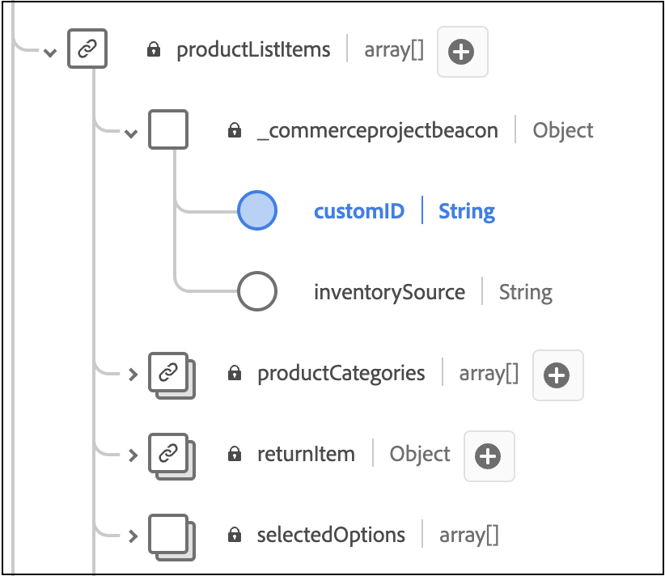

# Hinzufügen benutzerdefinierter Bestellattribute

In diesem Artikel erfahren Sie, wie Sie Backoffice-Ereignissen benutzerdefinierte Attribute hinzufügen. Mit benutzerdefinierten Attributen können Sie umfangreiche Dateneinblicke erfassen, um die Analyse zu verbessern und weitere personalisierte Erlebnisse für Ihre Kunden zu erstellen.

Benutzerdefinierte Attribute werden auf zwei Ebenen unterstützt:

- Auftragsebene
- Bestellartikelebene

>[!NOTE]
>
>Adobe [!DNL Commerce] unterstützt benutzerdefinierte Attribute mit dem Datentyp „String“, „Boolean“ oder „Date“.

Das Hinzufügen benutzerdefinierter Attribute zu Back-Office-Ereignissen erfordert Folgendes:

1. Erstellen Sie ein Projekt in Ihrer [!DNL Commerce].
1. Aktualisieren Sie Ihr Schema, damit die neuen benutzerdefinierten Attribute ordnungsgemäß in Experience Platform aufgenommen werden können.
1. Bestätigen Sie in der Admin-Liste, dass die benutzerdefinierten Attribute erfasst und an Experience Platform gesendet werden.

>[!IMPORTANT]
>
>Die folgende Verzeichnisstruktur und die folgenden Codebeispiele veranschaulichen, wie Sie benutzerdefinierte Attribute implementieren können. Die tatsächliche Verzeichnisstruktur und der erforderliche Code hängen von Ihrer Store-Konfiguration und -Umgebung ab.

## Schritt 1: Ordnerstruktur erstellen

1. Navigieren Sie zum `app/code`-Verzeichnis in Ihrer [!DNL Commerce] und erstellen Sie ein Modulverzeichnis. Beispiel: `Magento/AepCustomAttributes`. Dieses Verzeichnis enthält die Dateien, die für Ihre benutzerdefinierten Attribute erforderlich sind.
1. Erstellen Sie im Modulverzeichnis ein Unterverzeichnis mit dem Namen `etc`. Das `etc` enthält die `module.xml`-, `query.xml`-, `di.xml`- und `et_schema.xml`.

## Schritt 2: Definieren der Abhängigkeiten und der Setup-Version

Erstellen Sie eine `module.xml`, die die Abhängigkeiten und die Setup-Version definiert. Beispiel:

```xml
<?xml version="1.0"?>
<config xmlns:xsi="http://www.w3.org/2001/XMLSchema-instance" xsi:noNamespaceSchemaLocation="urn:magento:framework:Module/etc/module.xsd">
    <module name="Magento_AepCustomAttributes">
        <sequence>
            <module name="Magento_SalesOrderDataExporter"/>
        </sequence>
    </module>
</config>
```

## Schritt 3: Kundenauftragsdaten abrufen

Erstellen Sie eine `query.xml`, die Kundenauftragsdaten abruft. Beispiel:

```xml
<?xml version="1.0"?>
<config xmlns:xsi="http://www.w3.org/2001/XMLSchema-instance" xsi:noNamespaceSchemaLocation="urn:magento:Module:Magento_QueryXml:etc/query.xsd">
  <query name="salesOrdersV2">
    <source name="sales_order">
      <link-source name="sales_order_inventory_source" link-type="inner">
        <attribute name="inventory_source_code" alias="inventory_source" />
        <using glue="and">
          <condition attribute="order_id" operator="eq" type="identifier">entity_id</condition>
         </using> 
        </link-source>
    </source>
  </query>
  </config>
```

## Schritt 4: Einrichten der Injektion von Abhängigkeiten

Erstellen Sie eine `di.xml` Datei , die die Injektion von Abhängigkeiten einrichtet. Beispiel:

```xml
  <?xml version="1.0"?>
  <config xmlns:xsi="http://www.w3.org/2001/XMLSchema-instance" xsi:noNamespaceSchemaLocation="urn:magento:framework:ObjectManager/etc/config.xsd">
      <type name="Magento\AepCustomAttributes\Model\Provider\CustomAttribute">
          <arguments>
              <argument name="usingField" xsi:type="string">commerceOrderId</argument>
          </arguments>
      </type>
      <type name="Magento\AepCustomAttributes\Model\Provider\OrderItemCustomAttribute">
          <arguments>
              <argument name="usingField" xsi:type="string">entityId</argument>
          </arguments>
      </type>
      <type name="Magento\DataServices\Model\ProductContext">
          <plugin name="product-context-plugin" type="Magento\AepCustomAttributes\Plugin\Model\ProductContext"/>
      </type>
  </config>
```

## Schritt 5: Definieren der für die Injektion von Abhängigkeiten verwendeten Services

Erstellen Sie eine `et_schema.xml` Datei, die die Services definiert, die für die Injektion von Abhängigkeiten verwendet werden. Beispiel:

```xml
  <?xml version="1.0"?>
  <config xmlns:xsi="http://www.w3.org/2001/XMLSchema-instance" xsi:noNamespaceSchemaLocation="urn:magento:module:Magento_DataExporter:etc/et_schema.xsd">
      <record name="OrderV2">
          <field name="additionalInformation" type="CustomAttribute" repeated="true" provider="Magento\AepCustomAttributes\Model\Provider\CustomAttribute">
              <using field="commerceOrderId"/>
          </field>
      </record>
      <record name="OrderItemV2">
          <field name="additionalInformation" type="CustomAttribute" repeated="true" provider="Magento\AepCustomAttributes\Model\Provider\OrderItemCustomAttribute">
              <using field="entityId"/>
          </field>
      </record>
  </config>
```

## Schritt 6: Erstellen Sie ein Verzeichnis für die PHP-Dateien

Erstellen Sie auf derselben Ebene wie das `etc` Verzeichnis ein Verzeichnis mit dem Namen `Module/Provider`. Dieses Verzeichnis enthält die `OrderCustomAttributes` und `OrderItemCustomAttributes` PHP-Dateien.

## Schritt 7: OrderCustomAttributes definieren

Erstellen Sie eine `OrderCustomAttributes.php`, die die Reihenfolge der benutzerdefinierten Attribute definiert. Beispiel:

```php
declare(strict_types=1);

namespace Magento\AepCustomAttributes\Model\Provider;

use Magento\Framework\Serialize\Serializer\Json;

class CustomAttribute
{
  /**
   * @var Json
   */
  private Json $jsonSerializer;

  /**
   * @var string
   */
  private string $usingField = '';

  /**
   * @param string $usingField
   * @param Json $jsonSerializer
   */
  public function __construct(
      string $usingField,
      Json $jsonSerializer
  ) {
      $this->usingField = $usingField;
      $this->jsonSerializer = $jsonSerializer;
  }

  /**
   * @param array $values
   * @return array
   */
  public function get(array $values): array
  {
      $output = [];

      /**
       * Entity IDs
       */
      $ids = array_column($values, $this->usingField);

      foreach ($this->flatten($values) as $row) {
          $info = \is_string($row['additionalInformation']) ? $row['additionalInformation'] : '{}';
          $unserializedData = $this->jsonSerializer->unserialize($info) ?? [];

          if (isset($row)) {
              $unserializedData['order_channel'] = 'order_channel';
              $unserializedData['order_status'] = 'order_status';

              $additionalInformation = [];
              foreach ($unserializedData as $name => $value) {
                  $additionalInformation[] = [
                      'name' => $name,
                      'value' => \is_string($value) ? $value : $this->jsonSerializer->serialize($value)
                  ];
              }
              foreach ($additionalInformation as $information) {
                  $output[] = [
                      'additionalInformation' => $information,
                      $this->usingField => $row[$this->usingField],
                  ];
              }
          }
      }
      return $output;
  }

  /**
   * @param $values
   * @return array
   */
  private function flatten($values): array
  {
      if (isset(current($values)[0])) {
          return array_merge([], ...array_values($values));
      }
      return $values;
  }
}
```

## Schritt 8: OrderItemCustomAttributes definieren

Erstellen Sie eine `OrderItemCustomAttributes.php`, die die benutzerdefinierten Attribute des Bestellartikels definiert. Beispiel:

```php
declare(strict_types=1);

namespace Magento\AepCustomAttributes\Model\Provider;

use Magento\Framework\Serialize\Serializer\Json;

class OrderItemCustomAttribute
{
  /**
   * @var Json
   */
  private Json $jsonSerializer;

  /**
   * @var string
   */
  private string $usingField = '';

  /**
   * @param Json $jsonSerializer
   * @param string $usingField
   */
  public function __construct(
      Json $jsonSerializer,
      string $usingField
  ) {
      $this->jsonSerializer = $jsonSerializer;
      $this->usingField = $usingField;
  }

  /**
   * Getting additional attributes data.
   *
   * @param array $values
   * @return array
   */
  public function get(array $values): array
  {
      $output = [];
      $values = $this->flatten($values);

      foreach ($values as $row) {
          $info = \is_string($row['additionalInformation']) ? $row['additionalInformation'] : '{}';
          $unserializedData = $this->jsonSerializer->unserialize($info) ?? [];
          $unserializedData['product_brand'] = implode(',', ['label 1', 'label 2']);

          $additionalInformation = [];
          foreach ($unserializedData as $name => $value) {
              $additionalInformation[] = [
                  'name' => $name,
                  'value' => \is_string($value) ? $value : $this->jsonSerializer->serialize($value)
              ];
          }
          foreach ($additionalInformation as $information) {
              $output[] = [
                  'additionalInformation' => $information,
                  $this->usingField => $row[$this->usingField],
              ];
          }
      }
      return $output;
  }

  /**
   * @param $values
   * @return array
   */
  private function flatten($values): array
  {
      if (isset(current($values)[0])) {
          return array_merge([], ...array_values($values));
      }
      return $values;
  }
}
```

## Schritt 9: Erstellen eines Verzeichnisses für die productContext-Datei

Erstellen Sie auf derselben Ebene wie das `etc` Verzeichnis ein Verzeichnis mit dem Namen `Plugin/Module`. Dieses Verzeichnis enthält die `ProductContext.php`.

## Schritt 10: Definieren Sie die ProductContext-Klasse

Erstellen Sie eine Datei mit dem Namen `ProductContext.php`, die die `ProductContext` definiert. Beispiel:

```php
<?php>
namespace Magento\AepCustomAttributes\Plugin\Model;
use Magento\Catalog\Model\Product;
use Magento\DataServices\Model\ProductContext as Subject;
use Magento\Framework\App\ResourceConnection;

class ProductContext
{
    private ?array $brandCache = [];
    public function __construct(
        private ResourceConnection $resourceConnection ) {
    }  

    public function afterGetContextData(Subject $subject, array $result Product $product)
    {
        $brand = $product->getCustomAttribute('cust_attr1');
        if (!empty($brand) && $brand->getValue()) {
            $result['brands'] = ['brand_label_1', 'brand_label_2'];
            }
            return $result;
      }
  }
```

## Schritt 11: Modul registrieren

Erstellen Sie auf derselben Ebene wie das `etc`-Verzeichnis eine `registration.php`-Datei, die das Modul registriert. Beispiel:

```php
<?php>
declare(strict_types=1);

use \Magento\Framework\Component\ComponentRegistrar;

ComponentRegistrar::register(
    ComponentRegistrar::MODULE,
    'Magento_AepCustomAttributes',
    __DIR__
);
```

## Schritt 12: Erweitern des vorhandenen XDM-Schemas

Um sicherzustellen, dass die neuen benutzerdefinierten Sortierattribute von Ihrem [!DNL Commerce] in Experience Platform aufgenommen werden können, müssen Sie das Schema erweitern, um diese benutzerdefinierten Felder einzuschließen.

Informationen zum Erweitern eines vorhandenen XDM-Schemas um diese benutzerdefinierten Felder finden Sie im Artikel [Erstellen und Bearbeiten von Schemas in der Benutzeroberfläche](https://experienceleague.adobe.com/en/docs/experience-platform/xdm/ui/resources/schemas#custom-fields-for-standard-groups) in der Experience Platform-Dokumentation. Das Feld Mandanten-ID wird dynamisch generiert. Die Feldstruktur sollte jedoch dem Beispiel in der Experience Platform-Dokumentation ähneln.

>[!IMPORTANT]
>
>Benutzerdefinierte XDM-Attribute müssen mit den von [!DNL Commerce] gesendeten Attributen übereinstimmen.

Fügen Sie `commerce.order` ein Feld für die Auftragsebene hinzu:


Fügen Sie `productListItems` Felder für die Bestellartikelebene hinzu:



## Schritt 12: Bestätigen Sie, dass Daten erfasst werden

Gehen Sie in [ Admin zur Registerkarte ](connect-data.md#data-customization)Datenanpassung“, um zu bestätigen, dass benutzerdefinierte Attributdaten erfasst und an die Experience Platform gesendet werden.

### Fehlerbehebung

Wenn die Meldung `No custom order attributes found.` auf der Registerkarte **[!UICONTROL Data Customization]** angezeigt wird, bestätigen Sie Folgendes:

1. Sie haben die Voraussetzungen zum Aktivieren der [Data Connector-Erweiterung](overview.md#prerequisites) erfüllt.
1. Sie haben [benutzerdefinierte Bestellattribute“ ](#add-custom-order-attributes).
1. Mindestens ein Auftragsereignis wurde generiert.
