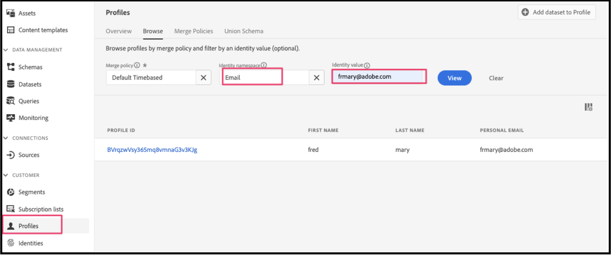
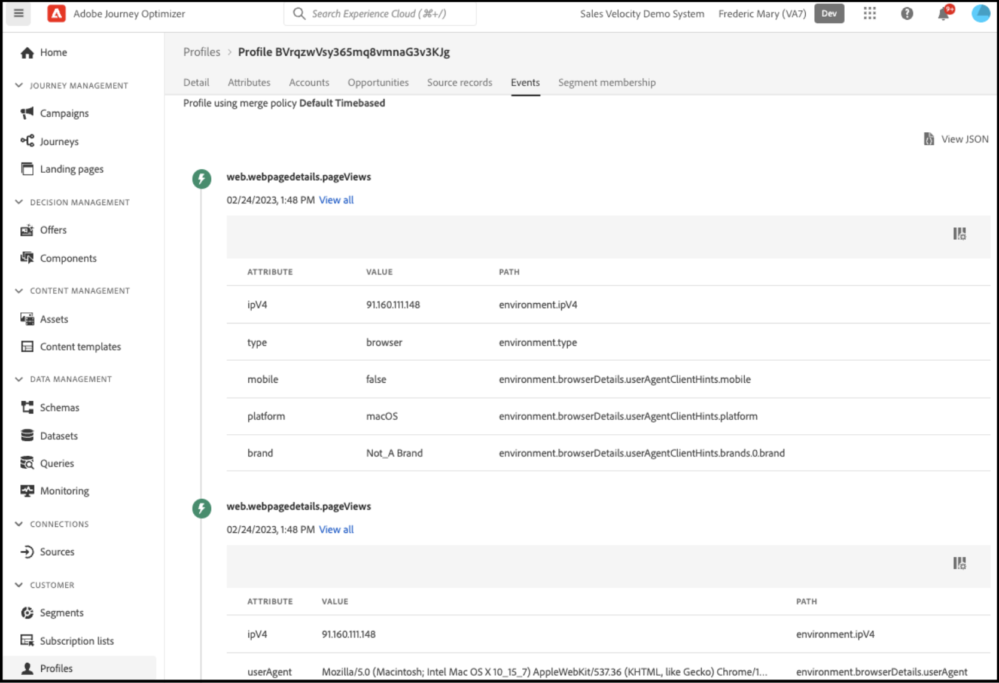

# Verwenden von Adobe Journey Optimizer zum Senden einer E-Mail zu einem Transaktionsabbruch

Erfahren Sie, wie Sie eine personalisierte E-Mail zur erneuten Interaktion oder Benachrichtigung senden, wenn eine Warenkorb- oder Browser-Sitzung abgebrochen wurde. In diesem Artikel verwenden Sie Daten von Kunden, die eine Reihe von Produkten und Kategorien angesehen, mit einem Produkt interagiert oder Zeit auf einer Seite verbracht haben.

## Welche Daten sollte ich verwenden?

Erstellen Sie einen Transaktionsabbruch, durchsuchen Sie E-Mails oder Benachrichtigungen mithilfe von Daten aus Storefront- und Backoffice-Ereignissen.

| Datentypen | Storefront-Daten (Verhaltensereignisse) | Back-Office-Daten (Server-seitige Ereignisse) |
|---|---|---|
| **Definition** | Klicks oder Aktionen, die Kunden auf Ihrer Site durchführen. | Informationen über den Lebenszyklus und Details jeder Bestellung (vergangene und aktuelle). |
| **Von Adobe Commerce erfasste Ereignisse** | [pageView](https://experienceleague.adobe.com/en/docs/commerce/data-connection/event-forwarding/events#pageview)<br>[productPageView](https://experienceleague.adobe.com/en/docs/commerce/data-connection/event-forwarding/events)<br>[addToCart](https://experienceleague.adobe.com/en/docs/commerce/data-connection/event-forwarding/events#addtocart)<br>[openCart](https://experienceleague.adobe.com/en/docs/commerce/data-connection/event-forwarding/events#opencart)<br>[startCheckout](https://experienceleague.adobe.com/en/docs/commerce/data-connection/event-forwarding/events#startcheckout)<br>[completeCheckout](https://experienceleague.adobe.com/en/docs/commerce/data-connection/event-forwarding/events#completecheckout) | [orderPlaced](https://experienceleague.adobe.com/en/docs/commerce/data-connection/event-forwarding/events-backoffice#orderplaced)<br>[Order history](https://experienceleague.adobe.com/en/docs/commerce/data-connection/fundamentals/connect-data#send-historical-order-data) |

### Was haben andere Kunden erreicht?

Adobe [!DNL Commerce]-Kunden haben durch die Implementierung personalisierter Abbruchkampagnen mit Adobe [!DNL Commerce], Adobe [!DNL Journey Optimizer] und Adobe [!DNL Real-Time CDP] erhebliche geschäftliche Vorteile erzielt.

Ein weltweiter, markenübergreifender Bekleidungseinzelhändler hat erreicht:

- 1,9fache Konversion bei Klick aus neuen Kampagnen
- 57 % mehr Umsatz durch Omni-Channel-Abbruch-Journey
- Steigerung der Konversionsrate von Rückgewinnungskampagnen um 41 %
- Mehr als 1000 neue Käufer pro Woche eingestellt

Ein weltweit tätiges Getränkeunternehmen hat folgendes erreicht:

- Öffnungsraten von 36 % für die Rückgewinnung von E-Mails
- Steigerung der Clickthrough-Raten um 21 %
- Steigerung der Konversionsrate um 8,5 %
- 89 % der rückeroberten Abbrecher konvertieren

## Fangen wir an

Dieser spezielle Anwendungsfall konzentriert sich auf die Erstellung einer E-Mail zu einem Warenkorb, bei der Daten aus Ihrer [!DNL Commerce]-Instanz verwendet und an Adobe [!DNL Journey Optimizer] gesendet werden.

### Was ist Adobe Journey Optimizer?

Mit [Adobe Journey Optimizer](https://experienceleague.adobe.com/docs/journey-optimizer/using/get-started/get-started.html) können Sie das Commerce-Erlebnis für Ihre Kunden personalisieren. Sie können Journey Optimizer beispielsweise verwenden, um geplante Marketing-Kampagnen zu erstellen und bereitzustellen, z. B. wöchentliche Werbeaktionen für ein Einzelhandelsgeschäft, oder um eine E-Mail zu generieren, wenn ein Kunde ein Produkt zum Warenkorb hinzugefügt, aber dann den Checkout-Prozess nicht abgeschlossen hat.

In diesem Thema erfahren Sie, wie Sie eine E-Mail zu einem Transaktionsabbruch erstellen, indem Sie ein von Ihrer [!DNL Commerce] generiertes `checkout`-Ereignis überwachen und in Journey Optimizer auf dieses Ereignis reagieren.

>[!IMPORTANT]
>
>Verwenden Sie zu Demonstrationszwecken Ihre [!DNL Commerce] Sandbox-Umgebung, damit Sie Ihre Produktionsereignisdaten nicht mit den Storefront- und Backoffice-Ereignisdaten verwässern, die Sie an Experience Platform senden.

### Voraussetzungen

Bevor Sie mit diesen Schritten beginnen, stellen Sie Folgendes sicher:

- Sie haben die Berechtigung zur Verwendung von Adobe [!DNL Journey Optimizer]. Wenn Sie sich nicht sicher sind, wenden Sie sich an Ihren Systemintegrator oder das Entwicklungs-Team, das Projekte und Umgebungen verwaltet.
- Sie [ die [!DNL Data Connection]-Erweiterung in [!DNL Commerce] ](install.md) und [&#128279;](connect-data.md) konfiguriert.
- Sie [bestätigt](connect-data.md#confirm-that-event-data-is-collected) dass Ihre [!DNL Commerce] Ereignisdaten am Experience Platform Edge eintreffen.

## Schritt 1: Erstellen Sie einen Benutzer in Ihrer [!DNL Commerce] Sandbox-Umgebung

Erstellen Sie einen Benutzer in Ihrer Sandbox-Umgebung und vergewissern Sie sich, dass diese Benutzerkontoinformationen in Experience Platform angezeigt werden. Stellen Sie sicher, dass die angegebene E-Mail so gültig ist, wie sie später in diesem Abschnitt zum Senden der E-Mail für den Transaktionsabbruch verwendet wird.

1. Melden Sie sich an oder erstellen Sie ein Konto in Ihrer [!DNL Commerce] Sandbox-Umgebung.

   {width="700" zoomable="yes"}

   Wenn die [!DNL Data Connection]-Erweiterung installiert und konfiguriert ist, werden diese Kontoinformationen als Profil an Experience Platform gesendet.

1. Vergewissern Sie sich, dass Ihre Benutzerkontoinformationen im Abschnitt **[!UICONTROL Profile]** von Experience Platform angezeigt werden.

   Navigieren Sie zu **[!UICONTROL Profiles]** in der Adobe Experience Platform. Klicken Sie im Profil auf **[!UICONTROL Detail]** , um das von Ihnen erstellte Profil anzuzeigen.

   {width="700" zoomable="yes"}

## Schritt 2: Anzeigen von Ereignissen in Journey Optimizer

Trigger von Ereignissen in Ihrer [!DNL Commerce]-Sandbox-Umgebung in Ihrer Storefront, indem Sie Produktseiten anzeigen, Artikel zu einem Warenkorb hinzufügen und verschiedene andere Aktivitäten ausführen, die ein Käufer ausführen würde. Bestätigen Sie dann, dass diese Ereignisse an Journey Optimizer weitergeleitet werden.

1. [Adobe Journey Optimizer starten](https://experienceleague.adobe.com/docs/journey-optimizer/using/get-started/user-interface.html).
1. Wählen Sie **[!UICONTROL Profiles]** aus.
1. Legen Sie **[!UICONTROL Identity namespace]** auf `Email` fest.
1. **[!UICONTROL Identity value]** auf Ihre E-Mail-Adresse festlegen.
1. Wählen Sie Ihr Profil und dann die Registerkarte **[!UICONTROL Events]** aus.

   {width="700" zoomable="yes"}

   Suchen Sie nach dem `commerce.checkouts` Ereignis und untersuchen Sie die Ereignis-Payload:

   ```json
   "personID": "84281643067178465783746543501073369488", 
   "eventType": "commerce.checkouts", 
   "_id": "4b41703f-e42e-485b-8d63-7001e3580856-0", 
   "commerce": { 
       "cart": {}, 
       "checkouts": { 
           "value": 1 
       } 
   ```

   Wie zu sehen ist, enthält die vollständige Ereignis-Payload umfangreiche Ereignisdaten. Im nächsten Abschnitt konfigurieren Sie Ereignisse in Journey Optimizer, um auf das `commerce.checkouts` zu warten, das von Ihrer [!DNL Commerce]-Storefront generiert wurde, und darauf zu reagieren.

## Schritt 3: Konfigurieren von Ereignissen in Journey Optimizer

Konfigurieren Sie zwei Ereignisse in Journey Optimizer: Das eine Ereignis überwacht das `commerce.checkouts` Ereignis aus Commerce, und das andere ist ein einfaches Zeitüberschreitungsereignis, das wartet, bis eine bestimmte Zeit vergangen ist, bevor eine E-Mail mit einem Transaktionsabbruch ausgelöst wird.

### Listener-Ereignis erstellen

1. [Adobe Journey Optimizer starten](https://experienceleague.adobe.com/docs/journey-optimizer/using/get-started/user-interface.html).

1. Klicken Sie **[!UICONTROL Configurations]** unter dem Abschnitt **[!UICONTROL Administration]** im linken Bereich.

1. Klicken Sie in der Kachel **[!UICONTROL Events]** auf **[!UICONTROL Manage]**.

   {width="700" zoomable="yes"}

1. Klicken Sie auf der **[!UICONTROL Events]** Seite auf **[!UICONTROL Create Event]**.

1. Richten Sie in der rechten Navigation Ihr Ereignis wie folgt ein:

   1. Legen Sie die **[!UICONTROL Name]** auf `firstname_lastname_checkout` fest.
   1. Legen Sie **[!UICONTROL Type]** auf **[!UICONTROL Unitary]** fest.
   1. Legen Sie **[!UICONTROL Event id typ]e** auf **[!UICONTROL Rule based]** fest.
   1. Legen Sie **[!UICONTROL Schema]** auf Ihr [!DNL Commerce] fest [Schema](update-xdm.md).
   1. Wählen Sie **[!UICONTROL Fields]** aus, um die **[!UICONTROL Fields]** zu öffnen. Wählen Sie dann die Felder aus, die für dieses Ereignis nützlich sind. Wählen Sie beispielsweise alle Felder unter **[!UICONTROL Product list items]**, **[!UICONTROL Commerce]**, **[!UICONTROL eventType]** und **[!UICONTROL Web]** aus.
   1. Klicken Sie auf **[!UICONTROL OK]** , um die ausgewählten Felder zu speichern.
   1. Klicken Sie in das Feld **[!UICONTROL Event id condition]** . Erstellen Sie dann eine Bedingung: `eventType` ist gleich `commerce.checkouts` UND `personalEmail.address` ist gleich der E-Mail-Adresse, die Sie beim Erstellen des Profils im vorherigen Abschnitt verwendet haben.

      {width="700" zoomable="yes"}

   1. Klicken Sie auf **[!UICONTROL OK]**.
   1. Klicken Sie auf **[!UICONTROL Save]** , um Ihr Ereignis zu speichern.

### Zeitüberschreitungsereignis erstellen

1. Erstellen Sie wie zuvor ein Ereignis in Journey Optimizer.

1. Richten Sie in der rechten Navigation Ihr Ereignis wie folgt ein:

   1. Legen Sie die **[!UICONTROL Name]** auf `firstname_lastname_timeout` fest.
   1. Legen Sie **[!UICONTROL Type]** auf **[!UICONTROL Unitary]** fest.
   1. Legen Sie **[!UICONTROL Event id type]** auf **[!UICONTROL Rule based]** fest.
   1. Legen Sie **[!UICONTROL Schema]** auf Ihr [!DNL Commerce] fest [Schema](update-xdm.md).
   1. Stellen Sie **[!UICONTROL Schema]**, **[!UICONTROL Fields]** und **[!UICONTROL Event id condition]** auf die gleichen Werte wie oben ein.
   1. Klicken Sie auf **[!UICONTROL Save]** , um Ihr Ereignis zu speichern.

Erstellen Sie nach dem Konfigurieren dieser beiden Ereignisse eine Journey, die eine E-Mail zu einem Transaktionsabbruch sendet.

## Schritt 4: Erstellen einer Checkout-Journey

Erstellen Sie eine Journey, die auf das `commerce.checkouts` wartet und dann nach Ablauf einer bestimmten Zeit eine E-Mail an den Transaktionsabbruch sendet.

1. Wählen Sie in Journey Optimizer **[!UICONTROL Journeys]** unter **J[!UICONTROL OURNEY MANAGEMENT]** aus.
1. Klicken Sie auf **[!UICONTROL Create Journey]**.
1. Geben Sie den Namen Ihrer Journey an.
1. Klicken Sie auf **[!UICONTROL OK]** , um die Journey zu speichern.
1. Suchen Sie in der linken Navigation unter dem Abschnitt **[!UICONTROL EVENTS]** nach dem zuvor erstellten Checkout-Ereignis: `firstname_lastname_checkout` Sie es per Drag-and-Drop auf die Arbeitsfläche.

   >[!TIP]
   >
   >Durch Doppelklicken auf das Ereignis wird es automatisch zur Arbeitsfläche hinzugefügt.

1. Suchen Sie nach dem Timeout-Ereignis und fügen Sie es zur Arbeitsfläche hinzu.
1. Doppelklicken Sie auf das Zeitüberschreitungsereignis.

   1. Aktivieren Sie im Abschnitt **[!UICONTROL Timeout]** das Kontrollkästchen **[!UICONTROL Define the event time]** .
   1. Geben Sie in das **[!UICONTROL Wait for]** Feld `1` und `Minute` ein.
   1. Aktivieren Sie das Kontrollkästchen **[!UICONTROL Set a timeout path]** .

   Mit dieser Zeitüberschreitungskonfiguration schließt ein Käufer, der einen Checkout durchführt, die Bestellung jedoch nicht innerhalb einer Minute ab, diese Zeitüberschreitungsverzweigung Trigger ab. In einer tatsächlichen Produktionsumgebung würden Sie dies für einen längeren Zeitraum festlegen, z. B. 24 Stunden.

1. Fügen Sie in der linken Navigation unter **[!UICONTROL ACTIONS]** die Aktion **[!UICONTROL Email]** zur Verzweigung Timeout hinzu. Ihr Journey sollte wie folgt aussehen:

   {width="700" zoomable="yes"}

### Erstellen einer E-Mail für einen Transaktionsabbruch

Erstellen Sie eine E-Mail zu einem Transaktionsabbruch, die gesendet wird, wenn ein Transaktionsabbruch erkannt wird.

1. Doppelklicken Sie auf der oben erstellten Journey auf das Symbol **[!UICONTROL Email]** auf der Arbeitsfläche.

1. Befolgen Sie die [Schritte](https://experienceleague.adobe.com/docs/journey-optimizer/using/content-management/personalization/personalization-use-cases/personalization-use-case-helper-functions.html#configure-email) im Journey Optimizer-Handbuch, um die E-Mail mit dem Transaktionsabbruch zu erstellen.

Sie haben jetzt eine Journey in Journey Optimizer, die auf das `commerce.checkouts`-Ereignis aus Ihrem [!DNL Commerce] wartet, und eine E-Mail zu einem Transaktionsabbruch, die nach Ablauf eines bestimmten Zeitraums gesendet wird. Im nächsten Abschnitt erfahren Sie, wie Sie die Journey testen.

## Schritt 5: Checkout-Ereignis in Echtzeit als Trigger anzeigen

In diesem Abschnitt testen Sie das Ereignis in Echtzeit.

1. Schalten Sie in Journey Optimizer den Testmodus ein.

   {width="700" zoomable="yes"}

1. Um diese Journey in Echtzeit zu testen, öffnen Sie eine andere Browser-Registerkarte und navigieren Sie zur [!DNL Commerce]-Website in Ihrer Sandbox-Umgebung.

   1. Fügen Sie ein Produkt in Ihren Warenkorb.
   1. Zur Kasse gehen.
   1. Beenden Sie den Warenkorb auf der Kaufbestätigungsseite, indem Sie zur Hauptseite zurückkehren oder Ihre Registerkarte schließen.

      Die Journey wird jetzt ausgelöst. Öffnen Sie zur Bestätigung die Registerkarte, auf der sich Ihr Journey in Journey Optimizer befindet. Es sollte ein grüner Pfeil angezeigt werden, der den Pfad anzeigt, den Ihre Benutzerin oder Ihr Benutzer durchlaufen hat.

1. Überprüfen Sie Ihren Posteingang auf die E-Mail.
