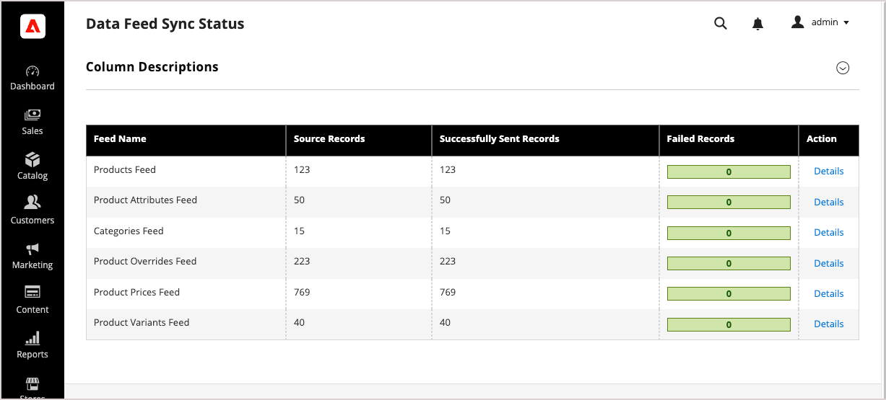

# Synchronisierungsprozess anzeigen und verwalten

Die meisten Synchronisierungsaktivitäten werden automatisch mit vollständiger Synchronisierung, teilweiser Synchronisierung oder Wiederholung fehlgeschlagener Elementsynchronisierung verarbeitet. Siehe [Synchronisierungstypen](sync-overview.md#synchronization-types) für Details zum Zeitpunkt der Ausführung der einzelnen Typen. [!DNL SaaS Data Export] bietet außerdem Tools zur Überwachung, Verwaltung und Fehlerbehebung bei diesem Prozess. Sie können den Synchronisierungsstatus anzeigen und den Datensynchronisierungsprozess mithilfe der Dashboards für Ihre Bereitstellung verwalten.

>[!BEGINTABS]

>[!TAB Adobe Commerce]

Bei Adobe Commerce-On-Cloud-, On-Premise- oder Adobe Commerce as a Cloud Service-Bereitstellungen können Sie den Synchronisierungsprozess über diese Commerce-Admin-Ressourcen anzeigen und verwalten:

- **[Seite „Daten-Feed-Synchronisierungsstatus](../optimizer/setup/data-sync.md)** - Überprüfen Sie den Feed-Exportstatus für Bereitstellungen, die mit [!DNL Live Search], [!DNL Product Recommendations] oder [!DNL Catalog Service] verbunden sind. Dieses Dashboard zeigt den Status des Feed-Exports für jeden Feed einschließlich aller aufgetretenen Fehler an. In einer Detailansicht wird der Status des Feed-Exports für einzelne Feed-Elemente angezeigt.

- **[Daten-Management-Dashboard](https://experienceleague.adobe.com/en/docs/commerce-admin/systems/data-transfer/data-sync/data-dashboard)** - Admin-Benutzer können Daten anzeigen und verfolgen, die erfolgreich exportiert und mit verbundenen Commerce Services synchronisiert wurden. In diesem Dashboard werden die mit Commerce Services synchronisierten Produktdaten angezeigt.

>[!NOTE]
>
>Das Daten-Management-Dashboard und die Seite Status der Daten-Feed-Synchronisierung sind nur verfügbar, wenn [!DNL Live Search], [!DNL Product Recommendations] oder [!DNL Catalog Service] installiert sind.

>[!TAB Adobe Commerce mit Commerce Optimizer]

Bei Commerce-On-Cloud- oder -On-Premise-Bereitstellungen, die in [!DNL Commerce Optimizer] integriert sind, können Sie den Synchronisierungsprozess mithilfe der folgenden Ressourcen anzeigen und verwalten:

- **[Seite „Synchronisierungsstatus für Daten-Feeds](../optimizer/setup/data-sync.md)** - Überprüfen Sie für Commerce-Projekte, die [!DNL Commerce Optimizer] verwenden, die Verfügbarkeit von Katalogdaten für Ihre Storefront auf der Seite „Synchronisierungsstatus für Daten-Feeds“ in [!DNL Commerce Optimizer]. Dieses Dashboard zeigt den Synchronisierungsstatus der Datenexport-Feeds an.

- **[Datensynchronisierungsseite](../optimizer/setup/data-sync.md)** - Die Datensynchronisierungsseite bietet einen Überblick über den Synchronisierungsstatus für Produktdaten, die von Ihrer Upstream-Katalogquelle in [!DNL Commerce Optimizer] stammen.

Weitere Informationen dazu, wie Sie diese Dashboards verwenden, um zu überprüfen, ob die Datensynchronisierung funktioniert, und um Daten manuell neu zu synchronisieren, finden Sie unter [Synchronisierung verwalten](../aco-connector/data-sync-manage.md) im _Adobe Commerce Optimizer Connector-Handbuch_.

>[!ENDTABS]

## Überprüfen, ob die Datensynchronisation funktioniert {#verify-that-the-data-sync-is-working}

Um sicherzustellen, dass die Datensynchronisierung funktioniert, überprüfen Sie, ob die Daten erfolgreich aus [!DNL Adobe Commerce] exportiert und erfolgreich an den verbundenen Commerce-Service übermittelt wurden. Verwenden Sie die Dashboards für Ihre Bereitstellung, um beide Schritte zu überprüfen.

Mit Export beginnen und dann Versand bestätigen.

1. Überprüfen Sie den Synchronisierungsstatus in der Commerce Admin Console.

   Navigieren Sie zu **[!UICONTROL System]** > **[!UICONTROL Data Transfer]** > **[!UICONTROL Data Feed Sync Status]**.

   {width="800" zoomable="yes"}

   Wenn die Synchronisierung ausgeführt wird, zeigen die Feed-Daten erfolgreich gesendete Datensätze an. Feed auswählen, um Details anzuzeigen oder Synchronisierungsprobleme zu beheben.

1. Vergewissern Sie sich, dass die Daten an verbundene Commerce Services gesendet wurden.

   Navigieren Sie vom Commerce-Administrator aus zu **[!UICONTROL System]** > **[!UICONTROL Data Transfer]** > **[!UICONTROL Data Management Dashboard]**.

   {width="700" zoomable="yes"}

   Überprüfen Sie, ob die erwarteten Produkte, Preise und Attribute angezeigt werden.

>[!TIP]
>
>Wenn Sie Probleme mit der Datensynchronisation haben, lesen Sie den Abschnitt [Protokolle überprüfen und Fehler beheben](troubleshooting/logging.md).

## Daten manuell neu synchronisieren

Wenn Synchronisierungsprobleme durch teilweise Synchronisierung und automatische erneute Versuche nicht behoben werden, können Sie die Synchronisierung von Daten manuell über den Commerce Admin oder mithilfe von Commerce-CLI-Befehlen neu synchronisieren. Die verfügbaren Optionen hängen von Ihrer Bereitstellung ab.

### Verfügbare manuelle Resynchronisierungsoptionen {#manual-resync-options-commerce}

Verwenden Sie die folgenden Optionen, um Feed-Daten manuell neu zu synchronisieren.

| Aufgabe | Option | Notizen |
| --- | --- | --- |
| Ausgewählte fehlgeschlagene oder problematische Feed-Elemente neu synchronisieren | **[!UICONTROL Data Feed Sync Status]Seite** | Überwachen und re-synchronisieren Sie ausgewählte Feed-Elemente über den Commerce Admin. Siehe [Überprüfen, ob die Datensynchronisation funktioniert](#verify-that-the-data-sync-is-working). |
| Vollständige Neusynchronisierung aller Feeds | **[!UICONTROL Data Management Dashboard]** | Führen Sie eine vollständige Neusynchronisierung aller Feeds von Commerce Admin durch. Adobe empfiehlt dies vor allem, wenn Sie zum ersten Mal eine Verbindung zu einem Commerce-Service herstellen. Siehe [Überprüfen, ob die Datensynchronisation funktioniert](#verify-that-the-data-sync-is-working). |
| Gezielte Re-Synchronisation des Feeds mit Betriebssteuerung | **Commerce-CLI** | Verwenden Sie den Befehl `saas:resync` für die Resynchronisation zielgerichteter Feeds. Siehe [Synchronisieren von Feeds mit der Commerce-CLI](data-export-cli-commands.md). |

>[!MORELIKETHIS]
>
> - [Funktionsweise der Synchronisierung](sync-overview.md) - Erfahren Sie mehr über Synchronisierungsmodi, vollständige Synchronisierung, partielle Synchronisierung und Wiederholen fehlgeschlagener Elemente.
> - [Feeds über die Commerce-CLI synchronisieren](data-export-cli-commands.md) - Verwenden Sie den Befehl `saas:resync` für die Resynchronisierung gezielter Feeds.
> - [Überprüfen von Protokollen und Fehlerbehebung](troubleshooting/logging.md) - Diagnostizieren von Datenexport- und SaaS-Exportfehlern.
> - [Synchronisierung mit verwalten [!DNL Commerce Optimizer]](../aco-connector/data-sync-manage.md) - Überprüfen Sie die Synchronisierung von Katalogdaten und synchronisieren Sie Connector-Feeds manuell neu.

