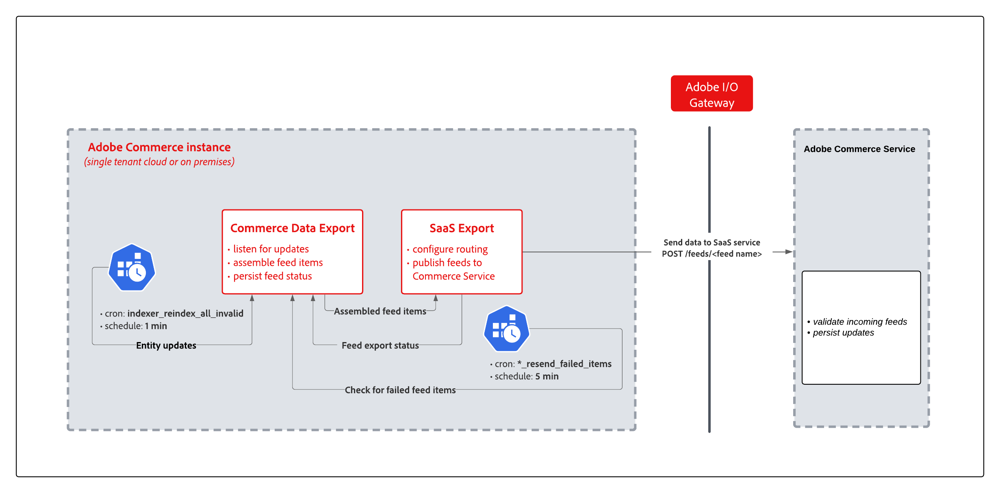

# Synchronisieren von Daten mit dem SaaS-Datenexport

Wenn Sie einen Commerce-Service installieren, für den ein Datenexport erforderlich ist, z. B. Catalog Service, Live Search oder Product Recommendations, wird eine Sammlung von SaaS-Datenexportmodulen installiert, um den Datenerfassungs- und Synchronisierungsprozess zu verwalten.

Der SaaS-Datenexport verschiebt Produktdaten laufend von einer Adobe Commerce-Instanz auf die Commerce Services-Plattform, um die Daten auf dem neuesten Stand zu halten. Beispielsweise benötigen Sie für Produktempfehlungen aktuelle Kataloginformationen, um Empfehlungen mit korrekten Namen, Preisen und Verfügbarkeit genau zurückzugeben. Verwenden Sie [Daten-Management-Dashboard](https://experienceleague.adobe.com/en/docs/commerce/user-guides/data-services/catalog-sync), um den Synchronisierungsprozess zu beobachten und zu verwalten, oder die Befehlszeilenschnittstelle, um eine Synchronisierung Trigger und Produktdaten für die Nutzung durch Commerce Services neu zu indizieren.

Das folgende Diagramm zeigt den SaaS-Datenexportfluss.

{width="900" zoomable="yes"}

Zu den Hauptkomponenten des SaaS-Datenexportflusses gehören:

- SaaS-Datenexportmodule, die die Daten für Feeds aus Adobe Commerce erfassen, Feed-Elemente zusammenstellen, auf Aktualisierungen warten und den Feed-Status beibehalten.
- SaaS exportieren Module, die Daten exportieren, Routing konfigurieren und die Feeds an verbundene Services veröffentlichen.
- Der Adobe Commerce-Service verwaltet den Datenaufnahmeprozess, um eingehende Feeds zu validieren und Aktualisierungen für verbundene Services beizubehalten.

## Synchronisationsmodi

Der SaaS-Datenexport verfügt über zwei Modi zur Verarbeitung von Entitäts-Feeds:

- **Modus für sofortigen Export** - In diesem Modus werden Daten in einer einzigen Iteration erfasst und sofort an den Commerce-Service gesendet. Dieser Modus beschleunigt die Bereitstellung von Entitätenaktualisierungen an den Commerce-Service und reduziert die Speichergröße der Feed-Tabellen.

- **Alter Exportmodus** - In diesem Modus werden Daten in einem einzigen Prozess erfasst. Dann sendet ein Cron-Auftrag die erfassten Daten an die verbundenen Commerce-Services. In Datenexportprotokolleinträgen sind Feeds, die den alten Modus verwenden, mit `(legacy)` gekennzeichnet.

## Synchronisierungstypen

Der SaaS-Datenexport unterstützt drei Synchronisierungstypen: Vollständige Synchronisierung, Teilsynchronisierung und Wiederholen fehlgeschlagener Elementsynchronisierung.

### Vollständige Synchronisierung

Nachdem Sie eine Adobe Commerce-Instanz mit dem Commerce-Service verbunden haben, führen Sie eine vollständige Synchronisierung durch, um Entitäts-Feed-Daten von Adobe Commerce an den verbundenen Service zu senden.

>[!NOTE]
>
>Die vollständige Synchronisierung erfolgt hauptsächlich in der Onboarding-Phase. Vermeiden Sie den regulären Gebrauch, um eine Überlastung der Datenbank zu vermeiden. Nach der ersten Synchronisierung werden laufende Änderungen automatisch durch partielle Synchronisierung synchronisiert.

### Teilweise synchronisieren

Bei teilweiser Synchronisierung sendet der SaaS-Datenexport automatisch Aktualisierungen aus der Commerce-Anwendung, z. B. Änderungen des Produktnamens oder Preisaktualisierungen, an verbundene Commerce-Services.

Der Datenexportprozess verwendet die folgenden Cron-Aufträge, um den Vorgang der partiellen Synchronisierung zu automatisieren.

- Cron-Gruppenaufträge „indizieren“:
   - Der `indexer_reindex_all_invalid` indiziert alle ungültigen Feeds neu. Dies ist ein standardmäßiger Adobe Commerce-Cron-Auftrag.
   - Der `saas_data_exporter` ist für alte Export-Feeds.
   - Der `sales_data_exporter` ist spezifisch für den Verkaufsdaten-Export-Feed.

Diese Aufträge werden jede Minute ausgeführt.

Damit die partielle Synchronisierung funktioniert, benötigt die Commerce-Anwendung die folgende Konfiguration:

- [Die Aufgabenplanung wird über Cron-Aufträge aktiviert](https://experienceleague.adobe.com/docs/commerce-operations/installation-guide/next-steps/configuration.html)

- Alle SaaS-Datenexportindizierer sind im `Update by Schedule`-Modus konfiguriert.

  In der SaaS-Datenexportversion 103.1.0 und höher ist der `Update by Schedule` standardmäßig aktiviert. Sie können die Indexkonfiguration auf dem Server mithilfe des Commerce-CLI-Befehls `bin/magento indexer:show-mode | grep -i feed`

### Synchronisierung fehlgeschlagener Elemente wiederholen

Die Synchronisierung fehlgeschlagener Elemente wiederholen verwendet einen separaten Prozess zum erneuten Senden von Elementen, die aufgrund von Fehlern während des Synchronisierungsprozesses nicht synchronisiert werden konnten, z. B. ein Anwendungsfehler, eine Netzwerkunterbrechung oder ein SaaS-Service-Fehler. Die Implementierung für diese Synchronisierung basiert ebenfalls auf Cron-Aufträgen.

- `resync_failed_feeds_data_exporter` Cron-Gruppenaufträge:
   - Der `<feed name>_feed_resend_failed_feeds_items` sendet Elemente, die nicht synchronisiert werden konnten, erneut, z. B. `products_feed_resend_failed_items`.

### Synchronisierungsprozess anzeigen und verwalten

Die meisten Synchronisierungsaktivitäten werden automatisch auf Grundlage der Anwendungskonfiguration verarbeitet. Der SaaS-Datenexport bietet jedoch auch Tools zur Verwaltung des Prozesses.

- Admin-Benutzer können den Synchronisierungsfortschritt anzeigen und verfolgen und Informationen zu den Daten vom [Daten-Management-Dashboard](https://experienceleague.adobe.com/en/docs/commerce-admin/systems/data-transfer/data-dashboard) abrufen.

- Entwickler, Systemintegratoren oder Admins mit Zugriff auf den Commerce-Anwendungsserver können den Synchronisierungsprozess und die Daten-Feeds mithilfe des Adobe Commerce-Befehlszeilen-Tools (CLI) verwalten. Siehe [Referenz für Datenexportbefehle](data-export-cli-commands.md).

### Konfiguration der Commerce-Anwendung überprüfen

Die Synchronisierung von teilweise synchronisierten und fehlgeschlagenen Elementen mit „Erneut versuchen“ funktioniert nur, wenn die Commerce-Instanz korrekt konfiguriert wurde. Normalerweise wird die Konfiguration abgeschlossen, wenn der Commerce-Service eingerichtet wird. Wenn der Datenexport nicht ordnungsgemäß funktioniert, überprüfen Sie die folgende Konfiguration.

- [Bestätigen Sie, dass Cron-Aufträge ausgeführt werden](https://experienceleague.adobe.com/en/docs/commerce-knowledge-base/kb/troubleshooting/miscellaneous/cron-readiness-check-issues).

- Stellen Sie sicher, dass die Indexer vom [Admin](https://experienceleague.adobe.com/en/docs/commerce-admin/systems/tools/index-management) oder mithilfe des Commerce CLI-`bin/magento indexer:info` ausgeführt werden.

- Stellen Sie sicher, dass die Indexer für die folgenden Feeds auf `Update by Schedule` eingestellt sind: Katalogattribute, Produkt, Produktüberschreibungen und Produktvariante. Sie können die Indexer unter [Indexverwaltung](https://experienceleague.adobe.com/en/docs/commerce-admin/systems/tools/index-management) im Admin oder über die CLI (`bin/magento indexer:show-mode | grep -i feed`) überprüfen.

### Ereignis-Manager-Benachrichtigungen für die Datenübertragungsprotokollierung

In Version 103.3.4 und höher sendet der SaaS-Datenexport das `data_sent_outside`, wenn Daten von der Commerce-Instanz an Adobe Commerce-Services gesendet werden.

```php
$this->eventManager->dispatch(
   "data_sent_outside",
   [
       "timestamp" => time(),
       "type" => $metadata->getFeedName(),
       "data" => $data
   ]
);
```

>[!NOTE]
>
>Informationen zu Ereignissen und zum Abonnieren finden Sie unter [Ereignisse und Beobachter](https://developer.adobe.com/commerce/php/development/components/events-and-observers) in der Adobe Commerce Developer-Dokumentation.