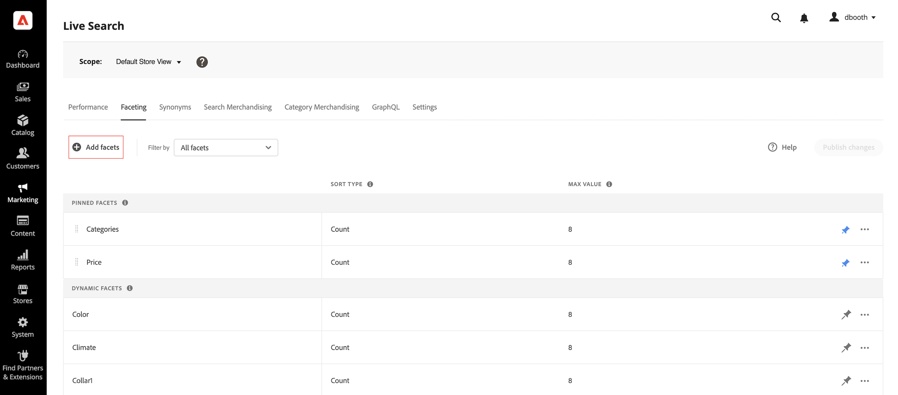
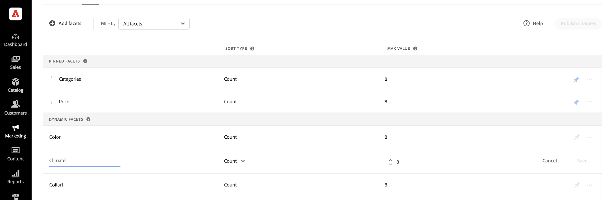

# Facetten hinzufügen

Jedes filterbare Produktattribut kann als Facette außer Lagerstatus (`quantity_and_stock_status`) verwendet werden. Im Bedienfeld *[!UICONTROL Add facets]* werden die aktuellen Facetten aufgelistet. Damit können Sie problemlos zusätzliche Produktattribute als Facetten zuweisen. Während dieses dreistufigen Prozesses wird ein Attribut ausgewählt, das als Facette verwendet wird, Eigenschaften bei Bedarf bearbeitet werden und die Änderungen in der Storefront veröffentlicht werden.

>[!NOTE]
>
>Informationen zur Verwaltung der Produktanzeige nach Lagerstatus finden Sie [Verwalten von nicht vorrätigen Produkten](manage-out-of-stock-products.md).

## Schritt 1: Facette hinzufügen

1. Gehen Sie im Admin zu **Marketing** > SEO &amp; Search > **[!DNL Live Search]**.
1. Klicken Sie auf *Registerkarte* Facettierung **auf Facetten hinzufügen**.
1. In der Liste *Facetten hinzufügen* verfügt jedes verfügbare Attribut über eine separate . Führen Sie einen der folgenden Schritte aus:

   * Wählen *in der Liste* das Produktattribut aus, das Sie als Facette verwenden möchten, und klicken Sie auf **Hinzufügen**.
   * Um ein bestimmtes Produktattribut zu finden, geben Sie die ersten Zeichen des Attributnamens in das Feld *Suche* ein. Klicken Sie dann auf **Hinzufügen**.

     Informationen zum Konfigurieren von Preisvarianten und Gruppierungen finden Sie unter [Einstellungen](settings.md). Weitere Informationen finden Sie unter [Facettenarten](facets-type.md).
Die Facette wird am unteren Rand der Liste *Dynamische Facetten* hinzugefügt und die Schaltfläche *Änderungen veröffentlichen* wird verfügbar.

1. Wenn die Facette, die Sie hinzufügen möchten, nicht gefunden werden kann, navigieren Sie zu **Stores** > Attribute > **Produkt** und stellen Sie sicher, dass das Attribut über die [erforderlichen Eigenschaften](facets.md) verfügt, um als Facette verwendet zu werden. Aktualisieren Sie bei Bedarf die folgenden Storefront-Eigenschaften des -Attributs:

   * **[!UICONTROL Use in Search]** -  `Yes`
   * **[!UICONTROL Use in Layered Navigation]** -  `Filterable (with results)`
   * **[!UICONTROL Use in Search Results Layered Navigation]** -  `Yes`

1. Aktualisieren Sie bei Aufforderung den Cache.

   Die Facette wird in der Storefront verfügbar, wenn der Katalog das nächste Mal mit [!DNL Live Search] synchronisiert wird. Wenn die Facette nach zwei Stunden nicht verfügbar ist, finden Sie weitere Informationen unter [Synchronisieren von Katalogdaten](install.md#sync).

## Schritt 2: Facetteneigenschaften bearbeiten (optional)

1. Um die Facetteneigenschaften zu bearbeiten, klicken Sie auf **Mehr** () Optionen in der rechten Spalte.
1. Klicken Sie im Menü auf **Bearbeiten**. Passen Sie dann die folgenden Eigenschaften nach Bedarf an.

   * Beschriftung - ([nur Headless](facets-type.md)) Geben Sie die Facettenbeschriftung ein, die Sie verwenden möchten.
   * Sortiertyp - Facetten werden alphabetisch für alle [!DNL Commerce]-Storefronts sortiert. Bei Headless-Implementierungen können Facetten entweder alphabetisch oder nach Anzahl sortiert werden. Optionen: Alphabetisch, Anzahl (nur Headless)
   * Maximaler Wert - Geben Sie die maximale Anzahl der in der Storefront angezeigten Facettenwerte ein. Gültige Einträge: 0 - 100; Standard: 8

1. Klicken Sie abschließend auf **Speichern**.

   

1. Um die Facette oben in der Liste *Filter* anzuheften, klicken Sie auf den grauen Push-Pin .
1. Um die Reihenfolge der fixierten Facetten zu ändern, klicken Sie auf das Symbol **Verschieben** ( und ziehen Sie die Zeile an eine neue Position im Abschnitt *Fixierte Facetten*.

## Schritt 3: Änderungen veröffentlichen

1. Wenn die Facette abgeschlossen ist, klicken Sie auf **Änderungen**.
1. Warten Sie, bis die Facette im Store angezeigt wird.

   Wenn die Facette nach zwei Stunden nicht verfügbar ist, finden Sie weitere Informationen unter [Überprüfen des &#x200B;](install.md#sync)) in den Installationsanweisungen.

## Feldbeschreibungen

| Feld | Beschreibung |
|--- |--- |
| Label | ([Nur Headless](facets-type.md)) Die [Facettenbeschriftung](facets-type.md) die in der Storefront sichtbar ist, kann aus Gründen der Konsistenz mit Ihrer Marke bearbeitet werden. |
| Sortierungstyp | Die Methode, die zum [&#x200B; von &#x200B;](facets-type.md) verwendet wird. Alle [!DNL Commerce] Storefronts sortieren Facetten nur alphabetisch. Headless-Implementierungen können auch nach `Count` sortiert werden. options: Alphabetisch - Sortiert Facetten alphabetisch. Anzahl - (Nur Headless) Sortiert Facetten nach der Anzahl der gefundenen Übereinstimmungen. |
| Maximaler Wert | Die maximale Anzahl von Werten, die für jede Facette in der Storefront angezeigt werden können. Facetten, die einen Wertebereich darstellen, sind gleichmäßig verteilt. Gültige Einträge: 0 - 100; Standard: 8 |

### Kontrollen

| Kontrolle | Beschreibung |
|--- |--- |
|  | Fixiert oder hebt die Fixierung einer Facette an den Anfang der Liste *Filter* auf. |
|  | Zeigt ein Menü mit weiteren Aktionen an, die auf die ausgewählte Facette angewendet werden können. Optionen: Bearbeiten, Löschen |
|  | Ziehen Sie mit *Symbol &quot;*&quot; eine fixierte Facette an eine andere Position im Abschnitt *Fixierte Facetten*. |
