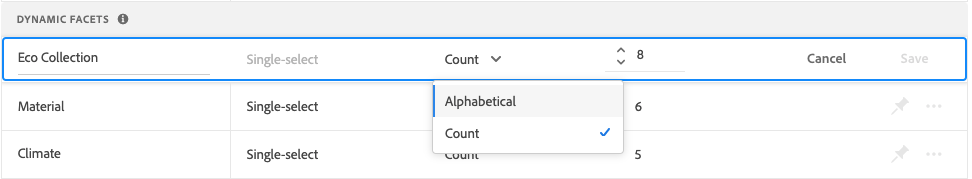

# Facetten verwalten

Folgen Sie diesen Anweisungen, um die Eigenschaften vorhandener Facetten zu aktualisieren oder ihre Darstellung in der Storefront zu ändern.

## Konfigurieren von Preisfacettengruppierungen

Informationen zum Konfigurieren von [ und Gruppierungen finden ](settings.md) unter „Einstellungen“.

## Facette bearbeiten

1. Suchen Sie die Facette, die Sie bearbeiten möchten.
1. Wenn die Liste viele Facetten enthält, setzen Sie *Filtern nach* auf eine der folgenden Optionen:

   * angeheftet
   * Dynamisch

   Weitere Informationen finden Sie unter [Facettenarten](facets-type.md).

   

1. Um die Facetteneigenschaften zu bearbeiten, klicken Sie auf **Optionen** Mehr…).
1. Klicken Sie auf **Bearbeiten**

   

1. Führen Sie einen der folgenden Schritte aus, um die Facettenbeschriftung zu bearbeiten:

   * Bearbeiten Sie für eine [!DNL Commerce] Storefront die [Attributbezeichnung](https://experienceleague.adobe.com/docs/commerce-admin/catalog/product-attributes/product-attributes.html?lang=de).
   * Klicken Sie bei einer Headless-Implementierung auf den Wert in der ersten Spalte und bearbeiten Sie den Text nach Bedarf.

   

1. (Nur Headless) Um die Methode zum Sortieren von Facettenwerten zu ändern, klicken Sie auf den Wert in der Spalte *Sortiertyp* und wählen Sie eine der folgenden Optionen aus:

   * Alphabetisch
   * Count

   

1. Legen Sie in **Spalte &quot;** Wert“ die maximale Anzahl (von 0 bis 10) der Facettenfilterwerte fest, die in der Storefront angezeigt werden sollen.
1. Klicken Sie abschließend auf **Speichern**.

   Ihre Änderungen werden erst nach ihrer Veröffentlichung in der Storefront angezeigt.

## Facette anheften/lösen

Die Nadel ändert ihre Farbe, wenn Sie darauf klicken, und wird verwendet, um die Facette entweder in den Abschnitt *Angeheftete Facetten* oder in den Abschnitt *Dynamische Facetten* zu verschieben.

1. Um eine Facette an den Anfang der Liste *Filter* zu setzen, suchen Sie die Facette in der Liste *Dynamische Facetten* und klicken Sie auf den grauen Pin ().

   Die Nadel wird blau und die Facette wird in den Abschnitt *Facetten*.

1. Um eine Facette zu lösen, suchen Sie die Facette in der Liste *Facetten angeheftet* und klicken Sie auf die blaue Nadel ().

   Der Stift wird grau und die Facette wird in den Abschnitt *Dynamische Facetten* verschoben.

   

>[!NOTE]
>
>Die fixierte Facettenreihenfolge kann inkonsistent sein, wenn zwei Beschriftungen mit demselben Namen vorhanden sind.

## Fixierte Facette verschieben

>[!NOTE]
>
>Die Sortierung angehefteter Facetten wird nur in Headless-Implementierungen unterstützt. Wenn geordnete Facetten benötigt werden, verwenden Sie das [!DNL Live Search] PLP-Widget.

Die Reihenfolge der fixierten Facetten kann geändert werden, indem die Zeile an eine andere Position verschoben wird. Angeheftete Facetten haben ein *Verschieben*-Symbol () am Anfang der Zeile. Im Gegensatz zu fixierten Facetten können dynamische Facetten nicht verschoben werden.

1. Suchen Sie die Facette *Abschnitt „Angeheftete*&quot; der Liste.
1. Ziehen Sie die **mithilfe des Symbols** Verschieben an eine neue Position im Abschnitt *Fixierte Facetten*.

   Nachdem die Änderungen veröffentlicht wurden, werden die neu angeordneten Facetten in der Liste Storefront *Filter* angezeigt.

## Facette löschen

1. Suchen Sie die Facette in der Liste und klicken Sie auf **Mehr** (…) Optionen.
1. Klicken Sie **Löschen**.
1. Wenn Sie zum Bestätigen aufgefordert werden, klicken Sie auf **Facette löschen**.
Die Facette wird aus der Storefront entfernt, nachdem die Änderungen veröffentlicht wurden.

## Änderungen veröffentlichen

1. Um die Storefront mit Ihren Änderungen zu aktualisieren, klicken Sie auf **Änderungen veröffentlichen**.
1. Warten Sie etwa 15 Minuten, bis die Aktualisierungen in Ihrem Store angezeigt werden.
