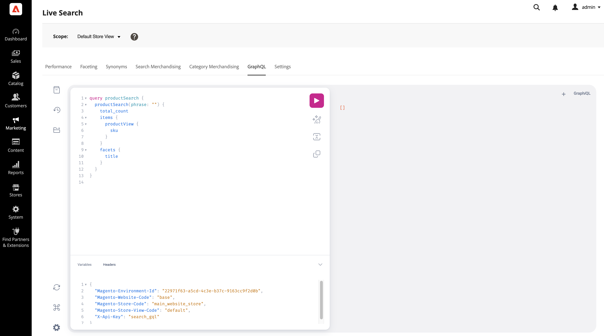

# GraphQL

Der Arbeitsbereich *GraphQL* ermöglicht es Admins, GraphQL-Abfragen mit ihren eigenen Daten zu erstellen und zu testen.

Dieser Arbeitsbereich unterstützt die [`productSearch`](https://developer.adobe.com/commerce/webapi/graphql/schema/live-search/queries/product-search/) und [`attributeMetadata`](https://developer.adobe.com/commerce/webapi/graphql/schema/live-search/queries/attribute-metadata/) Abfragen.



```graphql
query productSearch {
  productSearch(phrase: "") {
    total_count
    items {
      productView {
        sku
      }
    }
    facets {
      title
    }
  }
}
```

Variablen:

```json
{
  "Magento-Environment-Id": "xxxxxxxx-xxxx-xxxx-xxxx-xxxxxxxxxxxx",
  "Magento-Website-Code": "base",
  "Magento-Store-Code": "base",
  "Magento-Store-View-Code": "default",
  "X-Api-Key": "search_gql"
}
```
