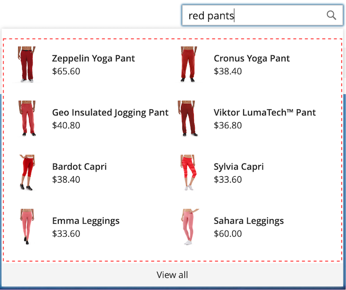

# [!DNL Storefront Popover]

Wenn [!DNL Live Search] [installiert](install.md) wird, wird eine [!DNL popover] in der Storefront angezeigt, wenn Käufer in das Feld [Suche](https://experienceleague.adobe.com/docs/commerce-admin/catalog/catalog/search/search.html?lang=de#quick-search) eingeben. Mit jedem eingegebenen Zeichen wird die [!DNL popover] mit vorgeschlagenen Produkten und Miniaturbildern der wichtigsten Suchergebnisse aktualisiert.

[!DNL Live Search] gibt Ergebnisse für eine Abfrage mit mindestens zwei Zeichen zurück. Bei einer Teilübereinstimmung beträgt die maximale Anzahl von Zeichen pro Wort 20. Die Anzahl der Zeichen in einer Abfrage vom Typ „Suche während der Eingabe“ ist nicht konfigurierbar.

![[!DNL Live Search popover]](assets/storefront-search-as-you-type.png)

>[!TIP]
>
>Im Artikel „Einrichten der Live-Suche“ erfahren [, wie Sie Produktattribute &#x200B;](workspace.md) durchsuchbar festlegen.

## [!DNL Popover] Seitengröße

Die Seitengröße der [!DNL popover] bestimmt, wie viele Zeilen von automatisch vervollständigten Produkten zurückgegeben werden können. Während der Live Search-Installation ändert sich der `page_size`-Wert in den aktuellen Wert der Einstellung [Katalogsuche](https://experienceleague.adobe.com/docs/commerce-admin/config/catalog/catalog.html?lang=de) - `Autocomplete Limit`.

Standardmäßig ist der Grenzwert für Katalogsuche - automatische Vervollständigung auf acht Zeilen (oder Zeilen) festgelegt. Gehen Sie wie folgt vor, um die Seitengröße der [!DNL popover] zu ändern:

1. Navigieren Sie in *Admin*-Seitenleiste zu **Stores** > Einstellungen > **Konfiguration**.
1. Erweitern Sie im linken Bereich **Katalog** und wählen Sie **Katalog** aus der Liste der Einstellungen aus.
1. Erweitern Sie den Abschnitt *Katalogsuche*.
1. Legen Sie **Grenzwert für die automatische Vervollständigung** auf die Anzahl der Zeilen fest, die Sie im [!DNL popover] zulassen möchten.
1. Klicken Sie abschließend auf **Konfiguration speichern**.

## Beispiel [!DNL Popover] Formatierung

Sie können das Erscheinungsbild des [!DNL Popover] Widgets an die Stil- und Branding-Richtlinien Ihres Unternehmens anpassen.

Die [!DNL storefront popover] zeigt immer die `name` und `price` an, und die Auswahl der Felder ist nicht konfigurierbar. [!DNL popover] können jedoch mithilfe von CSS-Klassen [&#x200B; werden](https://developer.adobe.com/commerce/frontend-core/guide/css/). Beispielsweise ändern die folgenden Deklarationen die Hintergrundfarbe des [!DNL popover]-Containers und der Fußzeile.

```css
.livesearch.popover-container {
    background-color: lavender;
}

.livesearch.view-all-footer {
    background-color: magenta;
}
```

## Container-Sichtbarkeit

Die übergeordnete Komponente des `.livesearch.popover-container` ist `.search-autocomplete`.  Die `.active`-Klasse gibt die Sichtbarkeit des Containers an. Die `.active`-Klasse wird bedingt hinzugefügt, wenn die [!DNL popover] geöffnet ist.

```css
.search-autocomplete.active   /* visible */
.search-autocomplete          /* not visible */
```

Weitere Informationen zum Formatieren von Storefront-Elementen finden Sie unter [Cascading Style Sheets (CSS)](https://developer.adobe.com/commerce/frontend-core/guide/css/) im [Frontend-Entwicklerhandbuch](https://developer.adobe.com/commerce/frontend-core/guide/).

## Klassenselektoren

Sie können die folgenden Klassenselektoren verwenden, um den Container und die Produktelemente im [!DNL popover] zu formatieren.

- `.livesearch.popover-container`
- `.livesearch.view-all-footer`
- `.livesearch.products-container`
- `.livesearch.product-result`
- `.livesearch.product-name`
- `.livesearch.product-price`

### Container-Klassenselektoren

#### .LiveSearch.Popover-Container

![[!DNL Popover] Container](assets/livesearch-popover-container.png)

#### .livesearch.view-all-footer


### Produktklassenselektoren

#### .LiveSearch.products-container



#### .LiveSearch.product-result


#### .livesearch.product-name


#### .livesearch.product-price


#### .LiveSearch-Produkt-Link


## Arbeiten mit einem geänderten Design {#working-with-modified-theme}

Sie können die [!DNL storefront popover] mit einem benutzerdefinierten [Design“ verwenden](https://developer.adobe.com/commerce/frontend-core/guide/themes/) das die erforderlichen Dateien von (*)*. Der `top.search` Block im `header-wrapper` des `Magento_Search` darf nicht geändert werden.

```html
<referenceContainer name="header-wrapper">
   <block class="Magento\Framework\View\Element\Template" name="top.search" as="topSearch" template="Magento_Search::form.mini.phtml">
      <arguments>
         <argument name="configProvider" xsi:type="object">Magento\Search\ViewModel\ConfigProvider</argument>
      </arguments>
   </block>
</referenceContainer>
```

## Deaktivieren der [!DNL popover]

Um die [!DNL popover] zu deaktivieren und die standardmäßige [Schnellsuche“ wiederherzustellen](https://experienceleague.adobe.com/docs/commerce-admin/catalog/catalog/search/search.html?lang=de#quick-search) geben Sie den folgenden Befehl ein:

```bash
bin/magento module:disable Magento_LiveSearchStorefrontPopover
```

## Headless-Implementierung

Für Benutzer mit Headless-Implementierungen können Sie das [!DNL Live Search popover] mit einem npm[Paket &#x200B;](https://www.npmjs.com/package/@magento/ds-livesearch-storefront-utils).
