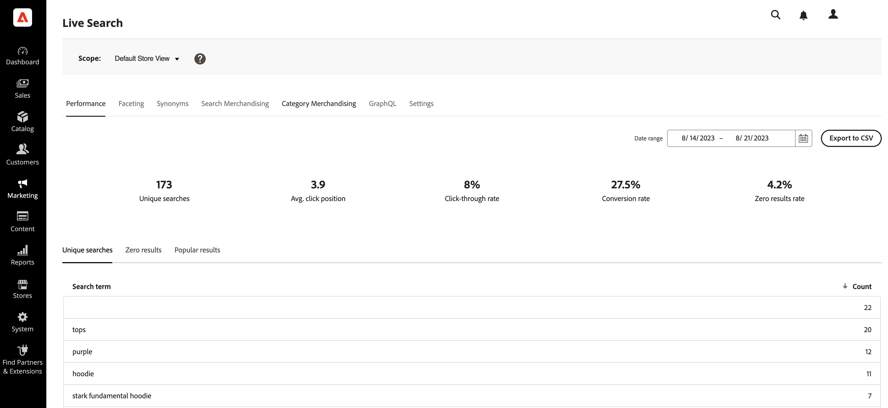

# Einrichten der Live-Suche

Im Arbeitsbereich können Sie die Leistung von [!DNL Live Search] konfigurieren, verwalten und überwachen. Das Menü oben bietet Zugriff auf die Werkzeuge in jedem Funktionsbereich. Die verfügbaren Funktionen spiegeln die aktuelle Menüauswahl wider.

## Datenerfassung

Um sicherzustellen, dass jeder Funktionsbereich im Arbeitsbereich die richtigen Daten enthält, müssen Sie die Datenerfassung basierend auf der ausgewählten Storefront-Implementierung konfigurieren:

1. Luma - Die Datenerfassung ist vorkonfiguriert verfügbar.
1. Headless - Die Datenerfassung muss je nach Storefront-Implementierung manuell konfiguriert werden.

Wenn Sie eine Headless-Storefront verwenden, finden Sie in der folgenden Dokumentation weitere Informationen zu den erforderlichen Ereignissen, die Sie hinzufügen müssen:

- [Erforderliche Ereignisse](events.md) für das Dashboard der Live-Suche.
- [Storefront Events Collector](https://developer.adobe.com/commerce/services/shared-services/storefront-events/collector/), der als Voraussetzung hinzugefügt werden muss.
- [Beispiele](https://github.com/adobe/commerce-events/tree/main/examples) der Ereignisstruktur.

### Healthcare-Kunden

Wenn Sie Kundschaft im Gesundheitswesen sind und die [Data Services HIPAA-Erweiterung](../data-connection/hipaa-readiness.md#installation) installiert haben, die Teil der [Data Connection](../data-connection/overview.md)-Erweiterung ist, werden von [!DNL Live Search] verwendete Storefront-Ereignisdaten nicht mehr erfasst. Dies liegt daran, dass Storefront-Ereignisdaten Client-seitig generiert werden. Um weiterhin Storefront-Ereignisdaten zu erfassen und zu senden, aktivieren Sie die Ereigniserfassung für [!DNL Live Search] erneut. Weitere Informationen finden [ unter ](https://experienceleague.adobe.com/de/docs/commerce-admin/config/general/general#data-services)Allgemeine Konfiguration“.

## Festlegen des Umfangs

Anfangs ist [Umfang](https://experienceleague.adobe.com/docs/commerce-admin/start/setup/websites-stores-views.html?lang=de#scope-settings) aller [!DNL Live Search] auf `Default Store View` festgelegt. Wenn Ihre [!DNL Commerce] mehrere Store-Ansichten enthält, legen Sie **Umfang** auf die [Store-Ansicht](https://experienceleague.adobe.com/docs/commerce-admin/start/setup/websites-stores-views.html?lang=de) fest, für die Ihre Facetteneinstellungen gelten.

## Menüoptionen

| Option | Beschreibung |
|--- |--- |
| [Leistung](performance.md) | Dashboard bietet Einblicke in die Leistung der Produktsuche. |
| [facettiert](facets.md) | Leistungsstarke Filterung, die mehrere Dimensionen von Attributwerten verwendet, um Suchkriterien zu verfeinern. |
| [Synonyme](synonyms.md) | Erweitern Sie die Reichweite der Suche, um Wörter einzuschließen, die Kunden möglicherweise verwenden, um Produkte zu finden, die sich von denen in Ihrem Katalog unterscheiden. |
| [Merchandising suchen](rules.md) | Gestalten Sie das Sucherlebnis mit logischen Regeln, die den Trigger geplanter Aktionen festlegen. Produkte optimieren, vergraben, anheften oder ausblenden, um Suchergebnisse zu kalibrieren und so Ihre Geschäftsziele zu unterstützen. |
| [Kategorie Merchandising](category-merch.md) | Wenden Sie Regeln und intelligentes Merchandising auf Kategorieebene an. |
| [GraphQL](graphql.md) | Entwickler, die beim Administrator Ihres Stores angemeldet sind, können Abfragen mit tatsächlichen Katalogdaten erstellen und testen. Weitere Informationen finden Sie unter [Übersicht über GraphQL](https://developer.adobe.com/commerce/services/graphql/live-search/) in der [!DNL Live Search] Entwicklerdokumentation. |
| [Einstellungen](settings.md) | Ermitteln Sie, wie die Facettenwerte des Preises nach Preisbereich in der Storefront gruppiert werden, und legen Sie die Indizierungssprache fest. |

## Festlegen von Attributen als durchsuchbar

Um zielgerichtete Ergebnisse zu erzielen, überprüfen Sie den Satz [ (durchsuchbaren](https://experienceleague.adobe.com/docs/commerce-admin/catalog/product-attributes/product-attributes.html?lang=de) (`searchable=true`) Produktattribute. Um Relevanz zu gewährleisten, sollten Attribute nur durchsuchbar sein, wenn sie Inhalte mit einer klaren und knappen Bedeutung enthalten. Vermeiden Sie die Verwendung von Attributen, die weniger präzisen, langen Text enthalten, z. B. `description`. Dies kann, obwohl standardmäßig die Suche aktiviert ist, die Genauigkeit der Suchergebnisse verringern. Wenn eine Person beispielsweise nach „kurzen Hosen“ sucht und es Hemden mit einer Beschreibung gibt, die den Begriff „kurze Ärmel“ enthält, werden die Hemden in die Suchergebnisse aufgenommen.

Führen Sie die folgenden Schritte aus, damit Attribute durchsuchbar sein können:

1. Gehen Sie in der Admin zu **Stores** > *Attribut* > **Produkt**.
1. Wählen Sie das Attribut aus, das durchsuchbar sein soll, z. B. `color`.
1. Wählen Sie **Storefront-Eigenschaften** aus und setzen **In der Suche verwenden** auf `yes`.

   

[!DNL Live Search] berücksichtigt auch die [Gewichtung](https://experienceleague.adobe.com/docs/commerce-admin/catalog/catalog/search/search-results.html?lang=de#weighted-search) eines Produktattributs, wie in Adobe Commerce festgelegt. Attribute mit einer höheren Gewichtung werden in den Suchergebnissen höher angezeigt.

Die folgenden Attribute sind immer durchsuchbar:

- `sku`
- `name`
- `categories`

[Facetten](facets.md) sind Produktattribute, die in definiert sind, [!DNL Live Search] filterbar zu sein. Sie können jedes filterbare Attribut als Facette in [!DNL Live Search] festlegen, aber es gibt [Beschränkungen](boundaries-limits.md) nach wie vielen Facetten Sie gleichzeitig suchen können.

[Synonyme](synonyms.md) sind Begriffe, die Sie definieren können, um Benutzende zum richtigen Produkt zu führen. Benutzer, die nach Hosen suchen, geben möglicherweise „Hosen“ oder „Hosen“ ein. Sie können Synonyme so einstellen, dass diese Suchbegriffe die Benutzer zu den „Hosen“-Ergebnissen führen.

## Commerce-Konfigurationseinstellungen

Im folgenden Abschnitt werden die unterstützten und nicht unterstützten Commerce-Konfigurationseinstellungen für [!DNL Live Search] beschrieben.

### Unterstützte Konfigurationswerte

>[!IMPORTANT]
>
>Es wird dringend empfohlen, die Widgets zur Produktauflistung zu verwenden, die in Live Search 4.0.0 standardmäßig aktiviert sind. Die Widgets sollen die Adapterimplementierung in zukünftigen Versionen vollständig ersetzen. Weitere [ finden Sie unter ](install.md#enable-product-listing-widgets) für die Produktliste aktivieren .

| Commerce-Konfigurationseinstellung | Beschreibung | Unterstützt von Popover | Unterstützt durch Adapter |
|---|---|---|---|
| Stores > Konfiguration > Katalog > Katalog > Katalogsuche > Alle Produkte pro Seite zulassen | Ist hierfür `Yes` festgelegt, wird die Option `ALL` in das Steuerelement „Pro Seite anzeigen“ einbezogen. | Ja. Max. 500 Produkte | Ja. Max. 500 Produkte |
| Stores > Konfiguration > Katalog > Katalog > Katalogsuche > Minimale Abfragelänge | Die bei einer Katalogsuche zulässige Mindestanzahl von Zeichen. | Ja | Ja |
| Stores > Konfiguration > Katalog > Katalog > Katalogsuche > Produkte pro Seite für zulässige Rasterwerte | Bestimmt die Anzahl der in der Rasteransicht angezeigten Produkte. | Ja | Ja |
| Stores > Konfiguration > Katalog > Katalog > Katalogsuche > Produkte pro Seite im Raster Standardwert | Bestimmt die Anzahl der Produkte, die standardmäßig in der Rasteransicht pro Seite angezeigt werden. | Ja. Max. 500 Produkte | Ja. Max. 500 Produkte |
| Stores > Konfiguration > Katalog > Inventar > Nicht vorrätige Produkte anzeigen | Zeigt nicht vorrätige Produkte an. | Ja | Ja |
| Stores > Konfiguration > Währung > Standardanzeigewährung | Die primäre Währung zur Anzeige von Preisen. | Ja | Ja |
| Filialen > Konfiguration > Allgemein > Währungseinstellungen > Währungsoptionen > Basiswährung | Die primäre Währung, die für alle Online-Zahlungsvorgänge verwendet wird. | Ja | Ja |

Die Preise auf der Widget-Produktlistenseite und im Pop-up werden mithilfe der konfigurierten Währungskurse in die standardmäßige Anzeigewährung umgerechnet.

### Nicht unterstützte Konfigurationswerte

| Commerce-Konfigurationseinstellung | Beschreibung | Notizen |
|---|---|---|
| Stores > Konfiguration > Katalog > Storefront > Listenmodus | Bestimmt das Format der Suchergebnisliste. | Wird korrekt dargestellt, bei einigen Seiteninteraktionen werden jedoch keine Ereignisse gesendet |
| Stores > Konfiguration > Katalog > Katalog > Katalogsuche > Maximale Abfragelänge | Die maximale Anzahl von Zeichen, die bei einer Katalogsuche zulässig ist. | Nicht implementiert; Search Services akzeptiert bis zu 255 Zeichen |
| Konfiguration > Verkauf > Steuer > Preisanzeigeeinstellungen > Produktpreise im Katalog anzeigen | Bestimmt, ob im Katalog veröffentlichte Produktpreise Steuern enthalten oder ausschließen oder zwei Versionen des Preises anzeigen, eine mit und die andere ohne Steuer |  |
| Stores > Konfiguration > Katalog > Storefront > Produktliste Sortieren nach | Bestimmt die Sortierreihenfolge der Suchergebnisliste. | Gilt nicht für das [!DNL Live Search] [Produktlistenseite-Widget](plp-styling.md) |

### Suchbegriffe

[!DNL Live Search] unterstützt [Suchbegriff-](https://experienceleague.adobe.com/docs/commerce-admin/catalog/catalog/search/search-terms.html?lang=de)) für Implementierungen, bei denen Adobe Commerce das Routing übernimmt, wie z. B. auf Luma und anderen PHP-basierten Designs.
