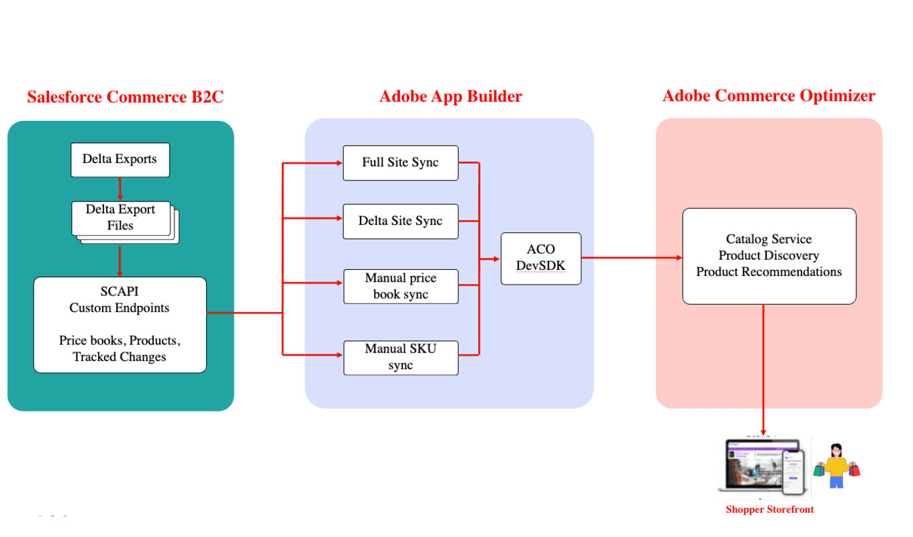

# Salesforce Commerce Connector für Adobe Commerce Optimizer

Die auf der Adobe App Builder-Technologie aufbauende [!DNL Commerce Optimizer Salesforce Commerce Connector] ermöglicht die nahtlose Übertragung und Verwaltung von Katalogdaten von Salesforce Commerce Cloud B2C zu [!DNL Adobe Commerce Optimizer]. Es verbindet beide Plattformen und sorgt dafür, dass Produktinformationen, Preise und Updates ohne erneute Plattform synchron bleiben.

Standardmäßig bietet der Connector zuverlässige Datensynchronisierungsfunktionen und die Flexibilität, Workflows an Ihre Geschäftsanforderungen anzupassen.

Eine vollständige Video-Tutorial-Reihe finden Sie unter [Informationen zum Salesforce Commerce Cloud Starter Kit](https://experienceleague.adobe.com/de/docs/commerce-learn/tutorials/adobe-commerce-optimizer/sfcc-starter-kit/overview).

## Wichtigste Funktionen

* **Synchronisierung von Katalogdaten:** Übertragen Sie Produktdaten - einschließlich Varianten, Preisbüchern und Strukturen - von Salesforce Commerce B2C in Adobe Commerce Optimizer, um Storefronts und erlebnisgesteuerte Anwendungen auf dem neuesten Stand zu halten.
* **Preissynchronisierung:** Importieren und verwalten Sie Preisdaten direkt aus Salesforce Commerce B2C.
* **Unterstützt mehrere Datentypen:**, Preise und Katalogstrukturen, um komplexe Merchandising-Konfigurationen widerzuspiegeln.

* **Flexible Synchronisations-Workflows**
   * **Geplante Synchronisationen:** Automatisieren von Aktualisierungen mithilfe der Cron-Auftragsplanung, kein manueller Aufwand erforderlich.
   * **On-Demand-Updates:** Sofortiger Trigger von Aktualisierungen auf SKU-Ebene für dringende Änderungen, Korrekturen oder Produkteinführungen.

* **Für Erweiterbarkeit entwickelt**
   * Verwendet benutzerdefinierte [Salesforce Commerce B2C API](https://developer.salesforce.com/docs/commerce/commerce-api/guide/get-started.html) (SCAPI)-Endpunkte für die Kompatibilität und einfache Anpassung an individuelle oder erweiterte Anwendungsfälle.
   * Skalierbar durch Katalog- und Preissynchronisierung und anschließende Erweiterung der Workflows zur Unterstützung zusätzlicher Integrationen oder Business-Logik.
   * Konfigurieren und Entwickeln von Workflows, ohne die Kernintegrationen neu zu erstellen.

>[!NOTE]
>
>Der Connector wurde speziell für Salesforce Commerce Cloud B2C entwickelt. Salesforce B2B- oder D2C-Produkte, die auf verschiedenen Technologie-Stacks basieren, werden nicht unterstützt.

## Wer profitiert vom Salesforce Connector?

Die [!DNL Salesforce Commerce Connector] ist ideal für:

* **Bestehende Salesforce Commerce Cloud B2C-Kunden** Erweiterung der Storefront-Funktionen
* **Unternehmen mit mehreren Marken** die erweiterte Merchandising- und Personalisierungsfunktionen für mehrere Storefronts benötigen
* **Unternehmen, die Leistungsverbesserungen wünschen** mithilfe von Adobe Edge Delivery Services für schnellere Storefront-Erlebnisse
* **Unternehmen mit komplexen Preisstrukturen** Synchronisieren ausgefeilter Preisbücher und gebietsschemaspezifischer Preisgestaltung
* **AEM-Kunden** Verwalten von Produktkatalogen über Salesforce Commerce B2C bei Verwendung der Adobe Commerce-Storefront mit Edge Delivery Services
* **Einzelhändler mit Anforderungen für mehrere Gebietsschemata** Synchronisieren lokalisierter Produktinformationen über Märkte und Sprachen hinweg

## Anwendungsfälle

Der Connector unterstützt mehrere wichtige Anwendungsfälle:

### Katalogdatenerfassung und Storefront-Anzeige

Dieser primäre Anwendungsfall zeigt den vollständigen Datenfluss von Salesforce Commerce B2C zur Adobe Commerce-Storefront:

1. **Erste Katalogaufnahme:** Laden Sie den gesamten Salesforce Commerce-Katalog zusammen, einschließlich einfacher Produkte mit Varianten, Preislisten und Preisinformationen.
1. **Automatisierte Delta-Updates:** Automatisches Synchronisieren von Produktaktualisierungen von der Salesforce Commerce-Katalogverwaltungs-Benutzeroberfläche mit [!DNL Commerce Optimizer].
1. **Storefront-Integration:** Anzeigen synchronisierter Katalogdaten in Ihrer Adobe Commerce Edge Delivery Service-Storefront mithilfe [!DNL Commerce Optimizer] Storefront-APIs.
1. **Echtzeit-Updates:** Zeigen Sie aktualisierte Produktinformationen (Namen, Preise, Beschreibungen) sofort in Ihrer Storefront an, nachdem Sie Änderungen in Salesforce vorgenommen haben.

### Produkt-Management für mehrere Gebietsschemata

Nutzung der B2C-Lokalisierungsfunktionen von Salesforce Commerce:

* Synchronisieren Sie lokalisierte Versionen von Produkttextfeldern (Namen, Beschreibungen) aus Salesforce Commerce B2C für verschiedene Gebietsschemata.
* Ordnen Sie Salesforce-Gebietsschemakonzepte 1:1 den [!DNL Commerce Optimizer] Gebietsschemata zu.
* Unterstützung mehrerer Produktaufnahmezyklen für verschiedene Lokalisierungen.
* Konsistenz über globale Produktkataloge hinweg gewährleisten.

## Architektur und Komponenten

Die [!DNL SFCC Connector] bietet eine robuste Integrationsebene zwischen einer Salesforce Commerce B2C-Instanz und [!DNL Commerce Optimizer]. Der Connector funktioniert über eine Reihe von Synchronisierungsaktionen, die Katalogdaten, Preisverzeichnisse und Produktinformationen übertragen.

1. **Datenextraktion** - Authentifizierung bei Ihrer Salesforce Commerce B2C-Instanz und Extrahieren von Katalogdaten mithilfe benutzerdefinierter SCAPI-APIs.
1. **Datenumwandlung** - Transformiert Produktdaten, um sie an das [!DNL Commerce Optimizer] Datenmodell und die Schemaanforderungen anzupassen.
1. **Datenaufnahme** - Sichere Übertragung transformierter Daten an [!DNL Commerce Optimizer] mit dem ACO TypeScript SDK.
1. **Storefront-Integration** - Synchronisierte Daten werden über [!DNL Commerce Optimizer] APIs für Storefront-Erlebnisse verfügbar.

Das folgende Diagramm zeigt den allgemeinen Datenfluss für die Integration:

{zoomable="yes"}

### Schlüsselkomponenten

Die [!DNL Commerce Optimizer SFCC Connector] besteht aus mehreren Schlüsselkomponenten:

* **ACO SFCC Starter Kit App Builder application**-Stellt Server-lose Funktionen bereit, die die Datensynchronisation zwischen SFCC und Adobe Commerce Optimizer handhaben.
* **Benutzerdefinierte SFCC-Patrone** - Erforderliche Patrone, die Ihre Salesforce Commerce Cloud-Instanz um APIs erweitert, die für die Datenextraktion benötigt werden.
* **Verwaltungs-Benutzeroberfläche** - Web-Schnittstelle zur Überwachung des Synchronisierungsstatus und zur Verwaltung von Connector-Vorgängen.

### Synchronisierungsprozess

Der Connector unterstützt mehrere Synchronisierungsmodi.

| Sync-Modus | Beschreibung |
|-----------|-------------|
| **Vollständige Site-Synchronisierung** | Führt eine umfassende Synchronisierung aller Produkte, Preisbücher und Preise für Ihre konfigurierte Salesforce Commerce Cloud-Site und Ihre konfigurierten Gebietsschemata durch. Dazu gehören <ul><li>Produktmetadaten und Attribute</li><li>Katalogstruktur und -kategorien</li><li>Preisbücher</li><li>Preisinformationen</li><li>Produktdaten für mehrere Gebietsschemata</li></ul> |
| **Delta-Synchronisation** | Ruft nur Änderungen ab, die seit der letzten Synchronisierung in den Produkt- und Preisdaten von Salesforce vorgenommen wurden, und synchronisiert diese, um effiziente und zeitnahe Aktualisierungen zu gewährleisten. Delta-Synchronisierung wird automatisch auf geplanter Basis ausgeführt (Standard: stündlich), um die Datenfrische zu erhalten. |
| **Gezielte Synchronisierungsoptionen** | Bietet granulare Synchronisierungsfunktionen: <ul><li>**Preisbuch synchronisieren** synchronisiert nur Preisbuchinformationen</li><li>**Metadatensynchronisierung** aktualisiert Produktmetadaten und Attributdefinitionen</li><li>**Spezifische Produktsynchronisierung** synchronisiert einzelne Produkte nach SKU</li></ul> |

## Wichtige Überlegungen

Beachten Sie bei der Planung Ihrer Implementierung die folgenden Schlüsselfaktoren:

### Datenzuordnung und Attribute

* **Durchsuchbare Attribute:** Salesforce Commerce B2C legt durchsuchbare Attribute über die Benutzeroberfläche fest, die von der API nicht verfügbar gemacht werden. Verwenden Sie den [[!DNL Catalog Data Ingestion metadata APIs]](https://developer.adobe.com/commerce/services/optimizer/data-ingestion/#metadata), um diese durchsuchbaren Attribute in Adobe Commerce Optimizer manuell zu konfigurieren.
* **Attributzuordnung:** Planen Sie die Zuordnung von Salesforce Commerce B2C-Produktattributen zu [!DNL Commerce Optimizer] Metadaten basierend auf Ihren Geschäftsanforderungen.
* **Durchsuchbare Standardfelder:** Der Connector macht Kernattribute (`name`, `description`, `ID`) standardmäßig durchsuchbar.

### Sync Scope

* **Site-Auswahl:** Salesforce Commerce B2C verfügt über ein Konzept von Sites, an die Kataloge angehängt werden. Wählen Sie während der vollständigen Synchronisierung aus, welche Salesforce-Site synchronisiert werden soll.
* **Gebietsschema-Verwaltung:** Jedes Salesforce Commerce-Gebietsschema führt in [!DNL Commerce Optimizer] zu einem separaten Produktaufnahmezyklus.
* **Datenvolumen:** Sie bei der Planung der Implementierung die Kataloggröße und die Synchronisierungshäufigkeit.

## Überwachung und Verwaltung

Nach der Installation und Konfiguration bietet die [!DNL Commerce Optimizer SFCC Connector] umfassende Überwachungs- und Verwaltungsfunktionen von der [!DNL SFCC to ACO Sync Panel]:

{width="700" zoomable="yes"}

Die URL für diese Schnittstelle wird bereitgestellt, nachdem Sie die [!DNL Commerce Optimizer SFCC Connector Starter Kit] für das App Builder-Projekt bereitgestellt haben.

Zu den wichtigsten Funktionen gehören:

* **Synchronisierungsstatus-Tracking** Überwachen Sie den Status und die Zeitstempel aller Synchronisierungsvorgänge.
* **Connectivity Validation:** Testen von Verbindungen zu Salesforce Commerce Cloud und Adobe Commerce Optimizer.
* **Validierung von Produktdaten:** Überprüfen Sie, ob synchronisierte Produktdaten in der Storefront korrekt angezeigt werden.
* **Fehlerprotokollierung und Fehlerbehebung:** Fehlerprotokolle zur Fehlerbehebung können über die App Builder-CLI aufgerufen werden.
* **Statusverwaltung:** Verfolgen Sie den Synchronisierungsfortschritt und vermeiden Sie Konflikte mit der integrierten Statusverwaltung.

## Source-Code und Entwicklungsressourcen

Die [!DNL Commerce Optimizer SFCC Connector] ist Open-Source-basiert und kann angepasst werden. Zu den wichtigsten Repositorys gehören:

* **[ACO SFCC Starter Kit](https://github.com/adobe-commerce/aco-sfcc-starter-kit)** - Hauptkonnektoranwendung und Dokumentation.
* **[ACO SFCC Cartridges](https://github.com/adobe-commerce/aco-sfcc-cartridges)** - Erforderliche SFCC-Cartridge für die API-Integration.
* **[ACO TypeScript SDK](https://github.com/adobe-commerce/aco-ts-sdk)** - Integration von SDK für Adobe Commerce Optimizer.

Diese Repositorys bieten vollständigen Quell-Code, eine detaillierte Dokumentation und Beispiele für die Implementierung und Anpassung des Connectors.

## Nächste Schritte

Sind Sie bereit, Ihre Salesforce Commerce Cloud-Daten mit Adobe Commerce Optimizer zu integrieren? Lesen Sie zunächst das detaillierte Implementierungshandbuch im [ACO SFCC Starter Kit-Repository](https://github.com/adobe-commerce/aco-sfcc-starter-kit) und stellen Sie sicher, dass Sie über die erforderlichen Voraussetzungen verfügen.
