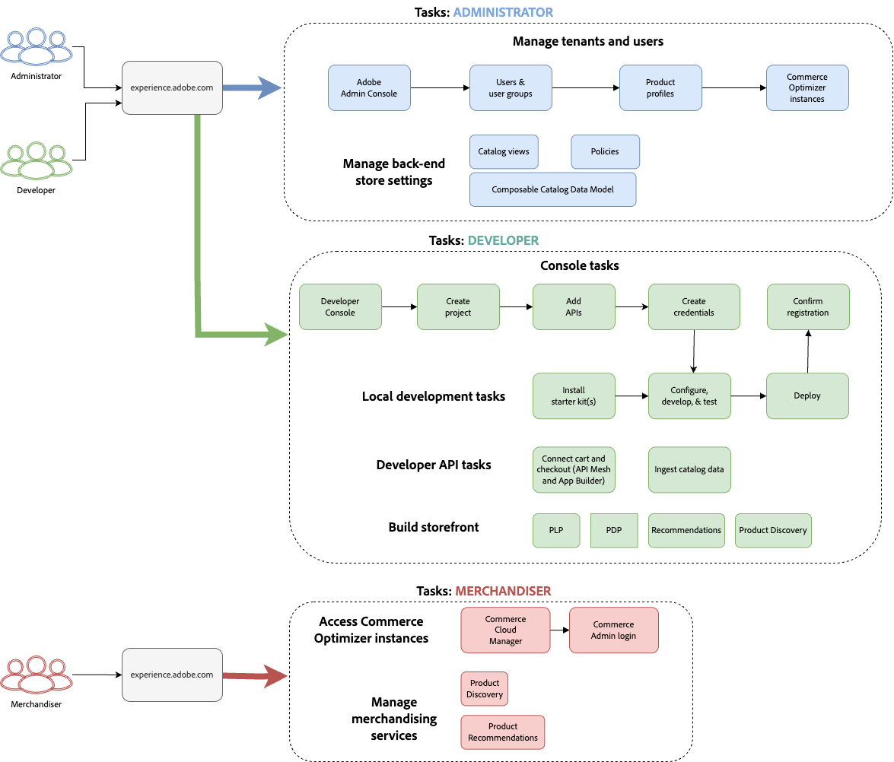
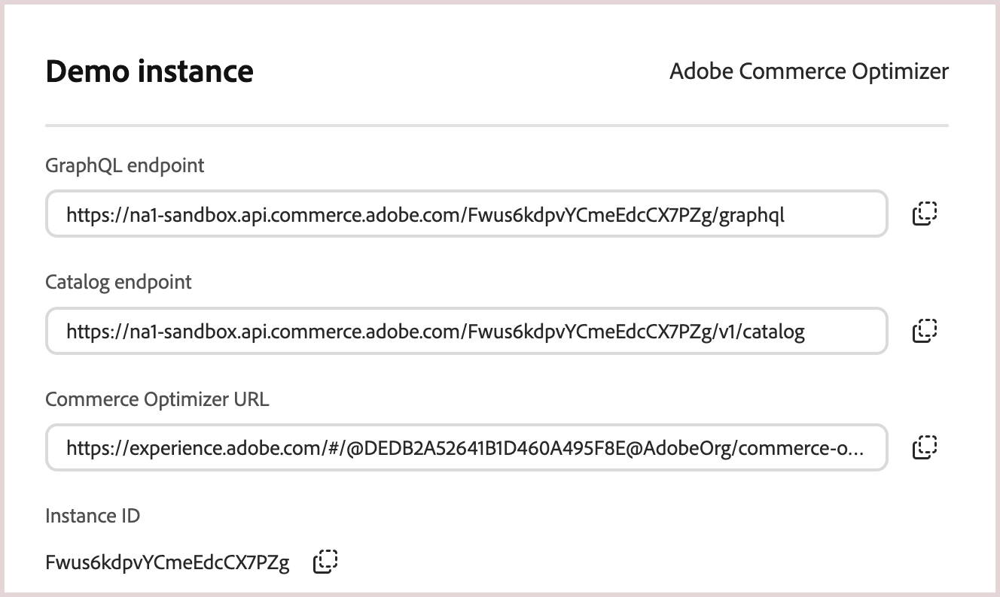

# Erste Schritte

Diese Anleitung führt Sie durch die Einrichtung von [!DNL Adobe Commerce Optimizer] von Anfang bis Ende. Dieses Handbuch deckt zwar alle Rollen ab, doch finden [ in der ](https://developer.adobe.com/commerce/services/optimizer/) für Entwickler detaillierte Informationen zu den jeweiligen Inhalten.

## Voraussetzungen

Bevor Sie beginnen, stellen Sie Folgendes sicher:

- **Adobe Experience Cloud-** mit [!DNL Adobe Commerce Optimizer] Berechtigungen
- **Organisations-Administratorzugriff** um Instanzen zu erstellen und Benutzer zu verwalten
- **GitHub-Konto** (zum Laden von Beispieldaten und für die Storefront-Entwicklung)
- **Grundlegendes** E-Commerce-Konzepte

## Schnellstartanleitung

Führen Sie die folgenden Schritte aus, um Ihre [!DNL Adobe Commerce Optimizer]-Umgebung zum Laufen zu bringen:

### Schritt 1. Instanz erstellen

1. Anmelden bei [Adobe Experience Cloud](https://experience.adobe.com/).
1. Navigieren Sie zu **Commerce** > **Commerce Cloud Manager**.
1. Klicken Sie **Instanz hinzufügen** > **Commerce Optimizer**.

   {width="60%" zoomable="yes"}

1. Instanzeinstellungen konfigurieren:
   - **Name**: Beschreibender Name (z. B. „Meine Unternehmens-Sandbox„)
   - **Beschreibung**: Kurze Beschreibung des Zwecks
   - **Region**: Wählen Sie Ihre bevorzugte Region aus
   - **Umgebungstyp**: Beginnen Sie zum Testen mit **Sandbox**-Umgebung

1. Klicken Sie **Instanz hinzufügen**.

   Die Cloud Manager wird aktualisiert und enthält jetzt auch Ihre neue Instanz. Weitere Informationen zum Zugriff und zur Verwaltung finden Sie unter [Verwalten einer Instanz](#manage-an-instance).

>[!NOTE]
>
>Sandbox-Instanzen sind auf die Region Nordamerika beschränkt. Sie können die Region nach der Erstellung nicht mehr ändern.

### Schritt 2. Einrichten der Umgebung

Nach dem Erstellen der Instanz:

1. [Instanz verwalten](#manage-an-instance) über Commerce Cloud Manager.
1. Richten Sie Katalogansichten und Richtlinien mithilfe des [Handbuchs für Katalogansichten](./setup/catalog-view.md) ein.
1. Konfigurieren Sie den Benutzerzugriff mithilfe des [Benutzerhandbuchs für die ](./user-management.md)&quot;

### Schritt 3. Beispieldaten hinzufügen (optional)

Zum Testen und Lernen folgen Sie den Anweisungen [Beispieldaten laden](#add-sample-data).

## Rollenbasierte Workflows

Die Einrichtung und Verwaltung von [!DNL Adobe Commerce Optimizer] beruht auf drei Schlüsselrollen. Jede Rolle hat bestimmte Aufgaben und Zuständigkeiten:

{zoomable="yes"}

### Administratoraufgaben

Administratoren verwalten Instanzen, Benutzer und Unternehmenseinstellungen.

| Aufgabe | Beschreibung | Link |
|---|---|---|
| **Benutzer verwalten** | Hinzufügen von Benutzern, Entwicklern und Administratoren | [Benutzerverwaltung](./user-management.md) |
| **Instanzen erstellen** | Einrichten von Sandbox- und Produktionsumgebungen | [Instanz erstellen](#create-an-instance) |
| **Zugriff konfigurieren** | Einrichten von Katalogansichten und Richtlinien | [Katalogansichten](./setup/catalog-view.md) |

### Entwickleraufgaben

Entwickler übernehmen die technische Implementierung und Datenintegration, einschließlich der Aufgaben der Plattformarchitektur.

| Aufgabe | Beschreibung | Link |
|---|---|---|
| **Zugriff auf Developer Console** | Erstellen von Projekten und Generieren von Anmeldeinformationen | [Developer Console](https://developer.adobe.com/developer-console/docs/guides/getting-started) |
| **Aufnehmen von Katalogdaten** | Importieren von Produktdaten aus vorhandenen Systemen | [Datenaufnahme-API](https://developer-stage.adobe.com/commerce/services/composable-catalog/data-ingestion/using-the-api/) |
| **Storefront einrichten** | Konfigurieren der Edge Delivery Services-Storefront | [Storefront-Setup](./storefront.md) |

### Merchandiser-Aufgaben

Merchandiser optimieren und personalisieren das Einkaufserlebnis durch Produkterkennung und Empfehlungen. Sie verwenden auch Kundendaten und Analysen, um strategische Entscheidungen über Produktplatzierung, Preise und Werbeaktionen in der Storefront zu treffen.

| Aufgabe | Beschreibung | Link |
|---|---|---|
| **Produkterkennung** | Konfigurieren von Suche und Filterung | [Merchandising - Übersicht](./merchandising/overview.md) |
| **Recommendations** | Einrichten von KI-gestützten Produktempfehlungen | [Produktempfehlungen](./merchandising/recommendations/overview.md) |
| **Leistungsverfolgung** | Überwachen von Erfolgsmetriken | [Erfolgsmetriken](./manage-results/success-metrics.md) |

## Instanz verwalten

1. Anmelden bei [Adobe Experience Cloud](https://experience.adobe.com/).

1. Öffnen Sie Commerce Cloud Manager:
   - Klicken **unter &quot;**&quot; auf **Commerce**.
   - Verfügbare Instanzen anzeigen.

1. Greifen Sie auf Ihre Instanz zu:

   Klicken Sie auf den Instanznamen, um die [!DNL Adobe Commerce Optimizer]-Anwendung zu öffnen.

1. Details der Instanz abrufen:
   - Klicken Sie auf das Informationssymbol neben Ihrem Instanznamen.
   - Beachten Sie den GraphQL-Endpunkt, den Catalog Service-Endpunkt für die Datenaufnahme und die Instanz-ID (auch als `tenant ID` bezeichnet).

   {width="60%" zoomable="yes"}

   Die Details zur Endpunkt- und Instanz-ID (Mandanten-ID) sind für die Integration mit Frontend-Anwendungen und Backend-Systemen erforderlich. Die URL für den Zugriff auf die [!DNL Adobe Commerce Optimizer]-Anwendung wird ebenfalls hier bereitgestellt.

   Nicht alle Adobe Commerce Optimizer-Benutzer haben Zugriff auf Cloud Manager und die Instanzdetails. Der Zugriff hängt von der Rolle und den Berechtigungen ab, die dem Benutzerkonto zugewiesen sind. Wenn Sie keinen Zugriff haben, wenden Sie sich an den Admin Ihrer Organisation, um die Details der Instanz zu erhalten.

1. Namen und Beschreibung der Instanz bearbeiten:
   - Klicken Sie auf **Bearbeiten**-Symbol neben einem Instanznamen.
   - Aktualisieren Sie den Namen und die Beschreibung nach Bedarf.
   - Klicken Sie **Speichern**.

   Sie können auch die Such- und Filteroptionen verwenden, um bestimmte Instanzen schnell zu finden.

## Beispieldaten hinzufügen

Adobe bietet ein GitHub-Repository mit Beispieldaten und Tools, mit denen Sie [!DNL Adobe Commerce Optimizer] Funktionen erlernen und testen können.
Die Beispieldaten basieren auf dem [Carvelo-Geschäftsszenario](./use-case/admin-use-case.md) und umfassen:

- Produktkatalog mit Kfz-Teilen
- Mehrere Preisbücher und Preisszenarien
- Katalogansichten und Richtlinien für verschiedene Händler
- Vollständige Beispiele für End-to-End-Workflow

**Beispieldaten laden:**

1. Zugriff auf das GitHub-Repository:
   - Besuchen Sie das [Beispielkatalog-Datenaufnahme-Repository](https://github.com/adobe-commerce/aco-sample-catalog-data-ingestion)
   - Befolgen Sie die Setup-Anweisungen in der README-Datei des Repositorys.

2. Ausführen der Aufnahme:
   - Verwenden Sie die bereitgestellten Skripte, um Beispieldaten in Ihre Adobe Commerce Optimizer-Staging-Umgebung zu laden.
   - Stellen Sie sicher, dass die Daten auf der Seite [Datensynchronisierung](./setup/data-sync.md) angezeigt werden.

3. Bereinigung (optional):

   Entfernen Sie die Beispieldaten mit dem `reset.js`-Skript aus dem Quell-Code des Beispiel-Daten-Laders.

## Nächste Schritte

Nach Abschluss der Einrichtung:

1. Einrichten der Storefront:
   - [Edge Delivery Services-Storefront konfigurieren](./storefront.md)
   - Herstellen einer Verbindung zu Ihren Katalogdaten

1. Erkunden Sie den Anwendungsfall Carvelo:
   - Befolgen Sie [End-to-End-Workflow](./use-case/admin-use-case.md)
   - Üben mit realen Szenarien

1. Merchandising konfigurieren:
   - Einrichten [Produkterkennung](./merchandising/overview.md)
   - Erstellen [Recommendations](./merchandising/recommendations/overview.md)

1. Überwachen der Leistung:
   - [Erfolgsmetriken](./manage-results/success-metrics.md)
   - Analysieren [Suchleistung](./manage-results/search-performance.md)

## Fehlerbehebung

### Häufige Probleme

| Problem | Lösung |
|---|---|
| **Instanz kann nicht erstellt werden** | Vergewissern Sie sich, dass Sie über [!DNL Adobe Commerce Optimizer] Berechtigungen und Administratorrechte verfügen. |
| **Instanz wird nicht angezeigt** | Überprüfen Sie Ihre Adobe IMS-Organisation und aktualisieren Sie die Seite. |
| **Zugriff auf Instanz nicht möglich** | Stellen Sie sicher, dass Sie als Benutzer in der Admin Console hinzugefügt werden. |
| **Beispieldaten werden nicht geladen** | Überprüfen Sie Ihre Instanzanmeldeinformationen und API-Endpunkte. |

### Hilfe erhalten

- **Entwicklerressourcen**: [Entwicklerdokumentation](https://developer-stage.adobe.com/commerce/services/composable-catalog/)
- **Storefront-Ressourcen**: [Dokumentation zur Commerce Storefront](https://experienceleague.adobe.com/developer/commerce/storefront/?lang=de)
- **Support**: [Adobe Commerce-Support-Ressourcen](https://experienceleague.adobe.com/de/docs/commerce-knowledge-base/kb/overview)
