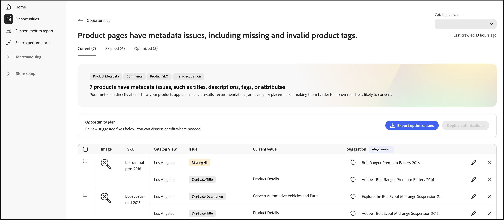
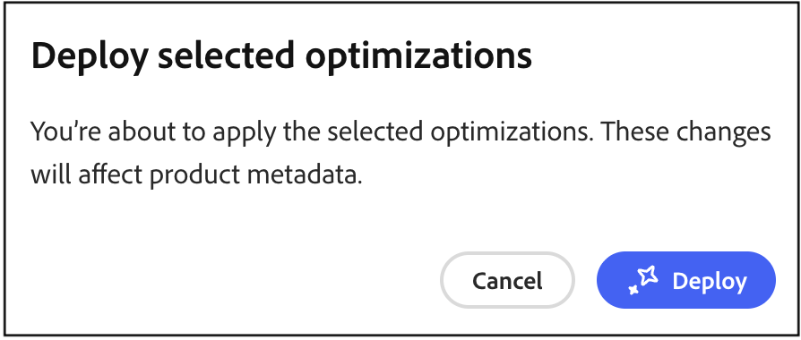

# Opportunities

Die **Opportunities** hilft Ihnen, Optimierungen zu identifizieren und zu implementieren, um den Site-Traffic, die Benutzerinteraktion und die Konversionsraten durch die Integration mit Adobe Sites Optimizer zu verbessern.

## Was sind Opportunities?

[Opportunities](https://experienceleague.adobe.com/en/docs/experience-manager-sites-optimizer/content/documentation/opportunities/overview) sind KI-gestützte Empfehlungen, die Merchandisern dabei helfen, Probleme zu identifizieren und zu beheben, die sich auf die Leistung ihrer Commerce-Site auswirken. Diese Empfehlungen basieren auf [Adobe Experience Manager Sites Optimizer](https://experienceleague.adobe.com/en/docs/experience-manager-sites-optimizer/content/home), einem Cloud-basierten Service, der die Leistung der Website analysiert und verbessert.

## Wichtigste Funktionen

- **Automatisierte Problemerkennung** - Sites Optimizer scannt Produktkataloge, Suchprotokolle und Empfehlungsdaten kontinuierlich, um Probleme zu identifizieren, die die Erkennung beeinträchtigen.
- **KI-gesteuerte Empfehlungen** - Erhalten Sie intelligente Vorschläge zum Beheben erkannter Probleme.
- **Wirkungskategorisierung** - Probleme werden nach Geschäftsauswirkungen kategorisiert (Suche, Empfehlungen, Durchsuchen/Navigation, Qualität der Produktdaten).
- **Dashboard-Reporting** - Zeigt Problem-Trends, am häufigsten betroffene Produkte oder Abfragen und Verbesserungen im Laufe der Zeit an.

## Erste Schritte

Um Opportunities in [!DNL Adobe Commerce Optimizer] zu aktivieren, wenden Sie sich an Ihren Customer Success Manager (CSM). Opportunitys sind mit der **Ultima** Adobe Sites Optimizer-Lizenz verfügbar.

## Schneller Überblick

Die Seite Opportunitys ist in drei Registerkarten unterteilt, die Sie bei der Verwaltung von Optimierungsempfehlungen unterstützen:

- **Aktuell (Aktiv)** Zeigt neu erkannte Opportunities an, die überprüft und bearbeitet werden müssen. Dies sind aktive Probleme, die sich auf die Leistung Ihrer Site auswirken können.
- **Übersprungen** - Enthält Opportunities, die Sie verworfen oder verschoben haben. Sie können Chancen hierher verschieben, wenn sie für Ihre aktuellen Geschäftsziele nicht relevant sind.
- **Optimiert (Fertig)** - Zeigt Chancen an, die durch die automatische Fehlerbehebung erfolgreich behoben wurden. Manuell adressierte Opportunitys werden auf dieser Registerkarte nicht angezeigt. Auf dieser Registerkarte können Sie Ihre automatisch behobenen Opportunitys im Zeitverlauf verfolgen.

## Workflow für automatische Erkennung

Der Workflow zur automatischen Erkennung nutzt die KI-gestützte Analyse, um automatisch Optimierungsmöglichkeiten in Ihrem gesamten Produktkatalog zu identifizieren. Dieser automatisierte Scan-Prozess überwacht kontinuierlich Ihre Produktdaten, Suchprotokolle und die Recommendations-Performance, um Probleme zu erkennen, die sich auf die Site-Performance, SEO und Kundeninteraktion auswirken könnten.

### Funktionsweise

Die automatische Erkennung nutzt Adobe Experience Manager Sites Optimizer für:

- **Analysieren von Produktseiten** - Das System untersucht die 200 wichtigsten Seiten und Filter auf Produktdetailseiten, um Optimierungsziele zu identifizieren.
- **Metadaten extrahieren** - Meta-Tags (Titel, Beschreibungen, H1-Kopfzeilen) werden zur Analyse aus jeder Seite extrahiert.
- **KI-Empfehlungen generieren** - Die extrahierten Daten werden über den KI-Workflow von Adobe verarbeitet, um umsetzbare Optimierungsvorschläge zu erstellen.
- **Opportunities befüllen** - Automatisch erkannte Vorschläge werden auf der Registerkarte **Aktuell (Aktiv)** zur Überprüfung angezeigt.

### Voraussetzung

Bevor die automatische Erkennung Empfehlungen generieren kann, müssen Ihre Katalogdaten synchronisiert und auf dem neuesten Stand sein, um genaue Empfehlungen sicherzustellen.

### Wie geht es weiter?

Sobald die automatische Erkennung Optimierungsmöglichkeiten identifiziert, können Sie:

- Überprüfen Sie die empfohlenen Optimierungen auf der **Aktuell (aktiv)** Registerkarte.
- Fehlerbehebungen automatisch mithilfe des Workflows [Automatische Fehlerbehebung](#auto-fix-workflow) bereitstellen (für unterstützte [Opportunity-Typen](#supported-opportunity-types))
- Änderungen manuell in Commerce Admin implementieren.
- Chancen ignorieren, die nicht mit Ihren Geschäftszielen übereinstimmen.

## Workflow für automatische Fehlerbehebung

Der Workflow für die automatische Fehlerbehebung ermöglicht die schnelle Bereitstellung von KI-generierten Optimierungen mit einem einzigen Klick. Wenn Sie eine automatische Fehlerbehebung anwenden, erstellt das System eine Katalogoptimierungsschicht, die bestimmte Produktattribute überschreibt, ohne die ursprünglichen Produktdaten zu ändern. Ihre ursprünglichen Produktdaten bleiben intakt, sodass Sie Optimierungen sicher anwenden und Änderungen jederzeit rückgängig machen können. Weitere [&#x200B; finden Sie unter „Funktionsweise von Katalogebenen mit &#x200B;](#how-catalog-layers-work-with-auto-fix)&quot;.

### Unterstützte Opportunity-Typen

Im Folgenden sind die unterstützten Opportunity-Typen aufgeführt:

- Titel zu lang
- Titel zu kurz
- Doppelter Titel
- Fehlender Titel
- Leerer Titel
- Beschreibung zu lang
- Beschreibung zu kurz
- Fehlende Beschreibung
- Leere Beschreibung
- Beschreibung duplizieren
- Fehlendes H1
- H1 duplizieren
- H1 zu lang

>[!NOTE]
>
>Mehrere H1 auf der Seite werden derzeit nicht unterstützt.

### Voraussetzungen

Bevor Sie die automatische Fehlerbehebung verwenden, stellen Sie Folgendes sicher:

- Ihr Produktkatalog ist vollständig in [!DNL Adobe Commerce Optimizer] aufgenommen.
- Der Opportunity-Typ unterstützt die automatische Fehlerbehebung (einige Optimierungstypen erfordern eine manuelle Implementierung).
- Sie verfügen über die entsprechenden Berechtigungen zum Erstellen und Verwalten von Katalogebenen.

>[!IMPORTANT]
>
>Die Funktion für die automatische Fehlerbehebung erfordert einen vollständig aufgenommenen Produktkatalog. Wenn Ihr Katalog noch nicht aufgenommen wurde, können Sie mithilfe der bereitgestellten CSV-Datei weiterhin Opportunities anzeigen und Korrekturen manuell implementieren. Beachten Sie, dass manuelle Implementierungen nicht auf der Registerkarte **Optimiert (Fertig)** verfolgt werden.

### Bereitstellen einer automatischen Fehlerbehebungsoptimierung

Führen Sie die folgenden Schritte aus, um eine von KI vorgeschlagene Optimierung zu implementieren:

1. Navigieren Sie **Ergebnisse verwalten** > **Opportunities**.

1. Überprüfen Sie auf **Registerkarte „Aktuell (aktiv** die verfügbaren Optimierungsvorschläge.

1. Opportunity auswählen.

   

   >[!NOTE]
   >
   >Die Schaltfläche **Optimierung bereitstellen** ist nur für [unterstützte &#x200B;](#supported-opportunity-types)&quot; verfügbar. Bei nicht unterstützten Typen ist das Kontrollkästchen deaktiviert und Sie müssen die Fehlerbehebungen in Ihrem Katalog manuell vornehmen.

1. Klicken Sie **Optimierung bereitstellen** und anschließend auf **Bereitstellen**, um den automatischen Fehlerbehebungsprozess Trigger.

   

   Das System führt im Hintergrund die folgenden Aktionen aus:

   - Erstellt eine neue Katalogebene für das Produkt (sofern noch keine vorhanden).
   - Aktualisiert das relevante Attribut (z. B. Meta-Titel, Beschreibung oder H1) auf der Grundlage der KI-Empfehlung.
   - Weist der neuen Ebene die höchste Priorität (höhere Zahl) in der Katalogansicht zu.
   - Validiert die Änderung über den Katalog-Storefront-Service.

1. Überwachen des Bereitstellungsstatus. Das System aktualisiert den Vorschlagsstatus automatisch, sobald die Validierung abgeschlossen ist.

1. Nach der Optimierung wechselt der Vorschlag zur Registerkarte **Optimiert (Fertig)** mit einer Statusanzeige:

   - **Grünes Häkchen** - Die Optimierungsebene wird als erste Priorität festgelegt und aktiv auf Ihre Storefront angewendet.
   - **Warnsymbol** - Die Ebene ist zwar vorhanden, hat aber nicht die höchste Priorität, weshalb sie möglicherweise von einer anderen Ebene überschrieben wird.

   

>[!NOTE]
>
>Die automatische Fehlerbehebung unterstützt die Metadatenoptimierung für Sites in jeder Sprache. Sites Optimizer analysiert Produktdetailseiten in ihrer Originalsprache, generiert lokalisierte KI-Empfehlungen und erstellt Katalogebenen basierend auf dem in Ihrer Katalogansicht konfigurierten Quellgebietsschema.

### Funktionsweise von Katalogebenen mit automatischer Korrektur

Wenn in Ihrer Katalogansicht keine Adobe Sites Optimizer-Ebene vorhanden ist, wird automatisch eine erstellt und ihr die höchste Priorität (höchste Zahl) zugewiesen. Wenn Sie diese Ebene löschen, wird sie bei der nächsten Ausführung der automatischen Fehlerbehebung neu erstellt und die vorhandenen Ebenen werden auf niedrigere Ordnungszahlen verschoben. Wenn die Adobe Sites Optimizer-Ebene bereits mit einer anderen Bestellnummer vorhanden ist, ändert die automatische Fehlerbehebung ihre Priorität nicht. Wenn Sie eine Ebene für die automatische Fehlerbehebung beibehalten, sie jedoch nicht sofort verwenden möchten, können Sie die Ebene deaktivieren. Weitere Informationen zum Verwalten von [Katalogebenen](../setup/catalog-layer.md#activate-deactivate-or-delete-layers).

Das Diagramm zeigt eine einzelne Zeile mit dem Namen **ASO-Optimierung**. Dieser Eintrag enthält alle Möglichkeiten zur automatischen Fehlerbehebung. Unabhängig davon, ob Sie eine einzelne Opportunity oder mehrere Opportunitys automatisch korrigieren, werden sie alle in dieser einzelnen **ASO-**&quot; angezeigt. Ebenen sind für jede Katalogansicht spezifisch, daher wendet die hier angezeigte **Los**&quot; nur dann die **ASO-Optimierung** an, wenn diese Ansicht aktiv ist.

### Wichtige Überlegungen

Beachten Sie bei der Verwendung der automatischen Fehlerbehebung Folgendes:

- Der für jeden Vorschlag angezeigte Status entspricht dem Status zum Zeitpunkt, zu dem der Autokorrektur-Worker ausgeführt wurde. Der Status wird nicht dynamisch aktualisiert, wenn Sie danach Katalogebenen manuell neu anordnen.

- Um sicherzustellen, dass Ihre Optimierungen aktiv bleiben, vermeiden Sie es, die Prioritäten der Katalogschicht nach der Bereitstellung von Empfehlungen zur automatischen Fehlerbehebung manuell zu ändern.

### Fehlerbehebung

Wenn eine Optimierung auf Ihre Storefront nicht angewendet zu werden scheint:

1. Überprüfen Sie die Statusanzeige auf der Registerkarte **Optimiert (Fertig**.
1. Wenn ein Warnsymbol angezeigt wird, überprüfen Sie die Einstellungen für die Katalogschicht-Priorität.
1. Stellen Sie sicher, dass die Optimierungsebene in Ihrer Katalogansicht als höchste Priorität (höchste Zahl) festgelegt ist.
1. Überprüfen Sie, ob die Synchronisierung der Katalogdaten aktiv und auf dem neuesten Stand ist.
1. Warten Sie, bis sich die Änderungen ausbreiten. Selbst bei einer ordnungsgemäß konfigurierten Ebene mit der höchsten Bestellnummer kann es einige Zeit dauern, bis Änderungen in Ihrer Storefront angezeigt werden, ähnlich wie bei der Verzögerung bei der Veröffentlichung neuer Produkte.

## So arbeiten Sites Optimizer und Erfolgsmetriken zusammen

Erfolgsmetriken überwachen wichtige Leistungsindikatoren wie Produkterkennung und Kataloggeschäftseffizienz, während Opportunities in Sites Optimizer zeigen, wie Sie SEO, Ladegeschwindigkeit, Barrierefreiheit und Interaktion steigern können. Gemeinsam können Merchandiser und Marketing-Experten die betriebliche Effizienz verbessern und mit minimalem IT-Support eine schnellere End-to-End-Performance und Konversionsgewinne erzielen. Informationen dazu, wie Sie diese beiden Technologien zur Verbesserung der Leistung und des Erlebnisses Ihrer Storefront nutzen können, finden Sie unter [Verwenden von Erfolgsmetriken und Sites Optimizer gemeinsam](./success-metrics.md#using-success-metrics-and-sites-optimizer-together).

## Weitere Informationen zu Sites Optimizer

Detaillierte Informationen zu den Funktionen und Leistungsmerkmalen von Sites Optimizer finden Sie in der Dokumentation zu [Adobe Experience Manager Sites Optimizer](https://experienceleague.adobe.com/en/docs/experience-manager-sites-optimizer/content/home).

Zusätzliche Ressourcen:

- [Opportunity-Typen](https://experienceleague.adobe.com/en/docs/experience-manager-sites-optimizer/content/opportunities) - Erfahren Sie mehr über verfügbare Optimierungsmöglichkeiten.
- [Sites Optimizer-Funktionen](https://experienceleague.adobe.com/en/docs/experience-manager-sites-optimizer/content/capabilities) - Erfahren Sie, was Sites Optimizer tun kann.

## Ähnliche Themen

- [Erfolgsmetriken](success-metrics.md) - Überwachen Sie wichtige Leistungsindikatoren.
- [Suchleistung](search-performance.md) - Analysieren Sie Suchbegriffe und optimieren Sie die Relevanz.
- [Empfehlungsleistung](recommendation-performance.md) - Überwachen der Effektivität von Empfehlungen.
