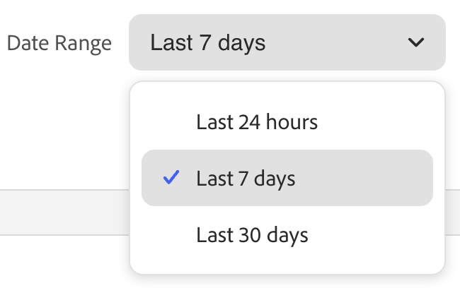

# Recommendations-Leistung

Auf der Seite Recommendations-Performance wird eine Liste der konfigurierten Recommendations zusammen mit Schlüsselmetriken angezeigt, anhand derer Sie deren Effektivität bewerten können. Sie können die Ansicht so konfigurieren, dass Metriken für den letzten Tag, die letzte Woche oder den letzten Monat angezeigt werden. Diese Einblicke zeigen, wie oft jede Empfehlungseinheit angezeigt oder angeklickt wird, sodass Sie die Leistung bewerten und Optimierungsmöglichkeiten identifizieren können.

>[!INFO]
>
>Eine Empfehlungseinheit ist ein Widget, das das empfohlene Produkt (_)_.

{zoomable="yes"}

## Anzeigen eines Berichts

1. Wählen Sie die **Katalogansicht** aus, z. B. *Alle Ansichten*, für die Ihre Empfehlungen gelten.

   Weitere Informationen zu [Katalogansichten](#select-catalog-view) finden Sie in Empfehlungen.

1. Klicken Sie auf die **[!UICONTROL Date Range]** und wählen Sie einen der folgenden Bereiche aus:

   

   Die Empfehlungstabelle wird aktualisiert, um Metriken für diesen Datumsbereich und diese Katalogansicht anzuzeigen.

## Tabelle anpassen

1. Klicken Sie oben links auf das Symbol , um die Tabelle anzupassen.

   Die sichtbaren Spalten sind mit einem Häkchen versehen.

1. Führen Sie im Menü eine der folgenden Aktionen aus:

   - Um eine ausgeblendete Spalte anzuzeigen, klicken Sie auf einen beliebigen Spaltennamen ohne Häkchen.
   - Um eine sichtbare Spalte auszublenden, klicken Sie auf einen beliebigen Spaltennamen mit einem Häkchen.

   Die Tabelle wird aktualisiert und enthält nur die ausgewählten Spalten.

## Details anzeigen

1. Klicken Sie in der Tabelle auf das Symbol () neben der Empfehlung, die Sie untersuchen möchten.

1. Um den Status der Empfehlung zu ändern, klicken Sie auf **Aktivieren** oder **Deaktivieren**.

## Empfehlungen erstellen oder verwalten

Erfahren Sie, wie [&#x200B; eine neue Empfehlung erstellen oder eine vorhandene &#x200B;](../merchandising/recommendations/create.md) verwalten können.

## Workspace-Steuerelemente

| Kontrolle | Beschreibung |
|---|---|
|  | Bestimmt den Zeitbereich, der für Metrikberechnungen verwendet wird. |
|  | Bestimmt die Spalten, die in der Recommendations-Tabelle angezeigt werden. |
| Empfehlung erstellen | Öffnet die Seite [Neue Empfehlung erstellen](../merchandising/recommendations/create.md). |
| [Katalogansicht](#select-catalog-view) | Wählen Sie die Katalogansicht aus, um die Tabelle so zu filtern, dass nur die Empfehlungen angezeigt werden, die für die ausgewählte Katalogansicht gelten. Diese Auswahl wird auch als Katalogansicht verwendet, wenn Sie [&#x200B; neue Empfehlung &#x200B;](../merchandising/recommendations/create.md) (erstellen). Die Optionen sind *Alle*) oder eine bestimmte [Katalogansicht](../setup/catalog-view.md). |

## Spaltenbeschreibungen

| Spalte | Beschreibung |
|---|---|
| -Name | Der Name der Empfehlung. |
| Seite | Die Seite, auf der die Empfehlung angezeigt wird. |
| Typ | Der Empfehlungstyp. |
| Status | Der Empfehlungsstatus. Optionen: inaktiv/aktiv/Entwurf |
| Erstellt | Das Datum, an dem die Empfehlung erstellt wurde. |
| Zuletzt bearbeitet | Das Datum, an dem die Empfehlung zuletzt bearbeitet wurde. |
| Impressionen | Die Häufigkeit, mit der eine Empfehlungseinheit auf einer Seite geladen und gerendert wird. Eine Empfehlungseinheit, die sich unter dem Falz des Darstellungsfelds des Browsers befindet, wird auf der Seite gerendert, auch wenn sie nicht vom Käufer angezeigt wird. In diesem Fall wird die gerenderte Einheit als Impression gezählt, eine Ansicht wird jedoch nur gezählt, wenn der Käufer die Einheit in die Ansicht scrollt. |
| Impressions | (Sichtbare Impressions) Die Anzahl der Empfehlungseinheiten, die mindestens eine Ansicht registrieren. Wenn die Empfehlungseinheit beispielsweise zwei Zeilen mit jeweils zwei Produkten hat und die letzten beiden Produkte vom Käufer nicht gesehen werden, die ersten beiden jedoch, wird die Aktivität weiterhin als Impression gezählt. |
| Ansichten | Die Anzahl der Empfehlungseinheiten, die im Ansichtsfenster des Browsers des Käufers angezeigt werden. Wenn der Käufer die Seite mehrmals nach oben oder unten scrollt, wird das Ereignis mehrmals ausgelöst, und zwar jedes Mal, wenn das Gerät angezeigt wird. |
| Klicks | Die Summe der Klicks eines Kunden auf einen Artikel in der Empfehlungseinheit und die Anzahl der Klicks des Kunden auf die Schaltfläche **Zum Warenkorb hinzufügen** in der Empfehlungseinheit |
| Einnahmen | Der durch die Empfehlung generierte Umsatz für den aktuellen Zeitraum. |
| LT-Umsatz | (Lebensdauerumsatz) Der durch eine Empfehlung gesteuerte lebenslange Umsatz. |
| Sichtbarkeit | Der Prozentsatz der Empfehlungseinheiten, die sich für die Ansicht registrieren. |
| CTR | (Klickrate) Der Prozentsatz der Einheitenimpressionen für die Empfehlung, die einen Klick registriert. CTR zählt alle Impressionen, auch wenn die Einheit nicht in die Ansicht des Käufers gelangt. Wenn die Empfehlungseinheit nicht angezeigt wird, ist es unwahrscheinlich, dass darauf geklickt wird. Diese unsichtbaren Impressionen werden jedoch auf den CTR-Score angerechnet und reduzieren den CTR-Gesamtprozentsatz. |
| vCTR | (Sichtbare Clickthrough-Rate) Misst Klicks nur auf der Grundlage von sichtbaren Impressions (Empfehlungen, die tatsächlich im sichtbaren Teil des Käuferbildschirms erschienen sind) und bietet so einen genaueren Maßstab für die Interaktion mit Kunden. |

## Katalogansicht auswählen

>[!IMPORTANT]
>
>Diese Funktion befindet sich derzeit in der Betaphase.

Die **[!UICONTROL Catalog view]**-Auswahl auf der **Recommendations**-Seite hat zwei Aufgaben:

1. **Filtert die Tabelle** - Zeigt nur Empfehlungen (und deren Metriken) an, die für die ausgewählte Katalogansicht gelten.
1. **Legt den Umfang für neue Empfehlungen fest** - Wenn Sie [eine Empfehlung erstellen](../merchandising/recommendations/create.md) wird die ausgewählte Katalogansicht als Umfang der Einheit verwendet. Die Optionen sind *Alle*) oder eine bestimmte [Katalogansicht](../setup/catalog-view.md).

   - **Alle Ansichten** - Die Empfehlung gilt für alle Katalogansichten (die Produktverfügbarkeit wird weiterhin pro Ansicht gefiltert).
   - **Katalogansicht** - Die Empfehlung gilt nur für die ausgewählte Katalogansicht (z. B. eine Storefront, Sprache oder Marke).

Durch Festlegen einer Katalogansicht für jede Empfehlung haben Sie folgende Möglichkeiten:

- Konfigurieren Sie Recommendations für alle Katalogansichten (global) oder für eine Katalogansicht.
- Anzeigen einer Vorschau und Filtern von Produkten nach Katalogansicht auf der Seite [Erstellen](../merchandising/recommendations/create.md) einer Empfehlung.
- Nur Produkte anzeigen, die für jede Storefront verfügbar sind.
- Zeigen Sie Metriken und das Verhalten der Storefront pro Katalogansicht an.

### Filtern von Produkten in der Katalogansicht

Die Produktverfügbarkeit wird pro Katalogansicht auch für Empfehlungseinheiten unter der Auswahl **Alle Ansichten** erzwungen. Dies funktioniert zusätzlich zu allen (Ein- [&#x200B; Ausschlussfiltern), &#x200B;](../merchandising/recommendations/filters.md) Sie auf der Empfehlungseinheit festgelegt haben.

**Beispiel: Empfehlung mit Einschlussfiltern unter der Auswahl Alle Ansichten**

- **Alle Ansichten** Die Empfehlung enthält SKUs: SKU_ABC, SKU_CDE, SKU_XYZ.
- **Katalogansicht: Kingsbluff** kann SKU_ABC oder SKU_CDE nicht verkaufen. **Angezeigt:** SKU_XYZ plus alle anderen SKUs, die für Kingsbluff gültig sind.
- **Katalogansicht: Arkbridge** kann keine der enthaltenen SKUs verkaufen. **Angezeigt:** Nur SKUs erlaubt von Arkbridge. Wenn keine verfügbar sind, wird die Empfehlungseinheit nicht in dieser Storefront angezeigt.
