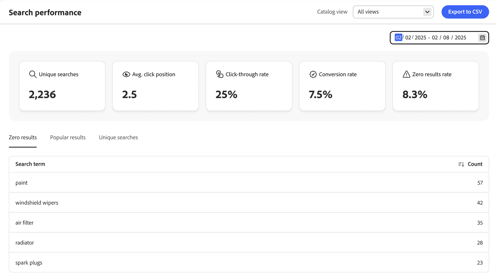

# Suchleistung

Die *Suchleistung* liefert insight zu den Suchbegriffen, die Käufer verwenden. Die Informationen können verwendet werden, um Trends zu identifizieren, den Clickthrough zu erhöhen und die Konversionsrate zu verbessern. Die Seite Suchleistung bietet eine Momentaufnahme der Suchmetriken für einen bestimmten Datumsbereich und umfasst die folgenden Berichte:

- Eindeutige Suchvorgänge
- Durchschnittliche Klickposition
- Clickthrough-Rate
- Konversionsrate
- Rate der Nullergebnisse

{zoomable="yes"}

>[!IMPORTANT]
>
>Wenn keine Suchleistungsmetriken angezeigt werden, stellen Sie sicher, dass Suchereignisdaten [erfasst](../setup/events/overview.md).

## Wählen Sie die **Katalogansicht**

Wählen Sie die [Katalogansicht](../setup/catalog-view.md) aus, um bestimmte Suchergebnisse anzuzeigen.

## Anzeigen eines Berichts

Klicken Sie auf den Kalender und führen Sie einen der folgenden Schritte aus:

- Um ein einzelnes Datum anzugeben, doppelklicken Sie auf das Datum im Kalender.
- Um einen Datumsbereich anzugeben, klicken Sie auf das erste und letzte Datum im Kalender.

>[!NOTE]
>
>Der Datumsbereich darf ein Jahr nicht überschreiten.

Klicken Sie auf **[!UICONTROL Export to CSV]** , um eine CSV-Datei mit Ihrer Suchleistung zu generieren.

## So verbessern Sie die Suchleistung

Im folgenden Abschnitt finden Sie Strategien, mit denen Sie Ihre Site-Suchfunktion verbessern und ein nahtloses und effizientes Kundenerlebnis gewährleisten können, das die Konversionsraten maximiert.

Die Relevanz und Effektivität von Suchergebnissen hängt von mehreren Schlüsselfaktoren ab:

- Durch gut strukturierte Produktdaten wird sichergestellt, dass Suchalgorithmen Produkte effektiv Abfragen zuordnen können. Produktdaten von geringer Qualität führen zu weniger relevanten Suchergebnissen. So wirken Sie sich direkt auf den Erfolg Ihrer Merchandising-Strategie aus:
   - Richten Sie die richtigen [Attribute als durchsuchbar](https://developer.adobe.com/commerce/services/reference/rest/#tag/Metadata) mit der entsprechenden Gewichtung ein.
   - Stellen Sie sicher, dass Daten innerhalb dieser Attribute relevant sind.
- Ein gut gestaltetes Sucherlebnis schafft Vertrauen bei den Kunden und gibt ihnen die Zuversicht, das zu finden, was sie brauchen.
- Suchregeln sind wichtig, da sie die Sichtbarkeit bestimmter Produkte basierend auf Popularität, Neuankömmlingen, Werbekriterien oder einer anderen Merchandising-Strategie erhöhen können, um Ihre Geschäftsanforderungen zu erfüllen.
- Die Facettennavigation ermöglicht es Kunden, ihre Suche zu verfeinern und schnell relevante Ergebnisse zu erhalten.

### Suchergebnisse überwachen

Um Suchergebnisse mit [!DNL Adobe Commerce Optimizer] zu optimieren, überwachen Sie relevante Key Performance Indicators (KPIs) wie eindeutige Abfragen, durchschnittliche Klickposition, Clickthrough-Raten, Konversionsrate und Nullergebnisrate, um zu verstehen, wie Käufer mit Ihrer Suchfunktion interagieren. Diese Daten helfen Ihnen, Ihre Suchregeln regelmäßig zu aktualisieren und zu verfeinern.

- **Eindeutige Suchvorgänge** - Die Anzahl der einzelnen Suchabfragen, die auf Ihrer [!DNL Adobe Commerce Optimizer]-Site durchgeführt wurden. Jede einzelne Suche wird nur einmal gezählt, auch wenn sie mehrere Male von ein und demselben oder verschiedenen Erstkäufern wiederholt wird. Diese Metrik hilft Ihnen, die Vielfalt der von Kundinnen und Kunden verwendeten Suchbegriffe zu verstehen, und bietet Einblicke in die Produkte oder Informationen, die Kundinnen und Kunden suchen. Das Tracking einzelner Suchvorgänge ermöglicht Folgendes:

   - Identifizieren Sie beliebte Suchtrends und häufig gesuchte Elemente.
   - Erkennung potenzieller Lücken in Ihrem Produktkatalog oder Inhalt.
   - Optimieren Sie Ihre Suchfunktion durch Hinzufügen [Synonyme](../merchandising/synonyms/overview.md), Erstellen oder Aktualisieren [Suchregeln](../merchandising/rules/overview.md).

- **Durchschnittliche Klickposition** - Gibt die durchschnittliche Position der Suchergebnisse an, auf die Käuferinnen und Käufer nach der Durchführung einer Suchabfrage auf Ihrer Site geklickt haben. Diese Metrik bietet Einblicke in die Relevanz und Effektivität Ihrer Suchergebnisse.

  Eine niedrigere durchschnittliche Klickposition (näher an 1) deutet darauf hin, dass Käufer relevante Ergebnisse schnell finden, was darauf hinweist, dass Ihre Suchstrategie effektiv ist. Dies hilft Ihnen, das Verhalten der Käufer zu verstehen und zu erkennen, wie weit sie bereit sind, zu scrollen, um das gewünschte Produkt zu finden. Wenn die durchschnittliche Klickposition hoch ist, kann dies darauf hindeuten, dass die relevantesten Ergebnisse nicht oben angezeigt werden, was eine Überprüfung und Optimierung Ihrer Suchstrategie erfordert.

- **Clickthrough-Rate (CTR)** - Misst den Prozentsatz der Käufer, die nach der Durchführung einer Suchanfrage auf ein Suchergebnis klicken. Ein hoher CTR-Wert bedeutet, dass die Suchergebnisse relevant und für Kunden attraktiv sind, da sie auf die Ergebnisse klicken, die sie finden. Die CTR-Überwachung kann dabei helfen, Bereiche zu identifizieren, in denen Verbesserungen erforderlich sind. Eine niedrige CTR kann darauf hindeuten, dass die Suchergebnisse nicht mit den Kundenabsichten übereinstimmen, was dazu führen kann, dass die Suchregeln verfeinert, die Produktdaten verbessert oder die Ergebnisdarstellung verbessert werden muss.

- **Konversionsrate** - Zeigt die Effektivität Ihrer Suchfunktion zur Steigerung des Umsatzes und zum Erreichen von Geschäftszielen an. Sie spiegelt die allgemeine Effektivität Ihrer Suchfunktion bei der Erfüllung der Kundenanforderungen und der Erleichterung eines reibungslosen Einkaufserlebnisses wider. Eine hohe Konversionsrate bedeutet, dass Ihre Suchergebnisse hochrelevant und überzeugend sind, sodass die Käufer ihre Käufe abschließen. Wenn die Konversionsrate niedrig ist, kann dies auf Probleme mit der Suchrelevanz, der Produktverfügbarkeit oder dem gesamten Käufer-Journey von der Suche bis zum Kauf hinweisen.

- **Null-Ergebnisrate** - Misst den Prozentsatz der Suchanfragen auf Ihrer [!DNL Adobe Commerce Optimizer]-Site, die keine Ergebnisse zurückgeben. Diese Metrik ist wichtig, um zu verstehen, wie oft die Suchvorgänge von Käufern erfolglos sind, und kann Einblicke in potenzielle Lücken in Ihrem Produktkatalog oder Ihrer Sucheinrichtung geben. Eine hohe Ergebnisrate von null kann Käuferinnen und Käufer frustrieren, was zu einem schlechten Einkaufserlebnis und potenziellen Kundenverlust führt. Es kann auf fehlende Produkte oder Kategorien in Ihrem Katalog hinweisen, nach denen Käufer suchen, die Inventar- und Produktlisten-Entscheidungen anleiten.

  Um die Nullergebnisrate zu reduzieren, haben Sie folgende Möglichkeiten:

   - Bieten Sie alternative oder verwandte Suchbegriffe an, z[ B. &quot;](../merchandising/synonyms/overview.md)&quot;, wenn keine exakten Übereinstimmungen gefunden werden.
   - Überprüfen Sie regelmäßig Nullergebnisabfragen, um Muster zu identifizieren und notwendige Anpassungen an Ihrem Produktkatalog und Ihren Sucheinstellungen vorzunehmen.

Sie können diese Metrikdaten verwenden, um Ihre Suchfunktion wie folgt zu optimieren:

- Implementieren Sie Regeln, um beliebte Produkte automatisch höher in den Suchergebnissen zu bewerten. Produkte, auf die häufig geklickt oder gekauft wird, können bevorzugt oben angezeigt werden. Kuratieren Sie Listen beliebter Produkte für bestimmte Suchabfragen manuell und stellen Sie sicher, dass diese Elemente gut sichtbar angezeigt werden.
- Markieren Sie Produkte, die derzeit im Trend liegen oder in letzter Zeit einen Anstieg der Popularität erlebt haben. Dies kann besonders bei saisonalen Veranstaltungen, Feiertagen oder Werbezeiten wirksam sein. Verwenden Sie dazu das intelligente Ranking, das beim Einrichten einer Suchregel Ihrem Anwendungsfall und Ihren Geschäftsanforderungen besser entspricht.
- Markieren Sie beliebte Filter oder Facetten. Wenn Käufer häufig nach bestimmten Marken oder Preisspannen filtern, heben Sie diese Optionen hervor, indem Sie diese Facetten anheften und entsprechend sortieren.
- Wenn eine Suche keine Ergebnisse liefert, verwenden Sie beliebte Ergebnisdaten, um alternative Produkte oder verwandte Kategorien mit hoher Käuferinteraktion vorzuschlagen.
- Analysieren Sie beliebte Suchbegriffe und Produktdaten, um wichtige Keywords zu identifizieren. Optimieren Sie die durchsuchbaren Attribute Ihres Produkts mit diesen Keywords, um die Suchrelevanz zu verbessern.
- Analysieren Sie Ihre Ergebnisdaten regelmäßig, um sich ändernde Trends, Kundenpräferenzen und -verhalten zu verstehen, die wichtigsten Suchbegriffe zu identifizieren und Probleme zu erkennen. Verwenden Sie diese Feedback-Schleife, um Ihre Suchregeln und Produktangebote kontinuierlich zu verfeinern und zu verbessern

## Optimieren der Suchfunktion

Um Ihre Suchfunktion zu optimieren, verwenden Sie [Synonyme und Schreibweisen](../merchandising/synonyms/overview.md) um sicherzustellen, dass Käufer Produkte finden, auch wenn sie unterschiedliche Wörter und [Facetten](../merchandising/facets/overview.md) verwenden, damit Käufer die Suchergebnisse eingrenzen können.

## Relevanz der Suchergebnisse verbessern

Um die Relevanz der Suchergebnisse zu verbessern, implementieren Sie effektive [Suchregeln](../merchandising/rules/overview.md) und verwenden Sie Produktmetadaten, um sicherzustellen, dass genaue und detaillierte [Attribute durchsuchbar sind](https://developer.adobe.com/commerce/services/reference/rest/#tag/Metadata).

### Bilder

Stellen Sie sicher, dass die untergeordneten Produkte der konfigurierbaren Produkte Bilder mit den richtigen Rollen enthalten. Übergeordnete oder untergeordnete Produkte können dazu führen, dass das Suchergebnis keine Bilder enthält.

>[!NOTE]
>
>Bilder in Suchergebnissen können je nach Suchbegriff unterschiedlich sein. Wenn der Suchbegriff bestimmt, dass ein untergeordnetes Produkt relevanter ist, werden anstelle von Bildern des übergeordneten Produkts Bilder vom untergeordneten Produkt verwendet.

### Verwenden von Produktmetadaten

Stellen Sie sicher, dass genaue [ detaillierte Produktattribute als durchsuchbar eingerichtet ](https://developer.adobe.com/commerce/services/reference/rest/#tag/Metadata). Beachten Sie, dass die Attribute „SKU“, „Name“ und „Kategorie“ standardmäßig durchsuchbar sind und nicht von der Suche ausgeschlossen werden können. Verwenden Sie für optimale Ergebnisse keine Leerzeichen in Ihren SKUs.

Um die Suchrelevanz zu erhöhen, weisen Sie jedem durchsuchbaren Attribut eine Gewichtung zu. Attribute mit einer höheren Gewichtung sollten in den Suchergebnissen höher angezeigt werden. Die Sortierung nach Relevanz wird von mehreren Kriterien beeinflusst, z. B. der Suchgewichtung. Dies bedeutet, dass manchmal Attribute mit niedrigerer Suchgewichtung immer noch mehr Relevanz haben können als Attribute mit höherer Suchgewichtung. Andere Kriterien können die Anzahl der Übereinstimmungen in einem bestimmten Attribut, die Position des gefundenen Suchbegriffs und die Gesamttextstruktur vor und nach einem Suchbegriff sein.

Stellen Sie sicher, dass jedes Produkt relevanten Inhalt in jedem durchsuchbaren Attribut hat. Es wird nicht empfohlen, ein Attribut als durchsuchbar festzulegen, wenn es große Mengen an Inhalten enthält, die die Relevanz der Suchergebnisse verringern können.

Weitere Informationen zu Produktattributen für die Suche:

- [Attribute als durchsuchbar festlegen](https://developer.adobe.com/commerce/services/reference/rest/#tag/Metadata)
- [Attributen Gewichtung zuweisen](https://developer.adobe.com/commerce/services/reference/rest/#tag/Metadata)

## Feldbeschreibungen

| Momentaufnahmen-Daten | Beschreibung |
|--- |--- |
| Eindeutige Suchvorgänge | Die Gesamtzahl der eindeutigen Suchvorgänge für den angegebenen Datumsbereich. Mehrere Suchvorgänge desselben Kunden, selbst wenn sie für dieselbe Abfrage durchgeführt werden, gelten als eindeutig, wenn sie im Abstand von mehr als einer Stunde eingereicht werden. |
| Clickthrough-Rate | Der Prozentsatz der Suchvorgänge, die damit enden, dass der Einkäufer auf ein Produkt klickt. Die Clickthrough-Rate beträgt zum Beispiel 50 %, wenn der Käufer nach „pants“ und „shirt“ sucht und dann auf ein Ergebnis in der „shirt“-Suche klickt. |
| Konversionsrate | Der Prozentsatz der Produkte, die der Einkäufer kauft, im Vergleich zur Anzahl der Produkte, auf die der Einkäufer für den angegebenen Datumsbereich klickt. Beispielsweise liegt die Konversionsrate der Interaktion bei 100 %, wenn der Käufer sechs Produkte im Popover anzeigt, auf eines klickt und einen Kauf tätigt.   Die Konversionsrate wird durch die Anzahl der Ansichten eines bestimmten Produkts nicht beeinflusst. Beispielsweise bleibt die Konversionsrate gleich, wenn der Käufer die Suche verwendet, aber nicht auf Produkte klickt. |
| Rate der Nullergebnisse | Der Prozentsatz der eindeutigen Suchvorgänge, die für den angegebenen Datumsbereich keine Ergebnisse zurückgeben. Beispielsweise liegt die Null-Ergebnisrate bei 66,67 %, wenn der Käufer zweimal (ohne Ergebnisse) nach „fjjajfjfjf“ und einmal (mit Ergebnissen) nach „pants“ sucht. |
| Durchschnitt Klick-Position | Die relative Position der durchschnittlichen Klickrate auf der Grundlage eindeutiger Suchvorgänge für den angegebenen Datumsbereich. |

| Berichte | Beschreibung |
|--- |--- |
| Keine Ergebnisse | Listet die Suchabfragen auf, die keine Ergebnisse zurückgeben, und gibt an, wie oft im angegebenen Datumsbereich verwendet wurde. Bericht-Limit: Die 500 wichtigsten Begriffe |
| Beliebte Ergebnisse | Listet die Namen von Produkten auf, die im angegebenen Datumsbereich die meisten Ansichten erhalten haben. Beliebte Ergebnisse werden nur auf der Grundlage von Impressions berechnet und sind von der Anzahl der Klicks oder des generierten Umsatzes nicht betroffen. Bericht-Limit: Die 500 wichtigsten Begriffe |
| Eindeutige Suchvorgänge | Listet die eindeutigen Suchanfragen auf, die im angegebenen Datumsbereich verwendet wurden. Die Berichtsdaten werden auf die gleiche Weise berechnet wie die Daten eindeutiger Such-Momentaufnahmen. Wenn ein Käufer dieselbe Suchanfrage zweimal, aber im Abstand von mehr als einer Stunde eingibt, wird die Suche als zwei eindeutige Suchvorgänge betrachtet. Bericht-Limit: Die 500 wichtigsten Begriffe |

## Standardmäßige Nicht-Systemattribut-Eigenschaften

In der folgenden Tabelle werden die standardmäßigen durchsuchbaren und filterbaren Eigenschaften von Nicht-Systemattributen angezeigt. Wenn Sie die *In der Suche verwenden* auf `Yes` setzen, kann das Attribut in [!DNL Adobe Commerce Optimizer] durchsucht werden.

| Attributcode | durchsuchbar |
|--- |--- |
| Aktivität | Ja |
| attributes_brand | Ja |
| Marke | Ja |
| Klima | Ja |
| Kragen | Ja |
| Farbe | Ja |
| Kosten | Ja |
| eco_collection |  |
| Geschlecht | Ja |
| Hersteller | Ja |
| Material | Ja |
| Zweck | Ja |
| strap_bags | Ja |
| style_general | Ja |

## Standardattribut-Eigenschaften

Die folgende Tabelle zeigt die standardmäßigen durchsuchbaren und filterbaren Eigenschaften von Systemattributen.

| Attributcode | durchsuchbar |
|--- |--- |
| allow_open_amount | Ja |
| Beschreibung | Ja |
| name | Ja |
| Preis | Ja |
| short_description | Ja |
| SKU | Ja |
| Status | Ja |
| TAX_CLASS_ID | Ja |
| url_key | Ja |
| Gewichtung | Ja |
