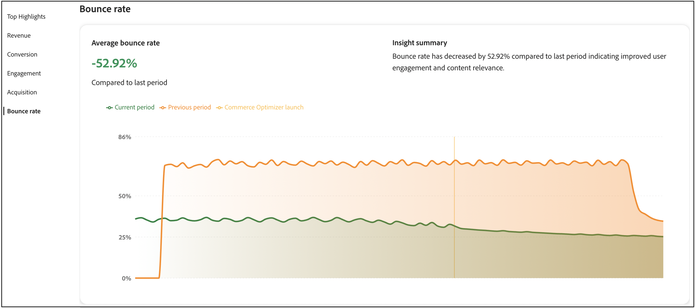

# Erfolgsmetriken

Diese Seite bietet einen Überblick über die wichtigsten Leistungsmetriken für Ihren [!DNL Adobe Commerce Optimizer]. Das Ziel besteht darin, dass Sie die Ergebnisse der Implementierung von schnell verstehen [!DNL Adobe Commerce Optimizer] Ihnen und Ihrem Team helfen, Wachstumschancen zu erkennen und Bereiche für die Optimierung hervorzuheben.

Die Metriken im Bericht werden aus Storefront-Ereignisdaten abgerufen. [Weitere Informationen](../setup/events/overview.md) über die erfassten Ereignisdaten.

## Grundlegendes zu Metriken

Der Bericht zu Erfolgsmetriken bietet umsetzbare Einblicke in fünf wichtige Leistungsbereiche, die sich direkt auf Ihre Geschäftsergebnisse auswirken. Jede Metrik zeigt Muster im Kundenverhalten und in der Store-Performance auf, die Ihnen dabei helfen, Chancen zu erkennen und Herausforderungen zu bewältigen. Nutzen Sie diese Erkenntnisse, um intelligentere Entscheidungen zu treffen und Ihr Commerce-Erlebnis zu optimieren.

**Top-Highlights** fasst die Schlüsselmetriken aus jedem Leistungsbereich zusammen. Verwenden Sie diesen Abschnitt, um schnell Ihre größten Verbesserungsmöglichkeiten zu ermitteln.

Die wichtigsten Leistungsindikatoren sind:

- **Umsatz** - Ihre primäre Finanzmetrik, die die Gesamtumsatzleistung anzeigt.
- **Konversion** - Der Prozentsatz der Besucherinnen und Besucher, die Käufe abschließen.
- **Interaktion** - Wie aktiv Benutzer mit Ihrer Site interagieren.
- **Akquise** - Die Effektivität Ihrer Bemühungen zur Kundenakquise.
- **Absprungrate** - Der Prozentsatz der Besucherinnen und Besucher, die das Video verlassen, nachdem sie nur eine Seite angesehen haben.

## Erstellen eines Berichts

1. Wählen Sie in der linken Leiste die Option **Erfolgsmetriken**.
1. Geben **unter &quot;**&quot; den **Datumsbereich**, **Katalogquelle** basierend auf Ihrer Gebietsschema-Einstellung und **Währung** an.
1. Klicken Sie auf **[!UICONTROL Apply]**.

   Die **Top-**, **Umsatz**, **Konversion**, **Interaktion**, **Akquise** und **Absprungrate** werden alle auf Grundlage Ihrer Berichtskonfiguration aktualisiert.

1. Klicken Sie auf **[!UICONTROL Export]** , um den Bericht als PDF zu speichern.

## Nächste Schritte und Optimierungsstrategien

Verwenden Sie Ihre Erfolgsmetrikdaten, um Verbesserungsmöglichkeiten zu identifizieren und zielgerichtete Optimierungsstrategien zu implementieren. Die folgenden Abschnitte enthalten spezifische, umsetzbare Anleitungen für jeden Metrikbereich.

### Umsatzoptimierung

Beim Umsatz ist es Ihr Ziel, den Gesamtumsatz und den durchschnittlichen Bestellwert zu steigern.

#### Strategien

- **KI-gestützte Empfehlungen implementieren**: Verwenden Sie die Empfehlungs-Engine von Optimizer, um relevante Produkte aufzudecken, die höhere Konversionsraten erzielen. Stellen Sie *Kunden, die dies angesehen haben* bereit und *haben dies gekauft, diese gekauft* Empfehlungstypen, um die Crossselling-Möglichkeiten zu erhöhen.

- **Merchandising-Regeln erstellen**: Verstärken Sie margenstarke Produkte in Suchergebnissen mithilfe von [Merchandising-Regeln](../merchandising/rules/overview.md). Best-Selling-Elemente für Abfragen mit hohem Traffic oben in den Suchergebnissen anheften.

- **Optimieren Sie die Produkterkennung**: Verwenden Sie [intelligente Facetten](../merchandising/facets/overview.md), um Kunden dabei zu helfen, Produkte effizienter zu finden, was zu höheren Konversionsraten und höheren Umsätzen führt.

- **Nutzen saisonaler Opportunitys**: Erstellen Sie zeitbasierte Merchandising-Regeln, um saisonale oder Werbeartikel in Spitzenzeiten des Einkaufs zu bewerben.

### Verbesserung der Konversionsrate

Um Ihre Konversionsrate zu verbessern, besteht Ihr Ziel darin, mehr Besucher in Kunden zu konvertieren.

#### Strategien

- **Suchrelevanz optimieren**: Implementieren Sie [Synonyme](../merchandising/synonyms/overview.md), um sicherzustellen, dass Kundinnen und Kunden das finden, wonach sie suchen, auch mit verschiedenen Suchbegriffen. Verwenden Sie dynamisches Facettieren , um relevante Filteroptionen bereitzustellen.

- **Strategische Empfehlungsplatzierung**: Stellen Sie Empfehlungseinheiten auf Seiten mit hohem Traffic wie Produktdetailseiten und Kategorieseiten bereit. Verwenden Sie *Am häufigsten angezeigten* und *Am häufigsten gekauften* Empfehlungen, um Vertrauen und Dringlichkeit aufzubauen.

- **Produktansicht verbessern**: Verwenden Sie Merchandising-Regeln, um sicherzustellen, dass meistverkaufte und hoch konvertierende Produkte in den Suchergebnissen deutlich zu sehen sind.

- **A/B-Test-**: Experimentieren Sie mit verschiedenen Empfehlungstypen und Platzierungen, um zu ermitteln, was für Ihre Zielgruppe am besten geeignet ist.

### Interaktionsverbesserung

Um die Interaktion zu verbessern, ist es Ihr Ziel, die Kundeninteraktion und die Zeit vor Ort zu erhöhen.

#### Strategien

- **Empfehlungstypen diversifizieren**: Vermeiden Sie es, dieselben Empfehlungen wiederholt anzuzeigen. Verwenden Sie einen Mix aus *Empfohlen für Sie*, *Trending* und *Kürzlich angesehen*, um Inhalte frisch und ansprechend zu halten.

- **Intelligente Suche implementieren**: Verwenden Sie KI-gesteuerte dynamische Facettierung und Ergebnisneuranking, um Suchergebnisse in Echtzeit basierend auf dem Käuferverhalten anzupassen.

- **Personalisierte Erlebnisse erstellen**: Stellen Sie auf der Homepage und auf der gesamten Kunden-Journey „Empfohlene für Sie“-Einheiten bereit, um personalisierte Produktvorschläge bereitzustellen.

- **Sucherlebnis optimieren**: Verwenden Sie Synonyme, um die Suchrelevanz zu verbessern und sicherzustellen, dass Kunden schnell finden, wonach sie suchen.

### Akquise-Wachstum

Um mehr Wachstum zu erhalten, ist es Ihr Ziel, mehr neue Kunden zu gewinnen und die Akquise-Effizienz zu verbessern.

#### Strategien

- **Nutzen von Suchleistungsdaten**: Verwenden Sie den [Suchleistung](../manage-results/search-performance.md)-Bericht, um Trenderzeugnisse und beliebte Suchbegriffe zu identifizieren. Erstellen Sie Merchandising-Regeln, um diese Elemente hervorzuheben.

- **Optimieren der Empfehlungsleistung**: Überwachen Sie [&#x200B; Metriken zur Empfehlungsleistung](../manage-results/recommendation-performance.md) um zu ermitteln, welche Empfehlungstypen den meisten Traffic und die meisten Konversionen fördern.

- **Neue Artikel und Werbeartikel hervorheben**: Verwenden Sie Merchandising-Regeln, um neue Produkte oder Werbeartikel in den Suchergebnissen zu optimieren, um die Aufmerksamkeit neuer Besucher zu erregen.

- **Traffic-Quellen nachverfolgen**: Verwenden Sie Ereignisdaten, um zu verstehen, welche Kanäle den wertvollsten Traffic generieren, und optimieren Sie Ihre Marketing-Maßnahmen entsprechend.

### Reduktion der Bounce-Rate

Um die Absprungrate zu reduzieren, besteht Ihr Ziel darin, die Besucherinteraktion aufrechtzuerhalten und Einzelseitenbesuche zu reduzieren.

#### Strategien

- **Suchrelevanz verbessern**: Verwenden Sie Synonyme und intelligente Facettenbildung, um sicherzustellen, dass Kunden relevante Produkte schnell finden. Schlechte Suchergebnisse sind eine Hauptursache für hohe Absprungraten.

- **Implementieren von Empfehlungseinheiten**: Stellen Sie Empfehlungseinheiten auf Kategorie- und Suchergebnisseiten bereit, um zusätzliche Produktoptionen bereitzustellen und die Besucherinteraktion zu gewährleisten.

- **Produkterkennung optimieren**: Verwenden Sie Merchandising-Regeln, um sicherzustellen, dass die relevantesten und beliebtesten Produkte zuerst in den Suchergebnissen angezeigt werden.

- **Erstellen ansprechender Homepage-Erlebnisse**: Verwenden Sie die Empfehlungstypen „Empfohlen für Sie“ und „Trending“ auf Ihrer Homepage, um Besucher sofort mit relevanten Inhalten zu interagieren.

## Fehlerbehebung und Optimierung

### Wenn Metriken zurückgehen

**Umsatzrückgang**:

- Überprüfen, ob Empfehlungseinheiten weiterhin aktiv sind und eine gute Leistung zeigen
- Überarbeitung der Merchandising-Regeln, um sicherzustellen, dass Produkte mit hoher Gewinnspanne beworben werden
- Analysieren Sie die Suchleistung, um festzustellen, ob beliebte Produkte immer noch ein gutes Ranking haben.

**Konversionsrate sinkt**:

- Überprüfen, ob die Suchrelevanz erhalten bleibt (Synonyme und Facetten überprüfen)
- Stellen Sie sicher, dass Empfehlungseinheiten korrekt angezeigt werden
- Überprüfen von Merchandising-Regeln auf Konflikte oder Probleme

**Hohe Absprungraten**:

- Relevanz des Suchergebnisses prüfen und ggf. Synonyme implementieren
- Stellen Sie sicher, dass Empfehlungseinheiten ordnungsgemäß geladen werden
- Überprüfen der Qualität und Verfügbarkeit von Produktdaten

**Geringe Interaktion**:

- Diversifizieren Sie die Empfehlungstypen, um Kundenmüdigkeit zu vermeiden.
- Implementieren von stärker personalisierten Empfehlungsstrategien
- Optimieren des Sucherlebnisses mit besseren Facetten und Synonymen

## Feldbeschreibungen

### Berichtskonfiguration

| Feld | Beschreibung |
|---|---|
| Datumsbereich | Zu den Optionen gehören **Letzte 3 Monate**, **Letzte 7 Tage**, **Letzte 30 Tage**, **Letzte 6 Monate**, **Letzte 12 Monate** und **Jahr bis heute**. Verwenden Sie kürzere Bereiche für sofortige Optimierungseinblicke und längere Bereiche für Trendanalysen. |
| Land | Basierend auf der für Ihre [Katalogansicht“ angegebenen &#x200B;](../setup/catalog-view.md). Wählen Sie den geeigneten Markt für eine genaue Leistungsanalyse aus. |
| Währung | Die für Ihre Katalogansicht angegebene Währung. Stellen Sie sicher, dass dies Ihrem Zielmarkt für eine genaue Umsatzberichterstattung entspricht. |
| Export | Speichert den Bericht als PDF zur Freigabe für Stakeholder oder Offline-Analyse. |

## Ähnliche Themen

- [Suchleistung](../manage-results/search-performance.md) - Analysieren Sie Suchbegriffe und optimieren Sie die Suchrelevanz
- [Empfehlungsleistung](../manage-results/recommendation-performance.md) - Überwachen und Optimieren der Empfehlungseffektivität
- [Recommendations-Übersicht](../merchandising/recommendations/overview.md) - Erfahren Sie mehr über KI-gestützte Produktempfehlungen
- [Merchandising-Regeln](../merchandising/rules/overview.md) - Verstärken, Begraben, Anheften oder Ausblenden von Produkten in Suchergebnissen
- [Facetten](../merchandising/facets/overview.md) - Verbessern der Suche mit intelligenter Filterung
- [Synonyme](../merchandising/synonyms/overview.md) - Verbesserung der Suchrelevanz und des Kundenerlebnisses
- [Übersicht über Ereignisse](../setup/events/overview.md) - Informationen zu den Daten, auf denen Ihre Metriken basieren
