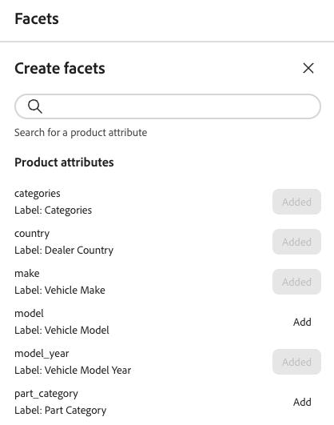

# Erstellen und Verwalten von Facetten

Jedes filterbare Produktattribut kann als Facette verwendet werden. Facetten helfen Kunden, Produkte einfacher zu filtern und zu finden. In diesem Artikel wird beschrieben, wie Sie Facetten in Ihrer Storefront hinzufügen, verwalten und konfigurieren.

## Facette erstellen

1. Wählen Sie in der linken Leiste _Merchandising_ > **Facetten** und klicken Sie dann auf **Facetten erstellen**.
1. In der Liste *Facetten erstellen* verfügt jedes verfügbare Attribut über eine separate . Führen Sie einen der folgenden Schritte aus:

   - Wählen Sie in *Liste* Facettenattribute“ das Produktattribut aus, das Sie als Facette verwenden möchten, und klicken Sie auf **Hinzufügen**.
   - Um ein bestimmtes Produktattribut zu finden, geben Sie die ersten Zeichen des Attributnamens in das Feld *Suche* ein. Klicken Sie dann auf **Hinzufügen**.

   Die Facette wird am unteren Rand der Liste *Dynamische Facetten* hinzugefügt und die Schaltfläche *Änderungen veröffentlichen* wird verfügbar.

1. Wenn die hinzuzufügende Facette nicht gefunden werden kann, verwenden Sie die [Metadaten-API](https://developer.adobe.com/commerce/services/reference/rest/#tag/Metadata), um den `searchable` festzulegen:

   `"searchable": true`

   Die Facette wird in der Storefront verfügbar, wenn der Katalog das nächste Mal mit [!DNL Adobe Commerce Optimizer] synchronisiert wird. Wenn die Facette nach zwei Stunden nicht verfügbar ist, finden Sie weitere Informationen unter [Datensynchronisierung](../../setup/data-sync.md).

## Facetteneigenschaften bearbeiten (optional)

1. Suchen Sie die Facette, die Sie bearbeiten möchten.
1. Klicken Sie auf den () mehr-Selektor.
1. Klicken Sie im Menü auf **Bearbeiten**. Passen Sie dann die folgenden Eigenschaften nach Bedarf an:

   - Beschriftung - Geben Sie die Facettenbeschriftung ein, die Sie verwenden möchten.
   - Sortiertyp : Wählen Sie eine der folgenden Optionen:
      - Alphabetisch - Sortiert Facetten alphabetisch
      - Anzahl - Sortiert Facetten nach der Anzahl der gefundenen Übereinstimmungen
   - Maximaler Wert - Geben Sie die maximale Anzahl der in der Storefront angezeigten Facettenwerte ein. Gültige Einträge: 0 - 100; Standard: 8.

1. Klicken Sie abschließend auf **Speichern**.

## Facetten anheften/lösen

Die Nadel ändert ihre Farbe, wenn Sie darauf klicken, und wird verwendet, um die Facette entweder in den Abschnitt *Angeheftete Facetten* oder in den Abschnitt *Dynamische Facetten* zu verschieben.

1. Um eine Facette an den Anfang der Liste *Filter* zu setzen, suchen Sie die Facette in der Liste *Dynamische Facetten* und klicken Sie auf den grauen Pin ().

   Die Nadel wird blau und die Facette wird in den Abschnitt *Facetten*.

1. Um eine Facette zu lösen, suchen Sie die Facette in der Liste *Facetten angeheftet* und klicken Sie auf die blaue Nadel ().

   Der Stift wird grau und die Facette wird in den Abschnitt *Dynamische Facetten* verschoben.

>[!NOTE]
>
>Die fixierte Facettenreihenfolge kann inkonsistent sein, wenn zwei Beschriftungen mit demselben Namen vorhanden sind.

## Facetten löschen

1. Suchen Sie die Facette in der Liste und klicken Sie auf den Selektor .
1. Klicken Sie **Löschen**.
1. Wenn Sie zum Bestätigen aufgefordert werden, klicken Sie auf **Facette löschen**.
Die Facette wird aus der Storefront entfernt, nachdem die Änderungen veröffentlicht wurden.

## Änderungen veröffentlichen

1. Um die Storefront mit Ihren Änderungen zu aktualisieren, klicken Sie auf **[!UICONTROL Publish]**.
1. Warten Sie etwa 15 Minuten, bis die Aktualisierungen in Ihrem Store angezeigt werden.

## Weitere Informationen

- Informationen zum Konfigurieren von Preisvarianten und Gruppierungen finden Sie unter [Einstellungen](../../settings.md).
- Erfahren Sie mehr über die [Arten](type.md) von Facetten.
