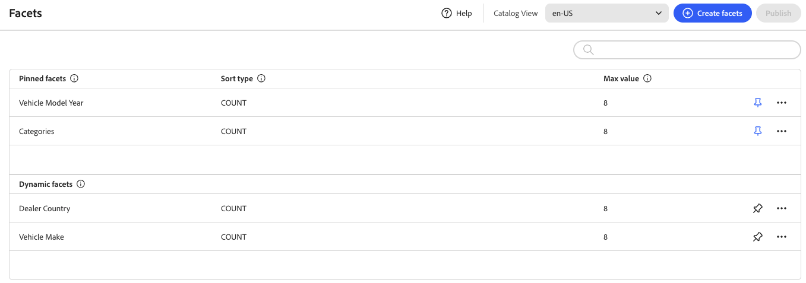

# Facetten Workspace

Der *Facetten*-Arbeitsbereich listet alle derzeit verfügbaren Facetten auf und bietet Zugriff auf die Tools, die Sie zum Einrichten und Verwalten von Facetten benötigen. Angeheftete Facetten werden zuerst in der Liste der vorhandenen Facetten angezeigt, gefolgt von dynamischen Facetten. Sie können die Facettenliste durchsuchen.

## Feldbeschreibungen

| Feld | Beschreibung |
|--- |--- |
| Erstellen von Facetten | Öffnet den [Facetteneditor](add.md). |
| Label | Die [Facettenbezeichnung](type.md#facet-labels) die in der Storefront sichtbar ist, kann aus Gründen der Konsistenz mit Ihrer Marke bearbeitet werden. |
| Sortierungstyp | Die Methode, die zum [ von ](type.md#sort-type) verwendet wird. Alle [!DNL Adobe Commerce Optimizer] Storefronts sortieren Facetten alphabetisch und nach `Count`. options: Alphabetisch - Sortiert Facetten alphabetisch. Anzahl - Sortiert Facetten nach der Anzahl der gefundenen Übereinstimmungen. |
| Maximaler Wert | Die maximale Anzahl von Werten, die für jede Facette in der Storefront angezeigt werden können. Facetten, die einen Wertebereich darstellen, sind gleichmäßig verteilt. Gültige Einträge: 0 - 100; Standard: 8. |

## Kontrollen

| Kontrolle | Beschreibung |
|--- |--- |
|  | Fixiert oder hebt die Fixierung einer Facette an den Anfang der Liste *Filter* auf. |
|  | Zeigt ein Menü mit weiteren Aktionen an, die auf die ausgewählte Facette angewendet werden können. Optionen: Bearbeiten, Löschen |
