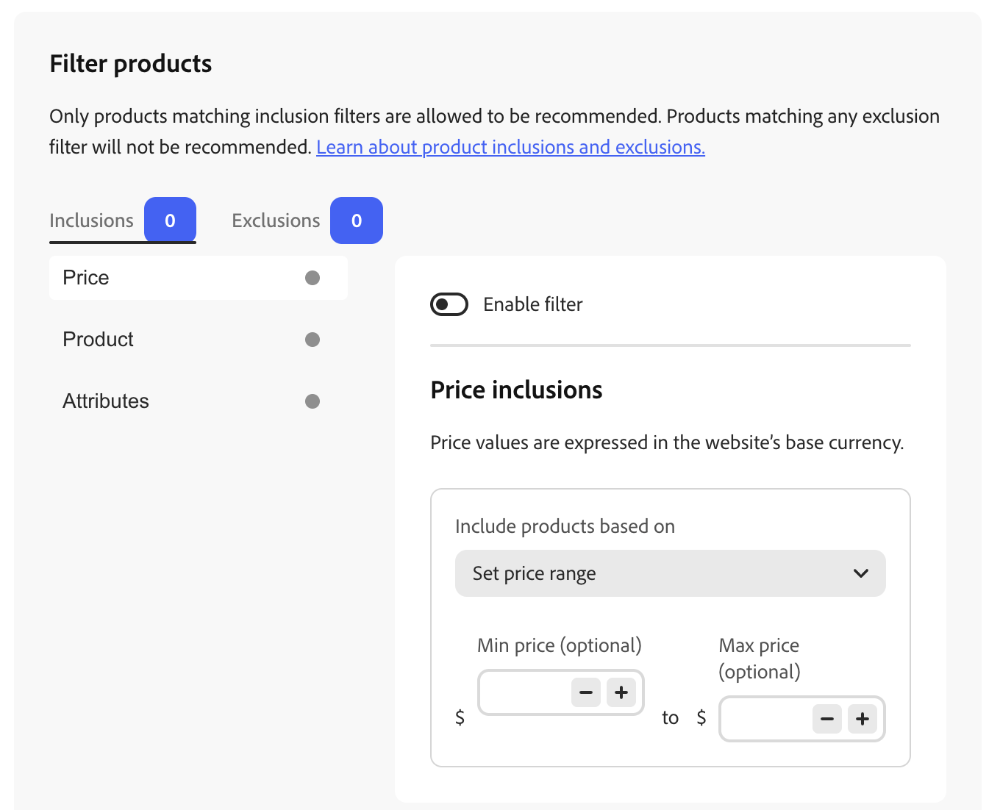
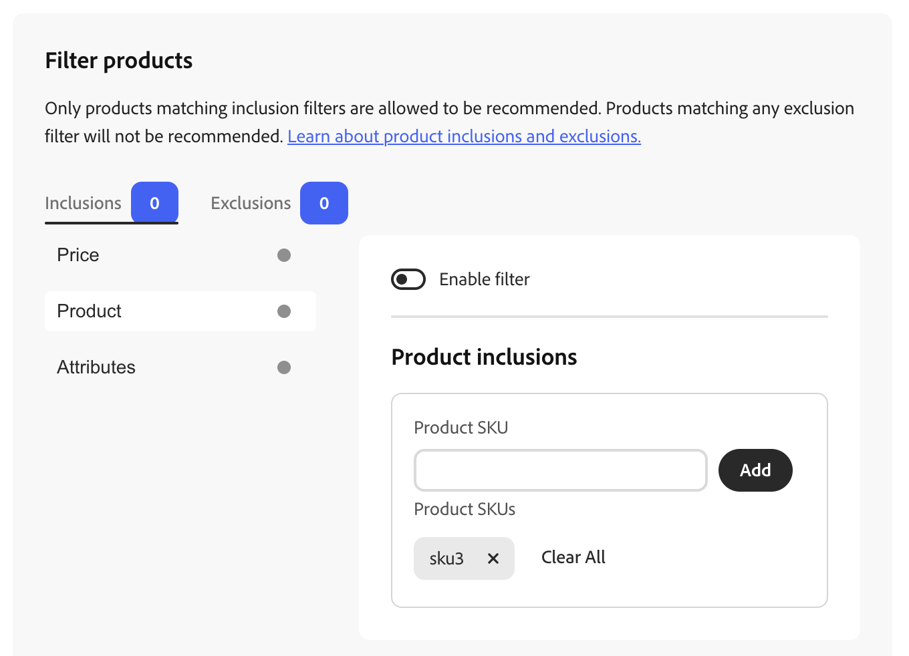
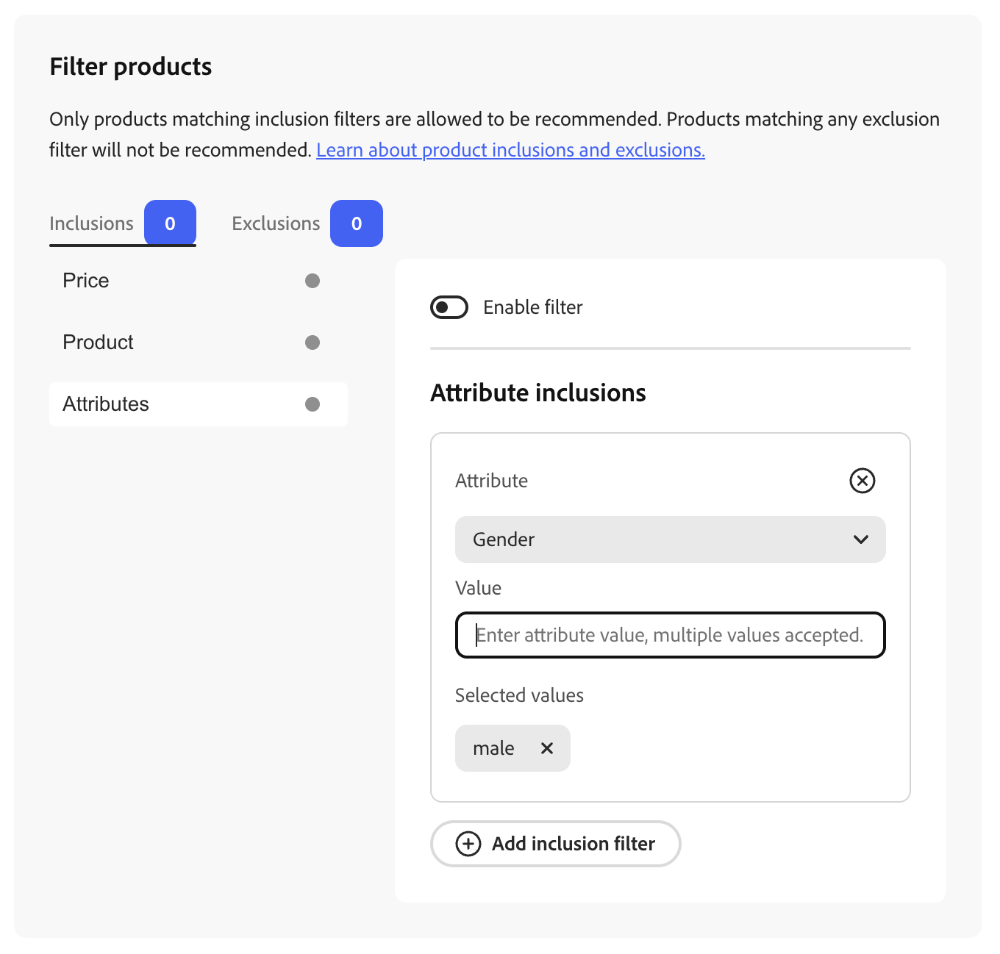

# Produkte filtern

[!DNL Adobe Commerce Optimizer] wendet nicht konfigurierbare Standardfilter automatisch auf Empfehlungseinheiten an. Wenn mehrere Empfehlungseinheiten auf einer Seite bereitgestellt werden, filtert [!DNL Adobe Commerce Optimizer] alle Produkte heraus, die in den Einheiten wiederholt werden. Es wird nur der erste Hinweis auf ein wiederholtes Produkt verwendet, um Platz für andere zu empfehlende Produkte zu schaffen. [!DNL Adobe Commerce Optimizer] filtert auch alle zuvor gekauften Produkte und diejenigen aus, die sich im Warenkorb befinden.

Wenn Sie [Empfehlungseinheit erstellen](create.md) können Sie Filter definieren, die steuern, welche Produkte in Recommendations angezeigt werden können. Diese Filter basieren auf einem Satz von Ein- oder Ausschlussbedingungen, die Sie definieren. In den Empfehlungen werden nur Produkte angezeigt, die allen Einschlussbedingungen entsprechen. Produkte, die eine der Ausschlussbedingungen erfüllen, werden nicht empfohlen.

Sie können mehrere Filter konfigurieren und nur die gewünschten aktivieren, indem Sie den Umschalter auf jeder Filterseite auswählen. Auf diese Weise können Sie Entwürfe von Filtern für die zukünftige Verwendung erstellen. Die Anzahl der aktivierten Filter wird auf jeder Registerkarte angezeigt.

## Bedingungen

Bedingungen können statisch oder dynamisch sein.

- Eine statische Bedingung verwendet vorhandene Produktattribute, um zu bestimmen, welche Produkte in der Einheit angezeigt werden können. Sie können beispielsweise angeben, dass nur Lagerprodukte mit einem Preis über 25 USD in der Einheit angezeigt werden.

- Eine dynamische Bedingung bestimmt den aktuellen Kontext eines Käufers, z. B. die aktuell angezeigte Kategorie oder das angezeigte Produkt. Wenn Sie beispielsweise eine Produktempfehlung erstellen, die auf Produktdetailseiten bereitgestellt werden soll, können Sie einen [dynamischen Preisfilter) verwenden](#dynamic-price-filters-relative-to-current-product) um Produkte innerhalb eines relativen Preisbereichs des aktuell angezeigten Produkts ein- oder auszuschließen.

### Logische Operatoren

Die logischen Operatoren `AND` und `OR` werden verwendet, um mehrere Bedingungen miteinander zu verbinden. Wenn Sie über Filtertypen hinweg sowohl Ein- als auch Ausschlussfilter verwenden, werden Einschlüsse zunächst ausgewertet, um alle möglichen Produkte zu ermitteln, die empfohlen werden können. Anschließend werden Produkte, die mit Ausschlussfiltern übereinstimmen, aus der Liste entfernt. **Preis** Filter verwenden eine andere Reihenfolge zwischen den Preisregeln: zuerst Ausschlüsse, dann Einschlüsse. Siehe [Ein- und Ausschlussregeln verwenden den Preis](#how-include-and-exclude-rules-use-price).

- `AND` - Verbindet zwei Einschlussfilterbedingungen
- `OR` - Verbindet zwei Ausschluss-Filterbedingungen

## Filtertypen

Jeder Filtertyp bezieht sich auf einen anderen Aspekt des Katalogs, z. B. Produkt und Preis, sodass Sie eingrenzen oder erweitern können, welche Produkte für eine Einheit infrage kommen. Wählen Sie die Typen aus, die Ihren Merchandising-Zielen entsprechen, und kombinieren Sie dann die Ein- und Ausschlussbedingungen nach Bedarf. In den folgenden Unterabschnitten wird beschrieben, wie sich jeder Typ verhält und wie [!DNL Adobe Commerce Optimizer] ihn anwendet.

>[!NOTE]
>
>Es können nur Produkte empfohlen werden **die Ihren** Einschluss“ entsprechen. Alle Produkte, die mit einem Filter **Ausschluss** übereinstimmen, werden entfernt.

### Preis {#price}

>[!IMPORTANT]
>
>Die Preisfilterung befindet sich in der Beta-Phase.

Die Preisfilterung nutzt den **endgültigen berechneten Preis** jedes Produkts aus dem &quot;**Preisbuch“ des Storefronts,** dem Preisbuch entspricht, das der Storefront zugewiesen wurde, in der die Empfehlungseinheit gerendert wird.

Dieser Wert:

- **Enthält**, Sonderangebote und Sonderpreise, die in diesem Preisbuch definiert sind (nicht Listenpreis allein).
- **Ausgeschlossen** Anpassungen auf Versand- und Warenkorbebene.
- **Gilt nur** für das aktive Preisbuch für diese Storefront; andere Storefronts oder Preisbücher werden nicht verwendet.

Konfigurieren Sie die Zuordnung von Preisbüchern zu einer Storefront in Ihrem Katalog und [Preisbücher](../../setup/pricebooks.md) Setup.

#### Einschließen und Ausschließen von Regeln und Preis {#how-include-and-exclude-rules-use-price}

- **Ausschlussregeln** - Produkte, deren Endpreis (**) einem** definierten Preisausschluss entspricht, werden zuerst entfernt.
- **Einschlussregeln** - Von den übrigen Kandidaten kommen nur Produkte, deren Endpreis **allen**) definierten Preiseinschlussbedingungen entspricht, weiterhin für eine Förderung in Frage. Dazu gehören alle aktivierten Einschlussfilter (z. B. Ihre Preisregel plus alle anderen Einschlussregeln).

Preisregeln **filtern** die vom Empfehlungskandidaten festgelegten Regeln; sie **keine** Neubewertung von Produkten. Die Engine erzeugt eine Rangliste, Regeln für Preise, die Produkte einschließen und ausschließen, entfernen Produkte aus dieser Liste, und die relative Reihenfolge der verbleibenden Produkte bleibt gleich. Wenn weniger Produkte als die Einheitenanfragen qualifiziert sind, werden nur gültige Elemente angezeigt. Wenn keiner qualifiziert ist, wird die Einheit nicht gerendert (kein leerer Platzhalter).

Der Preis, der auf Produkten innerhalb der Empfehlungseinheit angezeigt wird, ist derselbe **Endpreis** aus dem Preisbuch dieser Storefront, sodass das, was die Käufer sehen, mit dem Wert übereinstimmt, der für die Filterung verwendet wird. In der Admin-Vorschau können konfigurierbare Produkte eine Preisspanne anzeigen, wenn Variantenpreise unterschiedlich sind. Siehe [Konfigurierbare Produkte in der Vorschau](#configurable-products-in-preview).

#### Statische Preisspanne

Verwenden Sie einen **statischen** Preisfilter, wenn Sie ein festes Minimum oder Maximum in der Basiswährung Ihres Geschäfts wünschen, unabhängig vom Produkt, das ein Käufer anzeigt.

##### Einrichten eines statischen Preisfilters

1. Beim [Erstellen oder Bearbeiten](create.md) einer Empfehlungseinheit öffnen Sie **[!UICONTROL Filter products]** (oder gehen Sie zum Schritt _Filter_ im Einheitenworkflow).
1. Wählen Sie die Registerkarte **[!UICONTROL Inclusions]** oder **[!UICONTROL Exclusions]** aus, je nachdem, ob Sie nur Produkte in einer Preisspanne zulassen oder Produkte in einer Preisspanne blockieren möchten. Das Badge auf jeder Registerkarte zeigt an, wie viele Filter dieses Typs aktiviert sind.
1. Wählen Sie in der Liste auf der linken Seite **[!UICONTROL Price]**.
1. Schalten Sie **[!UICONTROL Enable filter]** ein.

   Die Preiswerte verwenden die **Basiswährung der Website**, wie auf der Seite angegeben.

1. Öffnen Sie **[!UICONTROL Include products based on]** (auf der Registerkarte **[!UICONTROL Inclusions]**) oder das entsprechende Steuerelement auf der Registerkarte **[!UICONTROL Exclusions]** und wählen Sie **[!UICONTROL Set price range]** aus.
1. Legen Sie eine optionale **[!UICONTROL Min price]** und/oder **[!UICONTROL Max price]** mithilfe der Felder neben dem Währungssymbol fest. Sie können Beträge eingeben oder die Steuerelemente **-** und **+** verwenden, um Werte anzupassen. Lassen Sie eine Bindung leer, wenn Sie keine Mindest- oder Höchstwerte benötigen. Die Bandbreite wird mit dem endgültigen berechneten Preis jedes Produkts für das aktive Preisbuch der Storefront verglichen.
1. Stellen Sie die Konfiguration der Empfehlungseinheit fertig und speichern oder veröffentlichen Sie wie gewohnt, damit der Filter wirksam wird.

#### Dynamische Preisfilter (relativ zum aktuellen Produkt) {#dynamic-price-filters-relative-to-current-product}

Verwenden Sie einen **dynamischen** Preisfilter, wenn die Recommendations in Bezug auf das **aktuell angezeigte Produkt** auf einer Produktdetailseite (PDP) beschränkt sein sollen. Der Filter verwendet den Endpreis dieses Produkts als **Anker** und vergleicht empfohlene Produkte mit den von Ihnen definierten Grenzen.

Dynamische Operatoren sind nur für [SKU-bezogene Empfehlungstypen](types.md) verfügbar, die in einem Produktkontext ausgeführt werden:

- hat dieses angezeigt, hat Folgendes angezeigt
- Das hier angesehen, das gekauft
- Das kaufte ich, das kaufte ich
- Ähnliche Themen
- Visuelle Ähnlichkeit

Sie sind **nicht** für populäritätsbasierte Typen verfügbar, da diese Einheiten nicht über ein einziges aktuelles Produkt verfügen, um den Filter zu verankern:

- Am häufigsten angezeigt
- Am häufigsten gekauft
- Am häufigsten zum Warenkorb hinzugefügt
- Trend
- Empfohlen
- Zuletzt angesehen
- Konvertierung von Ansicht in Warenkorb
- Konvertierung für Kauf anzeigen

In der Storefront liest das Recommendations-Dropdown-Menü den Preis des aktuellen Produkts aus dem PDP-Kontext und sendet ihn zusammen mit der Recommendations-Anfrage. [!DNL Adobe Commerce Optimizer] verwendet diesen Wert als Anker bei der Bewertung dynamischer Preisregeln. Bei konfigurierbaren Produkten ist der Anker der **niedrigste Variante** Endpreis (`priceRange.minimum`).

##### Operatoren

In **[!UICONTROL Include products based on]** (oder der entsprechenden Ausschlüsse) können Sie Folgendes auswählen:

| Benutzerin oder Benutzer | Zweck |
| --- | --- |
| **Kleiner oder gleich dem aktuellen Produktpreis** | Produkte an oder unterhalb einer Grenze, die vom Ankerpreis abgeleitet ist, plus Versatz ein- oder ausschließen. |
| **Größer oder gleich dem aktuellen Produktpreis** | Ein- oder Ausschließen von Produkten an oder über einer Grenze, die aus dem Ankerpreis plus einem Offset abgeleitet wurde. |
| **Innerhalb eines Wertebereichs des aktuellen Produkts** | Produkte einschließen oder ausschließen, deren Endpreis in ein festes Währungsband um den Anker fällt (Offsets vom aktuellen Preis). |
| **Innerhalb eines Prozentbereichs des aktuellen Produkts** | Ein- oder Ausschließen von Produkten, deren Endpreis innerhalb einer Prozentspanne um den Anker liegt. |

##### Versatzsemantik

Für **Kleiner oder gleich dem aktuellen Produktpreis** und **Größer oder gleich dem aktuellen Produktpreis** ist der eingegebene Wert ein **numerischer Offset, der zum Ankerpreis hinzugefügt wird**, um die Grenze zu bilden:

- Ein **negativer** Versatz verschiebt die Grenze **unter** den aktuellen Produktpreis.
- Ein **positiver** Versatz verschiebt die Grenze **oberhalb** des aktuellen Produktpreises.
- **Empty** oder **0** bedeutet **kein Limit** auf dieser Seite; das Backend behandelt sie gleich.
- Sie können **0** nicht als Grenze für „genau den aktuellen Produktpreis“ verwenden.

Dies entspricht [!DNL Product Recommendations] auf PaaS. Beschriftungen in Admin spiegeln diese Semantik direkt wider.

##### Dynamischen Preisfilter einrichten

1. [Erstellen oder bearbeiten](create.md) eine **SKU-bezogene** Empfehlungseinheit, die auf der Seite **Produktdetails** (oder einer anderen Platzierung, an der sich ein aktuelles Produkt immer im Kontext befindet) bereitgestellt wird.
1. Öffnen Sie **[!UICONTROL Filter products]** und wählen Sie die Registerkarte **[!UICONTROL Inclusions]** oder **[!UICONTROL Exclusions]** aus.
1. Wählen Sie **[!UICONTROL Price]** aus und schalten Sie **[!UICONTROL Enable filter]** ein.
1. Öffnen Sie **[!UICONTROL Include products based on]** (oder das Äquivalent „Ausschlüsse„) und wählen Sie einen dynamischen Operator aus (z. B **„Innerhalb eines Wertebereichs des aktuellen Produkts**).
1. Geben Sie Versätze oder Bereichswerte nach Aufforderung ein. Verwenden Sie die Vorschau, um die Ergebnisse für ein Beispielprodukt zu bestätigen.
1. Speichern oder veröffentlichen Sie die Einheit.

Ungültige Werte (nicht numerische Beträge, nicht unterstützte Kombinationen oder Bereiche, in denen das Minimum größer als das Maximum ist) blockieren das Speichern und zeigen Validierungsfehler an. **[!UICONTROL Save]** bleibt deaktiviert, bis der Filter gültig ist.

##### Wenn kein Ankerpreis verfügbar ist

Wenn ein dynamischer Preisfilter aktiviert ist, die Storefront jedoch keinen aktuellen Produktpreis bereitstellen kann (z. B. wird die Einheit außerhalb eines PDP-Kontexts gerendert), gibt [!DNL Adobe Commerce Optimizer] keine ungefilterten Empfehlungen zurück. Die Einheit zeigt **keine Empfehlungen**, da die Anzeige ungefilterter Ergebnisse nicht mit der von Ihnen konfigurierten Regel übereinstimmen würde.

##### Konfigurierbare Produkte in der Vorschau {#configurable-products-in-preview}

Im Admin **Bedienfeld** Vorschau) werden die empfohlenen Produktpreise wie folgt angezeigt:

- **Einfache Produkte** - Ein Endpreis aus der GraphQL-Antwort.
- **Konfigurierbare Produkte** - Wenn die Mindest- und Höchstvariantenpreise unterschiedlich sind, zeigt die Vorschau einen Bereich an (z. B. `$min – $max`). Wenn sie gleich sind, wird ein einheitlicher Preis angezeigt.

Der Ankerpreis, der für dynamische Filterberechnungen für ein konfigurierbares Produkt verwendet wird, ist immer **(**) Variantenendpreis, der mit der Storefront übereinstimmt.

#### Beispiele für Preisfilter

Die folgenden Beispiele verwenden einen aktuellen Produktpreis von **$500**. Passen Sie Einbindung versus Ausschluss an Ihr Merchandising-Ziel an.

| Benutzerin oder Benutzer | Tabulator | Ziel | Beispiel-Begrenzung |
| --- | --- | --- | --- |
| Kleiner oder gleich dem aktuellen Produktpreis | Ausschlüsse | Upsell fördern, indem kostengünstigere Alternativen verborgen werden | Produkte ≤ 500 $ ausschließen |
| Kleiner oder gleich dem aktuellen Produktpreis | Einschlüsse | Budgetfreundliche Alternativen anbieten | Produkte ≤ 500 $ einschließen |
| Größer oder gleich dem aktuellen Produktpreis | Ausschlüsse | Vermeiden von Upsell in einem budgetfokussierten Fluss | Produkte ≥ 500 $ ausschließen |
| Größer oder gleich dem aktuellen Produktpreis | Einschlüsse | Alternativen zu Oberflächenprämien | Produkte ≥ 500 $ einschließen |
| Innerhalb eines Wertebereichs des aktuellen Produkts | Ausschlüsse | Abkehr von ähnlichen Preispunkten | Ausschließen von 400 bis 600 $ |
| Innerhalb eines Wertebereichs des aktuellen Produkts | Einschlüsse | Vergleichbare Alternativen in einem schmalen Bereich anzeigen | Einschließen von 400 bis 600 $ |
| Innerhalb eines Prozentbereichs des aktuellen Produkts | Ausschlüsse | Reduzieren Sie Artikel zu ähnlichen Preisen (z. B. ±20 %) | Ungefähr 400 bis 600 $ ausschließen |
| Innerhalb eines Prozentbereichs des aktuellen Produkts | Einschlüsse | Fairer Vergleich innerhalb einer vergleichbaren Bandbreite | Einschließlich ca. 400 bis 600 $ |

### Produkt

Produktfilter zielen auf einzelne Katalogelemente nach **SKU** ab. Sie können eine oder mehrere SKUs hinzufügen, um entweder nur diese Produkte zuzulassen (**Einschlüsse**) oder sie zu blockieren (**Ausschlüsse**), indem Sie dieselbe **[!UICONTROL Filter products]** wie [Preisfilter](#price). Sie können keine deaktivierten Produkte oder Produkte anzeigen, die nicht einzeln in einer Empfehlungseinheit sichtbar sind; diese Produkte werden unabhängig von Filtern nie in der Storefront angezeigt.

#### Einrichten eines Produktfilters

1. Beim [Erstellen oder Bearbeiten](create.md) einer Empfehlungseinheit öffnen Sie **[!UICONTROL Filter products]** (oder gehen Sie zum Schritt _Filter_ im Einheitenworkflow).
1. Wählen Sie die Registerkarte **[!UICONTROL Inclusions]** oder **[!UICONTROL Exclusions]** aus. Das Badge auf jeder Registerkarte zeigt an, wie viele Filter dieses Typs aktiviert sind.
1. Wählen Sie in der Liste auf der linken Seite **[!UICONTROL Product]**.
1. Schalten Sie **[!UICONTROL Enable filter]** ein.

   Die Überschrift des rechten Bedienfelds spiegelt die Registerkarte wider, z. B. **[!UICONTROL Product inclusions]** oder das Äquivalent für Ausschlüsse.

1. Geben Sie **[!UICONTROL Product SKU]** eine SKU ein und klicken Sie auf **[!UICONTROL Add]**. Wiederholen Sie diesen Schritt, um weitere SKUs hinzuzufügen.

   Unter **[!UICONTROL Product SKUs]** wird jede SKU als entfernbares Tag angezeigt. Klicken Sie **X** auf ein Tag, um diese SKU zu entfernen, oder klicken Sie auf **[!UICONTROL Clear All]**, um alle SKUs aus der Liste zu entfernen.

1. Stellen Sie die Konfiguration der Empfehlungseinheit fertig und speichern oder veröffentlichen Sie wie gewohnt, damit der Filter wirksam wird.

Für **Einschlüsse** können nur Produkte empfohlen werden, deren SKUs aufgelistet sind (und die mit Ihren anderen aktivierten Einschlussfiltern übereinstimmen). Für **Ausschlüsse** wird kein Produkt empfohlen, dessen SKU aufgelistet ist, selbst wenn es ansonsten qualifiziert wäre.

>[!NOTE]
>
>Untergeordnete Produkte eines konfigurierbaren Produkts werden nicht in einer Empfehlungseinheit angezeigt, da diese untergeordneten Produkte die Sichtbarkeit &quot;_einzeln sichtbar“_.

### Attribute {#attributes}

>[!NOTE]
>
>Die Attributfilterung befindet sich in der Beta-Phase.

Mit Attributfiltern können Sie Produkte basierend auf Produktattributwerten ein- oder ausschließen. Dabei wird dieselbe **[!UICONTROL Filter products]** wie bei [Preis](#price)- und [Produkt](#product)Filtern verwendet.

#### Über Attributfilter

Ein Attributfilter unterscheidet sich von einem [Produktfilter](#product) insofern, als er Produkte nach gemeinsamen Attributwerten und nicht nach einzelnen SKU anstrebt. Anstatt beispielsweise jede SKU aufzulisten, die einer Kategorie zugewiesen ist, können Sie einen einzelnen Attributfilter erstellen, der alle Produkte auflistet, die dieser Kategorie zugewiesen sind.

#### Einrichten eines Attributfilters

Führen Sie die folgenden Schritte aus, um einer Empfehlungseinheit eine Regel zum Einschließen oder Ausschließen von Attributen hinzuzufügen.

1. Beim [Erstellen oder Bearbeiten](create.md) einer Empfehlungseinheit zu **[!UICONTROL Filter products]** wechseln.
1. Wählen Sie die Registerkarte **[!UICONTROL Inclusions]** oder **[!UICONTROL Exclusions]** aus. Das Badge auf jeder Registerkarte zeigt an, wie viele Filter dieses Typs aktiviert sind.
1. Wählen Sie in der Liste auf der linken Seite **[!UICONTROL Attributes]**.
1. Wählen Sie ein Attribut aus dem Selektor aus, z. B **„Kategorie**.
1. Geben Sie **[!UICONTROL Value]** einen Wert für das Attribut ein, z. B. **pants**.
1. Drücken Sie **Eingabetaste** oder klicken Sie auf **[!UICONTROL Add inclusion filter]** (oder das entsprechende Ausschlusssteuerelement), um den Attributfilter hinzuzufügen.
1. Stellen Sie die Konfiguration der Empfehlungseinheit fertig und speichern oder veröffentlichen Sie wie gewohnt, damit der Filter wirksam wird.

>[!NOTE]
>
>Wenn Sie ein Attribut auswählen, dessen Metadaten auf `true` `number`, z. B **Größe**, zeigt das **Wert**-Feld Bereichseingaben anstelle eines einzelnen Textwerts an.

#### Ein- und Ausschlussbedingungen verwenden

Es dürfen nur Produkte empfohlen werden, die mit Einschlussfiltern übereinstimmen. Produkte, die einem Ausschlussfilter entsprechen, werden nicht empfohlen.

#### Kombinieren von Bedingungen

Wenn ein Attributfilter mehrere Werte enthält oder mit anderen Bedingungen kombiniert wird, gilt die folgende Logik.

- Wenn mehrere Werte für dasselbe Attribut ausgewählt sind, werden die Werte mit `OR` kombiniert.
- Bedingungen für verschiedene Attribute (z. B. Farbe und Größe) werden mit `AND` kombiniert - ein Produkt muss allen Attributen entsprechen. Wenn Sie dasselbe Attribut als separate Bedingungen hinzufügen, anstatt mehrere Werte in einer Bedingung einzugeben, werden diese Bedingungen ebenfalls mit `AND` kombiniert, nicht mit `OR`.
- Wenn mehrere Ausschlussbedingungen vorliegen, wird ein Produkt entfernt, wenn es einer der Ausschlussbedingungen entspricht.
- Wenn Sie sowohl Einschluss- als auch Ausschlussfilter verwenden, finden Sie weitere Informationen unter [Logische Operatoren](#logical-operators).

<!--
#### Availability by recommendation type

Hiding this for now as we need better clarification on what "limited" means.

Attribute filter support varies by recommendation type.

| Recommendation type | Inclusion support | Exclusion support |
| --- | --- | --- |
| Most viewed | Yes | Yes |
| Most purchased | Yes | Yes |
| Trending | Yes | Yes |
| Recommended for you | Limited | Yes |
| Viewed this, viewed that | Limited | Yes |
| Viewed this, bought that | Limited | Yes |
| Bought this, bought that | Limited | Yes |
| More like this | Limited | Yes |
| Visual similarity | No | Yes |
| Recently viewed | No | Limited |
| Recently purchased | No | Limited |
-->

#### Verfügbarkeit, Validierung und Fehlerbehebung

- Wenn leere Attributwerte oder ungültige Bedingungen vorhanden sind, werden Empfehlungen nicht in der Storefront oder im Vorschaubereich gerendert.
- Die Attributwerte müssen genau mit den Werten in Ihrem Katalog übereinstimmen, einschließlich Leerzeichen und Groß-/Kleinschreibung.
- Wenn keines der Produkte die Filterkriterien erfüllt, werden die Empfehlungen nicht in der Storefront oder im Vorschaubereich gerendert.
