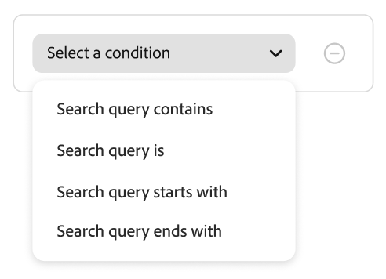

# Regeln erstellen und verwalten

Um eine Regel zu erstellen, öffnen Sie den Regeleditor, wählen Sie einen **Regeltyp** aus (Suchbedingungen, Standardauflistung oder Kategorieseiten), definieren Sie dann Bedingungen und Rangfolgen, wo sie gelten, testen Sie die Ergebnisse und veröffentlichen Sie die Regel.

## Erstellen einer Regel {#create-a-rule}

1. Navigieren Sie in der linken Leiste zu _Merchandising_ > **Merchandising-Regeln**.
1. (Optional) Verwenden Sie das **Katalogansicht**, um die Katalogansicht auszuwählen, in der die Regel angewendet werden soll. Die von Ihnen erstellte Regel wird auf die ausgewählte Ansicht beschränkt (oder auf alle Katalogansichten, wenn **Alle Ansichten** ausgewählt ist). Siehe [Auswählen der &#x200B;](workspace.md#select-catalog-view)), wie der Umfang der Katalogansicht funktioniert.

   >[!IMPORTANT]
   >
   >Katalogansichten befinden sich derzeit in der [Beta](https://experienceleague.adobe.com/en/docs/commerce-operations/release/beta#merchandising-rules-globally-and-per-catalog-view-public-beta). Beta-Teilnehmer müssen alle vorhandenen Merchandising-Regeln neu erstellen, um den neuen Umfang der Katalogansicht nutzen zu können.

1. Klicken Sie auf **[!UICONTROL Create rule]** , um den Regeleditor zu starten.

### Regeltypen

Jeder Regeltyp verfügt im Editor über ein Informationssymbol mit einer kurzen Erläuterung. Verwenden Sie den Typ, der entspricht, wo Käufer die Merchandising-Logik sehen sollen:

| Regeltyp | Zweck |
| --- | --- |
| **Regel „Alle Produkte“** | Standard-Ranking und Merchandising in allen Produktlisten, wenn keine spezifischere Such- oder Kategorieregel gilt. Sie können nur eine solche Regel erstellen; sie kann keine Bedingungen enthalten. |
| **Kategorieregel** (Beta) | Wendet Merchandising und Ranking auf eine oder mehrere ausgewählte Kategorien an und steuert die Produktbestellung auf diesen Kategorieseiten. |
| **Suchregel** | Wendet Merchandising und Ranking an, wenn Käufer eine Suche ausführen, die den Abfragebedingungen der Regel entspricht. |

Im Abschnitt **Regel erstellen** definieren Sie den Regelnamen, den Zeitplan, unabhängig davon, ob die Regel für alle Listen oder für bestimmte Suchbedingungen gilt, sowie Ranking-Typen.

1. Geben Sie im Feld **[!UICONTROL Name]** einen Namen für die Regel ein. Alle Regelnamen müssen eindeutig sein.
1. Geben Sie im Feld **[!UICONTROL Description]** eine Beschreibung für die Regel ein.
1. Geben Sie im Feld **[!UICONTROL Date range]** das Datum oder den Datumsbereich an, zu dem die Regel aktiv sein soll.
1. Wählen Sie im Abschnitt **[!UICONTROL Rule applies to]** den [Regeltyp](#rule-types) aus, den Sie verwenden möchten.

>[!BEGINTABS]

>[!TAB Suchregel]

Eine Suchregel wendet eine Merchandising- und Ranking-Logik an, wenn Käufer eine Suche durchführen, die den definierten Bedingungen entspricht.

Die Bedingungen sind die Voraussetzungen für den Trigger eines Ereignisses. Eine Regel kann bis zu zehn Bedingungen und 25 Ereignisse enthalten. Eine Standardregel darf keine Bedingungen enthalten.

**Einzel-Bedingung**

1. Wählen *unter „Regel erstellen* die **Bedingung** aus und befolgen Sie die Anweisungen, um die Anweisung abzuschließen.

   - Suchanfrage enthält : Geben Sie die Textzeichenfolge ein, die in der Abfrage des Erstkäufers enthalten sein muss. Die Einstellung Übereinstimmung bestimmt das Ausmaß, in dem die Abfrage des Käufers mit dem Katalog übereinstimmt. Optionen:   Beliebig - Jeder Teil des Abfragetextes des Käufers kann mit der Bedingung übereinstimmen. Alle - Die Abfrage des Käufers muss der Bedingung entsprechen.
   - Suchabfrage ist - Geben Sie eine Textzeichenfolge ein, die genau mit der Abfrage des Erstkäufers übereinstimmt. Zum Beispiel: „Yogahose“. Regeln mit den `All` &quot;`Search query is`&quot; und „Übereinstimmung“ können nur eine Bedingung haben.
   - Suchabfrage beginnt mit : Geben Sie ein Zeichen oder eine Zeichenfolge ein, die am Anfang der Abfrage des Erstkäufers stehen muss.
   - Suchabfrage endet mit : Geben Sie ein Zeichen oder eine Zeichenfolge ein, die am Ende der Abfrage des Erstkäufers stehen muss.

   Die Ergebnisse werden sofort im Bereich *Regel testen* angezeigt und nach Priorität nummeriert. Mit dem Schieberegler *Ergebnisse pro Zeile* oben rechts können Sie die Anzahl der Produkte in jeder Zeile ändern.

1. Um andere Abfragen zu testen, ändern Sie den Abfragetext im Suchfeld *Regel testen* und drücken Sie **Return**.
Zunächst rendert der Testbereich die Abfrage aus dem Suchfeld Bedingungen . Jetzt wird die Abfrage jedoch aus dem Feld Testabfrage gerendert. Im Testbereich wird jeweils nur eine Abfrage gerendert.
1. Wenn Ihnen das Ergebnis gefällt, aktualisieren Sie den Text im Suchfeld *Bedingungen* . Klicken Sie dann auf eine beliebige Stelle auf der Seite, um die Ergebnisse im Testbereich zu aktualisieren.
1. Legen Sie [Intelligente Rangfolge](#intelligent-ranking) und [Manuelle Rangfolge](#manual-ranking) wie in den folgenden Abschnitten beschrieben fest. Die gleichen Steuerelemente gelten für Kategorieseiten, wobei alle Unterschiede hervorgehoben werden.

**Mehrere Bedingungen**

1. Um eine Regel mit mehreren Bedingungen zu erstellen, klicken Sie auf **Bedingung hinzufügen**.
Eine Regel kann bis zu zehn Bedingungen enthalten. Der logische Operator, der zwei Bedingungen verknüpft, basiert auf der aktuellen Einstellung *Übereinstimmung*. Standardmäßig ist *Match* `All` und der logische Operator ist `AND`.

1. Wählen Sie die zweite Bedingung aus und geben Sie den erforderlichen Abfragetext ein.

1. Um die Logik der Regel zu ändern, ändern Sie die Einstellung **Übereinstimmung**, um zu bestimmen, wie genau die Suchkriterien des Käufers mit der Abfragebedingung übereinstimmen müssen. Legen **Match** auf eine der folgenden Einstellungen fest:

   - Beliebig - (Standard) Alle logischen Operatoren in der Regel sind auf `OR` festgelegt, und die Ergebnisse werden im Testbereich angezeigt.
   - Alle - Alle logischen Operatoren in der Regel sind auf `AND` festgelegt, und die Ergebnisse werden im Testbereich angezeigt.

   Der *Match*-Wert bestimmt den logischen Operator, der zum Verbinden mehrerer Bedingungen verwendet wird. Durch Ändern der *Übereinstimmung*-Einstellung werden alle logischen Operatoren in der Regel geändert. `AND` und `OR` können nicht in derselben Regel kombiniert werden.

   In diesem Beispiel gibt es zwei separate Abfragen, die nach „Yoga“ oder „Hose“ suchen, anstatt nach „Yoga-Hose“ zu suchen. Diese Regel ist weniger spezifisch und wird häufiger in der Storefront ausgelöst als in der anderen.

1. Um eine weitere Bedingung hinzuzufügen, klicken Sie auf **Bedingung hinzufügen** und wiederholen Sie den Vorgang.
1. Legen Sie [Intelligente Rangfolge](#intelligent-ranking) und [Manuelle Rangfolge](#manual-ranking) wie in den folgenden Abschnitten beschrieben fest. Die gleichen Steuerelemente gelten für Kategorieseiten, wobei alle Unterschiede hervorgehoben werden.

>[!TAB Kategorieregel]

>[!IMPORTANT]
>
>Kategorieregeln befinden sich in der Beta-Phase.

Kategorieregeln steuern, wie Produkte auf (Kategorieseiten **bestellt**. Sie kombinieren **Kategorieregeln** mit **intelligentem Ranking** (einschließlich KI-gesteuerter Signale) und **manuellen** Aktionen wie Pin, Boost und Bury. So können Sie Discovery kuratieren, Promotions ausführen und Kategorieseiten an Ihrer Strategie ausrichten, ohne sich auf externe Tools verlassen zu müssen.

1. Wählen **unter** die Kategorie(n) aus, für die die Regel gelten soll. Ausgewählte Kategorien werden unter dem Steuerelement angezeigt, sodass Sie den Umfang bestätigen können.
1. Sie können in der angezeigten Liste der Kategorien auf die drei Punkte klicken und Folgendes auswählen:

   - **Löschen** - Entfernt die Kategorie aus der Regel.
   - **Auf Unterkategorien anwenden** - Wendet die Regel auf Unterkategorien an, für die noch keine aktive Merchandising-Regel definiert ist.
   - **Vorschau** - Zeigt an, wie die Kategorieseite in Ihrer Storefront angezeigt würde.

1. Legen Sie [Intelligente Rangfolge](#intelligent-ranking) und [Manuelle Rangfolge](#manual-ranking) wie in den folgenden Abschnitten beschrieben fest. Die gleichen Steuerelemente gelten für Suchregeln, wobei alle Unterschiede hervorgehoben werden.

>[!ENDTABS]

### Intelligente Rangfolge {#intelligent-ranking}

Intelligente Rangfolgen bestellen Produkte mithilfe **Verhaltenssignalen** und gegebenenfalls KI. Sie gilt für **Suchregeln**, **alle Produktlisten** (Standardregeln) und **Kategorieregeln** (Kategorieseiten). Bei Einkäufern **Suchvorgängen** wiegt das Ranking auch **textliche Relevanz** für die Abfrage; **Kategorieseiten** verwenden Abfragetext nicht auf die gleiche Weise - der Editor konzentriert sich auf Verhaltensstrategien.

Store-Inhaber können Strategien wie die folgenden festlegen. Exakte Beschriftungen und Zeitfenster stimmen mit dem Regeleditor überein und können je nach Regeltyp leicht abweichen.

- **Am häufigsten gekauft**/**Am häufigsten gekauft** - Sortiert nach der Kaufhäufigkeit pro SKU in einem aktuellen Fenster (z. B. in den vorherigen 7 Tagen für Suchkontexte).
- **Am häufigsten zum Warenkorb hinzugefügt** - Sortiert nach der Gesamtaktivität von Hinzufügungen zum Warenkorb in einem aktuellen Fenster (z. B. die letzten 7 Tage für Suchkontexte).
- **Am häufigsten angezeigt** - Sortiert die Ansichten nach SKU in einem aktuellen Fenster (z. B. in den letzten 7 Tagen für Suchkontexte).
- **Empfohlen für Sie** - Verwendet das `viewed-viewed` Signal: Käufer, die diese SKU angesehen haben, haben auch andere SKUs angesehen; unterstützt, sofern verfügbar, die personalisierte Sortierung auf Kategorieseiten.
- **Trending** - betont die jüngste Popularität (für Suchen, Seitenansichten in den letzten 72 Stunden für Hintergrund-Ereignisse und 24 Stunden für Vordergrund-Ereignisse).
- **None** - Für Such- und Standardauflistungen werden die Produkte nach **Relevanz** sortiert. Bei **Kategorieregeln** wird die standardmäßige Merchandising-Reihenfolge für die Kategorie verwendet, wenn Sie keine andere intelligente Strategie auswählen.

Wählen Sie die Strategie für Ihre Regel aus. Im **[!UICONTROL Test your rule]** Bereich werden die erwarteten Ergebnisse für suchorientierte Regeln angezeigt. **Kategorienregeln** verwenden die Kategorievorschau.

#### Intelligente Ranking-Optimierung {#intelligent-ranking-boost}

Für **Empfohlen für Sie**, **Am häufigsten angezeigt**, **Am häufigsten gekauft**, **Am häufigsten zum Warenkorb hinzugefügt** und **Trending** zeigt der Editor **[!UICONTROL Intelligent Ranking Boost]** (den Verstärkungsfaktor) an. Er wird nicht verwendet, wenn Sie &quot;**&quot;**.

Verwenden Sie diese Steuerung, um abzuwägen, wie stark **Verhaltenssignale** die Sortierung in Bezug auf **textliche Relevanz** auf der Suche und in Bezug auf andere Rangfolgesignale auf **Kategorieseiten** und **Standardlisten**. Der Boost ist für **Suchregeln** die **Regel „Alle Produkte** und **Kategorieregeln** verfügbar. Jede Regel speichert ihren eigenen Wert.

| Verhalten | Detail |
| --- | --- |
| Standard | `5` (entspricht dem vorherigen festen Verhaltensmultiplikator). |
| Bereich | Von `1` (sanfter Verhaltenseinfluss) bis `100` (stärkerer Einfluss). Die Obergrenze kann sich in einer zukünftigen Version ändern. |
| Umfang | Gilt nur für Abfragen oder Listeneinträge, die das Ziel der Regel sind. Andere Regeln behalten ihre eigenen Verstärkungswerte bei. |
| Vorschau | Die Regelvorschau verwendet denselben Verstärkungsfaktor wie Live-Ergebnisse für diese Regel. |
| Indizierung | Wird zur **Abfragezeit** angewendet. Sie benötigen keinen Katalog neu synchronisieren oder vollständig neu indizieren, nur weil Sie diese Einstellung geändert haben. |

**Wann die Verstärkung erhöht oder verringert werden soll**

- **Verstärken** Wenn Strategien wie **Am häufigsten angezeigt** SKUs mit hoher Interaktion für mehrdeutige oder umfassende Abfragen aggressiver aufzeigen sollten, ohne jeden Steckplatz manuell anzuheften.
- **Verringern** Sie den Anstieg, wenn Sie die Qualität der Textübereinstimmung verbessern möchten, um die Liste strenger zu gestalten, und Verhaltensdaten sollten die Reihenfolge nur geringfügig verbessern.

**Wann sollte stattdessen die manuelle Rangfolge verwendet werden**

Verwenden Sie **Pin**, **Boost** oder **Bury**, wenn Sie bestimmte Produkte in exakten Positionen oder garantierter Sichtbarkeit benötigen, unabhängig von katalogweiten Signalen. **[!UICONTROL Intelligent Ranking Boost]** passt für diese Regel eine **globale** Verhaltensgewichtung an; sie ersetzt nicht die Steuerung auf SKU-Ebene.

>[!NOTE]
>
> Eine hohe **[!UICONTROL Intelligent Ranking Boost]** kann einen **manuellen Schub** auf demselben Produkt überwiegen. Wenn eine geboosterte SKU einen niedrigeren Rang als erwartet in der Regelvorschau oder in der Storefront, einen niedrigeren **[!UICONTROL Intelligent Ranking Boost]** oder **Pin** hat, das Produkt an eine bestimmte Position. Jede Änderung verschiebt das manuell sortierte Produkt höher in der Liste.

#### Funktionsweise der intelligenten Rangfolgenbewertung (Suche)

Für **Suchergebnisse** (und die Testabfrage im Regeleditor) bestimmt ein intelligentes Ranking die endgültige Produktreihenfolge, indem zwei Schlüsselfaktoren kombiniert werden: **Textrelevanz** und **Verhaltenssignale**. Wenn Sie verstehen, wie diese Faktoren interagieren, können Sie realistische Erwartungen an Ihre Suchergebnisse stellen.

**Bewertungskomponenten:**

- **Textrelevanz**: Der dominante Faktor bei der Bewertung. Dadurch wird gemessen, wie gut der Name, die Beschreibung und die Attribute eines Produkts mit der Suchanfrage übereinstimmen. Die Textrelevanz-Bewertung ist unbegrenzt (hat keine bestimmte Obergrenze) und wird durch Faktoren wie folgende beeinflusst:

   - Häufigkeit des Auftretens von übereinstimmenden Wörtern.
   - Länge (in Worten) der Produktnamen/-beschreibungen.

- **Verhaltenssignale**: Ein begrenzter Verstärker, der zusätzlich zum Textrelevanzwert angewendet wird. Wenn Sie eine intelligente Rangfolgestrategie wie „Am häufigsten angezeigt“ oder „Am häufigsten gekauft“ auswählen, erhalten Produkte mit höheren Verhaltenssignalen eine höhere relative Gewichtung. Die Stärke dieser Gewichtung wird durch **[!UICONTROL Intelligent Ranking Boost]** gesteuert (siehe [Intelligente Rangverstärkung](#intelligent-ranking-boost)). Die Steigerung bleibt begrenzt, aber Sie können erhöhen, wie viel sie der Reihenfolge nach verschiebt.

**Warum das am häufigsten angezeigte Produkt möglicherweise nicht zuerst angezeigt wird:**

Die textliche Relevanz dominiert oft das Ranking, da die Punktzahl unbegrenzt ist, während der verhaltensbezogene Einfluss durch das Boost-Modell begrenzt wird. Produkte mit sehr starken Textübereinstimmungen können SKUs mit höherer Interaktion immer noch übertreffen, es sei denn, Sie erhöhen **[!UICONTROL Intelligent Ranking Boost]** für diese Regel. Selbst bei höheren Verstärkungswerten kann eine extreme Textrelevanzlücke die Liste nicht vollständig umkehren. Die Qualität der Textübereinstimmung bleibt ein Hauptgrund. Bestätigen Sie Ihre Fragen immer **[!UICONTROL Test your rule]**.

**Beispiel:**

Ein Händler verwendet die „am häufigsten angesehene“ intelligente Rangfolgestrategie und sucht nach **Kerze**. Sie erwarten, dass die Produkt-SKU YAN-K-E-512 an der Spitze der Ergebnisse angezeigt wird, da sie die höchste Ansichtsanzahl aufweist. Andere Produkte sind jedoch höher:

- **Texas Candle** (1. Position): Hat einen kürzeren, saubereren Produktnamen, der einen sehr hohen Textrelevanzwert erzeugt. Obwohl es weniger Ansichten als **YAN-K-E-512** hat, überwiegt seine überlegene Textübereinstimmung den Verhaltensschub.

- **YAN-K-E-512** (untere Position): Obwohl der Name das höchste Ansichts-Perzentil in den Verhaltensdaten mit dem Status „Am häufigsten angezeigt“ hat, erzeugt sein komplexer, auf SKU basierender Name einen niedrigeren Textrelevanzwert. Im **[!UICONTROL Intelligent Ranking Boost]** (`5`) reicht der Verhaltenseinfluss möglicherweise nicht aus, um diese Textlücke zu schließen. Bei Produkten, die bereits mit der **übereinstimmen, kann die Steigerung** YAN-K-E-512) höher ausfallen. **YAN-K-E-512** muss auch mit der Abfrage übereinstimmen: Mindestens ein durchsuchbares Attribut für diese SKU muss **candle** enthalten, sonst wird es nicht in den Ergebnissen angezeigt und die Steigerung kann nicht angewendet werden.

**Beispiel (allgemeine Abfrage):**

Bei einer Abfrage wie **Holz** können mehrere Produkte eine ähnliche Textrelevanz aufweisen, während die Anzahl der Ansichten unterschiedlich ist. Wenn **Am häufigsten angezeigt** ausgewählt ist, steigt die Wahrscheinlichkeit, dass die historisch am häufigsten angezeigte relevante SKU mit zunehmender **[!UICONTROL Intelligent Ranking Boost]** über leichtere Übereinstimmungen auftaucht. Durch das Verringern der Steigerung können die Ergebnisse näher an der reinen Textreihenfolge liegen.

Unter [Suchregeln](./best-practice.md#tips-to-optimize-search-rules) erfahren Sie, wie Sie die Auffindbarkeit von Produkten mithilfe von Regeln verbessern.

#### Einschränkungen

- Apostrophe und Anführungszeichen in Abfragen können zu einigen kleineren Problemen mit Rangfolge und Relevanz in einigen Sprachen führen.
- Um sicherzustellen, dass das intelligente Ranking für **Suche** ordnungsgemäß funktioniert, stellen Sie sicher, dass **Suchgewichtung** für alle Attribute, die für die Suche oder Filterung (Facetten) verwendet werden, `5` oder kleiner ist. (Diese Anleitung gilt für die Suchindizierung, nicht für Merchandising-Flüsse, die nur einer Kategorie angehören.)

Informationen zum Festlegen der Suchgewichtung finden Sie unter [Metadaten-API](https://developer.adobe.com/commerce/services/reference/rest/).

### Manuelle Rangfolge {#manual-ranking}

**Manuelle Rangfolge** Ereignisse passen die Produktreihenfolge für **Suchergebnisse** (wenn die Bedingungen Ihrer Regel erfüllt sind), für **Standardproduktlisten** und für **Kategorieseite** an. Eine einzelne Regel kann bis zu 25 Ereignisse enthalten.

- **Verstärken** - Verschiebt ein Produkt in der Liste nach oben.
- **Bury** - Verschiebt eine SKU weiter unten in der Liste.
- **Produkt anheften** - Fixiert ein Produkt an der ausgewählten Position in der Auflistung.
- **Produkt ausblenden** - Schließt eine SKU aus den Ergebnissen aus (suchorientiert; Verhalten für Kategorieregeln im Editor bestätigen).

Die einfachste Möglichkeit, ein Produkt anzuheften, besteht darin, es per Drag-and-Drop zu ziehen.

1. Klicken und ziehen Sie ein Produkt in den Testbereich. Ziehen Sie sie per Drag-and-Drop an die gewünschte Position. Die Felder Produkt und Position werden automatisch im Bereich Ereignisse ausgefüllt.

Sie können auch auf das Anheften-Symbol klicken, um ein Produkt an seinen aktuellen Speicherort anzuheften. Verwenden Sie das Kontextmenü mit den Auslassungspunkten, um „Nach oben“ oder „Nach unten“ anzuheften.

>[!NOTE]
>
>**Suchregeln** - Sie können nur Produkte anheften, die in den Suchergebnissen für die konfigurierten Abfrage- und Regelbedingungen angezeigt werden. Produkte müssen indiziert, sichtbar und vorrätig sein und alle Regelfilter erfüllen, damit sie angeheftet werden können. Wenn ein Produkt nicht in der Vorschau oder in den Ergebnissen für Ihre Regel angezeigt wird, hat das Anheften keine Auswirkung.
>
>**Standardsortierung** — Manuelle Positionen werden angewendet, wenn der Käufer die Standardsortierung verwendet: **Sortieren nach:** Relevanz für die Suche oder **Relevanz** / **Position** für Kategorienlisten. Wenn der Erstkäufer die Sortierreihenfolge ändert, z. B. nach Name, angeheftet, verstärkt, begraben oder ausgeblendet, stimmt das Verhalten möglicherweise nicht mehr mit der Vorschau überein.

Oder Ereignisse können manuell festgelegt werden:

1. Wählen *unter* die Option **Ereignis** aus, die ausgeführt werden soll, wenn die zugehörigen Bedingungen erfüllt sind.

   Wählen Sie beispielsweise `Hide a product`. Geben Sie dann den Namen des Produkts ein, das Sie ausblenden möchten. Produkte werden bei der Eingabe vorgeschlagen.

1. Wählen Sie für mehrere Ereignisse alle anderen Ereignisse aus, die Sie bei Erfüllung der Bedingungen als Trigger festlegen möchten.

### Regel abschließen {#finalizing-the-rule}

1. Untersuchen Sie die Ergebnisse der Regel im Testbereich.
1. Wenn die Regel mehrere Abfragen umfasst, testen Sie jede, die von der Regel betroffen sein könnte.
1. Klicken Sie abschließend auf **Speichern und**.

   Die Regel wird der Liste im Arbeitsbereich *Regeln* hinzugefügt.

1. Obwohl aktive Regeln sofort in Kraft treten, müssen Sie möglicherweise bis zu 15 Minuten warten, bis die zwischengespeicherten Abfrageergebnisse in der Storefront aktualisiert werden.

>[!NOTE]
>
>Regeln und manuell sortierte Produkte werden auf **Suchergebnisse** angewendet, wenn die standardmäßige Sortierreihenfolge „Sortieren nach: Am relevantesten“ ausgewählt ist. Wenn ein Käufer die Sortierreihenfolge ändert, sodass sie etwa nach Namen sortiert wird, sind Regeln und manuelle Rankings nicht mehr wirksam. Für **category**-Listen wird das Standardsortierverhalten unter „Manuelles [&quot; &#x200B;](#manual-ranking).

## Regeln bearbeiten, anzeigen und löschen {#edit-view-and-delete-rules}

Befolgen Sie diese Anweisungen, um die Eigenschaften vorhandener Regeln zu aktualisieren. Sie können die Katalogansicht (den Umfang) einer Regel nicht ändern, nachdem sie erstellt wurde. Der Umfang wird beim Erstellen der Regel festgelegt. Siehe [Auswählen einer Katalogansicht](workspace.md#select-catalog-view).

### Regel bearbeiten

1. Suchen Sie im Arbeitsbereich *Merchandising* Regeln“ die Regel in dem Raster, das Sie bearbeiten möchten, und klicken Sie auf **Mehr** (…) Optionen.
1. Klicken Sie **Bearbeiten**, um auf den Regeleditor zuzugreifen.
1. Aktualisieren Sie die Bedingungen, Operatoren und Ereignisse nach Bedarf.
1. Aktualisieren Sie die Felder Name, Start- und Enddatum sowie Beschreibung nach Bedarf. Alle Regelnamen müssen eindeutig sein.
1. Testen Sie die Regel.
1. Veröffentlichen Sie die Änderungen.
Die Regel wird der Liste im Arbeitsbereich *Regeln* hinzugefügt. Obwohl aktive Regeln sofort in Kraft treten, kann es bis zu 15 Minuten dauern, bis zwischengespeicherte Abfrageergebnisse in der Storefront aktualisiert werden.

### Details anzeigen

Diese Option bietet eine schnelle Möglichkeit, alle Regelparameter anzuzeigen, während Sie auf der Tabelle *Regeln* bleiben.

1. Suchen Sie im Arbeitsbereich *Merchandising* Regeln“ die Regel in dem Raster, das Sie bearbeiten möchten, und klicken Sie auf **Mehr** (…) Optionen.
1. Klicken Sie **Details anzeigen**, um die Regelparameter anzuzeigen.
1. Wählen Sie **Bearbeiten** oder **Löschen** oder klicken Sie auf das X, um das Bedienfeld zu schließen.

### Regel löschen

1. Suchen Sie im Arbeitsbereich *Regeln* die Regel in dem Raster, das Sie bearbeiten möchten, und klicken Sie auf **Mehr** (…) Optionen.
1. Klicken Sie **Löschen**.

## Feldbeschreibungen {#field-descriptions}

### Bedingungen (falls)

| Bedingung | Beschreibung |
|--- |--- |
| Suchanfrage enthält | Ein Zeichen oder eine Zeichenfolge, das bzw. die in der Abfrage des Käufers enthalten ist. Die Abfrage des Käufers muss nur einem einzigen Zeichen entsprechen, um diese Bedingung zu erfüllen. |
| Suchabfrage ist | Ein Zeichen oder eine Textzeichenfolge, das bzw. die genau mit der Abfrage des Käufers übereinstimmt. Komplexe Abfragen mit mehreren Bedingungen können nicht erstellt werden, wenn diese Bedingung verwendet wird. |
| Suchanfrage beginnt mit | Die Abfrage des Käufers beginnt mit diesem Zeichen oder dieser Zeichenfolge. |
| Suchanfrage endet mit | Die Abfrage des Käufers endet mit diesem Zeichen oder dieser Zeichenfolge. |

### Logische Operatoren

| Benutzerin oder Benutzer | Beschreibung |
|--- |--- |
| ODER | (Standard) Der logische Operator `OR` vergleicht zwei Bedingungen und erfüllt die Anforderungen für den Trigger eines Ereignisses, wenn mindestens eine Bedingung erfüllt ist. |
| UND | Der logische Operator `AND` vergleicht zwei Bedingungen und erfüllt die Anforderungen für den Trigger eines Ereignisses, wenn beide Bedingungen erfüllt sind. |

### Operatoren abgleichen

| Benutzerin oder Benutzer | Beschreibung |
|--- |--- |
| Beliebig | Ändert alle logischen Operatoren in der Regel in `OR` und gibt den Satz übereinstimmender Produkte zurück. |
| Alle | Ändert alle logischen Operatoren in der Regel in `AND` und gibt den Satz übereinstimmender Produkte zurück. |

### Manuelle Ranking-Ereignisse

| Ereignis | Beschreibung |
|--- |--- |
| Verstärken | Verschiebt eine SKU oder einen Bereich von SKUs in der Liste nach oben (Suche oder Kategorie). Jede Version ist in den Testergebnissen mit einem „erweiterten“ Vorschau-Badge gekennzeichnet. |
| begraben | Verschiebt eine SKU oder einen Bereich von SKUs in den unteren Bereich der Liste. Jedes wird in den Testergebnissen mit einem „Buried“-Vorschauabzeichen gekennzeichnet. |
| Produkt anheften | Fügt einer bestimmten Position im Listeneintrag eine einzelne SKU hinzu. Das Produkt ist in den Testergebnissen mit einem „angehefteten“ Vorschauabzeichen gekennzeichnet. |
| Produkt ausblenden | Schließt eine SKU oder eine Reihe von SKUs aus den Ergebnissen aus (suchorientiert; Kategorieregeln im Editor bestätigen). |

### Intelligente Ranking-Steuerelemente

| Feld | Beschreibung |
| --- | --- |
| [!UICONTROL Intelligent Ranking Boost] | Wenn eine andere intelligente Strategie als **Keine** ausgewählt wird, steuert diese Einstellung, wie stark sich Verhaltenssignale auf das Ranking für diese Regel auswirken. `5`; zulässiger Bereich `1`-`100`. Wird zur Abfragezeit angewendet. Die Regelvorschau entspricht dem Live-Verhalten der konfigurierten Regel. |

### Details

| Feld | Beschreibung |
|--- |--- |
| -Name | Der Name der Regel. Regelnamen müssen eindeutig sein. |
| Regeltyp | **Standard** (alle Produktlisten), **Abfrage** (spezifische Suchbedingungen) oder **Kategorie** (Kategorieseiten), je nachdem, für **Regel gilt**. |
| Startdatum | Das Startdatum der Regel, falls geplant. |
| Enddatum | Das Enddatum der Regel, falls geplant. |
| Beschreibung | Eine kurze Beschreibung der Regel. |
