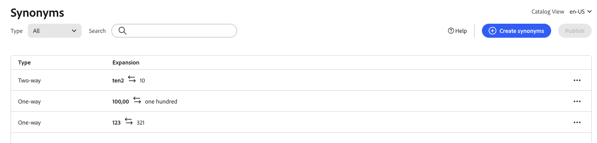

# Erstellen von Synonymen

Erhöhen Sie die Kundeninteraktion, indem Sie Ihre eigene kuratierte Liste [!DNL Adobe Commerce Optimizer] Synonyme hinzufügen. Pro Shop können bis zu 200 Synonyme hinzugefügt werden.

## Schritt 1: Synonym hinzufügen

1. Navigieren Sie in der linken Leiste zu _Merchandising_ > **Synonyme**.
1. Klicken Sie auf die Schaltfläche **[!UICONTROL Add synonyms]** .

## Schritt 2: Synonym nach Typ definieren

Befolgen Sie die Anweisungen für den [Typ des Synonyms](type.md) den Sie erstellen möchten.

### Zweiweg-Synonym

1. Akzeptieren Sie die standardmäßige **bidirektionale** Option.

   

1. Geben Sie den **Keyword**-Begriff oder die zuzuordnende Phrase ein.
1. Geben Sie **Begriffe**Erweiterung) ein, die Sie als Synonyme für das Keyword hinzufügen möchten. Trennen Sie mehrere Begriffe durch Kommas.
In diesem Beispiel lautet das Keyword, mit dem eine Übereinstimmung erzielt werden soll, „Hose“, und die Menge der Ausdehnungsbegriffe lautet „Hose, Hose“.

   

1. Klicken Sie abschließend auf **Speichern**.

   Die Gruppe von Synonymen wird in der Liste mit einem Pfeil in beide Richtungen zwischen den einzelnen Begriffen angezeigt, was bedeutet, dass die Begriffe austauschbar sind.

   

### Einwegsynonym

1. Klicken Sie auf **Einwegsynonym** Typ.

   

1. Geben Sie die Begriffe **Keyword** und **Erweiterung** ein. Trennen Sie mehrere Begriffe durch Kommas.

   

   In diesem Beispiel ist das Keyword „pants“ und die Einweg-Erweiterungsbegriffe „capris, peddle-pushers“ sind jeweils eine Untergruppe von „pants“, jedoch mit einer bestimmten Bedeutung.

1. Klicken Sie abschließend auf **Speichern**.

   Der Satz von Synonymen wird in der Liste mit einem Einwegpfeil angezeigt, der von den Erweiterungsbegriffen auf das Keyword verweist, um anzugeben, dass die Begriffe Untergruppen des Keywords sind. Ein Pluszeichen trennt jeden Expansionsbegriff.

   

## Schritt 3: Änderungen veröffentlichen

1. Klicken Sie nach Abschluss der Synonyme auf **Veröffentlichen**.
1. Warten Sie bis zu zwei Stunden, bis Ihre Aktualisierungen in der Storefront verfügbar werden.

## Feldbeschreibungen

| Feld | Beschreibung |
|--- |--- |
| [Typ](type.md) | Bestimmt, ob die Synonyme dieselbe Bedeutung wie das Keyword haben oder eine Teilmenge des Keywords sind. options: bidirektional (Standard) - Begriffe, die dieselbe Bedeutung wie das Keyword haben und dieselben Suchergebnisse zurückgeben unidirektional - Begriffe, die eine Teilmenge des Keywords sind. Einwegsynonyme geben eine engere Liste spezifischer Produkte zurück. |
| Schlüsselwort | Ein Wort, das normalerweise mit einer Auswahl von Produkten in Ihrem Katalog verknüpft ist. |
| Expansion | Zusätzliche Begriffe, die dieselbe oder eine ähnliche Bedeutung wie das Keyword haben. |

## Verwalten von Synonymen

Befolgen Sie diese Anweisungen, um bestehende [!DNL Adobe Commerce Optimizer] ([) ](overview.md) verwalten.

## Synonym suchen

Um das Auffinden eines Synonyms zu erleichtern, können Sie die Liste nach Typ filtern und nach Keyword oder Expansionsbegriff suchen. Diese Methoden können einzeln oder gemeinsam verwendet werden.

1. Um die Liste zu filtern, setzen **Typ** auf einen der folgenden Werte:

   - Alle
   - unidirektional
   - wechselseitig

1. Um nach einem Keyword oder einem Erweiterungsbegriff zu suchen, geben Sie mindestens drei Zeichen in das **[!UICONTROL Search]** ein.

## Synonym bearbeiten

1. Suchen Sie das Synonym, das Sie bearbeiten möchten, und klicken Sie auf **Optionen** Mehr…).

1. Klicken Sie **Bearbeiten**.
Das Keyword ist der erste Begriff in der Liste, und jeder Begriff wird durch ein Komma getrennt. Die Schlüsselwort- und Erweiterungsbegriffe können aktualisiert werden, der Typ des Synonyms kann jedoch nicht geändert werden.
1. Klicken Sie auf das Element, das Sie bearbeiten möchten. Aktualisieren Sie dann den Text nach Bedarf.

1. Klicken Sie abschließend auf **Speichern**.

## Synonym löschen

1. Suchen Sie das Synonym, das Sie löschen möchten, in der Liste und klicken Sie auf **Mehr** (…) Optionen.
1. Klicken Sie **Löschen**.
1. Wenn Sie dazu aufgefordert werden, klicken **zur Bestätigung auf** Synonym löschen.

## Änderungen veröffentlichen

Um den Vorgang abzuschließen, müssen Ihre gespeicherten Änderungen in der Storefront veröffentlicht werden. Es kann bis zu zwei Stunden dauern, bis die Aktualisierungen live geschaltet werden.

1. Klicken Sie **Veröffentlichen**.
1. Suchen Sie oben auf der Seite nach der Meldung, die bestätigt, dass Ihre Änderungen veröffentlicht wurden.
