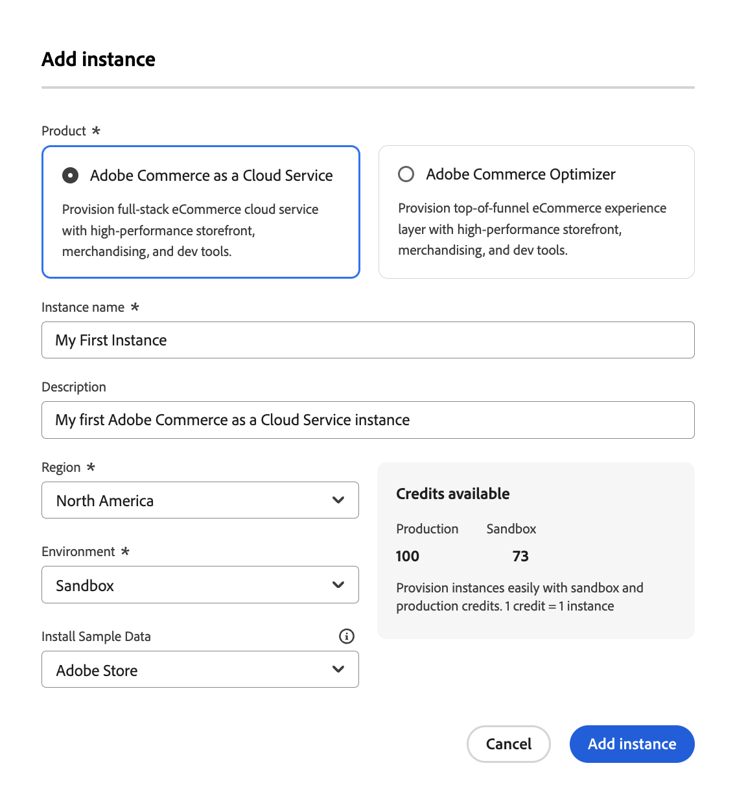

# Versionshinweise

Die folgenden Versionshinweise enthalten Aktualisierungen zu [!DNL Adobe Commerce Optimizer].

## August 2025

**Veröffentlichungsdatum:**. August 2025

>[!BEGINSHADEBOX]

### EU-Region jetzt verfügbar

Unterstützung für Kunden-IMS-Organisationen aus der Region der Europäischen Union (eu1) ist jetzt verfügbar. Sie können jetzt **Europäische Union** als **Region** auswählen, wenn [eine Commerce Optimizer-Instanz &#x200B;](./get-started.md#step-1-create-an-instance) Cloud Manager hinzufügen. Die Region der Europäischen Union ist nur für Produktionsumgebungen verfügbar.

Die Basis-Produktions-URLs für die Region der Europäischen Union lauten:

* Administrator: `https://eu1.admin.commerce.adobe.com`
* REST und GraphQL: `https://eu1.api.commerce.adobe.com`

{width="600" align="center" zoomable="yes"}

>[!ENDSHADEBOX]
