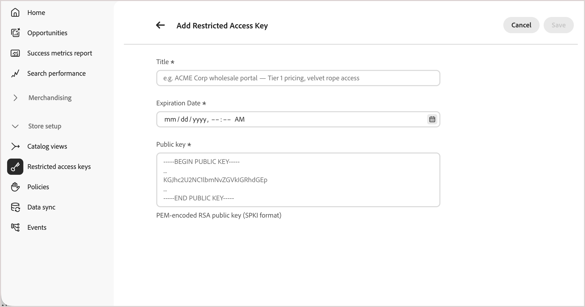

# Schlüssel für eingeschränkten Zugriff

Mithilfe von eingeschränkten Zugriffsschlüsseln können autorisierte Client-Anwendungen auf eine [private Katalogansicht](catalog-view.md) zugreifen. Nur Anfragen mit einem gültigen signierten Token aus einem zugewiesenen Schlüssel können Katalogdaten abrufen. Alle anderen Anfragen werden abgelehnt, einschließlich Anfragen von anonymen Käufern, Käufern, denen kein expliziter Zugriff auf diese Katalogansicht gewährt wurde, und Skripten, die die API untersuchen.

## Anwendungsfälle für Schlüssel mit eingeschränktem Zugriff

[!DNL Adobe Commerce Optimizer] bestimmt **[!UICONTROL Price Book ID]**, welche Preise eine Anfrage sieht - sie umfasst die Preise, nicht, wer die Anfrage stellen kann. Jeder Kunde, der die ID und Preisbuch-ID einer Katalogansicht kennt, kann diese Daten über die Merchandising-API abrufen. Eingeschränkte Zugriffsschlüssel fügen eine separate, ergänzende Kontrolle hinzu: Sie ermöglichen es, überhaupt auf eine Katalogansicht zuzugreifen, unabhängig davon, welches Preisbuch gilt.

Eingeschränkte Zugriffsschlüssel werden häufig für Folgendes verwendet:

- **Vertragsbasierte B2B-Preisfindung** - Schränken Sie eine Katalogansicht ein, die mit einem ausgehandelten Preisbuch verknüpft ist, sodass nur der Käufer, für den es gilt, es abfragen kann. Andere Einkaufsorganisationen und die Öffentlichkeit können das nicht.
- **Partner- und Reseller-**: Beschränken Sie eine Teilmenge des Katalogs auf genehmigte Partner, die direkt in die Merchandising-API integriert werden.
- **Vorabversionsvorschauen** - Ein vertrauenswürdiges internes System oder Partnersystem kann bevorstehende Produkte in der Vorschau anzeigen, bevor sie öffentlich sichtbar werden.

>[!IMPORTANT]
>
>Schlüsselgenerierung, Token-Signierung und Rotation werden derzeit vollständig von der Backend-Client-Anwendung verwaltet, die Käufer authentifiziert. [!DNL Adobe Commerce Optimizer] generiert oder dreht diese Schlüssel nicht in Ihrem Auftrag.

## Funktionsweise von eingeschränkten Zugriffsschlüsseln

Ein Schlüssel mit eingeschränktem Zugriff ist die öffentliche Komponente eines RSA-Schlüsselpaars. Ihre Client-Anwendung generiert und verwendet diesen Schlüssel, um zu beweisen, dass sie zum Lesen einer privaten Katalogansicht berechtigt ist. In diesem Zusammenhang bedeutet „Client-Anwendung“ das Backend-System, das Kunden authentifiziert - z. B. benutzerdefinierte Logik auf [!DNL Adobe Commerce] oder das Backend eines Drittanbieters -, niemals das Storefront-Frontend selbst.

Die folgenden Schritte beschreiben, wie ein Schlüsselpaar und ein signiertes Token von der Erstellung zur Validierung wechseln:

1. Ihre Client-Anwendung generiert ein RSA-Schlüsselpaar und behält den privaten Schlüssel bei.
1. Sie registrieren den **öffentlichen** Schlüssel in [!DNL Commerce Optimizer] als eingeschränkten Zugriffsschlüssel.
1. Ihre Client-Anwendung signiert ein JSON Web Token (JWT) mit dem privaten Schlüssel und fügt es bei jeder Anfrage in eine private Katalogansicht ein.
1. [!DNL Commerce Optimizer] validiert die Signatur des Tokens anhand des registrierten öffentlichen Schlüssels und gibt, falls gültig, die angeforderten Katalogdaten zurück.

## Erstellen eines eingeschränkten Zugriffsschlüssels

Generieren Sie zum ersten Testen privater Katalogansichten ein Schlüsselpaar mit einem Tool wie [!DNL OpenSSL]. Geheimnis des privaten Schlüssels beibehalten - nur der öffentliche Schlüssel wird in [!DNL Commerce Optimizer] hochgeladen.

```bash
openssl genrsa -out private-key.pem 2048
openssl rsa -in private-key.pem -pubout -out public-key.pem
```

Die Schlüsselgröße muss zwischen 2048 und 8192 Bit liegen. `public-key.pem` enthält den Wert, den Sie in das **[!UICONTROL Public key]** Feld unten einfügen.

## Hinzufügen eines eingeschränkten Zugriffsschlüssels zu [!DNL Commerce Optimizer]

1. Gehen Sie im linken Menü in [!DNL Adobe Commerce Optimizer Studio] zu **[!UICONTROL Store setup]** und klicken Sie auf **[!UICONTROL Restricted access keys]**.

   {width="70%" zoomable="yes"}

1. Klicken Sie auf **[!UICONTROL Add Restricted Access Key]**.

1. Geben Sie die wichtigsten Details ein:

   {width="70%" zoomable="yes"}

   - **[!UICONTROL Title]** - Eine Beschriftung zur Identifizierung des Schlüssels, die in der Schlüsselliste und der Tastenauswahl für die Katalogansicht angezeigt wird, z. B. `ACME Corp wholesale portal — Tier 1 pricing`.
   - **[!UICONTROL Expiration date]** - Datum und Uhrzeit (UTC), nach der der Schlüssel nicht mehr berücksichtigt wird, auch nicht bei einem Token, das noch nicht abgelaufen ist.
   - **[!UICONTROL Public key]** - Der PEM-kodierte öffentliche RSA-Schlüssel im SPKI-Format (Subject Public Key Info), einschließlich der `-----BEGIN PUBLIC KEY-----`- und `-----END PUBLIC KEY-----`. Muss in der gesamten Umgebung eindeutig sein.

1. Klicken Sie auf **[!UICONTROL Save]**.

Schlüssel sind nach der Erstellung unveränderlich. Um einen beliebigen Wert zu ändern, löschen Sie den Schlüssel und erstellen Sie einen neuen. Siehe [Drehen einer Taste](#rotate-a-key), um dies ohne Zugriffsunterbrechung zu tun.

## Zuweisen eines Schlüssels zu einer Katalogansicht

Ein Schlüssel mit eingeschränktem Zugriff schränkt den Zugriff nur ein, nachdem er einer Katalogansicht mit aktiviertem **[!UICONTROL Catalog Protection]** zugewiesen wurde. Siehe [Schützen einer &#x200B;](private-catalog-view.md#protect-a-catalog-view)) für Einrichtungsschritte.

## Schlüssel löschen

1. Suchen Sie auf der Seite **[!UICONTROL Restricted access keys]** den zu entfernenden Schlüssel und klicken Sie auf **[!UICONTROL Delete]**.

   Wenn der Schlüssel einer oder mehreren Katalogansichten zugewiesen ist, wird in einer Warnung erläutert, dass Client-Anwendungen, die auf diesen Schlüssel angewiesen sind, den Zugriff verlieren. Die Katalogansichten selbst bleiben geschützt - sie werden nicht öffentlich zugänglich.

1. Bestätigen Sie den Löschvorgang.

## Drehen eines Schlüssels

Um einen Schlüssel ohne Zugriffsunterbrechung zu drehen, können einer Katalogansicht bis zu drei Schlüssel gleichzeitig zugewiesen werden:

1. Generieren Sie ein neues Schlüsselpaar und fügen Sie den neuen öffentlichen Schlüssel als neuen Schlüssel mit beschränktem Zugriff hinzu.
1. Weisen Sie der Katalogansicht den neuen Schlüssel neben dem vorhandenen Schlüssel zu.
1. Signieren Sie neue Token mit dem neuen privaten Schlüssel, um das Rollover des Schlüssels abzuschließen.
1. Sobald alle Client-Anwendungen mit dem neuen Schlüssel bestätigt wurden, entfernen und löschen Sie den alten Schlüssel.

## Beschränkungen

Siehe [Katalogansichten und Richtlinienbeschränkungen](../boundaries-limits.md#catalog-views-and-policies).

## Ähnliche Themen

- [Private Katalogansichten](private-catalog-view.md) - Erfahren Sie, wie Sie eine Katalogansicht mit eingeschränkten Zugriffsschlüsseln schützen.

