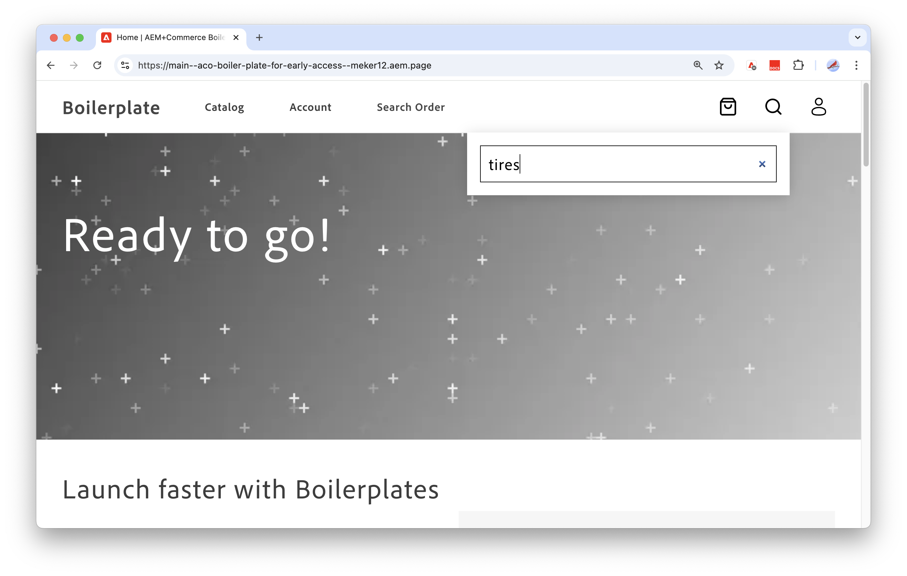

# Einrichten der Storefront

>[!NOTE]
>
>In dieser Dokumentation wird ein Produkt beschrieben, das sich in der Entwicklung für den frühzeitigen Zugriff befindet und nicht alle für die allgemeine Verfügbarkeit vorgesehenen Funktionen enthält.

In diesem Tutorial erfahren Sie, wie Sie eine [Adobe Commerce-Storefront mit Edge Delivery Services](https://experienceleague.adobe.com/developer/commerce/storefront/get-started/?lang=de) einrichten und verwenden, um eine leistungsstarke, skalierbare und sichere Commerce-Storefront auf der Grundlage von Daten aus Ihrer [!DNL Adobe Commerce Optimizer]-Instanz zu erstellen.


## Voraussetzungen

* Stellen Sie sicher, dass Sie über ein GitHub-Konto (github.com) verfügen, das Repositorys erstellen kann und für die lokale Entwicklung konfiguriert ist.

* Machen Sie sich mit dem grundlegenden Workflow und Vokabular zum Erstellen einer Storefront für Adobe Edge Delivery Services vertraut, indem Sie die [Übersicht](https://experienceleague.adobe.com/developer/commerce/storefront/get-started?lang=de) in der Dokumentation zur Adobe Commerce Storefront lesen.
* Einrichten der Entwicklungsumgebung


### Einrichten der Entwicklungsumgebung

Um Ihre Entwicklungsumgebung einzurichten, installieren Sie die erforderliche Version von Node.js und die Sidekick-Browser-Erweiterung.

#### Installieren von Node.js

Um Ihre [!DNL Adobe Commerce Optimizer] Storefront in Edge Delivery Services Project lokal zu entwickeln und zu testen, benötigen Sie Node.js Version 22.13.1 LTS.

Führen Sie bei Bedarf die folgenden Schritte aus, um Node Version Manager (NVM) und die erforderliche Node.js-Version zu installieren.

1. Installieren Sie Node Version Manager (NVM).

   ```bash
   curl -o- https://raw.githubusercontent.com/nvm-sh/nvm/v0.40.1/install.sh | bash
   ```

1. Installieren Sie Node.js und NPM. Weitere Informationen finden Sie unter [Node.js](https://nodejs.org/en/).

   ```bash
   nvm install 22
   ```

   ```bash
   npm install -g npm
   ```

1. Überprüfen Sie die Installation.

   ```bash
   npm -v
   ```

>[!TIP]
>
>Diese Einrichtung dient zur Entwicklung mit [!DNL Adobe Commerce Optimizer] und der Adobe Commerce Edge Delivery Service-Storefront. Zusätzliche Ressourcen zum Erweitern und Anpassen Ihrer [!DNL Adobe Commerce Optimizer]-Lösung sind über [App Builder für Adobe Commerce](https://experienceleague.adobe.com/de/docs/commerce-learn/tutorials/adobe-developer-app-builder/introduction-to-app-builder) und [API Mesh für Adobe Developer App Builder](https://experienceleague.adobe.com/de/docs/commerce-learn/tutorials/adobe-developer-app-builder/api-mesh/getting-started-api-mesh) verfügbar. Wenden Sie sich für Informationen zu Zugriff und Nutzung an Ihren Adobe-Kundenbetreuer.

#### Installieren von Sidekick

Installieren Sie die Sidekick-Browser-Erweiterung, um Storefront-Inhalte zu bearbeiten, in der Vorschau anzuzeigen und zu veröffentlichen. Siehe [Sidekick-Installationsanweisungen](https://www.aem.live/docs/sidekick#installation).


## Erstellen einer Storefront

Die Storefront, die Sie für Ihr [!DNL Adobe Commerce Optimizer]-Projekt erstellen, wird mit einer benutzerdefinierten Version des Adobe Commerce on Edge Delivery Services Storefront-Textbausteins erstellt. Das Textbaustein ist ein Satz von Dateien und Ordnern, die einen Ausgangspunkt für die Erstellung Ihrer Storefront bieten.

Dieser Einrichtungsprozess der Storefront wurde speziell für [!DNL Adobe Commerce Optimizer] Projekte angepasst. Der Fluss unterscheidet sich vom Fluss für die standardmäßige Einrichtung von [Adobe Commerce in der Edge Delivery Services-Storefront](https://experienceleague.adobe.com/developer/commerce/storefront/get-started/?lang=de).

>[!NOTE]
>
>In diesem Tutorial werden macOS, Chrome und Visual Studio Code als Entwicklungsumgebung verwendet. Der Bildschirm erfasst und Anweisungen spiegeln diese Einrichtung wider. Sie können ein anderes Betriebssystem, einen anderen Browser und einen anderen Code-Editor verwenden, aber die angezeigte Benutzeroberfläche und die erforderlichen Schritte variieren entsprechend.

### Workflow-Übersicht

Führen Sie diese Schritte aus, um eine Storefront zur Verwendung mit Adobe Commerce Optimizer einzurichten.

1. **[Erstellen eines Inhaltsordners](#step-1-create-a-content-folder)** Erstellen eines freigegebenen Inhaltsordners in Google Drive oder SharePoint. Dieser Ordner enthält Beispielinhalte und Assets für Ihre Storefront.

1. **[Erstellen eines Code-Repositorys](#step-1-create-a-code-repository)**-Erstellen Sie ein GitHub-Repository aus der Textvorlage Adobe Commerce + Edge Delivery Services . Schließen Sie alle Verzweigungen aus dem Quell-Repository ein.
1. **[Storefront-Textbaustein aktualisieren](#step-2-update-the-storefront-boilerplate)**-Aktualisieren Sie die benutzerdefinierte Textbausteinvorlage auf der `aco` Verzweigung des Repositorys, um Ihren Inhaltsordner mit der Storefront zu verbinden, und überprüfen Sie die Storefront-Konfiguration, die Daten von der Adobe Commerce Optimizer-Demoinstanz an Ihre Storefront bereitstellt.
1. **[Laden Sie den aktualisierten Textbausteincode der Storefront hoch](#step-3-upload-the-updated-boilerplate-code)**-Überschreiben Sie den Code auf der `main` Verzweigung mit dem aktualisierten Code aus der `aco` Verzweigung.
1. **[Fügen Sie die CodeSync-App hinzu](#step-4-add-the-aem-code-sync-app)**-Verbinden Sie Ihr Repository mit dem Edge Delivery-Service. Verbinden Sie die Code-Synchronisierungs-App erst, wenn Sie die Anpassung des Quell-Codes abgeschlossen haben und bereit sind, den Code in die `main` zu übertragen.
1. **[Vorschau und Veröffentlichung Ihres Inhalts](#step-5-preview-and-publish-your-content)** - Verwenden Sie die Sidekick-Erweiterung, um eine Vorschau anzuzeigen und den Site-Inhalt aus dem Inhaltsordner in der Storefront zu veröffentlichen.
1. **[Vorschau Ihrer Site und Anzeigen von Beispieldaten](#step-6-preview-your-site-and-view-sample-data)**-Stellen Sie eine Verbindung zu Ihrer Storefront-Site her, um den Beispielinhalt und die Daten aus der [!DNL Adobe Commerce Optimizer]-Demoinstanz anzuzeigen.
1. **[Entwickeln Sie die Storefront in Ihrer lokalen Umgebung](#step-7-develop-the-storefront-in-your-local-environmentdevelop-the-storefront-in-your-local-environment)**-Installieren Sie die erforderlichen Abhängigkeiten. Starten Sie den lokalen Entwicklungs-Server und aktualisieren Sie die Storefront-Konfiguration, um eine Verbindung zur [!DNL Adobe Commerce Optimizer]-Instanz herzustellen, die Adobe für Sie bereitgestellt hat.
1. **[Site-Inhalte verwalten](#step-8-manage-site-content)** Erfahren Sie mehr über das Aktualisieren und Verwalten von Site-Inhalten.

### Schritt 1: Erstellen eines Inhaltsordners

Befolgen Sie die Anweisungen in der Dokumentation zur Adobe Commerce-Storefront, um einen freigegebenen Inhaltsordner in Google Drive oder SharePoint hinzuzufügen und den Beispielinhalt hinzuzufügen. Der Beispielinhalt umfasst Bilder, Text und andere Assets, aus denen Ihre Site besteht.

* [Erstellen und Freigeben eines Google-Laufwerks oder SharePoint-Ordners](https://experienceleague.adobe.com/developer/commerce/storefront/get-started/?lang=de#create-and-share-folder)
* [Laden Sie den Beispielinhalt](https://experienceleague.adobe.com/developer/commerce/storefront/get-started/?lang=de#add-sample-content) in Ihren Ordner.

### Schritt 2: Code-Repository erstellen

Erstellen Sie ein Code-Repository in GitHub mit der Textvorlage Edge Delivery Services + Adobe Commerce . Diese Vorlage liefert den Textbausteincode für Ihre Storefront.

1. Melden Sie sich bei Ihrem GitHub-Konto an.

1. Navigieren Sie zum [aem-boilerplate-commerce](https://github.com/hlxsites/aem-boilerplate-commerce) GitHub-Repository.

1. Wählen **Diese Vorlage verwenden** und wählen Sie dann **Neues Repository erstellen** aus dem Dropdown-Menü aus.

   ![[!DNL Create github repo from storefront boilerplate template]](./assets/storefront-create-github-repo.png){width="700" zoomable="yes"}

   Dadurch wird die Repository-Konfigurationsseite geöffnet.

   ![[!DNL Configure github repo to pull all branches from boilerplate repo]](./assets/storefront-configure-github-repo.png){width="700" zoomable="yes"}

1. Füllen Sie das Konfigurationsformular mit den folgenden Details aus:

   * **Repository-Vorlage** - `hlxsites/aem-boilerplate-commerce` (Standard).
   * **Alle Verzweigungen einbeziehen** - Wählen Sie diese Option, um alle Verzweigungen einzubeziehen.
   * **Inhaber** - Ihr Unternehmen oder Konto (erforderlich).
   * **Repository-**: Ein eindeutiger Name für Ihr neues Repository (erforderlich).
   * **Beschreibung** - Eine kurze Beschreibung Ihres Repositorys (optional).
   * **Öffentlich oder Privat** - Adobe empfiehlt Öffentlich (Standard).

1. Wählen Sie **Repository erstellen** aus.

   Nach ein oder zwei Minuten wird Ihr neues Repository geöffnet.

   Ignorieren Sie alle Pull-Anforderungsbenachrichtigungen, die im neuen Repository angezeigt werden.

### Schritt 3: Schaufenster aktualisieren

In diesem Abschnitt führen Sie die folgenden Aufgaben aus:

* Checken Sie die `aco` Verzweigung Ihres Repositorys aus, um die benutzerdefinierte Textvorlage für [!DNL Adobe Commerce Optimizer] Projekte zu aktualisieren
* Verbinden Sie Ihren Inhaltsordner mit der Storefront, indem Sie die `fstab.yaml`-Datei so aktualisieren, dass sie auf Ihren Inhaltsordner verweist.
* Überprüfen Sie die Konfigurationsdatei für die Storefront, `config.json`
* Konfigurieren Sie die Sidekick-Erweiterung, um Inhalte aus Ihrem freigegebenen Inhaltsordner zu bearbeiten, in der Vorschau anzuzeigen und zu veröffentlichen.

Sie benötigen die folgenden Informationen, um diese Schritte abzuschließen:

* **GitHub-Repository-URL aus Schritt 2**— `github.com/{ORG}/{SITE}`

   * `{ORG}` ist der Organisationsname oder Benutzername für das Repository.

   * `{SITE}` ist Ihr Repository-Name

* **Inhaltsordner-URL aus Schritt 1**— `https://drive.google.com/drive/folders/{YOUR_FOLDER_ID}`

  `{YOUR_FOLDER_ID}` ist die ID des Ordners, den Sie mit den Beispielinhaltsdaten erstellt haben.

#### Aktualisieren Sie den Textbausteincode, um eine Verbindung zu Ihrem Inhaltsordner herzustellen.

1. Klonen Sie das Repository auf Ihrem lokalen Computer.

   ```bash
   git clone https://github.com/{ORG}/{SITE}.git
   ```

   Wenn beim Klonen des Repositorys Fehler auftreten, finden Sie weitere Informationen unter [Fehlerbehebung beim Klonen](https://docs.github.com/en/repositories/creating-and-managing-repositories/troubleshooting-cloning-errors) in der GitHub-Dokumentation.

1. Öffnen Sie das Repository in Ihrem Terminal oder in Ihrer IDE.

1. Checken Sie die `aco` aus

   ```bash
   git checkout aco
   ```

1. Erstellen Sie die Konfigurationsdatei, indem Sie die `default-fstab.yaml` nach `fstab.yaml` kopieren.

   ```bash
   cp default-fstab.yaml fstab.yaml
   ```

1. Aktualisieren Sie die Konfigurationsdatei der Storefront so, dass sie auf Ihre Inhalts-URL verweist.

   1. Öffnen Sie die [fstab.yaml](https://experienceleague.adobe.com/developer/commerce/storefront/get-started/?lang=de#vocabulary) Konfigurationsdatei.

      ```json
      mountpoints:
       /: {YOUR_MOUNTPOINT_URL}
      
      folders:
       /products/: /products/default
      ```

   1. Ersetzen Sie `{YOUR_MOUNTPOINT_URL}` durch die URL Ihres Content-Management-Systems.

      Wenn Sie beispielsweise Google Drive verwenden, sollte der aktualisierte Code wie folgt aussehen.

      ```json
       mountpoints:
        /: https://drive.google.com/drive/folders/{YOUR_FOLDER_ID}
      ```

   1. Speichern Sie die Datei.

#### Überprüfen der Datenverbindungskonfiguration

Die Datenverbindung stellt die Kommunikation zwischen Adobe Commerce Optimizer und der Storefront her, sodass Katalogdaten nahtlos in die Storefront übertragen werden können. Durch diesen Prozess werden verschiedene Storefront-Schnittstellen ausgefüllt, einschließlich der für die [!DNL Adobe Commerce Optimizer] erforderlichen Such-Komponenten-, Produktlisten- und Produktdetailseiten.

Für die Ersteinrichtung der Storefront stellt Adobe eine standardmäßige Konfigurationsdatei bereit, die eine Verbindung zu einer Adobe Commerce Optimizer-Demoinstanz mit Beispieldaten herstellt.

```json
{
  "public": {
    "default": {
      "commerce-core-endpoint": "https://www.aemshop.net/graphql",
      "commerce-endpoint": "https://na1-sandbox.api.commerce.adobe.com/Fwus6kdpvYCmeEdcCX7PZg/graphql",
      "headers": {
        "cs": {
          "ac-channel-id": "9ced53d7-35a6-40c5-830e-8288c00985ad",
          "ac-environment-id": "Fwus6kdpvYCmeEdcCX7PZg",
          "ac-price-book-id": "west_coast_inc",
          "ac-scope-locale": "en-US"
        }
      },
      "analytics": {
        "base-currency-code": "USD",
        "environment": "Production",
        "store-id": 1,
        "store-name": "ACO Demo",
        "store-url": "https://www.aemshop.net",
        "store-view-id": 1,
        "store-view-name": "Default Store View",
        "website-id": 1,
        "website-name": "Main Website"
      }
    }
  }
}
```

Überprüfen Sie die Konfigurationsdatei der Storefront in Ihrem Repository, um zu verstehen, wie die Datenverbindung hergestellt wird.

1. Navigieren Sie in Ihrem Code-Repository zum Stammverzeichnis.

1. Öffnen Sie die `config.json`.

   In dieser Datei geben die folgenden Schlüsselwerte die Adobe Commerce Optimizer-Instanz an, mit der eine Verbindung hergestellt werden soll, und bestimmen die Daten, die an die Storefront übertragen werden:

   * `commerce-endpoint` definiert die Adobe Commerce Optimizer-Instanz, mit der eine Verbindung hergestellt werden soll.
   * `headers` bestimmen die Daten, die an die Storefront übertragen werden.
      * `ac-channel-id` ist auf `west_coast_inc` festgelegt
      * `ac-price-book-id` ist auf `west_coast_inc` festgelegt
      * `ac-scope-locale` ist auf `en-US` festgelegt
      * `ac-price-book-id` ist auf `west_coast_inc` festgelegt

   Diese Werte legen die Kanal-ID, das Gebietsschema und die Preisbuch-ID fest, um Katalogdaten an einen bestimmten Vertriebskanal zu senden und diese Daten anhand der angegebenen Gebietsschema- und Preisbuchwerte zu filtern. Später erfahren Sie, wie Sie die Adobe Commerce Optimizer-Instanz ändern und die Kopfzeilen aktualisieren, um zu definieren, welche Daten an die Storefront bereitgestellt werden.

1. Schließen Sie die Datei nach Überprüfung und setzen Sie das Tutorial fort.


#### Konfigurieren der Sidekick-Erweiterung

Fügen Sie die Projektkonfiguration für die Sidekick-Erweiterung hinzu. Sidekick wird verwendet, um Ihre Storefront-Inhalte zu bearbeiten, in der Vorschau anzuzeigen und zu veröffentlichen. Durch diese Konfiguration wird sichergestellt, dass Sie Sidekick verwenden können, um Inhalte sowohl in Ihrem freigegebenen Inhaltsordner als auch auf den in der Staging- und Produktionsumgebung veröffentlichten Sites-Seiten zu verwalten.

>[!NOTE]
>
>Vergewissern Sie sich, dass Sie die [Sidekick-Erweiterung](https://www.aem.live/docs/sidekick#installation) in Ihrem Browser installiert haben.

1. Öffnen Sie die `tools/sidekick/config.json`.

   +++Sidekick-Konfigurationsdatei

   ```json
   {
     "project": "Boilerplate",
     "plugins": [
       {
         "id": "cif",
         "title": "Commerce",
         "environments": [
           "edit"
         ],
         "url": "https://main--{SITE}--{ORG}.aem.live/tools/picker/dist/index.html",
         "isPalette": true,
         "paletteRect": "top: 54px; left: 5px; bottom: 5px; width: 300px; height: calc(100% - 59px); border-radius: var(--hlx-sk-button-border-radius); overflow: hidden; resize: horizontal;"
       },
       {
         "id": "personalisation",
         "title": "Personalisation",
         "environments": [
           "edit"
         ],
         "url": "https://main--{SITE}--{ORG}.aem.live/tools/segments/dist/index.html",
         "isPalette": true,
         "paletteRect": "top: 54px; left: 5px; bottom: 5px; width: 300px; height: calc(100% - 59px); border-radius: var(--hlx-sk-button-border-radius); overflow: hidden; resize: horizontal;"
       }
     ]
   }
   ```

   Weitere Informationen finden Sie in der Dokumentation [&#128279;](https://www.aem.live/docs/sidekick-library) Sidekick-Bibliothek .

   +++

1. Aktualisieren Sie die `url` mit den Werten für Ihr GitHub-Repository.

   * `{ORG}` ist der Repository-Name oder Benutzername für Ihr Code-Repository

   * `{SITE}` ist der Repository-Name

1. Speichern Sie die Datei.

### Schritt 4: Aktualisierten Textbausteincode hochladen

Um den benutzerdefinierten Textbausteincode für die Storefront zu verwenden, überschreiben Sie den Code in der `main` mit Ihren Aktualisierungen.

1. Übertragen und speichern Sie die aktualisierten Dateien über Ihren Editor oder Ihre IDE.

   ```bash
   git add .
   ```

   ```bash
   git commit -m "Update storefront boilerplate for Adobe Commerce Optimizer"
   ```

1. Übertragen Sie die Änderungen auf den `aco` und überschreiben Sie den `main`:

   ```bash
   git push origin aco:main -f
   ```

### Schritt 5: AEM Code Sync App hinzufügen

Verbinden Sie Ihr Repository mit dem Edge Delivery-Service, indem Sie die GitHub-App zur AEM-Codesynchronisierung zu Ihrem Repository hinzufügen.

>[!IMPORTANT]
>
>Verbinden Sie die Code-Synchronisierungs-App erst, wenn Sie den aktualisierten Textbausteincode in die Hauptverzweigung Ihres GitHub-Repositorys hochgeladen haben.

1. Öffnen Sie die Konfigurationsseite der [AEM Code Sync App](https://github.com/apps/aem-code-sync).

1. Wählen Sie **Konfigurieren** und authentifizieren Sie sich dann bei dem **&#x200B;**&#x200B;oder **Konto**, das das von Ihnen erstellte Repository enthält.

1. Wählen Sie im Formular **Nur Repositorys auswählen** und wählen Sie das von Ihnen erstellte Repository aus.

1. Wählen Sie **Installieren** aus, um die AEM Code Sync-App zu Ihrem Repository hinzuzufügen.

   Es sollte eine Meldung angezeigt werden, dass die App erfolgreich installiert wurde.

### Schritt 6: Vorschau und Veröffentlichung Ihres Inhalts

Um Inhalte zu Ihrer Storefront hinzuzufügen, müssen Sie eine Vorschau anzeigen und Ihre Inhalte mit der Sidekick-Erweiterung veröffentlichen.

1. Öffnen Sie den Inhaltsordner in Google Drive oder SharePoint.

1. Aktivieren Sie Sidekick, indem Sie in der Browser-Symbolleiste auf das Sidekick-Symbol klicken.

   ![[!DNL Turn on Sidekick from browser toolbar]](./assets/storefront-enable-sidekick-toolbar.png){width="700" zoomable="yes"}

1. Verwenden Sie die Sidekick-Symbolleiste, um eine Vorschau anzuzeigen und Ihre Inhalte zu veröffentlichen.

   ![[Dateien für Vorschau und Veröffentlichung auswählen]](./assets/storefront-content-preview-publish.png){width="700" zoomable="yes"}

1. Wählen Sie die Dateien in jedem Ordner separat aus und verwenden Sie die Sidekick-Symbolleiste, um eine Vorschau anzuzeigen und alle Dateien zu veröffentlichen.

   * **Preview**-Lädt Inhalte in die Staging-Umgebung hoch. Staging-URLs der Storefront enden mit `.aem.page`.

   * **Veröffentlichen** lädt Inhalte in die Produktionsumgebung hoch. Produktions-URLs enden mit `aem.live`.

Weitere Informationen finden Sie in der Dokumentation zu Adobe Experience Manager [Sidekick](https://www.aem.live/docs/sidekick).

### Schritt 7: Vorschau der Site

Zeigen Sie eine Vorschau Ihrer Site an, um sich zu vergewissern, dass sowohl der Beispielinhalt als auch die Adobe Commerce Optimizer-Demodaten korrekt angezeigt werden.

* **Beispielinhalt** wird aus Ihrem freigegebenen Inhaltsordner bereitgestellt. Dazu gehören die Seitenlayouts, Banner und andere Inhalte, die Sie mit Sidekick veröffentlicht haben.
* **Beispieldaten** werden von der [!DNL Adobe Commerce Optimizer] Demoinstanz bereitgestellt. Zu den Daten gehören Produktdaten, für die Produktattribute, Bilder, Produktbeschreibungen und Preise basierend auf den in der Storefront-Konfigurationsdatei `config.json` angegebenen Werten ausgefüllt sind.


#### Verbinden Sie sich mit Ihrer Site, um Beispielinhalte und -daten anzuzeigen

1. Verbinden Sie sich mit Ihrer Site, indem Sie zu `https://main--{SITE}--{ORG}.aem.live` navigieren.

   Ersetzen Sie `{ORG}` und `{SITE}` durch die Organisation und den Namen für Ihr Textbausteinrepository.

   ![[!DNL ACO storefront site with boilerplate]](./assets/aco-storefront-site-boilerplate.png){width="700" zoomable="yes"}

   Wenn die Seite eine 404 zurückgibt, stellen Sie sicher, dass Sie den Inhalt mit der Sidekick-Erweiterung veröffentlicht haben. Überprüfen Sie außerdem mithilfe der URL für Ihren Inhaltsordner, ob Ihre aktualisierte `fstab.yaml`-Datei vorhanden ist.

1. Zeigen Sie die Beispielkatalogdaten aus Ihrer Commerce Optimizer-Demoinstanz an.

   1. Suchen Sie nach `tires`, um eine Dropdown-Liste der verfügbaren Reifenprodukte anzuzeigen.

   ![[!DNL Discover Adobe Commerce Optimizer products]](./assets/storefront-site-with-aco-data.png){width="700" zoomable="yes"}

   Die Suchkomponente ist Teil des Textbausteincodes für die Storefront. Die Suchergebnisdaten werden basierend auf der Storefront-Konfiguration ausgefüllt.

   1. Drücken Sie **Eingabetaste**, um die Produktlistenseite anzuzeigen.

      ![[!DNL View product details page]](./assets/storefront-with-aco-pdp-page.png){width="675" zoomable="yes"}

   1. Zeigen Sie eine Produktdetailseite an, indem Sie ein beliebiges Reifenprodukt auf der Seite auswählen.

      Wenn Sie die Storefront erkunden, beachten Sie, dass einige der Komponenten nicht funktionieren. Wenn Sie beispielsweise ein Produkt zum Warenkorb hinzufügen, wird ein Fehler zurückgegeben, und die Komponenten für die Kontoverwaltung funktionieren nicht. Dies liegt daran, dass diese Komponenten nicht für den Empfang von Daten aus einem Commerce-Backend konfiguriert wurden. Mit den Daten aus Ihrer Adobe Commerce Optimizer-Instanz werden nur die Seiten „Suchkomponente“, „Produktliste“ und „Produktdetails“ ausgefüllt.

   1. Fahren Sie nach dem Erkunden der Storefront mit dem Tutorial fort.


### Schritt 8: Entwickeln Sie die Storefront in Ihrer lokalen Umgebung

In diesem Abschnitt experimentieren Sie mit der Storefront-Konfiguration in Ihrer lokalen Entwicklungsumgebung, indem Sie die Storefront mit der [!DNL Adobe Commerce Optimizer]-Instanz verbinden, die Adobe für Sie bereitgestellt hat.

Um die Verbindung herzustellen, benötigen Sie den GraphQL-Endpunkt für Merchandising-Services, der in Ihrer Onboarding-E-Mail bereitgestellt wurde.

```text
https://na1-sandbox.api.commerce.adobe.com/{tenantId}/graphql
```

#### Start der lokalen Entwicklung

1. Checken Sie in Ihrer IDE den Hauptzweig Ihres GitHub-Code-Repositorys aus.

   ```bash
   git checkout main
   ```

1. Installieren Sie die erforderlichen Abhängigkeiten.

   ```bash
   npm install
   ```

1. Starten Sie den lokalen Entwicklungsserver.

   ```bash
   npm start
   ```

   Die erste Seite Ihrer TextbausteinStorefront sollte in Ihrem Browser unter `http://localhost:3000` angezeigt werden.

![[!DNL Configure github repo to pull all branches from boilerplate repo]](./assets/aco-storefront-local-dev-env.png){width="700" zoomable="yes"}


#### Aktualisieren der Storefront-Konfiguration

Aktualisieren Sie die Konfigurationsdatei für die Storefront und zeigen Sie eine Vorschau der Änderungen in Ihrer lokalen Entwicklungsumgebung an.


1. Aktualisieren Sie in Ihrer IDE die Storefront-Konfiguration, um eine Verbindung zur [!DNL Adobe Commerce Optimizer]-Instanz herzustellen, die Adobe für Sie bereitgestellt hat.

   1. Öffnen Sie die `config.json`.

   1. Aktualisieren Sie die folgenden Werte mithilfe des -Endpunkts für Ihre [!DNL Adobe Commerce Optimizer]-Instanz:

      * **`commerce-endpoint`**-Ersetzen Sie den vorhandenen Wert durch Ihre Endpunkt-URL.

        ```json
        "commerce-endpoint": "https://na1-sandbox.api.commerce.adobe.com/{tenantId}/graphql"
        ```

      * **`ac-environment-id`** - Ersetzen Sie den vorhandenen Wert durch die Mandanten-ID aus Ihrer Endpunkt-URL.

        ```json
        "ac-environment-id": "{tenantId}"
        ```

   1. Speichern Sie die Datei.

      Wenn Ihre lokale Vorschau ordnungsgemäß funktioniert, werden die Aktualisierungen auf Ihre lokale Storefront angewendet.

1. Überprüfen Sie die Site, um die Ergebnisse der Konfigurationsänderung anzuzeigen.

   1. Navigieren Sie im Browser zu `http://localhost:3000` und aktualisieren Sie die Seite.

   1. Klicken Sie in der Kopfzeile der Storefront auf die Lupe, um nach `tires` zu suchen.

      {width="675" zoomable="yes"}

      Beachten Sie, dass die Dropdown-Liste nicht gefüllt wird.

   1. Drücken Sie **Eingabetaste**, um die Produktlistenseite anzuzeigen.

      {width="675" zoomable="yes"}

      Die Suche gibt keine Ergebnisse zurück, da die Header in Ihrer Storefront-Konfigurationsdatei Header-Werte verwenden, die auf der Demo-Instanz basieren. Jetzt, da die Konfiguration auf die für Sie bereitgestellte [!DNL Adobe Commerce Optimizer]-Instanz verweist, sind diese Werte ungültig.

### Nächste Schritte

Siehe den [End-to-End-Anwendungsfall für Storefront- und Katalogadministrator](./use-case/admin-use-case.md), um zu erfahren, wie Sie Inhalte in Ihrer Storefront anzeigen, indem Sie die Storefront-Konfiguration mithilfe von Werten aus Ihrer [!DNL Adobe Commerce Optimizer] aktualisieren.

>[!MORELIKETHIS]
>
>* Wenn Sie [!DNL Adobe Commerce Optimizer] ohne Adobe Commerce-Backend verwenden möchten, lesen Sie die Dokumentation zur [Adobe Experience Manager-Storefront](https://experienceleague.adobe.com/developer/commerce/storefront/?lang=de), um mehr über das Aktualisieren von Site-Inhalten und die Integration mit Ihren Commerce-Frontend-Komponenten und Backend-Daten zu erfahren.
></br></br>
>* Wenn Sie [!DNL Adobe Commerce Optimizer] mit einem Adobe Commerce-Backend verwenden möchten, lesen Sie die [Dokumentation zur Adobe Commerce-Storefront](https://experienceleague.adobe.com/developer/commerce/storefront/?lang=de), um zu erfahren, wie Sie Inhalte aktualisieren und Storefront-Komponenten für die Kontoverwaltung, den Checkout und andere Funktionen konfigurieren können.
