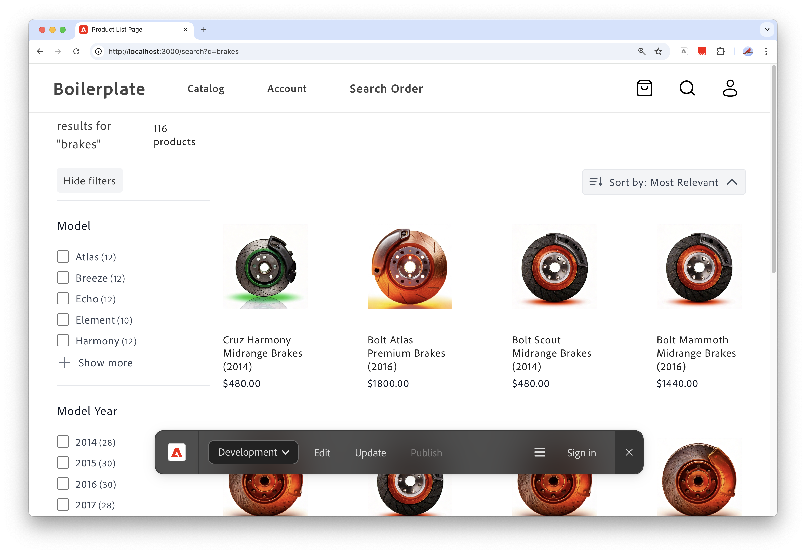

# End-to-End-Anwendungsfall für Storefront- und Katalogadministrator

Dieser Anwendungsfall basiert auf einem fiktiven Automobilkonzern namens Carvelo Automobile, der über eine komplexe Betriebsstruktur verfügt. Es zeigt, wie Sie [!DNL Adobe Commerce Optimizer] verwenden können, um einen Katalog zu verwalten, der mehrere Marken, Händlergeschäfte und Preislisten unterstützt und gleichzeitig ein benutzerdefiniertes Storefront-Erlebnis bereitstellt.

## Voraussetzungen

Dieses Anwendungsbeispiel richtet sich an Administratoren und Entwickler, die mithilfe von [!DNL Adobe Commerce Optimizer] erfahren möchten, wie eine Storefront eingerichtet und ein Katalog verwaltet wird. Es wird davon ausgegangen, dass Sie über ein grundlegendes Verständnis von [!DNL Adobe Commerce Optimizer] und seinen Funktionen verfügen.

**Geschätzte Dauer:** 45-60 Minuten

### Erforderliche Einrichtung

Bevor Sie mit diesem Tutorial beginnen, stellen Sie sicher, dass Sie die folgenden Voraussetzungen erfüllen:

- **Adobe Commerce Optimizer-Instanz**
   - Zugriff auf eine Testinstanz in Cloud Manager
   - Siehe [Erste Schritte](../get-started.md) für Einrichtungsanweisungen

- **Benutzerberechtigungen**
   - Admin-Zugriff auf Adobe Admin Console
   - Siehe [Benutzerverwaltung](../user-management.md) für die Kontoeinrichtung
   - Wenn Sie keinen Zugriff haben, wenden Sie sich an Ihren Adobe-Kundenbetreuer oder füllen Sie das [Early Access-Programm“ aus](https://experienceleague.adobe.com/go/aco-early-access-program)

- **Beispieldaten**
   - Carvelo Automobilkatalogdaten werden in Ihre Instanz geladen
   - Befolgen Sie die Anweisungen im [Datenaufnahme-Repository für den Beispielkatalog](https://github.com/adobe-commerce/aco-sample-catalog-data-ingestion)
   - Sie können Beispieldaten nach Abschluss mit dem enthaltenen `reset.js`-Skript löschen

- **Storefront-Umgebung**
   - Lokale Entwicklungsumgebung mit Node.js
   - Textbausteinprojekt für Storefront geklont und konfiguriert
   - Siehe [Storefront-Setup](../storefront.md) für detaillierte Anweisungen

## Fangen wir an

In diesem Anwendungsbeispiel arbeiten Sie mit Folgendem:

1. [!DNL Adobe Commerce Optimizer]-Benutzeroberfläche : Richten Sie Katalogansichten und Richtlinien ein, um die komplexe betriebliche Katalogeinrichtung für den Carvelo-Anwendungsfall zu verwalten.

1. Commerce-Storefront - Rendern Sie die Storefront mithilfe der Beispielkatalogdaten, die in Ihre [!DNL Adobe Commerce Optimizer]-Instanz geladen wurden, und der Konfigurationsdateien, `fstab.yaml` und `config.json` der Commerce-Storefront.

>[!NOTE]
>
> Erfahren Sie mehr über die Konfigurationsdateien für Storefronts, indem Sie das Thema [Erkunden des Textbausteins](https://experienceleague.adobe.com/developer/commerce/storefront/get-started/boilerplate-project/?lang=de) in der Dokumentation zur Adobe Commerce Storefront lesen.

### ‌Wichtige Erkenntnisse

Am Ende dieses Artikels werden Sie:

- Lernen Sie die Grundlagen der [!DNL Adobe Commerce Optimizer] mit ihrem leistungsfähigen und skalierbaren Katalogdatenmodell kennen.
- Erfahren Sie, wie das Katalogdatenmodell mit von Adobe erstellten plattformunabhängigen Storefront-Komponenten integriert wird.
- Erfahren Sie, wie Sie mit Katalogansichten und Richtlinien von Adobe Commerce Optimizer benutzerdefinierte Katalogansichten und Datenzugriffsfilter erstellen und die Daten an eine Adobe Commerce-Storefront mit Edge Delivery senden.

## Geschäftsszenario - Carvelo Automobile

Carvelo Automobile ist ein fiktiver Automobilkonzern mit einem komplexen operativen Setup.


In diesem Diagramm sehen Sie, dass Carvelo Automobilprodukte von drei Marken verkauft. Jede Marke ist ein anderes untergeordnetes Unternehmen:

- Aurora (Elektrofahrzeuge)
- Schraube (SUVs)
- Cruz (Hybrid)

Es verkauft diese Marken über drei Händler:

- Arkbridge
- Kingsbluff
- Celport

Diese Vertragshändler gehören zwei verschiedenen Muttergesellschaften an:

- West Coast Inc. (Arkbridge)
- East Coast Inc. (Kingsbluff, Celport)

Jedes Unternehmen verfügt über zwei Preisbücher, mit denen Produkte zu einem bestimmten Preis für verschiedene Käufer (Basis, VIP) verkauft werden.

- `west_coast_inc` und `vip_west_coast_inc`
- `east_coast_inc` und `vip_east_coast_inc`

Wie Sie sehen können, ist dies ein sehr komplexer geschäftlicher Anwendungsfall. Mit [!DNL Adobe Commerce Optimizer] kann ein Händler eine komplexe Geschäftsstruktur unterstützen, indem er einen einzigen Basiskatalog verwendet, um Daten ohne Katalogduplizierung zu syndizieren, Preisbücher (30.000 Preisbücher) zu skalieren und all diese Daten an eine Edge Delivery Services-Storefront bereitzustellen.

Jetzt, da Sie einen Überblick über den geschäftlichen Anwendungsfall haben, ist hier Ihr Ziel, während Sie dieses Tutorial durcharbeiten:

>[!BEGINSHADEBOX]

Carvelo will Teile über seine drei Marken (Aurora, Bolt und Cruz) über die verschiedenen Händler (Arkbridge, Kingsbluff und Celport) verkaufen. Carvelo möchte sicherstellen, dass die Vertragshändler nur Zugang zu den korrekten Teilen und Preisen gemäß ihren jeweiligen Lizenzvereinbarungen haben.

Letztlich verfolgt Carvelo zwei Hauptziele:

1. Pflegen Sie eine „globale“ Website, die alle SKUs aller drei Marken enthält.
1. Geben Sie Händlern einen Pfad an, um ihre eigenen Storefronts einzurichten, die auf der eindeutigen SKU-Sichtbarkeit und den Preisen für jede SKU für jeden Händler basieren. Und das alles bei Verwendung eines einzigen Basiskatalogs, wodurch die Duplizierung von Katalogen vermieden wird.

>[!ENDSHADEBOX]

## &#x200B;1. Zugriff auf die [!DNL Adobe Commerce Optimizer]

Navigieren Sie zur URL für das Commerce Optimizer-Programm, die mit den Beispieldaten vorkonfiguriert ist. Sie finden die URL im Commerce Cloud Manager in den Instanzdetails für Ihr Commerce Optimizer-Projekt oder wenden sich an Ihren Systemadministrator. (Siehe [Zugriff auf eine Instanz](../get-started.md#access-an-instance).)

Beim Starten von [!DNL Adobe Commerce Optimizer] wird Folgendes angezeigt:

![[!DNL Adobe Commerce Optimizer] Benutzeroberfläche](../assets/user-interface.png)

>[!NOTE]
>
>Informationen zu den wichtigsten Komponenten [ Benutzeroberfläche finden ](../overview.md) im Artikel [!DNL Adobe Commerce Optimizer]Übersicht“.

Erweitern Sie in der linken Navigation den Abschnitt _Store-Einrichtung_ und klicken Sie auf **[!UICONTROL Catalog views]**. Beachten Sie, dass die Arkbridge- und Kingsbluff-Händler bereits Katalogansichten erstellt haben:


>[!NOTE]
>
>Sie können die Katalogansicht **global** vorerst ignorieren.

Klicken Sie auf das Infosymbol, um die Details der Katalogansicht anzuzeigen.

Arkbridge verfügt über die folgenden Richtlinien:

- Marke
- Modell
- Marken von West Coast Inc
- Arkbridge-Teilekategorien

Kingsbluff hat die folgenden Richtlinien:

- Marke
- Modell
- Marken von East Coast Inc
- Kingsbluff-Teilekategorien

Im nächsten Abschnitt erstellen Sie eine Katalogansicht und Richtlinien für den Celport-Händler.

## &#x200B;2. Erstellen einer Richtlinien- und Katalogansicht

Carvelos E-Commerce-Manager muss eine neue Storefront für einen Händler namens *Celport* einrichten, der zum Unternehmen *East Coast Inc* gehört. Celport wird Bremsen und Federungen für die Marken Bolt und Cruz verkaufen.


Mit [!DNL Adobe Commerce Optimizer] wird der Commerce Manager:

1. Erstellen Sie eine neue Richtlinie mit dem Namen *Celport-Teilekategorien*, damit Celport nur Brems- und Federungsteile verkaufen kann.
1. Erstellen Sie eine neue Katalogansicht für die Celport-Storefront.

   Diese Katalogansicht verwendet Ihre neu erstellte Richtlinie *Celport-Teilekategorien* und die vorhandenen *East Coast Inc Brands*, um sicherzustellen, dass Celport nur die Marken Bolt und Cruz als Teil der Vereinbarung mit East Coast Inc. verkaufen kann. Die Celport-Katalogansicht verwendet das `east_coast_inc`-Preisbuch, um Produktpreispläne zu unterstützen, die mit Markenlizenzvereinbarungen übereinstimmen.
1. Aktualisieren Sie die Konfiguration der Commerce-Storefront, um Daten aus der von Ihnen erstellten Celport-Katalogansicht zu verwenden.

Am Ende dieses Abschnitts wird Celport für den Verkauf der Carvelo-Produkte bereit sein.

### Erstellen einer Richtlinie

Erstellen wir eine neue Richtlinie mit dem Namen *Celport-Teilekategorien* um die SKUs zu filtern, die der Celport-Händler verkauft und die Brems- und Federungsteile enthalten.

1. Erweitern Sie in der linken Leiste den Abschnitt _Store-Einrichtung_ und klicken Sie auf **[!UICONTROL Policies]**.

1. Klicken Sie auf **[!UICONTROL Create Policy]**.

   Es wird eine neue Seite angezeigt, auf der Sie die Richtliniendetails hinzufügen können.

1. Fügen Sie die erforderlichen Details hinzu:

   **name** = *Celport-Teilekategorien*

1. Klicken Sie auf **[!UICONTROL Add Filter]**.

   Es wird ein Dialogfeld angezeigt, in dem Sie Filterdetails hinzufügen können.

1. Fügen Sie die Filterdetails hinzu:

   - **Attribut** = *part_category*
   - **Operator** = **IN**
   - **Wert Source** = **STATIC**
   - **Wert** = *Bremsen*, *Aufhängung*

   >[!IMPORTANT]
   >
   >Stellen Sie sicher, dass der angegebene Attributname genau mit dem SKU-Attributnamen im Katalog übereinstimmt.

   Weitere Informationen über den Unterschied zwischen einer STATIC- und einer TRIGGER-Wertquelle finden Sie unter [Quelltypen von Werten](../setup/policies.md#value-source-types).

1. Klicken Sie im Dialogfeld **[!UICONTROL Filter details]** auf **[!UICONTROL Save]**.

1. Um den soeben erstellten Filter zu aktivieren, klicken Sie auf die Aktionspunkte (…) und wählen Sie **Aktivieren**.

1. Klicken Sie auf **[!UICONTROL Save]**.

   >[!NOTE]
   >
   >Wenn die Schaltfläche **[!UICONTROL Save]** nicht aktiv (blau) ist, fehlt möglicherweise der Richtlinienname. Klicken Sie auf das Stiftsymbol neben *Neue Richtlinie*, um sie hinzuzufügen.

1. Gehen Sie zurück zur Liste der Richtlinien, indem Sie auf den Rückwärtspfeil klicken.

   Die neue *Celport-*&quot; wird in der Liste angezeigt.

**So überprüfen Sie, ob dieser Schritt ordnungsgemäß abgeschlossen wurde:**

- Richtlinie wird in der Liste Richtlinien angezeigt
- Richtlinienstatus wird als „Aktiviert“ angezeigt (grüne Anzeige)
- Filterdetails zeigen „Teil_Kategorie IN (Bremsen, Federung)“ an
- Richtlinienname ist „Celport Part Categories“

### Erstellen einer Katalogansicht

Erstellen Sie eine neue Katalogansicht für den *Celport*-Händler und verknüpfen Sie die folgenden Richtlinien: *East Coast Inc Marken* und *Celport Teilekategorien*.

1. Erweitern Sie in der linken Leiste den Abschnitt _Store-Einrichtung_ und klicken Sie auf **[!UICONTROL Catalog views]**.

   Beachten Sie die vorhandenen Katalogansichten: *Arkbridge*, *Kingsbluff* und *Global*.

   

1. Klicken Sie auf **[!UICONTROL Add catalog view]**.

1. Füllen Sie die Details der Katalogansicht aus:

   - **name** = *Celport*
   - **Catalog sources** = *en-US* (Eingabe drücken)
   - **Richtlinien** (Dropdown verwenden) = *East Coast Inc Brands*; *Celport-Teilekategorien*; *Marke*; *Modell*                          
1. Klicken Sie auf **[!UICONTROL Add]** , um die Katalogansicht zu erstellen.

   Die Seite mit den Katalogansichten wird aktualisiert, um die neue Katalogansicht anzuzeigen.

   

   >[!NOTE]
   >
   >Wenn die Schaltfläche **[!UICONTROL Add]** nicht blau ist, stellen Sie sicher, dass die Katalogquelle ausgewählt ist, indem Sie den Cursor in den **[!UICONTROL Catalog sources]** Abschnitt platzieren und die Eingabetaste **.**.

1. Rufen Sie die Celport-Katalogansichts-ID ab.

   Klicken Sie auf das Informationssymbol für die Celport-Katalogansicht auf der Seite **Katalogansichten**.

   

   Kopieren Sie die Katalogansichts-ID und speichern Sie sie. Sie benötigen diese ID, wenn Sie die Storefront-Konfiguration aktualisieren, um Daten an Ihren neuen Celport-Katalog zu senden.

   **So überprüfen Sie, ob dieser Schritt ordnungsgemäß abgeschlossen wurde:**
   - Name der Katalogansicht: „Celport“
   - Katalogansicht zeigt 4 verknüpfte Richtlinien an
   - Die Katalogansichts-ID wird angezeigt und kann kopiert werden
   - Katalogquelle zeigt „en-US“

Nachdem Sie die Celport-Katalogansicht und die zugehörigen Richtlinien erstellt haben, besteht der nächste Schritt darin, die Storefront für die Verwendung Ihres neuen Celport-Katalogs zu konfigurieren.

## &#x200B;3. Aktualisieren der Storefront

Der letzte Teil dieses Tutorials beinhaltet die Aktualisierung der Storefront, die [Sie bereits erstellt haben](#prerequisite) um Daten an den neuen Celport-Katalog zu liefern. In diesem Abschnitt ersetzen Sie die Katalogansichts-ID in Ihrer Storefront-Konfigurationsdatei durch die Katalogansichts-ID für Celport.

1. Öffnen Sie in Ihrer lokalen Entwicklungsumgebung den Ordner, in den Sie das GitHub-Repository geklont haben, mit Ihren Textbausteinkonfigurationsdateien für die Storefront.

1. Öffnen Sie im Stammverzeichnis des Ordners die `config.json`.

   +++config.json-Code

   ```json
   {
    "public": {
      "default": {
      "commerce-core-endpoint": "https://www.aemshop.net/graphql",
      "commerce-endpoint": "https://na1-sandbox.api.commerce.adobe.com/Fwus6kdpvYCmeEdcCX7PZg/graphql",
      "headers": {
         "cs": {
            "ac-catalog-view-id": "9ced53d7-35a6-40c5-830e-8288c00985ad",
            "ac-price-book-id": "west_coast_inc",
            "ac-source-locale": "en-US"
           }
         },
         "analytics": {
            "base-currency-code": "USD",
            "environment": "Production",
            "store-id": 1,
            "store-name": "ACO Demo",
            "store-url": "https://www.aemshop.net",
            "store-view-id": 1,
            "store-view-name": "Default Store View",
            "website-id": 1,
            "website-name": "Main Website"
          }
       }
      }
   }
   ```

   Beachten Sie, dass die Kopfzeile der Katalogansicht die folgenden Werte enthält:

   - `commerce-endpoint`: `"https://na1-sandbox.api.commerce.adobe.com/Fwus6kdpvYCmeEdcCX7PZg/graphql"`
   - `ac-catalog-view-id`:`"9ced53d7-35a6-40c5-830e-8288c00985ad"`
   - `ac-price-book-id`: `"west_coast_inc"`
   - `ac-source-locale`: `"en-US"`

1. Ersetzen Sie im `commerce-endpoint` die Mandanten-ID in der URL durch die URL für Ihre [!DNL Adobe Commerce Optimizer].

   Die Mandanten-ID finden Sie in der URL für die Commerce Optimizer-Benutzeroberfläche. Bei der folgenden URL ist die Mandanten-ID beispielsweise `XDevkG9W6UbwgQmPn995r3`.

   ```text
   https://experience.adobe.com/#/@commerceprojectbeacon/in:XDevkG9W6UbwgQmPn995r3/commerce-optimizer-studio/catalog
   ```

1. Ersetzen Sie den `ac-catalog-view-id` Wert durch die Celport-Katalogansichts-ID, die Sie zuvor kopiert haben.

1. Ersetzen Sie den `ac-price-book-id` durch `"east_coast_inc"`.

   Nachdem Sie diese Änderungen vorgenommen haben, sollte Ihre `config.json`-Datei etwa wie folgt aussehen, wobei die `ACO-tenant-id` und `celport-catalog-view-id` Platzhalter durch Ihre Werte ersetzt werden:

   ```json
   {
     "public": {
        "default": {
        "commerce-core-endpoint": "https://www.aemshop.net/graphql",
        "commerce-endpoint": "https://na1-sandbox.api.commerce.adobe.com/{{ACO-tenant-id}}/graphql",
        "headers": {
            "cs": {
                "ac-catalog-view-id": "{{celport-catalog-view-id}}",
                "ac-price-book-id": "east_coast_inc",
                "ac-source-locale": "en-US"
              }
            },
            "analytics": {
                "base-currency-code": "USD",
                "environment": "Production",
                "store-id": 1,
                "store-name": "ACO Demo",
                "store-url": "https://www.aemshop.net",
                "store-view-id": 1,
                "store-view-name": "Default Store View",
                "website-id": 1,
                "website-name": "Main Website"
             }
         }
     }
   }
   ```

1. Speichern Sie die Datei.

   Wenn Sie die Änderungen speichern, aktualisieren Sie die Katalogkonfiguration, um die Carvelo-Katalogansicht zu verwenden, die so konfiguriert wurde, dass nur Brems- und Federungsteile verkauft werden.

## &#x200B;4. Vorschau der Storefront

Nachdem Sie die Konfiguration der Storefront aktualisiert haben, um die Celport-Katalogansicht zu verwenden, können Sie eine Vorschau der Storefront anzeigen, um zu sehen, wie sie die Katalogdaten rendert.

1. Starten Sie die Storefront, um das Celport-spezifische Katalogerlebnis anzuzeigen, das von Ihrer Storefront-Konfiguration erstellt wurde.

   1. Starten Sie im Terminal-Fenster in Ihrer IDE die Vorschau Ihrer lokalen Storefront.

      ```shell
      npm start
      ```

      Der Browser öffnet die Vorschau der lokalen Entwicklung unter `http://localhost:3000`.

      Wenn der Befehl fehlschlägt oder sich der Browser nicht öffnet, lesen Sie die [Anweisungen für die lokale Entwicklung](../storefront.md) im Thema „Storefront-Setup“.

1. Suchen Sie im Browser nach `brakes` und drücken Sie die **Eingabetaste**.

   Die Storefront wird aktualisiert, um die Produktlistenseite mit den Bremsteilen anzuzeigen.

   

   Klicken Sie auf ein Bild eines Bremsteils, um die Produktdetails mit Preisinformationen anzuzeigen und die Produktpreisinformationen zu beachten.

1. Suchen Sie nach `tires`, was eine weitere Komponentenkategorie ist, die in den Anwendungsfalldaten auf Ihrer [!DNL Adobe Commerce Optimizer]-Instanz verfügbar ist.

   

   Es werden keine Ergebnisse zurückgegeben. Dies liegt daran, dass die Celport-Katalogansicht so konfiguriert wurde, dass nur Brems- und Federungsteile verkauft werden.

1. Experimentieren Sie mit der Aktualisierung Ihrer Storefront-Konfigurationsdatei (`config.json`).

   1. Ändern Sie die `ac-catalog-view-id`- und `ac-price-book`.

   Sie können beispielsweise die Katalogansichts-ID in die Kingsbluff-Katalogansicht und die Preisbuch-ID in `east_coast_inc` ändern. Sie können die für Kingsbluff verfügbaren Teilekategorien sehen, indem Sie die Richtlinie *Kingsbluff-*) lesen.

   1. Speichern Sie die Datei.

      Wenn Sie die Datei speichern, wird die Vorschau der lokalen Storefront automatisch aktualisiert.

   1. Zeigen Sie eine Vorschau der Änderungen im Browser an, indem Sie die Suchfunktion verwenden, um Reifenteile zu finden.

      Beachten Sie die verschiedenen verfügbaren Teiletypen und die Preise, die der Kingsbluff-Katalogansicht zugeordnet sind.

   Diese Experimente zeigen die Flexibilität von Adobe Commerce Optimizer. Sie können schnell zwischen verschiedenen Katalogansichten und Preisverzeichnissen wechseln, um benutzerdefinierte Einkaufserlebnisse für verschiedene Zielgruppen zu erstellen, ohne Ihre Katalogdaten zu duplizieren.

## Fehlerbehebung

Wenn während dieses Tutorials Probleme auftreten, versuchen Sie die folgenden Lösungen:

### Probleme bei der Richtlinienerstellung

**Problem:** Schaltfläche „Speichern“ ist nicht aktiv

- **Lösung:** Stellen Sie sicher, dass der Richtlinienname eingegeben und alle erforderlichen Felder ausgefüllt sind

**Problem:** Filter funktioniert nicht erwartungsgemäß

- **Lösung:** Überprüfen Sie, ob der Attributname genau mit dem SKU-Attribut in Ihrem Katalog übereinstimmt.

### Probleme mit der Katalogansicht

**Problem:** Katalogansicht wird nicht in der Liste angezeigt

- **Lösung:** Stellen Sie sicher, dass alle zugehörigen Richtlinien aktiviert und ordnungsgemäß konfiguriert sind

**Problem:** Schaltfläche „Hinzufügen“ ist nicht blau

- **Lösung:** Stellen Sie sicher, dass die Katalogquelle ausgewählt ist, indem Sie den Cursor in das Feld platzieren und die Eingabetaste drücken

### Storefront-Konfigurationsprobleme

**Problem:** Storefront wird nicht geladen

- **Lösung:** Überprüfen Sie, ob Ihre Mandanten-ID und Katalogansichts-ID in der Datei config.json korrekt eingegeben wurden

**Problem:** Keine Produkte angezeigt

- **Lösung:** Überprüfen Sie, ob die Preisbuch-ID mit einer in Ihrer Adobe Commerce Optimizer-Instanz verfügbaren ID übereinstimmt.

**Problem:** Suche gibt keine Ergebnisse zurück

- **Lösung:** Vergewissern Sie sich, dass die Richtlinien zur Katalogansicht die durchsuchte Produktkategorie zulassen.

Weitere Hilfe finden Sie in der [Dokumentation zu Adobe Commerce Optimizer oder ](../overview.md) Sie sich an den Adobe-Support.

## Zusammenfassung

In diesem Tutorial haben Sie erfolgreich:

- Neue Richtlinie zum Filtern von Produktkategorien für den Celport-Händler erstellt
- Einrichten einer Katalogansicht mit mehreren Richtlinien zur Steuerung der Produktansicht
- Storefront zur Verwendung der neuen Katalogansicht konfiguriert
- Konfiguration überprüft, indem Sichtbarkeit und Preise des Produkts getestet wurden.

## Nächste Schritte

So erfahren Sie mehr über Adobe Commerce Optimizer:

- Erkunden Sie [Merchandising-Funktionen](../merchandising/overview.md) um das Einkaufserlebnis zu personalisieren
- Erfahren Sie mehr [erweiterte Richtlinienkonfigurationen](../setup/policies.md)
- ([ Katalogansichten) ](../setup/catalog-view.md) andere Händler einrichten
- Lesen Sie die [API-Dokumentation](https://developer-stage.adobe.com/commerce/services/composable-catalog/data-ingestion/api-reference/) für die programmgesteuerte Katalogverwaltung
- Erfahren Sie, wie Sie Dropdown-Komponenten für Ihre Edge Delivery Services-Storefront konfigurieren, um benutzerdefinierte Storefront-Erlebnisse für die Produkterkennung, Empfehlungen und andere Storefront-Funktionen zu erstellen. Siehe die [Storefront-Dokumentation](https://experienceleague.adobe.com/developer/commerce/storefront/dropins/all/introduction/?lang=de)


