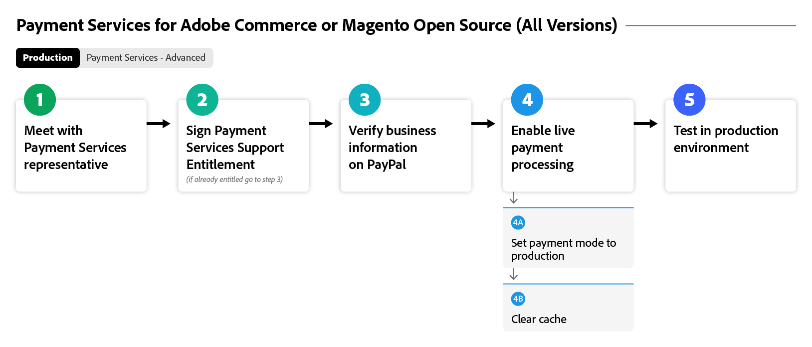

# Onboarding [!DNL Payment Services] Fluss

Für die ersten Schritte mit [!DNL Payment Services] müssen Sie einige Onboarding-Schritte ausführen. Wählen Sie unten die Adobe Commerce-Option aus, die sich am besten an der Instanz und der Version Ihres Unternehmens ausrichtet, um präzise Anleitungen zu erhalten.

Dieses Flussdiagramm zeigt den allgemeinen Prozess für das Onboarding von [!DNL Payment Services] in allen Versionen:

{width="700" zoomable="yes"}

Unten finden Sie Ihre spezifische Adobe Commerce-Version, die Sie mit [!DNL Payment Services] integrieren können.

## Helfen Sie mir, meine Instanz und Version zu finden

### Adobe Commerce oder Magento Open Source | v2.4.7+

Diese Flussdiagramme zeigen den allgemeinen Prozess des Onboarding von [!DNL Payment Services] mit einer Adobe Commerce oder Magento Open Source, die neuer als Version 2.4.7 sind.

>[!BEGINTABS]

>[!TAB Sandbox]

Dieses Flussdiagramm zeigt den Onboarding-Sandbox-Prozess mit einer Adobe Commerce oder Magento Open Source, die neuer als Version 2.4.7 ist, wobei [!DNL Payment Services] mit Adobe Commerce vorkonfiguriert ist.

{width="700" zoomable="yes"}

**Onboarding-Schritte für Versionen v2.4.7+ Teil 1: Sandbox**

1. [Instanz mit &#x200B;](connect.md#configure-commerce-services) Services von Commerce verbinden Diese Verbindung darf nur einmal pro Commerce-Instanz hergestellt werden. [!BADGE Nur PaaS]{type=Informative tooltip="Gilt nur für Adobe Commerce in Cloud-Projekten (von Adobe verwaltete PaaS-Infrastruktur)."}
1. [Richten Sie den Sandbox-](sandbox.md#enable-sandbox-testing) ein (oder fahren Sie alternativ mit [Aktivieren von Live-Zahlungen](sandbox.md#enable-live-payments) fort, wenn Sie die Funktionalität in einer anderen Umgebung getestet haben) mit einem PayPal-Zahlungsverarbeitungskonto.
1. Testen von Zahlungen in einer [Sandbox](sandbox.md#test-in-sandbox-environment)-Umgebung.

>[!TAB Produktion]

Dieses Flussdiagramm zeigt die Produktionsschritte, die zum Aktivieren von [!DNL Payment Services] erforderlich sind.

{width="700" zoomable="yes"}

**Onboarding-Schritte für Versionen v2.4.7+ Teil 2: Produktion**

1. [Als  [!DNL Payment Services]  festlegen](production.md#set-payment-services-as-payment-method) im Sandbox-Modus, um mit der Verarbeitung von Testzahlungen zu beginnen.
1. [Berechtigung für Zahlungen anfordern](production.md#request-payments-entitlement-from-adobe) um das Live-Onboarding zu aktivieren.
1. [Umfassendes Onboarding von Händlern](production.md#complete-merchant-onboarding), um Live-Zahlungen für Ihre Commerce-Websites zu aktivieren.
1. [Erhalten Sie Ihre  [!DNL Payment Services] -Händler-ID](production.md#configure-pricing-tier) und übergeben Sie sie an den Vertrieb, um die richtige Preisstufe zu konfigurieren.
1. [Aktivieren [!DNL Payment Services] im Live-Modus](production.md#enable-live-payments), um mit der Verarbeitung von Live-Zahlungen zu beginnen.
1. Testen Sie Zahlungen sowohl in [Sandbox](sandbox.md#test-in-sandbox-environment)- als auch [&#128279;](production.md#test-in-production).

>[!ENDTABS]

### Adobe Commerce oder Magento Open Source | v2.4.0-2.4.6 [!BADGE nur PaaS]{type=Informative tooltip="Gilt nur für Adobe Commerce in Cloud-Projekten (von Adobe verwaltete PaaS-Infrastruktur)."}

Diese Flussdiagramme zeigen den allgemeinen Prozess für das Onboarding von [!DNL Payment Services] mit Adobe Commerce oder Magento Open Source 2.4.0 bis 2.4.6. Sie müssen [!DNL Payment Services] herunterladen und installieren, um mit dem Onboarding zu beginnen.

>[!BEGINTABS]

>[!TAB Sandbox]

Dieses Flussdiagramm zeigt die Sandbox-Schritte, die für das Onboarding von [!DNL Payment Services] mit Adobe Commerce oder Magento Open Source der Versionen 2.4.0 bis 2.4.6 erforderlich sind.

{width="700" zoomable="yes"}

**Onboarding-Schritte für Versionen v2.4.0-2.4.6 Teil 1: Sandbox**

1. [Installieren Sie bei  [!DNL Payment Services]  die &#x200B;](install.md#get-payment-services).
1. [API-Anmeldeinformationen abrufen](connect.md#obtain-api-credentials).
1. [Instanz mit &#x200B;](connect.md#configure-commerce-services) Services von Commerce verbinden Diese Verbindung darf nur einmal pro Commerce-Instanz hergestellt werden.
1. [Richten Sie den Sandbox-](sandbox.md#enable-sandbox-testing) ein (oder fahren Sie alternativ mit [Aktivieren von Live-Zahlungen](sandbox.md#enable-live-payments) fort, wenn Sie die Funktionalität in einer anderen Umgebung getestet haben) mit einem PayPal-Zahlungsverarbeitungskonto.
1. Testen von Zahlungen in einer [Sandbox](sandbox.md#test-in-sandbox-environment)-Umgebung.

>[!TAB Produktion]

Dieses Flussdiagramm zeigt den allgemeinen Prozess zum Aktivieren von [!DNL Payment Services] in einer Produktionsumgebung mit Adobe Commerce oder Magento Open Source, Version 2.4.0 bis 2.4.6.

{width="700" zoomable="yes"}

**Onboarding-Schritte für Versionen v2.4.0-2.4.6 Teil 2: Produktion**

1. [Als  [!DNL Payment Services]  festlegen](production.md#set-payment-services-as-payment-method) im Sandbox-Modus, um mit der Verarbeitung von Testzahlungen zu beginnen.
1. [Berechtigung für Zahlungen anfordern](production.md#request-payments-entitlement-from-adobe) um das Live-Onboarding zu aktivieren.
1. [Umfassendes Onboarding von Händlern](production.md#complete-merchant-onboarding), um Live-Zahlungen für Ihre Commerce-Websites zu aktivieren.
1. [Erhalten Sie Ihre  [!DNL Payment Services] -Händler-ID](production.md#configure-pricing-tier) und übergeben Sie sie an den Vertrieb, um die richtige Preisstufe zu konfigurieren.
1. [Aktivieren [!DNL Payment Services] im Live-Modus](production.md#enable-live-payments), um mit der Verarbeitung von Live-Zahlungen zu beginnen.
1. Testen Sie Zahlungen sowohl in [Sandbox](sandbox.md#test-in-sandbox-environment)- als auch [&#128279;](production.md#test-in-production).

>[!ENDTABS]

>[!NOTE]
>
>Wenn Sie Ihre Commerce-Services nicht im Admin-Bereich (Teil 1) konfigurieren, können Sie keine Sandbox- oder Live-Zahlungen einrichten.

>[!MORELIKETHIS]
>
> * [Fehlerbehebung [!DNL Payment Services] Installation](https://experienceleague.adobe.com/docs/commerce-knowledge-base/kb/troubleshooting/payments/payservices-install.html?lang=de)
> * [PayPal-Sandbox-Konto nicht verifiziert](https://experienceleague.adobe.com/docs/commerce-knowledge-base/kb/troubleshooting/payments/payservices-paypal-acct.html?lang=de)
> * [Verzögerte [!DNL Payment Services] Berichtsdaten](https://experienceleague.adobe.com/docs/commerce-knowledge-base/kb/troubleshooting/payments/payservices-report-info-delayed.html?lang=de)
> * [Testkreditkarte schlägt mit PayPal bei der Verarbeitung von Zahlungen in einer Sandbox-Umgebung fehl](https://experienceleague.adobe.com/docs/commerce-knowledge-base/kb/troubleshooting/payments/payservices-cc-sandbox-failure.html?lang=de)