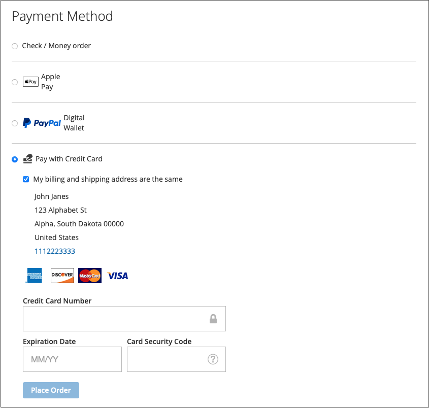

# Zahlungsoptionen

Mit [!DNL Adobe Commerce] und [!DNL Magento Open Source] [!DNL Payment Services] stehen Ihnen mehrere Zahlungsoptionen zur Verfügung.

Sie können diese Zahlungsoptionen in &quot;[&quot; oder ](payments-home.md)[ Store-Konfiguration](configure-admin.md) konfigurieren (empfohlen für ältere Zahlungsoptionen oder eine Multi-Store-Einrichtung).

Es gibt verschiedene Verhaltensweisen für jede Zahlungsmethode, je nachdem, wo Sie sich im Checkout-Prozess befinden:

* Produktseite - Die Produktseite für ein Element
* Mini-Warenkorb - Erhältlich beim Klicken auf das Warenkorb-Symbol, wenn ein Produkt zum Warenkorb hinzugefügt wurde
* Warenkorb - Verfügbar beim Klicken auf _Warenkorb anzeigen und bearbeiten_ aus dem Miniwarenkorb
* Checkout-Ansicht - Verfügbar beim Klicken auf _Zum Checkout_ aus dem Mini-Warenkorb oder Warenkorb

>[!IMPORTANT]
>
>[!DNL Payment Services] Onboarding muss abgeschlossen sein, bevor Zahlungen verarbeitet werden können.

## Erlebnis „Standard“ im Vergleich zu „Erweiterte Zahlungen“

[!DNL Payment Services] bietet **Erweitert** (vollständig unterstützt) und **Standard** (Express-Checkout) Zahlungsoptionen und Onboarding-Flüsse, je nach dem Land, in dem Sie tätig sind.

* **Erweitert** - Alle verfügbaren [Zahlungsoptionen](../payment-services/payments-options.md) sind für aktuelle ([ Länder) ](../payment-services/introduction.md#availability). Um Live-Zahlungen während des Onboardings zu aktivieren, wählen Sie die Option [Erweitertes Onboarding](../payment-services/production.md#advanced-onboarding) aus.

* **Standard** - Eine Untergruppe von Zahlungsoptionen (Express Checkout) - PayPal-Kredit- und Debitkarten - ist für andere verfügbare unterstützte Länder verfügbar. [Kreditkartenfelder](#credit-card-fields) und [Apple Pay](#apple-pay-button) sind für diese Onboarding-Option nicht verfügbar. Wählen Sie während des Onboardings die Option [Standard-Onboarding](../payment-services/production.md#standard-onboarding) aus, um Live-Zahlungen zu aktivieren.

Informationen [ Abschluss des Erweiterten Onboardings und des standardmäßigen Onboarding finden Sie  [!DNL Payment Services]  „Aktivieren für ](../payment-services/production.md#complete-merchant-onboarding)&quot;.

## [!UICONTROL Credit Card Fields]

[!UICONTROL Credit Card Fields] bieten einen einfachen und sicheren Checkout für Kreditkarten- oder Debitkartenzahlungsmethoden. Wenn ein Käufer mit Kreditkartenfeldern auscheckt, gibt er seinen Namen, seine Rechnungsadresse und Kreditkarteninformationen ein, um seine Bestellung aufzugeben. Ihre Kundeninformationen werden während der Kaufsitzung sicher verwendet, um sie nahtlos durch den Checkout-Ablauf zu führen.

{width="500" zoomable="yes"}

## [!UICONTROL Digital Wallets]

### [!DNL Fastlane]

[!DNL Fastlane] bietet eine schnelle, sichere und unkomplizierte Möglichkeit, online zu bezahlen. Während eines **Gast-Checkouts** können Sie Ihre Karte und Versanddetails sicher speichern, um in Zukunft noch schnellere Käufe zu ermöglichen.

* **Sofortiger Zugriff für verifizierte Käufer**: Erkennen Sie Millionen wiederkehrender Kunden und ermöglichen Sie nahtlose Zahlungen in Sekunden.
* **Umsatz steigern**: Steigern Sie Ihre Konversions- und Autorisierungsraten durch abgeschlossene Käufe.
* **Checkout beschleunigen**: Reduzieren Sie Reibungsverluste durch eine sichere, passwortlose Anmeldung.

Wenn [!DNL Fastlane] aktiviert ist, ist die Option [!UICONTROL Credit Card Fields] standardmäßig deaktiviert.

>[!NOTE]
>
> In Sandbox-Instanzen zeigen Fastlane-Transaktionen in der Ansicht Transaktionsaktivität nicht die Lieferadresse an.

Weitere Informationen finden [ unter „Fastlane ](https://www.paypal.com/us/fastlane){target=_blank} PayPal“.

### [!DNL Apple Pay]

Mit [!DNL Apple Pay] können Händler ein sicheres, optimiertes Checkout-Erlebnis in Safari bereitstellen (für bis zu 99 Domains pro Händlerkonto), was die Konversionen erhöhen kann. Mit der [!DNL Apple Pay] Schaltfläche werden die gespeicherten Zahlungs-, Kontakt- und Versanddetails von den iOS- oder macOS-Geräten des Kunden automatisch ausgefüllt, was ein schnelles, einmaliges Kauferlebnis ermöglicht.

{width="500" zoomable="yes"}

Wenn diese Option aktiviert ist, wird die Schaltfläche [!DNL Apple Pay] auf der Produktseite, im Mini-Warenkorb, im Warenkorb und in den Checkout-Ansichten angezeigt. Sie können [!DNL Apple Pay] in der Store-Konfiguration oder auf der Startseite der Erweiterung konfigurieren.

>[!NOTE]
>
>  Das Apple Pay-Domain-Verifizierungszertifikat ist bereits im Payment Services-Code enthalten. Vergewissern Sie sich, dass der Pfad `/.well-known/apple-developer-merchantid-domain-association` einen Antwort-Code 200 zurückgibt. Apple Weitere [ zum ](https://developer.paypal.com/docs/checkout/apm/apple-pay/#download-and-host-sandbox-domain-association-file)Apple Pay Domain-Verifizierungszertifikat finden Sie in der **Entwicklerdokumentation zu PayPal für die Integration mit**.

Weitere Informationen finden [ unter ](configure-admin.md#apple-pay).

### [!DNL Google Pay]

Durch die Integration von [!DNL Google Pay] in Ihr Checkout-Erlebnis können Händler gespeicherte Zahlungs-, Kontakt- und Versandinformationen über das Google-Konto des Käufers erfassen und so einen bequemen, optimierten Checkout über unterstützte Browser und Apps hinweg bieten.

[!DNL Google Pay] ist nur in bestimmten Ländern oder Regionen und auf bestimmten Geräten verfügbar. Weitere Informationen finden [[!DNL Google Pay]  unter ](https://developer.paypal.com/docs/checkout/apm/google-pay/#link-googlepayintegration)Dokumentation).

{width="500" zoomable="yes"}

Wenn diese Option aktiviert ist, wird die Schaltfläche [!DNL Google Pay] auf der Produktseite, im Mini-Warenkorb, im Warenkorb und in den Checkout-Ansichten angezeigt. Weitere Informationen finden [ unter ](configure-admin.md).

>[!NOTE]
>
> Die [!DNL Google Pay]-API kann nur auf Websites in einem sicheren Kontext verwendet werden. Weitere Informationen finden [ in ](https://developers.google.com/pay/api/web/support/troubleshooting) Dokumentation zur Fehlerbehebung .

### [!DNL PayPal Payment Buttons]

[!DNL PayPal payment buttons], die PayPal verwenden, um einen Kauf abzuschließen, speichert die Lieferadresse, Rechnungsadressen und Zahlungsdetails Ihres Käufers für die spätere Verwendung. Käufer können jede Zahlungsmethode verwenden, die zuvor von PayPal gespeichert oder angeboten wurde.

{width="350" zoomable="yes"}

Sie können [!UICONTROL PayPal payment buttons] in der Store-Konfiguration oder auf der [!DNL Payment Services]-Startseite konfigurieren.

Erfahren Sie mehr über die Verfügbarkeit von Zahlungsmethoden nach Land in der [ zu Zahlungsmethoden ](https://developer.paypal.com/docs/checkout/payment-methods/).

#### [!DNL PayPal]

Kunden können mit der PayPal-Schaltfläche bequem und sicher auschecken.

Die Schaltfläche &quot;[!DNL PayPal]&quot; ist auf der Produktseite sowie in den Ansichten „Mini-Warenkorb“, „Warenkorb“ und „Checkout“ sichtbar.

#### [!DNL Venmo]

Kunden können mit der Schaltfläche [Venmo](https://venmo.com/) auschecken.

Die Schaltfläche &quot;[!DNL Venmo]&quot; ist auf der Produktseite sowie in den Ansichten „Mini-Warenkorb“, „Warenkorb“ und „Checkout“ sichtbar.

#### PayPal Debit- oder Kreditkarten-Button

Kunden können mit der PayPal Debit- oder Kreditkartenschaltfläche auschecken.

Die Schaltfläche PayPal Debit oder Kreditkarte ist auf der Checkout-Seite sichtbar.

Diese Option kann verwendet werden, um Ihren Kunden eine Debit- oder Kreditkartenzahlungsoption mit einer PayPal-gehosteten Schaltfläche als Alternative zu einer Kreditkartenintegration anzuzeigen.

#### [!DNL Pay Later]

Bieten Sie Ihren Kunden kurzfristige, zinslose Zahlungen und andere Finanzierungsoptionen, damit sie jetzt kaufen und später mit der [!DNL Pay Later] bezahlen können.

Die Schaltfläche &quot;[!DNL Pay Later]&quot; ist auf der Produktseite sowie in den Ansichten „Mini-Warenkorb“, „Warenkorb“ und „Checkout“ sichtbar.

Weitere Informationen zu den [Pay Later-Angeboten](https://developer.paypal.com/docs/checkout/pay-later/us/) finden Sie in der PayPal-Entwicklerdokumentation. Wählen Sie **Dropdown-Menü „Land** oder Region“ eine gewünschte Region aus.

Erfahren Sie, wie Sie [!DNL Pay Later]-Messaging deaktivieren oder aktivieren, indem Sie die Konfiguration [Einstellungen](configure-admin.md#pay-later-button) aktualisieren.

##### Optional. Konfigurieren von Pay Later Messaging

**Messaging konfigurieren** für [Später bezahlen](configure-admin.md#pay-later-button) ermöglicht es Händlern, die Standardstile für diese Zahlungsoption zu ändern. Wenn Sie **[!UICONTROL Display Pay Later Message]** in Ihrer Konfiguration `Yes`Einstellungen[ auf ](configure-admin.md#pay-later-button) setzen, wird eine **[!UICONTROL Configure Messaging]** modale Schaltfläche angezeigt, über die Sie die Stile für die **[!UICONTROL PayPal Pay Later messaging]** festlegen können.

{width="500" zoomable="yes"}

### Nur PayPal-Zahlungs-Buttons verwenden

Um Ihren Shop schnell in den Produktionsmodus zu versetzen, können Sie _nur_ PayPal-Zahlungsschaltflächen (Venmo, PayPal usw.) konfigurieren.- anstatt auch die PayPal Kreditkartenzahlungsoption zu verwenden.

Auf diese Weise können Sie:

* Bieten Sie verschiedene Zahlungsoptionen für Ihre Kunden, einschließlich Venmo und PayPal-Zahlungsschaltflächen, mit der Option, PayPal-gehostete Kartenfelder zu deaktivieren und einen vorhandenen Kreditkartenanbieter zu verwenden.
* Nutzen Sie Ihren bestehenden Kreditkartenanbieter für Kreditkartenzahlungen und nutzen Sie gleichzeitig die anderen Zahlungsoptionen von PayPal.
* Verwenden Sie die Zahlungs-Buttons von PayPal in Regionen, in denen PayPal keine Kreditkarten als Zahlungsoption unterstützt.

So **Zahlungen mit _nur_ PayPal-Zahlungs-Schaltflächen (_nicht_ PayPal-Kreditkartenzahlungsoption) erfasst**:

1. Stellen Sie sicher, dass sich Ihr Store [im Produktionsmodus) ](configure-admin.md#enable-payment-services).
1. [Konfigurieren Sie die gewünschten PayPal-Zahlungs-Schaltflächen](configure-admin.md#payment-buttons) in den Einstellungen.
1. Deaktivieren __ die Option **[[!UICONTROL Show PayPal Credit and Debit card button]](configure-admin.md#payment-buttons)** im Abschnitt _[!UICONTROL Payment buttons]_.

So **Sie Zahlungen mit Ihrem vorhandenen Kreditkartenanbieter _und_ PayPal-Zahlungs-Schaltflächen**:

1. Stellen Sie sicher, dass sich Ihr Store [im Produktionsmodus) ](configure-admin.md#enable-payment-services).
1. [Konfigurieren Sie die gewünschten PayPal-Zahlungsschaltflächen](configure-admin.md#payment-buttons).
1. Deaktivieren __ die Option **[[!UICONTROL PayPal Show Credit and Debit card button]](configure-admin.md#payment-buttons)** im Abschnitt _[!UICONTROL Payment buttons]_.
1. Deaktivieren __ die Option **[[!UICONTROL Show on checkout page]](configure-admin.md#credit-card-fields)** im Abschnitt _[!UICONTROL Credit card fields]_und verwenden Sie Ihr [vorhandenes Kreditkartenkonto](https://experienceleague.adobe.com/docs/commerce-admin/stores-sales/payments/payments.html#payments).

## Checkout-Optionen

Mit [!DNL Payment Services] können Sie das Checkout-Erlebnis für Adobe Commerce so konfigurieren, dass es den Vorlieben und Verhaltensweisen Ihrer Kundinnen und Kunden am besten entspricht. Funktionen wie Kreditkarten [Vaulting](vaulting.md) und Autovermietung gewährleisten eine nahtlose, unkomplizierte Transaktion für Ihre Kunden.

Mit Adobe Commerce und Magento Open Source [!DNL Payment Services] stehen Ihnen mehrere Checkout-Erlebnisse zur Verfügung. Es gibt verschiedene Verhaltensweisen für jede Zahlungsmethode, je nachdem, wo Sie sich im Checkout-Prozess befinden:

* Produktseite - Die Produktseite für ein Element

* Mini-Warenkorb - Erhältlich beim Klicken auf das Warenkorb-Symbol, wenn ein Produkt zum Warenkorb hinzugefügt wurde

* Warenkorb - Verfügbar beim Klicken auf „Anzeigen“ und „Warenkorb bearbeiten“ im Mini-Warenkorb

* Checkout-Ansicht - Verfügbar beim Klicken auf „Weiter zum Checkout“ aus dem Mini-Warenkorb oder Warenkorb

### Neuberechnung der Bestellung

Wenn ein Kunde den Checkout-Fluss über den Mini-Warenkorb, den Warenkorb oder die Produktseite aufruft, wird er zu einer Seite zur Bestellüberprüfung weitergeleitet, auf der er die ausgewählte Lieferadresse in einem PayPal-Popup-Fenster sehen kann. Nachdem der Kunde die Versandart ausgewählt hat, wird der Bestellbetrag entsprechend neu berechnet und der Kunde kann die Versandkosten und -steuern sehen.

Wenn ein Kunde den Checkout-Fluss über die Checkout-Seite betritt, ist das System bereits über die Lieferadresse und den endgültigen berechneten Betrag informiert und die Gesamtsummen werden entsprechend dargestellt.

Steuerferien, Versandkosten und Umsatzsteuer können von Standort zu Standort stark variieren. Nachdem [!DNL Payment Services] die Lieferadresse und den Preis erhalten hat, berechnet es schnell alle anfallenden Kosten neu und zeigt sie in den letzten Phasen des Checkouts angemessen an.

Erfahren Sie mehr über die Verfügbarkeit von Zahlungsmethoden nach Land in [ Dokumentation zu Zahlungsmethoden ](https://developer.paypal.com/docs/checkout/payment-methods/){target=_blank} PayPal.
