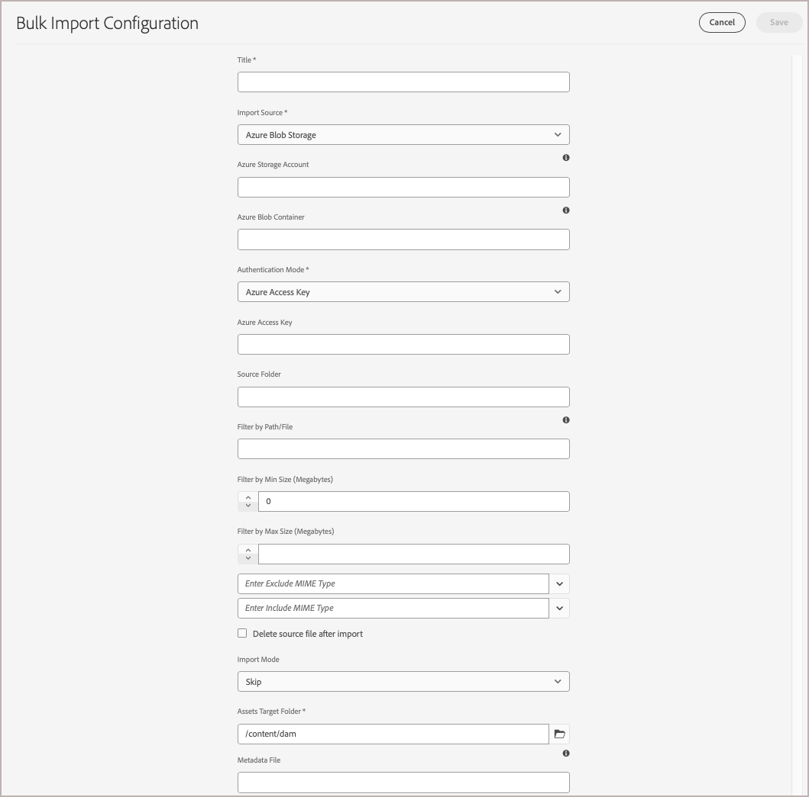

# Migrieren von Mediendateien in das AEM Assets-DAM

Sowohl Adobe Commerce als auch Adobe Experience Manager (AEM) bieten integrierte Funktionen zur Optimierung der Migration von Mediendateien von Commerce zum AEM Assets **Digital Asset Management System (DAM)**. Sie können auch Mediendateien aus anderen Quellen migrieren.

## Voraussetzungen

| Kategorie | Anforderung |
|----------|-------------|
| **Systemanforderungen** | <ul><li>AEM as a Cloud Service-Umgebung mit AEM Assets bereitgestellt</li><li>Ausreichende Speicherkapazität</li><li>Netzwerkbandbreite für große Dateiübertragungen</li></ul> |
| **Erforderlicher Zugriff und Berechtigungen** | <ul><li>Administratorzugriff auf AEM Assets as a Cloud Service</li><li>Zugriff auf das Quellsystem, in dem Mediendateien gespeichert werden (Adobe Commerce oder externes System)</li><li>Entsprechende Berechtigungen für den Zugriff auf Cloud-Speicher-Services</li></ul> |
| **Cloud-Speicherkonto** | <ul><li>AWS S3- oder Azure Blob Storage-Konto</li><li>Konfiguration von privaten Containern/Buckets</li><li>Authentifizierungsdaten</li></ul> |
| **Source-Inhalte** | <ul><li>Organisierte Mediendateien bereit für die Migration</li><li>Bild- und Videodateien in <a href="https://experienceleague.adobe.com/de/docs/experience-manager-cloud-service/content/assets/file-format-support#image-formats">von AEM Assets unterstützten Formaten</a>.</li><li>Bereinigen von duplizierten Assets</li></li> |
| **Metadatenvorbereitung** | <ul><li><a href="https://experienceleague.adobe.com/de/docs/commerce-admin/content-design/aem-asset-management/getting-started/aem-assets-configure-aem">AEM Assets-Metadatenprofil für Commerce-Assets konfiguriert</a></li><li>Zugeordnete Metadatenwerte für jedes Asset</li><li>CSV-Datei-Editor (z. B. Microsoft Excel)</li></ul> |

## Best Practices für die Migration

1. Kuratieren Sie Assets vor der Migration, indem Sie nicht verwendete und doppelte Inhalte entfernen.

1. Organisieren Sie Assets logisch nach Größe, Format oder Anwendungsfall.

1. Erwägen Sie, große Migrationen in kleinere Batches aufzuteilen.

1. Planung ressourcenintensiver Importe außerhalb der Spitzenzeiten

1. Validieren der Metadatenzuordnung vor dem vollständigen Import

## Migrations-Workflow

Befolgen Sie den Migrations-Workflow, um Mediendateien aus Adobe Commerce oder einem anderen externen System zu exportieren und in das AEM Assets-DAM zu importieren.

### Schritt 1: Exportieren von Inhalten aus der vorhandenen Datenquelle

[!BADGE Nur PaaS]{type=Informative tooltip="Gilt nur für Adobe Commerce in Cloud-Projekten (von Adobe verwaltete PaaS-Infrastruktur)."}

Für Adobe Commerce-Händler kann das **Remote-Speichermodul** den Import und Export von Mediendateien erleichtern. Mit diesem Modul können Unternehmen Mediendateien mithilfe von Remote-Speicherdiensten wie AWS S3 speichern und verwalten. Informationen zum Einrichten des Remote-Speichers für Ihre Commerce-Instanz finden Sie unter [Konfigurieren des Remote](https://experienceleague.adobe.com/de/docs/commerce-operations/configuration-guide/storage/remote-storage/remote-storage-aws-s3) im **Commerce-Konfigurationshandbuch**.

Wenn Sie Mediendateien haben, die außerhalb von Adobe Commerce gespeichert sind, laden Sie sie direkt in eine der [Datenquellen](https://experienceleague.adobe.com/de/docs/experience-manager-cloud-service/content/assets/assets-view/bulk-import-assets-view#prerequisites) hoch, die von AEM as a Cloud Service unterstützt werden.

### Schritt 2: Erstellen einer CSV-Datei für die Metadatenzuordnung

Erstellen Sie nach dem Exportieren der Mediendateien eine CSV-Datei, um diese Assets den für die Automatisierung erforderlichen Metadaten zuzuordnen. Die CSV sollte Felder für **Produkt**, **Position** und **Rollenzuordnung)**, um die Abstimmung mit dem [AEM Assets-Metadatenprofil sicherzustellen](configure-aem.md#configure-a-metadata-profile).

Geben Sie für jede Mediendatei, die Sie migrieren möchten, Werte für die Metadatenfelder im [AEM Assets-Metadatenprofil für Commerce-Assets ](configure-aem.md), wie in der folgenden Tabelle beschrieben.

| Metadaten | Beschreibung | Wert |
|-------|-------------|--------|
| assetPath | Der vollständige Pfad, in dem das Asset im AEM Assets-Repository gespeichert wird.<br><br>Verwenden Sie den Pfad, um Unterordner zu erstellen und Commerce-Assets zu organisieren, z. B. `content/dam/commerce/<brand>/<type>`. | `/content/dam/commerce/<sub-folder>/..<filename>` |
| commerce:positions | Die Position/Reihenfolge des Assets in den Produktkatalogen | Mehrere numerische Werte, durch Pipe getrennt (siehe CSV-Datei) |
| commerce:isCommerce | Markierung, die angibt, ob das Asset in Commerce verwendet wird | `Yes` |
| commerce:skus | Mit diesem Asset verknüpfte Produkt-SKUs | Mehrere durch Pipe getrennte Zeichenfolgenwerte (siehe CSV-Datei) |
| commerce:roles | Die Rollen oder Typen von Bildern für das Asset (z. B. `thumbnail`, `main image`, `swatch`) | Mehrere Werte, durch Semikolons getrennt (z. B. „Miniaturansicht; Bild; Farbfeld_Bild; SMALL_IMAGE„) |

+++CSV-Code

Verwenden Sie diesen CSV-Beispielcode, um die Datei in einem Code-Editor oder einer Tabellenkalkulationsprogramm wie Microsoft Excel zu erstellen.

```csv
assetPath,commerce:positions{{Number: multi}},commerce:isCommerce{{String}},commerce:skus{{String: multi}},commerce:roles{{String: multi}}
/content/dam/commerce/sample1.jpg,1,Yes,sku1,thumbnail; image; swatch_image; small_image
/content/dam/commerce/sample2.jpg,1|1|1,Yes,sku1|sku2|sku3,thumbnail; image; swatch_image; small_image|image|image; small_change
```

+++

### Schritt 3: Massenimport von Assets in AEM Assets

Nachdem Sie die Metadatenzuordnungsdatei erstellt haben, verwenden Sie das Tool für den Massenimport von AEM Assets , um Ihre Assets zu importieren.

Im Folgenden finden Sie einen allgemeinen Überblick über die Verwendung des Tools.

1. [Melden Sie sich bei Ihrer AEM Assets as a Cloud Service-Autorenumgebung ](https://experienceleague.adobe.com/de/docs/experience-manager-cloud-service/content/onboarding/journey/aem-users#login-aem).

1. Wählen Sie in der Ansicht Experience Manager-Tools die Option **[!UICONTROL Assets]** > **[!UICONTROL Bulk Import]** aus.

   {width="600" zoomable="yes"}

1. Wählen Sie aus den Massenimportkonfigurationen die Option **[!UICONTROL Create]** aus, um das Konfigurationsformular zu öffnen.

   {width="600" zoomable="yes"}

1. Richten Sie die Konfiguration ein und speichern Sie sie.

   Sie benötigen:

   * Authentifizierungsdaten für Ihre Datenquelle
   * Der Zielordner in AEM Assets, in dem importierte Dateien gespeichert werden
   * Optional. Informationen über die MIME-Typen, die Dateigröße und andere Parameter zum Anpassen der Importkonfiguration
   * Der Pfad zur CSV-Datei für die Metadatenzuordnung, die Sie in die Cloud-Speicherinstanz hochgeladen haben.

   Ausführliche Anweisungen finden Sie unter [Konfigurieren des Tools für den Massenimport](https://experienceleague.adobe.com/de/docs/experience-manager-cloud-service/content/assets/manage/add-assets#configure-bulk-ingestor-tool) im *AEM Assets as a Cloud Service-Benutzerhandbuch*.

1. Verwenden Sie nach dem Speichern der Konfiguration die Tools für den Massenimport, um den Importvorgang zu testen und auszuführen.

>[!MORELIKETHIS]
>
> [Video-Demo zum Tool für den Massenimport](https://experienceleague.adobe.com/de/docs/experience-manager-cloud-service/content/assets/manage/add-assets#asset-bulk-ingestor)
> &#x200B;> [Tipps, Best Practices und Einschränkungen](https://experienceleague.adobe.com/de/docs/experience-manager-cloud-service/content/assets/manage/add-assets#tips-limitations)
> &#x200B;> [Hochladen oder Aufnehmen von Assets mithilfe von APIs](https://experienceleague.adobe.com/de/docs/experience-manager-cloud-service/content/assets/admin/developer-reference-material-apis#asset-upload)
