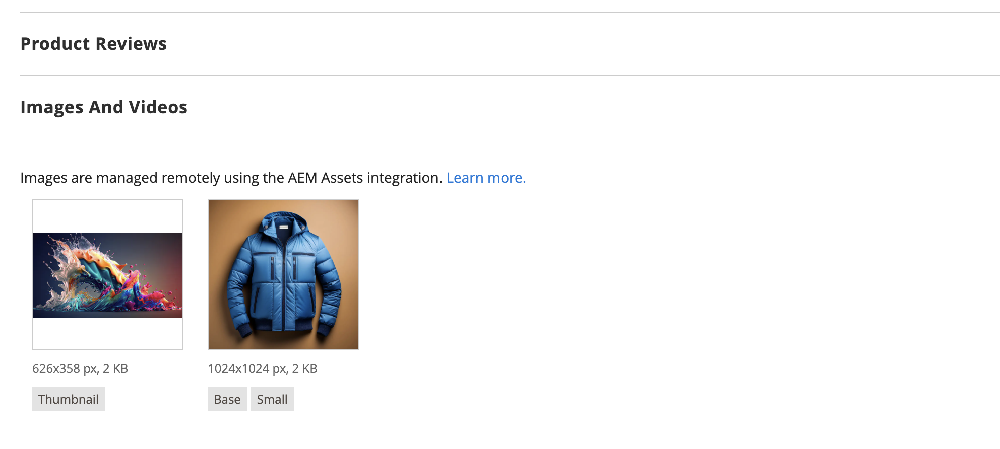
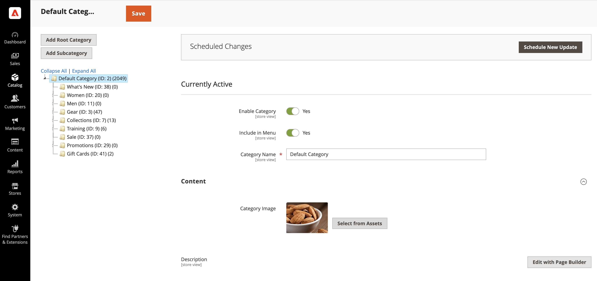

# Verwalten von Commerce-Medien-Assets mit Produktvisualisierungen

<!--In ACAP-844, this topic was linked to from the Commerce Admin products images and videos when the Assets integration is enabled. If the URL to the topic changes, be sure to add a redirect.-->

Sie können die folgenden Medientypen mit Produktvisualisierungen auf Basis von AEM Assets verwalten:

* Produktbilder
* Inhaltsbilder
* Produktvideos
* Kategoriebilder

## Produktbilder

Wenn die Integration von Produktvisualisierungen aktiviert ist, wird das Bildmanagement im Digital Asset Management System (DAM) zentralisiert. Adobe Commerce fungiert dann als wichtiger Interaktionskanal, der sicherstellt, dass nur genehmigte Bilder von hoher Qualität in allen Storefronts verwendet werden. Diese Einrichtung verbessert die Markenkonsistenz, minimiert den manuellen Aufwand und optimiert die Aktualisierung von Inhalten. Händler müssen keine Bilder mehr in Adobe Commerce manuell hochladen oder verwalten.

### Anzeigen von Produktbildern in Adobe Commerce

Produktbilder werden automatisch anhand vorkonfigurierter übereinstimmender Regeln aus AEM Assets abgerufen:

1. Navigieren Sie in _Admin_-Seitenleiste zu **[!UICONTROL Catalog]** > **[!UICONTROL Products]**.

1. Produkt auswählen.

1. Öffnen Sie den **Bilder und Videos** Abschnitt.

   {width="600" zoomable="yes"}

   >[!NOTE]
   >
   > Es wird eine Meldung angezeigt, dass die Integration aktiviert ist, wodurch dies zu einem **schreibgeschützten** wird, da die Bildverwaltung im DAM zentralisiert ist.

### Verwalten von Produktbildern in AEM Assets

Um produktbezogene Bilder zu verwalten, müssen alle Änderungen direkt in **AEM Assets vorgenommen**. Dieser Prozess ist vollständig automatisiert, sodass alle Änderungen mit Adobe Commerce synchronisiert werden, ohne dass ein manuelles Eingreifen erforderlich ist.

### Synchronisations-SLAs

Weitere [ zu diesem Thema finden ](get-started/setup-synchronization.md#synchronization-sla) unter Synchronisierung mit SLA .

## Inhaltsbilder

Adobe Commerce bietet Page Builder als **Content Management System (CMS)** für Händler, die nicht das Toolset Adobe Experience Manager (AEM) verwenden. Um die Inhaltserstellung zu verbessern, nutzt unsere Integration den [AEM Asset Selector](synchronize/asset-selector-integration.md), sodass Marketing-Experten nahtlos direkt über das **DAM** auf Bilder zugreifen und diese einbetten können. Dadurch wird sichergestellt, dass bei der Inhaltserstellung nur genehmigte Bilder von hoher Qualität verwendet werden. So wird redundanter Speicher in Adobe Commerce überflüssig.

### Verwenden der AEM-Asset-Auswahl in Page Builder

So verwenden Sie den **AEM Asset-Selektor** zum Einbetten von Bildern:

1. Navigieren Sie zu einem beliebigen Abschnitt in **Adobe Commerce Admin** der `content enrichment` mit **Page Builder** unterstützt.

1. Öffnen Sie [Page Builder](https://developer.adobe.com/commerce/frontend-core/page-builder/){target=_blank}.

   Ein neuer Medientyp mit dem Namen **AEM Asset** ist verfügbar.

1. Ziehen Sie den AEM Asset-Medientyp per Drag-and-Drop in einen Inhaltsbaustein.

1. Geben Sie bei Aufforderung die Anmeldeinformationen für den Zugriff auf das DAM ein.

1. Wählen Sie ein Bild aus dem DAM aus und fügen Sie es direkt in den Inhalt ein.

Die Verknüpfung mit dem ausgewählten Bild wird in Adobe Commerce als direkte URL gespeichert, die auf &quot;**Media“ verweist** wodurch Folgendes gewährleistet ist:

* Bilddateien müssen nicht in Adobe Commerce gespeichert werden.

* Marketing-Experten arbeiten ausschließlich mit genehmigten Assets aus dem DAM.

* Inhalte bleiben auf allen Kunden-Touchpoints konsistent und aktuell.

## Produktvideos

Adobe Commerce dient als wichtiger Interaktionskanal für digitale Assets. Nach der Aktivierung von Product Visuals wird das Videomanagement im **DAM** zentralisiert, wodurch Konsistenz, Compliance und eine optimierte Bereitstellung über Commerce-Storefronts hinweg sichergestellt sind.

### Verwalten von Produktvideos

1. Navigieren Sie in _Admin_-Seitenleiste zu **[!UICONTROL Catalog]** > **[!UICONTROL Products]**.

1. Produkt auswählen.

1. Öffnen Sie den **Bilder und Videos** Abschnitt.

   {width="600" zoomable="yes"}

   >[!NOTE]
   >
   > Eine Meldung gibt an, dass die Integration aktiviert ist, sodass dieser Abschnitt **schreibgeschützt** wird, da Videos in AEM Assets gesteuert werden.

### Verknüpfen von Videos in AEM Assets

1. Navigieren Sie in AEM Assets zu dem Video, das Sie mit einem Produkt verknüpfen möchten.

1. Verknüpfen des Videos mit einem oder mehreren Produkten in Adobe Commerce.

1. Die Integration synchronisiert automatisch die Verknüpfung und zeigt den Dynamic Media-Video-Player direkt auf der Storefront an. Dadurch müssen Händler keine Konfigurationen für die Videowiedergabe mehr verwalten.

### Nur API-First-Videounterstützung

Derzeit unterstützt die Integration Videos über API, sodass Partner Videos programmgesteuert abrufen können.

>[!WARNING]
>
> Videos sind standardmäßig noch nicht in bestehende Adobe Commerce-Storefront-Lösungen integriert.

Diese Integration stellt sicher, dass Händler Produktvideos mühelos skalierbar und optimiert verwalten können, indem sie AEM Assets und Dynamic Media für eine nahtlose Bereitstellung nutzen.

### Synchronisations-SLAs

Weitere [ zu diesem Thema finden ](get-started/setup-synchronization.md#synchronization-sla) unter Synchronisierung mit SLA .

## Kategoriebilder

Mit Adobe Commerce können Händler Bilder mit Produktkategorien verknüpfen und so eine visuell ansprechende Storefront erstellen. Die Integration nutzt AEM Asset Selector, damit Marketing-Experten Produktvisualisierungen direkt aus dem **Digital Asset Management System (DAM) nahtlos auswählen können**. Dadurch wird sichergestellt, dass nur genehmigte Bilder verwendet werden. Dadurch entfällt die Notwendigkeit, sie in Adobe Commerce zu speichern, was die Konsistenz und Effizienz über alle Interaktionskanäle hinweg aufrechterhält.

### Verwenden des AEM Asset-Wählers für Kategoriebilder

Nachdem Sie den [AEM-Asset-Selektor](synchronize/asset-selector-integration.md) konfiguriert haben, können Sie damit Assets zu Ihren Inhaltskategorien hinzufügen.

1. Navigieren Sie in _Admin_-Seitenleiste zu **[!UICONTROL Catalog]** > **[!UICONTROL Categories]**.

1. Wählen Sie eine Kategorie aus, die Sie aktualisieren möchten.

1. Erweitern Sie die  im Abschnitt **[!UICONTROL Content]**.

1. Suchen Sie im Abschnitt **[!UICONTROL Content]** das Feld *Bild*, das der Kategorie zugeordnet ist.

   {width="600" zoomable="yes"}

1. Klicken Sie auf **[!UICONTROL Select from Assets]** , um das Kategoriebild zu ändern.

   {width="600" zoomable="yes"}

1. Wählen Sie ein Bild aus dem AEM Asset-Wähler aus.

   {width="600" zoomable="yes"}

1. Klicken Sie auf **[!UICONTROL Save]** und fahren Sie fort.

   Weitere Informationen zum Erstellen einer Kategorie finden Sie unter [Kategorieinhalt vervollständigen](https://experienceleague.adobe.com/de/docs/commerce-admin/catalog/categories/create/category-create#step-3-complete-the-category-content) im **Handbuch zur Katalogverwaltung in Commerce**.

## Aktualisieren von Assets

Nachdem Sie ein Asset in AEM Assets aktualisiert und genehmigt haben, werden die Aktualisierungen mithilfe der Funktion für den automatisierten Abgleich von Produktbildern automatisch an Adobe Commerce gesendet. Dieser Prozess wird bei der Asset-Genehmigung ausgelöst. Um sicherzustellen, dass alle endgültigen Änderungen und Metadatenaktualisierungen enthalten sind, müssen Sie das Asset erneut verarbeiten, bevor Sie es genehmigen.

Weitere Informationen finden Sie in der folgenden Dokumentation zu AEM Assets.

* [Erneute Verarbeitung digitaler Assets](https://experienceleague.adobe.com/de/docs/experience-manager-cloud-service/content/assets/manage/reprocessing)

* [Genehmigen eines Assets](https://experienceleague.adobe.com/de/docs/experience-manager-cloud-service/content/assets/dynamicmedia/dynamic-media-open-apis/approve-assets)
